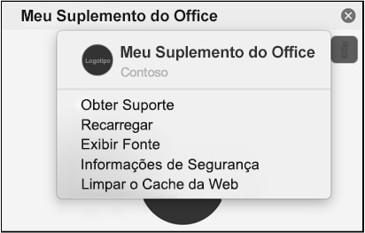

Os Suplementos muitas vezes são armazenados em cache no Office para Mac por questão de desempenho. Normalmente, o cache será limpo quando o suplemento for recarregado. Se houver mais de um suplemento no mesmo documento, é provável que o processo de limpeza automática do cache ao recarregar não seja confiável.

Você pode limpar o cache usando o menu personalidade de qualquer suplemento do painel de tarefas.
- Escolha o menu personalidade. Em seguida, escolha **Limpar Cache da Web**.
    > [!NOTE]
    > Você deve executar o macOS versão 10.13.6 ou posterior para ver o menu personalidade.

    

Você também pode limpar o cache manualmente ao excluir o conteúdo na pasta `~/Library/Containers/com.Microsoft.OsfWebHost/Data/`.

> [!NOTE]
> Se essa pasta não existir, verifique as pastas a seguir e, se encontradas, exclua o conteúdo da pasta.
>    - `~/Library/Containers/com.microsoft.{host}/Data/Library/Caches/` onde `{host}` é o aplicativo do Office (por exemplo, `Excel`)
>    - `~/Library/Containers/com.microsoft.{host}/Data/Library/Application Support/Microsoft/Office/16.0/Wef/` onde `{host}` é o aplicativo do Office (por exemplo, `Excel`)
>    - `~/Library/Containers/com.microsoft.Office365ServiceV2/Data/Caches/com.microsoft.Office365ServiceV2/`
>    - `~/Library/Containers/com.microsoft.Office365ServiceV2/Data/Library/Caches/com.microsoft.Office365ServiceV2/`
