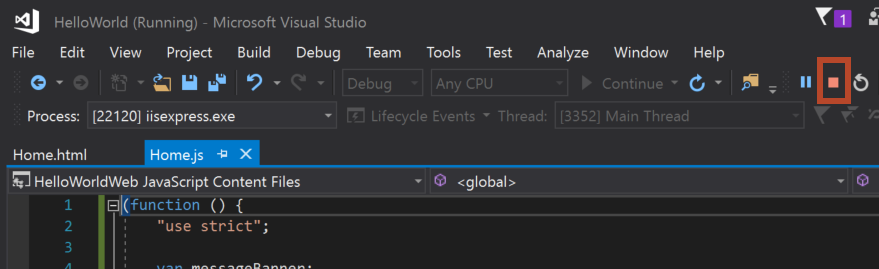

<span data-ttu-id="d1b02-101">Nesta etapa do tutorial, você vai recuperar metadados do slide selecionado.</span><span class="sxs-lookup"><span data-stu-id="d1b02-101">In this step of the tutorial, you'll retrieve metadata for the selected slide.</span></span>

> [!NOTE]
> <span data-ttu-id="d1b02-102">Esta página descreve uma etapa individual do tutorial de suplemento do PowerPoint.</span><span class="sxs-lookup"><span data-stu-id="d1b02-102">This page describes an individual step of the PowerPoint add-in tutorial.</span></span> <span data-ttu-id="d1b02-103">Se você chegou aqui por meio dos resultados de mecanismos de pesquisa ou via outro link direto, acesse a página de Introdução do [tutorial de suplemento do PowerPoint](../tutorials/powerpoint-tutorial.yml) para começá-lo do início.</span><span class="sxs-lookup"><span data-stu-id="d1b02-103">If you’ve arrived at this page via search engine results or other direct link, please go to the [PowerPoint add-in tutorial](../tutorials/powerpoint-tutorial.yml) introduction page to start the tutorial from the beginning.</span></span>

## <a name="get-slide-metadata"></a><span data-ttu-id="d1b02-104">Obter metadados do slide</span><span class="sxs-lookup"><span data-stu-id="d1b02-104">Get slide metadata</span></span>

1. <span data-ttu-id="d1b02-105">No arquivo **Home.html**, substitua `TODO4` pela marcação a seguir.</span><span class="sxs-lookup"><span data-stu-id="d1b02-105">In the **Home.html** file, replace `TODO4` with the following markup.</span></span> <span data-ttu-id="d1b02-106">Essa marcação define o botão **Obter metadados do slide** que aparecerá no painel de tarefas do suplemento.</span><span class="sxs-lookup"><span data-stu-id="d1b02-106">This markup defines the **Get Slide Metadata** button that will appear within the add-in's task pane.</span></span>

    ```html
    <br /><br />
    <button class="ms-Button ms-Button--primary" id="get-slide-metadata">
        <span class="ms-Button-icon"><i class="ms-Icon ms-Icon--plus"></i></span>
        <span class="ms-Button-label">Get Slide Metadata</span>
        <span class="ms-Button-description">Gets metadata for the selected slide(s).</span>
    </button>
    ```

2. <span data-ttu-id="d1b02-107">No arquivo **Home.js**, substitua `TODO6` pelo código a seguir para atribuir o manipulador de eventos para o botão **Obter Metadados do Slide**.</span><span class="sxs-lookup"><span data-stu-id="d1b02-107">In the **Home.js** file, replace `TODO6` with the following code to assign the event handler for the **Get Slide Metadata** button.</span></span>

    ```js
    $('#get-slide-metadata').click(getSlideMetadata);
    ```

3. <span data-ttu-id="d1b02-108">No arquivo **Home.js**, substitua `TODO7` pelo código a seguir para definir a função **getSlideMetadata**.</span><span class="sxs-lookup"><span data-stu-id="d1b02-108">In the **Home.js** file, replace `TODO7` with the following code to define the **getSlideMetadata** function.</span></span> <span data-ttu-id="d1b02-109">Esta função recupera metadados dos slides selecionados e os grava em uma janela pop-up da caixa de diálogo no painel de tarefas do suplemento.</span><span class="sxs-lookup"><span data-stu-id="d1b02-109">This function retrieves metadata for the selected slide(s) and writes it to a popup dialog window within the add-in task pane.</span></span>

    ```js
    function getSlideMetadata() {
        Office.context.document.getSelectedDataAsync(Office.CoercionType.SlideRange,
            function (asyncResult) {
                if (asyncResult.status === Office.AsyncResultStatus.Failed) {
                    showNotification("Error", asyncResult.error.message);
                } else {
                    showNotification("Metadata for selected slide(s):", JSON.stringify(asyncResult.value), null, 2);
                }
            }
        );
    }
    ```

## <a name="test-the-add-in"></a><span data-ttu-id="d1b02-110">Testar o suplemento</span><span class="sxs-lookup"><span data-stu-id="d1b02-110">Test the add-in</span></span>

1. <span data-ttu-id="d1b02-p104">Usando o Visual Studio, teste o suplemento pressionando `F5` ou escolhendo o botão **Iniciar** para abrir o PowerPoint com o botão de suplemento **Mostrar Painel de Tarefas** exibido na faixa de opções. O suplemento será hospedado localmente no IIS.</span><span class="sxs-lookup"><span data-stu-id="d1b02-p104">Using Visual Studio, test the add-in by pressing `F5` or choosing the **Start** button to launch PowerPoint with the **Show Taskpane** add-in button displayed in the ribbon. The add-in will be hosted locally on IIS.</span></span>

    

2. <span data-ttu-id="d1b02-114">No PowerPoint, selecione o botão **Mostrar Painel de Tarefas** na faixa de opções para abrir o painel de tarefas do suplemento.</span><span class="sxs-lookup"><span data-stu-id="d1b02-114">In PowerPoint, select the **Show Taskpane** button in the ribbon to open the add-in task pane.</span></span>

    

3. <span data-ttu-id="d1b02-116">No painel de tarefas, escolha o botão **Obter metadados do slide** para obter os metadados do slide selecionado.</span><span class="sxs-lookup"><span data-stu-id="d1b02-116">In the task pane, choose the **Get Slide Metadata** button to get the metadata for the selected slide.</span></span> <span data-ttu-id="d1b02-117">Os metadados do slide serão gravados na janela pop-up da caixa de diálogo na parte inferior do painel de tarefas.</span><span class="sxs-lookup"><span data-stu-id="d1b02-117">The slide metadata is written to the popup dialog window at the bottom of the task pane.</span></span> <span data-ttu-id="d1b02-118">Nesse caso, a matriz `slides` dos metadados JSON contém um objeto que especifica `id`, `title` e `index` do slide selecionado.</span><span class="sxs-lookup"><span data-stu-id="d1b02-118">In this case, the `slides` array within the JSON metadata contains one object that specifies the `id`, `title`, and `index` of the selected slide.</span></span> <span data-ttu-id="d1b02-119">Se vários slides tivessem sido selecionados na recuperação de metadados do slide, a matriz `slides` dos metadados JSON conteria um objeto para cada slide selecionado.</span><span class="sxs-lookup"><span data-stu-id="d1b02-119">If multiple slides had been selected when you retrieved slide metadata, the `slides` array within the JSON metadata would contain one object for each selected slide.</span></span>

    

4. <span data-ttu-id="d1b02-121">No Visual Studio, interrompa o suplemento pressionando `Shift + F5` ou selecionando o botão **Parar**.</span><span class="sxs-lookup"><span data-stu-id="d1b02-121">In Visual Studio, stop the add-in by pressing `Shift + F5` or choosing the **Stop** button.</span></span> <span data-ttu-id="d1b02-122">O PowerPoint fechará automaticamente quando o suplemento for interrompido.</span><span class="sxs-lookup"><span data-stu-id="d1b02-122">PowerPoint will automatically close when the add-in is stopped.</span></span>

    
