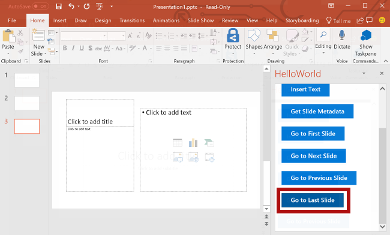

<span data-ttu-id="cf30e-101">Nesta etapa do tutorial, você vai navegar entre os slides de um documento.</span><span class="sxs-lookup"><span data-stu-id="cf30e-101">In this step of the tutorial, you'll navigate between the slides of a document.</span></span>

> [!NOTE]
> <span data-ttu-id="cf30e-102">Esta página descreve uma etapa individual do tutorial de suplemento do PowerPoint.</span><span class="sxs-lookup"><span data-stu-id="cf30e-102">This page describes an individual step of the PowerPoint add-in tutorial.</span></span> <span data-ttu-id="cf30e-103">Se você chegou aqui por meio dos resultados de mecanismos de pesquisa ou via outro link direto, acesse a página de Introdução do [tutorial de suplemento do PowerPoint](../tutorials/powerpoint-tutorial.yml) para começá-lo do início.</span><span class="sxs-lookup"><span data-stu-id="cf30e-103">If you’ve arrived at this page via search engine results or other direct link, please go to the [PowerPoint add-in tutorial](../tutorials/powerpoint-tutorial.yml) introduction page to start the tutorial from the beginning.</span></span>

## <a name="navigate-between-slides-of-the-document"></a><span data-ttu-id="cf30e-104">Navegar entre os slides do documento</span><span class="sxs-lookup"><span data-stu-id="cf30e-104">Navigate between slides of the document</span></span>

1. <span data-ttu-id="cf30e-105">No arquivo **Home.html**, substitua `TODO5` pela marcação a seguir.</span><span class="sxs-lookup"><span data-stu-id="cf30e-105">In the **Home.html** file, replace `TODO5` with the following markup.</span></span> <span data-ttu-id="cf30e-106">Essa marcação define os quatro botões de navegação que aparecerão no painel de tarefas do suplemento.</span><span class="sxs-lookup"><span data-stu-id="cf30e-106">This markup defines the four navigation buttons that will appear within the add-in's task pane.</span></span>

    ```html
    <br /><br />
    <button class="ms-Button ms-Button--primary" id="go-to-first-slide">
        <span class="ms-Button-icon"><i class="ms-Icon ms-Icon--plus"></i></span>
        <span class="ms-Button-label">Go to First Slide</span>
        <span class="ms-Button-description">Go to the first slide.</span>
    </button>
    <br /><br />
    <button class="ms-Button ms-Button--primary" id="go-to-next-slide">
        <span class="ms-Button-icon"><i class="ms-Icon ms-Icon--plus"></i></span>
        <span class="ms-Button-label">Go to Next Slide</span>
        <span class="ms-Button-description">Go to the next slide.</span>
    </button>
    <br /><br />
    <button class="ms-Button ms-Button--primary" id="go-to-previous-slide">
        <span class="ms-Button-icon"><i class="ms-Icon ms-Icon--plus"></i></span>
        <span class="ms-Button-label">Go to Previous Slide</span>
        <span class="ms-Button-description">Go to the previous slide.</span>
    </button>
    <br /><br />
    <button class="ms-Button ms-Button--primary" id="go-to-last-slide">
        <span class="ms-Button-icon"><i class="ms-Icon ms-Icon--plus"></i></span>
        <span class="ms-Button-label">Go to Last Slide</span>
        <span class="ms-Button-description">Go to the last slide.</span>
    </button>
    ```

2. <span data-ttu-id="cf30e-107">No arquivo **Home.js**, substitua `TODO8` pelo código a seguir para atribuir o manipulador de eventos aos quatro botões de navegação.</span><span class="sxs-lookup"><span data-stu-id="cf30e-107">In the **Home.js** file, replace `TODO8` with the following code to assign the event handlers for the four navigation buttons.</span></span>

    ```js
    $('#go-to-first-slide').click(goToFirstSlide);
    $('#go-to-next-slide').click(goToNextSlide);
    $('#go-to-previous-slide').click(goToPreviousSlide);
    $('#go-to-last-slide').click(goToLastSlide);
    ```

3. <span data-ttu-id="cf30e-108">No arquivo **Home.js**, substitua `TODO9` pelo código a seguir para definir as funções de navegação.</span><span class="sxs-lookup"><span data-stu-id="cf30e-108">In the **Home.js** file, replace `TODO9` with the following code to define the navigation functions.</span></span> <span data-ttu-id="cf30e-109">Cada uma dessas funções usa a função `goToByIdAsync` para selecionar um slide com base em sua posição no documento (primeiro, último, anterior, próximo).</span><span class="sxs-lookup"><span data-stu-id="cf30e-109">Each of these functions uses the `goToByIdAsync` function to select a slide based upon its position in the document (first, last, previous, next).</span></span>

    ```js
    function goToFirstSlide() {
        Office.context.document.goToByIdAsync(Office.Index.First, Office.GoToType.Index,
            function (asyncResult) {
                if (asyncResult.status == "failed") {
                    showNotification("Error", asyncResult.error.message);
                }
            });
    }

    function goToLastSlide() {
        Office.context.document.goToByIdAsync(Office.Index.Last, Office.GoToType.Index,
            function (asyncResult) {
                if (asyncResult.status == "failed") {
                    showNotification("Error", asyncResult.error.message);
                }
            });
    }

    function goToPreviousSlide() {
        Office.context.document.goToByIdAsync(Office.Index.Previous, Office.GoToType.Index,
            function (asyncResult) {
                if (asyncResult.status == "failed") {
                    showNotification("Error", asyncResult.error.message);
                }
            });
    }

    function goToNextSlide() {
        Office.context.document.goToByIdAsync(Office.Index.Next, Office.GoToType.Index,
            function (asyncResult) {
                if (asyncResult.status == "failed") {
                    showNotification("Error", asyncResult.error.message);
                }
            });
    }
    ```

## <a name="test-the-add-in"></a><span data-ttu-id="cf30e-110">Testar o suplemento</span><span class="sxs-lookup"><span data-stu-id="cf30e-110">Test the add-in</span></span>

1. <span data-ttu-id="cf30e-p104">Usando o Visual Studio, teste o suplemento pressionando `F5` ou escolhendo o botão **Iniciar** para abrir o PowerPoint com o botão de suplemento **Mostrar Painel de Tarefas** exibido na faixa de opções. O suplemento será hospedado localmente no IIS.</span><span class="sxs-lookup"><span data-stu-id="cf30e-p104">Using Visual Studio, test the add-in by pressing `F5` or choosing the **Start** button to launch PowerPoint with the **Show Taskpane** add-in button displayed in the ribbon. The add-in will be hosted locally on IIS.</span></span>

    

2. <span data-ttu-id="cf30e-114">No PowerPoint, selecione o botão **Mostrar Painel de Tarefas** na faixa de opções para abrir o painel de tarefas do suplemento.</span><span class="sxs-lookup"><span data-stu-id="cf30e-114">In PowerPoint, select the **Show Taskpane** button in the ribbon to open the add-in task pane.</span></span>

    


3. <span data-ttu-id="cf30e-116">Use o botão **Novo Slide** na faixa de opções da guia **Página Inicial** para adicionar dois novos slides ao documento.</span><span class="sxs-lookup"><span data-stu-id="cf30e-116">Use the **New Slide** button in the ribbon of the **Home** tab to add two new slides to the document.</span></span> 

4. <span data-ttu-id="cf30e-117">No painel de tarefas, escolha o botão **Ir para o primeiro Slide**.</span><span class="sxs-lookup"><span data-stu-id="cf30e-117">In the task pane, choose the **Go to First Slide** button.</span></span> <span data-ttu-id="cf30e-118">O primeiro slide no documento é selecionado e exibido.</span><span class="sxs-lookup"><span data-stu-id="cf30e-118">The first slide in the document is selected and displayed.</span></span>

    

5. <span data-ttu-id="cf30e-120">No painel de tarefas, escolha o botão **Ir para o próximo Slide**.</span><span class="sxs-lookup"><span data-stu-id="cf30e-120">In the task pane, choose the **Go to Next Slide** button.</span></span> <span data-ttu-id="cf30e-121">O próximo slide no documento é selecionado e exibido.</span><span class="sxs-lookup"><span data-stu-id="cf30e-121">The next slide in the document is selected and displayed.</span></span>

    

6. <span data-ttu-id="cf30e-123">No painel de tarefas, escolha o botão **Ir Para o Slide Anterior**.</span><span class="sxs-lookup"><span data-stu-id="cf30e-123">In the task pane, choose the **Go to Previous Slide** button.</span></span> <span data-ttu-id="cf30e-124">O slide anterior no documento é selecionado e exibido.</span><span class="sxs-lookup"><span data-stu-id="cf30e-124">The previous slide in the document is selected and displayed.</span></span>

    

7. <span data-ttu-id="cf30e-126">No painel de tarefas, escolha o botão **Ir Para o Último Slide**.</span><span class="sxs-lookup"><span data-stu-id="cf30e-126">In the task pane, choose the **Go to Last Slide** button.</span></span> <span data-ttu-id="cf30e-127">O último slide no documento é selecionado e exibido.</span><span class="sxs-lookup"><span data-stu-id="cf30e-127">The last slide in the document is selected and displayed.</span></span>

    

8. <span data-ttu-id="cf30e-129">No Visual Studio, interrompa o suplemento pressionando `Shift + F5` ou selecionando o botão **Parar**.</span><span class="sxs-lookup"><span data-stu-id="cf30e-129">In Visual Studio, stop the add-in by pressing `Shift + F5` or choosing the **Stop** button.</span></span> <span data-ttu-id="cf30e-130">O PowerPoint fechará automaticamente quando o suplemento for interrompido.</span><span class="sxs-lookup"><span data-stu-id="cf30e-130">PowerPoint will automatically close when the add-in is stopped.</span></span>

    
