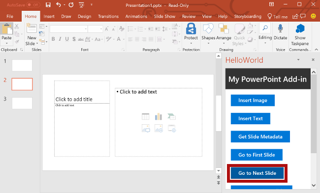

Nesta etapa do tutorial, você vai navegar entre os slides de um documento.

> [!NOTE]
> Esta página descreve uma etapa individual do tutorial de suplemento do PowerPoint. Se você chegou aqui por meio dos resultados de mecanismos de pesquisa ou via outro link direto, acesse a página de Introdução do [tutorial de suplemento do PowerPoint](../tutorials/powerpoint-tutorial.yml) para começá-lo do início.

## <a name="navigate-between-slides-of-the-document"></a>Navegar entre os slides do documento

1. No arquivo **Home.html**, substitua `TODO5` pela marcação a seguir. Essa marcação define os quatro botões de navegação que aparecerão no painel de tarefas do suplemento.

    ```html
    <br /><br />
    <button class="ms-Button ms-Button--primary" id="go-to-first-slide">
        <span class="ms-Button-icon"><i class="ms-Icon ms-Icon--plus"></i></span>
        <span class="ms-Button-label">Go to First Slide</span>
        <span class="ms-Button-description">Go to the first slide.</span>
    </button>
    <br /><br />
    <button class="ms-Button ms-Button--primary" id="go-to-next-slide">
        <span class="ms-Button-icon"><i class="ms-Icon ms-Icon--plus"></i></span>
        <span class="ms-Button-label">Go to Next Slide</span>
        <span class="ms-Button-description">Go to the next slide.</span>
    </button>
    <br /><br />
    <button class="ms-Button ms-Button--primary" id="go-to-previous-slide">
        <span class="ms-Button-icon"><i class="ms-Icon ms-Icon--plus"></i></span>
        <span class="ms-Button-label">Go to Previous Slide</span>
        <span class="ms-Button-description">Go to the previous slide.</span>
    </button>
    <br /><br />
    <button class="ms-Button ms-Button--primary" id="go-to-last-slide">
        <span class="ms-Button-icon"><i class="ms-Icon ms-Icon--plus"></i></span>
        <span class="ms-Button-label">Go to Last Slide</span>
        <span class="ms-Button-description">Go to the last slide.</span>
    </button>
    ```

2. No arquivo **Home.js**, substitua `TODO8` pelo código a seguir para atribuir o manipulador de eventos aos quatro botões de navegação.

    ```js
    $('#go-to-first-slide').click(goToFirstSlide);
    $('#go-to-next-slide').click(goToNextSlide);
    $('#go-to-previous-slide').click(goToPreviousSlide);
    $('#go-to-last-slide').click(goToLastSlide);
    ```

3. No arquivo **Home.js**, substitua `TODO9` pelo código a seguir para definir as funções de navegação. Cada uma dessas funções usa a função `goToByIdAsync` para selecionar um slide com base em sua posição no documento (primeiro, último, anterior, próximo).

    ```js
    function goToFirstSlide() {
        Office.context.document.goToByIdAsync(Office.Index.First, Office.GoToType.Index,
            function (asyncResult) {
                if (asyncResult.status == "failed") {
                    showNotification("Error", asyncResult.error.message);
                }
            });
    }

    function goToLastSlide() {
        Office.context.document.goToByIdAsync(Office.Index.Last, Office.GoToType.Index,
            function (asyncResult) {
                if (asyncResult.status == "failed") {
                    showNotification("Error", asyncResult.error.message);
                }
            });
    }

    function goToPreviousSlide() {
        Office.context.document.goToByIdAsync(Office.Index.Previous, Office.GoToType.Index,
            function (asyncResult) {
                if (asyncResult.status == "failed") {
                    showNotification("Error", asyncResult.error.message);
                }
            });
    }

    function goToNextSlide() {
        Office.context.document.goToByIdAsync(Office.Index.Next, Office.GoToType.Index,
            function (asyncResult) {
                if (asyncResult.status == "failed") {
                    showNotification("Error", asyncResult.error.message);
                }
            });
    }
    ```

## <a name="test-the-add-in"></a>Testar o suplemento

1. Usando o Visual Studio, teste o suplemento pressionando `F5` ou escolhendo o botão **Iniciar** para abrir o PowerPoint com o botão de suplemento **Mostrar Painel de Tarefas** exibido na faixa de opções. O suplemento será hospedado localmente no IIS.

    

2. No PowerPoint, selecione o botão **Mostrar Painel de Tarefas** na faixa de opções para abrir o painel de tarefas do suplemento.

    


3. Use o botão **Novo Slide** na faixa de opções da guia **Página Inicial** para adicionar dois novos slides ao documento. 

4. No painel de tarefas, escolha o botão **Ir para o primeiro Slide**. O primeiro slide no documento é selecionado e exibido.

    

5. No painel de tarefas, escolha o botão **Ir para o próximo Slide**. O próximo slide no documento é selecionado e exibido.

    

6. No painel de tarefas, escolha o botão **Ir Para o Slide Anterior**. O slide anterior no documento é selecionado e exibido.

    

7. No painel de tarefas, escolha o botão **Ir Para o Último Slide**. O último slide no documento é selecionado e exibido.

    

8. No Visual Studio, interrompa o suplemento pressionando `Shift + F5` ou selecionando o botão **Parar**. O PowerPoint fechará automaticamente quando o suplemento for interrompido.

    
