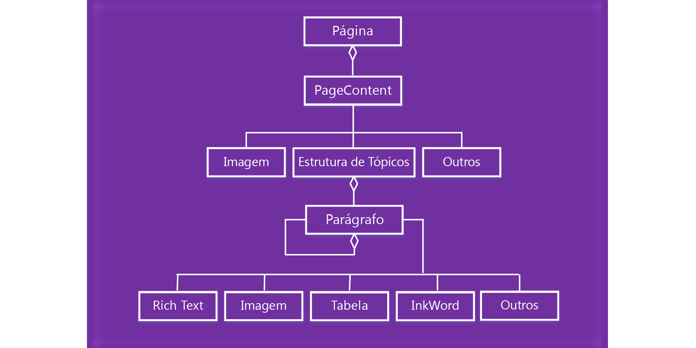

# Trabalhar com conteúdo da página do OneNote

Na API JavaScript de suplementos do OneNote, o conteúdo da página é representado pelo seguinte modelo de objeto.

  

- Um objeto Page contém um conjunto de objetos PageContent.
- Um objeto PageContent contém um tipo de conteúdo de Estrutura de Tópicos, Imagem ou Outro.
- Um objeto Outline contém um conjunto de objetos Paragraph.
- Um objeto Paragraph contém um tipo de conteúdo RichText, Image, Table ou Other.

Para criar uma página em branco do OneNote, use um dos seguintes métodos:

- [Section.addPage](/javascript/api/onenote/onenote.section#addpage-title-)
- [Page.insertPageAsSibling](/javascript/api/onenote/onenote.section#insertsectionassibling-location--title-)

Em seguida, use métodos nos seguintes objetos para trabalhar com o conteúdo da página, como `Page.addOutline` e `Outline.appendHtml`.

- [Page](/javascript/api/onenote/onenote.page)
- [Outline](/javascript/api/onenote/onenote.outline)
- [Paragraph](/javascript/api/onenote/onenote.paragraph)

O conteúdo e a estrutura da página do OneNote são representados por HTML. Apenas um subconjunto de HTML é compatível com a criação e a atualização do conteúdo da página, conforme descrito abaixo.

## HTML com suporte

A API JavaScript do suplemento do OneNote dá suporte ao HTML a seguir para a criação e a atualização do conteúdo da página:

- `<html>`, `<body>`, `
`, ``, ` `
- `
`
- ``
- `<a>`
- `<ul>`, `<ol>`, `<li>`
- `<table>`, `<tr>`, `<td>`
- `<h1>` ... `<h6>`
- `<b>`, `<em>`, `<strong>`, `<i>`, `<u>`, `<del>`, ``, ``, `<cite>`

> [!NOTE]
> Importar o HTML para o OneNote consolida o espaço em branco. O conteúdo resultante é colado em uma estrutura de tópicos.

O OneNote faz o melhor para traduzir o HTML no conteúdo da página enquanto garante a segurança para os usuários. Os padrões HTML e CSS não correspondem exatamente ao modelo de conteúdo do OneNote, portanto, haverá diferenças em aparências, particularmente com estilos de CSS. Recomendamos usar os objetos JavaScript se for necessário formatar uma formatação específica.

## Acessar o conteúdo da página

Só é possível acessar o *Conteúdo da Página* via `Page#load` para a página ativa no momento. Para alterar a página ativa, chame `navigateToPage($page)`.

Metadados, como título, ainda podem ser consultados para qualquer página.

## Confira também

- [Visão geral da programação da API JavaScript do OneNote](onenote-add-ins-programming-overview.md)
- [Referência da API JavaScript do OneNote](../reference/overview/onenote-add-ins-javascript-reference.md)
- [Amostra de Rubric Grader](https://github.com/OfficeDev/OneNote-Add-in-Rubric-Grader)
- [Visão geral da plataforma Suplementos do Office](../overview/office-add-ins.md)
