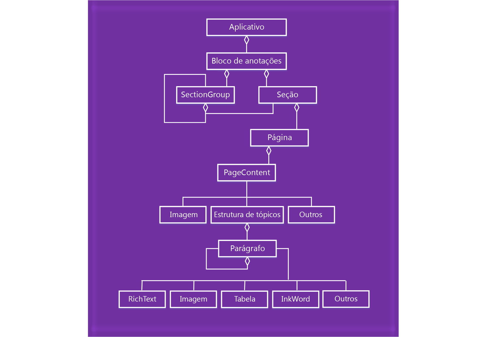

# <a name="onenote-javascript-api-programming-overview"></a>Visão geral da programação da API JavaScript do OneNote

O OneNote introduz uma API do JavaScript para suplementos do OneNote na Web. Você pode criar suplementos de painel de tarefas e de conteúdo e comandos de suplemento que interagem com objetos do OneNote e conectam-se a serviços Web ou a outros recursos baseados na Web.

> [!NOTE]
> Caso pretenda [publicar](../publish/publish.md) o suplemento na experiência do Office depois de criá-lo, verifique se você está em conformidade com as [Políticas de validação do AppSource](/office/dev/store/validation-policies). Por exemplo, para passar na validação, seu suplemento deve funcionar em todas as plataformas com suporte aos métodos que você definir (para mais informações, confira a [seção 4.12](/office/dev/store/validation-policies#4-apps-and-add-ins-behave-predictably) e a [Página de hospedagem e disponibilidade de suplementos do Office](../overview/office-add-in-availability.md)).

## <a name="components-of-an-office-add-in"></a>Componentes de um suplemento do Office

Os suplementos consistem de dois componentes básicos:

- Um **aplicativo Web** consiste em uma página da Web e em JavaScript, CSS ou outros arquivos necessários. Estes arquivos podem ser hospedados em qualquer servidor Web ou serviço de hospedagem na Web, como o Microsoft Azure. No OneNote online, o aplicativo Web exibe um controle de navegação ou iframe.

- Um **manifesto XML** que especifica a URL da página da Web do suplemento e os requisitos de acesso, as configurações e os recursos para o suplemento. Este arquivo é armazenado no cliente. Os suplementos do OneNote usam o mesmo formato de [manifesto](../develop/add-in-manifests.md) como outros suplementos do Office.

**Suplemento do Office = manifesto + página da Web**


## <a name="using-the-javascript-api"></a>Usar a API JavaScript

Os suplementos usam o contexto de tempo de execução do aplicativo host para acessar a API JavaScript. A API tem duas camadas: 

- Uma **API avançada** para operações específicas do OneNote, acessada por meio do objeto **Aplicativo**.
- Uma **API comum** compartilhada entre os aplicativos do Office, acessada por meio do objeto **Documento**.

### <a name="accessing-the-host-specific-api-through-the-application-object"></a>Acessar uma API avançada por meio do objeto *Aplicativo*.

Use o objeto **Aplicativo** para acessar os objetos do OneNote, como **Bloco de anotações**, **Seção** e **Página**. Com as APIs avançadas, você executa operações em lotes em objetos proxy. O fluxo básico será semelhante a: 

1. Obtenha a instância do aplicativo do contexto.

2. Crie um proxy que representa o objeto do OneNote com o qual você deseja trabalhar. Você interage com sincronia com os objetos proxy lendo e gravar suas propriedades e chamando seus métodos.

3. Chame **load** no proxy para preenchê-lo com valores de propriedade especificados no parâmetro. Essa chamada é adicionada à fila de comandos.

   > [!NOTE]
   > Chamadas de método para a API (como `context.application.getActiveSection().pages;`) também são adicionadas à fila.

4. Chame **context.sync** para executar todos os comandos na fila na ordem em que eles estão. Isso sincroniza o estado entre o momento em que os scripts e os objetos reais estão sendo executados, além de recuperar as propriedades dos objetos do OneNote carregados para uso no seu script. Você pode usar o objeto promessa retornado para o encadeamento ações adicionais.

Por exemplo:

```js
function getPagesInSection() {
    OneNote.run(function (context) {

        // Get the pages in the current section.
        var pages = context.application.getActiveSection().pages;

        // Queue a command to load the id and title for each page.
        pages.load('id,title');

        // Run the queued commands, and return a promise to indicate task completion.
        return context.sync()
            .then(function () {

                // Read the id and title of each page.
                $.each(pages.items, function(index, page) {
                    var pageId = page.id;
                    var pageTitle = page.title;
                    console.log(pageTitle + ': ' + pageId);
                });
            })
            .catch(function (error) {
                app.showNotification("Error: " + error);
                console.log("Error: " + error);
                if (error instanceof OfficeExtension.Error) {
                    console.log("Debug info: " + JSON.stringify(error.debugInfo));
                }
            });
    });
}
```

Você pode encontrar objetos do OneNote e operações compatíveis na [Referência API](/office/dev/add-ins/reference/overview/onenote-add-ins-javascript-reference).

#### <a name="onenote-javascript-api-requirement-sets"></a>Conjuntos de requisitos da API JavaScript do OneNote

Os conjuntos de requisitos são grupos nomeados de membros da API. Os suplementos do Office usam conjuntos de requisitos especificados no manifesto ou usam uma verificação de tempo de execução para determinar se um host do Office oferece suporte para as APIs necessárias para um suplemento. Para saber mais sobre conjuntos de requisitos da API JavaScript do OneNote, consulte [Conjuntos de requisitos da API JavaScript do OneNote](../reference/requirement-sets/onenote-api-requirement-sets.md).

### <a name="accessing-the-common-api-through-the-document-object"></a>Acessar a API comum por meio do objeto *Documento*

Use o objeto **Documento** para acessar a API comum, como os métodos [getSelectedDataAsync](/javascript/api/office/office.document#getselecteddataasync-coerciontype--options--callback-) e [setSelectedDataAsync](/javascript/api/office/office.document#setselecteddataasync-data--options--callback-). 


Por exemplo:  

```js
function getSelectionFromPage() {
    Office.context.document.getSelectedDataAsync(
        Office.CoercionType.Text,
        { valueFormat: "unformatted" },
        function (asyncResult) {
            var error = asyncResult.error;
            if (asyncResult.status === Office.AsyncResultStatus.Failed) {
                console.log(error.message);
            }
            else $('#input').val(asyncResult.value);
        });
}
```

Os suplementos do OneNote são compatíveis apenas com as seguintes APIs comuns:

| API | Observações |
|:------|:------|
| [Office.context.document.getSelectedDataAsync](/javascript/api/office/office.document#getselecteddataasync-coerciontype--options--callback-) | Apenas **Office.CoercionType.Text** e **Office.CoercionType.Matrix** |
| [Office.context.document.setSelectedDataAsync](/javascript/api/office/office.document#setselecteddataasync-data--options--callback-) | Apenas **Office.CoercionType.Text**, **Office.CoercionType.Image** e **Office.CoercionType.Html** | 
| [var mySetting = Office.context.document.settings.get(nome);](/javascript/api/office/office.settings#get-name-) | As configurações são compatíveis apenas com os suplementos de conteúdo | 
| [Office.context.document.settings.set(nome, valor);](/javascript/api/office/office.settings#set-name--value-) | As configurações são compatíveis apenas com os suplementos de conteúdo | 
| [Office.EventType.DocumentSelectionChanged](/javascript/api/office/office.documentselectionchangedeventargs) ||

Em geral, você usa a API comum para fazer algo que não é compatível com a API específica do host. Para obter mais informações sobre como usar a API comum, confira [Modelo do objeto do JavaScript API para Office](../develop/office-javascript-api-object-model.md).


<a name="om-diagram"></a>
## <a name="onenote-object-model-diagram"></a>Diagrama do modelo de objeto do OneNote 
O diagrama a seguir representa o que está disponível atualmente na API JavaScript do OneNote.

  


## <a name="see-also"></a>Confira também

- [Criando Suplementos do Office ](../overview/office-add-ins-fundamentals.md)
- [Criar seu primeiro suplemento do OneNote](../quickstarts/onenote-quickstart.md)
- [Referência da API JavaScript do OneNote](/office/dev/add-ins/reference/overview/onenote-add-ins-javascript-reference)
- [Amostra de Rubric Grader](https://github.com/OfficeDev/OneNote-Add-in-Rubric-Grader)
- [Visão geral da plataforma Suplementos do Office](../overview/office-add-ins.md)
