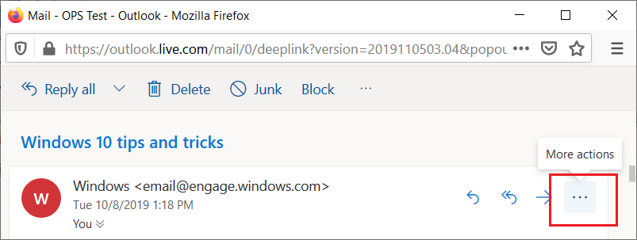
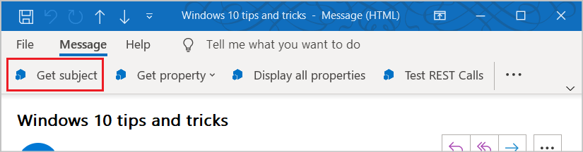
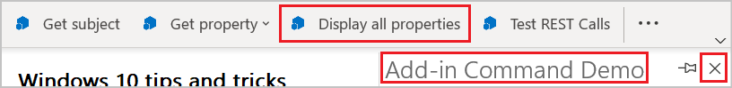

# Comandos de suplemento para o Outlook

Os comandos de suplemento do Outlook oferecem maneiras de iniciar ações específicas do suplemento na faixa de opções adicionando botões ou menus suspensos. Isso permite que os usuários acessem suplementos de maneira simples, intuitiva e discreta. Como eles oferecem maior funcionalidade de forma simplificada, você pode usar comandos de suplemento para criar soluções mais atraentes.

> [!NOTE]
> Os comandos de suplemento estão disponíveis apenas no Outlook 2013 ou posterior no Windows, no Outlook 2016 ou posterior no Mac, no Outlook no iOS, no Outlook no Android, no Outlook na Web para o Exchange 2016 ou posterior e no Outlook na Web para Microsoft 365 e Outlook.com.
>
> O suporte para comandos de suplementos no Outlook 2013 requer três atualizações:
> - [Atualização de segurança de 8 de março de 2016 para o Outlook](https://support.microsoft.com/kb/3114829)
> - [Atualização de segurança de 8 de março de 2016 para o Office (KB3114816)](https://support.microsoft.com/topic/3d3eb171-78c2-0e61-62a2-85723bc4bcc0)
> - [Atualização de segurança de 8 de março de 2016 para o Office (KB3114828)](https://support.microsoft.com/topic/54437016-d1e0-7aac-dbb7-4ecfbd57f5f0)
>
> O suporte para comandos de suplementos no Exchange 2016 requer a [Atualização Cumulativa 5](https://support.microsoft.com/topic/d67d7693-96a4-fb6e-b60b-e64984e267bd).

Os comandos de suplementos estão disponíveis apenas para suplementos que não usam [regras ItemHasAttachment, ItemHasKnownEntity ou ItemHasRegularExpressionMatch](activation-rules.md) para limitar os tipos de itens em que são ativados. No entanto, os [suplementos contextuais](contextual-outlook-add-ins.md) podem apresentar comandos diferentes, dependendo do item selecionado no momento ser uma mensagem ou um compromisso, e podem optar por serem exibidos em cenários de leitura ou redação. É uma [prática recomendada](../concepts/add-in-development-best-practices.md) usar comandos de suplementos.

## Criar o comandos do suplemento

Os comandos do suplemento estão declarados no manifesto do suplemento no elemento [VersionOverrides ](/javascript/api/manifest/versionoverrides). Esse elemento é uma adição ao esquema de manifesto v1.1 que garante a compatibilidade com versões anteriores. Em um cliente que não suporta **\<VersionOverrides\>**, os suplementos existentes continuarão funcionando como funcionavam sem os comandos do suplemento.

As entradas do manifesto **\<VersionOverrides\>** especificam muitas coisas para o suplemento, como o aplicativo, os tipos de controles a serem adicionados à faixa de opções, o texto, os ícones e quaisquer funções associadas.

Quando um suplemento precisa fornecer atualizações de status, como indicadores de progresso ou mensagens de erro, ele deve fazer isso por meio das [APIs de notificação](/javascript/api/outlook/office.notificationmessages). O processamento para as notificações também deve ser definido em um arquivo HTML separado que é especificado no nó `FunctionFile` do manifesto.

Os desenvolvedores devem definir ícones para todos os tamanhos necessários, para que os comandos do suplemento se ajustem sem problemas junto com a faixa de opções. Os tamanhos de ícone obrigatórios são 80 x 80 pixels, 32 x 32 pixels e 16 x 16 pixels para área de trabalho e 48 x 48 pixels, 32 x 32 pixels e 25 x 25 pixels para dispositivos móveis.

## Como os comandos de suplemento são exibidos?

Um comando de suplemento aparece na faixa de opções como um botão ou um item em um menu suspenso. Quando um usuário instala um suplemento, seus comandos aparecem na interface do usuário como um grupo de botões. Isso pode estar na guia padrão da faixa de opções ou em uma guia personalizada. Para mensagens, o padrão é a guia **Início** ou **Mensagem**. Para o calendário, o padrão é a guia **Reunião**, **Ocorrência de Reunião**, **Série de Reuniões** ou **Compromisso**. Para extensões de módulo, o padrão é uma guia personalizada. Na guia padrão, cada suplemento pode ter um grupo de faixa de opções com até 6 comandos. Em guias personalizadas, o suplemento pode ter até 10 grupos, cada um com 6 comandos. Os suplementos estão limitados a apenas uma guia personalizada.

À medida que a faixa de opções fica mais cheia, os comandos de suplementos serão exibidos no menu estouro. Geralmente, os comandos de um suplemento serão agrupados.

Quando um comando do suplemento é adicionado a um suplemento, o nome do suplemento é removido da barra do aplicativo. Permanece apenas o botão de comando de suplemento na faixa de opções.

### Outlook na Web moderno

No Outlook na Web, o nome do suplemento é exibido em um menu estouro. Se o suplemento tiver vários comandos, você poderá expandir o menu do suplemento para ver o grupo de botões rotulados com o nome do suplemento.

## Quais são os tipos de comandos do suplemento?

A interface do usuário de um comando de suplemento consiste em um botão da faixa de opções ou um item em um menu suspenso. Há dois tipos de comandos de suplemento, com base no tipo de ação que o comando dispara.

- **Comandos do painel de tarefas**: O botão ou item de menu abre o painel de tarefas do suplemento. Você adiciona esse tipo de comando de suplemento com marcação no manifesto. O "código por trás" do comando é fornecido pelo Office.
- **Comandos de função**: O item de botão ou menu executa qualquer JavaScript arbitrário. O código quase sempre chama APIs na Biblioteca JavaScript do Office, mas não precisa. Esse tipo de suplemento normalmente não exibe nenhuma interface do usuário além do próprio item de menu ou botão. Observe o seguinte sobre comandos de função:

   - A função disparada pode chamar o método [displayDialogAsync](/javascript/api/office/office.ui#office-office-ui-displaydialogasync-member(1)) para mostrar uma caixa de diálogo, que é uma boa maneira de exibir um erro, mostrar o progresso ou solicitar a entrada do usuário.
   - O runtime no qual o comando de função é executado é um [runtime completo baseado em navegador](../testing/runtimes.md#browser-runtime). Ele pode renderizar HTML e chamar a Internet para enviar ou obter dados.

### Executar um comando de função

Use um botão de comando de suplemento que executa uma função JavaScript para cenários em que o usuário não precisa fazer seleções adicionais para iniciar a ação. Isso pode ser para ações como acompanhar, lembrar-me ou imprimir ou cenários em que o usuário deseja obter informações mais detalhadas de um serviço.

Em extensões de módulo, o botão de comando de suplemento pode executar funções JavaScript que interagem com o conteúdo na interface do usuário principal.

### Iniciar um painel de tarefas

Use um botão de comando de suplemento para iniciar um painel de tarefas para cenários em que um usuário precisa interagir com um suplemento por um período de tempo mais longo. Por exemplo, o suplemento requer alterações em configurações ou o preenchimento de vários campos.

A largura padrão do painel de tarefas vertical é de 320 px. O painel de tarefas vertical pode ser redimensionado no Outlook Explorer e no Inspetor. O painel pode ser redimensionado da mesma maneira que o painel de tarefas pendentes e a exibição de lista.

 

Esta captura de tela mostra um exemplo de um painel de tarefas vertical. O painel é aberto com o nome do comando de suplemento no canto superior esquerdo. Os usuários podem usar o botão **X**, no canto superior direito do painel, para fechar o suplemento ao terminar de usá-lo. Por padrão, esse painel não persistirá entre mensagens. Os suplementos podem ser [compatíveis com a fixação](pinnable-taskpane.md) do painel de tarefas e receber eventos quando uma nova mensagem for selecionada. Todos os elementos de interface do usuário renderizados no painel de tarefas, além do nome do suplemento e do botão fechar, são fornecidos pelo suplemento.

Se um usuário escolher outro comando de suplemento que abre um painel de tarefas, o painel de tarefas será substituído pelo comando usado recentemente. Se um usuário escolher um botão de comando de suplemento que executa uma função ou um menu suspenso enquanto o painel de tarefas estiver aberto, a ação será concluída e o painel de tarefas permanecerá aberto.

### Menu suspenso

Um comando de suplemento do menu suspenso define uma lista estática de itens. O menu pode ser qualquer combinação de itens que executam uma função ou que abrem um painel de tarefas. Não há suporte para submenus.

## Onde os comandos de suplemento aparecem na interface de usuário?

Os comandos de suplemento têm suporte em quatro cenários:

### Ler uma mensagem

Quando o usuário está lendo uma mensagem no painel de leitura ou na guia **Mensagem** por um formulário de leitura pop-out, os comandos de suplemento adicionados à guia padrão aparecem na guia **Página Inicial**.

### Redigir uma mensagem

Quando o usuário está compondo uma mensagem, os comandos de suplemento adicionados à guia padrão aparecem na guia **Mensagem**.

### Criar ou exibir um compromisso ou uma reunião como organizador

Quando você cria ou exibe um compromisso ou uma reunião como organizador, os comandos de suplemento adicionados à guia padrão aparecem nas guias **Reunião**, **Ocorrência de Reunião**, **Série de Reuniões** ou **Compromisso** em formulários pop-out. No entanto, se o usuário selecionar um item no calendário, mas não abrir o pop-out, o grupo da faixa de opções do suplemento não ficará visível na faixa de opções.

### Exibir uma reunião como participante

Quando você exibe uma reunião como participante, os comandos de suplemento adicionados à guia padrão aparecem nas guias **Reunião**, **Ocorrência de Reunião** ou **Série de Reuniões** em formulários pop-out. No entanto, se um usuário selecionar um item no calendário, mas não abrir o pop-out, o grupo da faixa de opções do suplemento não ficará visível na faixa de opções

### Usar uma extensão de módulo

Quando você usa uma extensão de módulo, os comandos de suplemento aparecem na guia personalizada da extensão.

## Confira também

- [Suplemento do Outlook para demonstração de comando de suplemento](https://github.com/officedev/outlook-add-in-command-demo)
- [Criar comandos de suplemento no manifesto para Excel, Word e PowerPoint](../develop/create-addin-commands.md)
- [Comandos de função de depuração em suplementos do Outlook](debug-ui-less.md)
- [Tutorial: criar uma mensagem para compor o suplemento do Outlook](../tutorials/outlook-tutorial.md)
