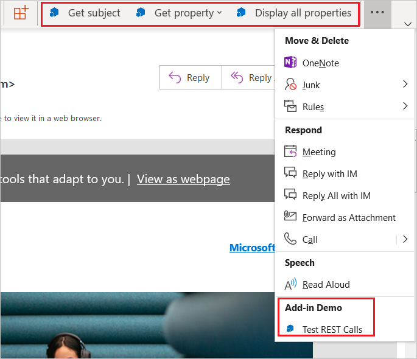

# Comandos de suplemento para o Outlook

Outlook add-in commands provide ways to initiate specific add-in actions from the ribbon by adding buttons or drop-down menus. This lets users access add-ins in a simple, intuitive, and unobtrusive way. Because they offer increased functionality in a seamless manner, you can use add-in commands to create more engaging solutions.

> [!NOTE]
> Os comandos de suplemento estão disponíveis apenas no Outlook 2013 ou posterior no Windows, no Outlook 2016 ou posterior no Mac, no Outlook no iOS, no Outlook no Android, no Outlook na Web para o Exchange 2016 ou posterior e no Outlook na Web para Microsoft 365 e Outlook.com.
>
> O suporte para comandos de suplementos no Outlook 2013 requer três atualizações:
> - [Atualização de segurança de 8 de março de 2016 para o Outlook](https://support.microsoft.com/kb/3114829)
> - [Atualização de segurança de 8 de março de 2016 para o Office (KB3114816)](https://support.microsoft.com/topic/3d3eb171-78c2-0e61-62a2-85723bc4bcc0)
> - [Atualização de segurança de 8 de março de 2016 para o Office (KB3114828)](https://support.microsoft.com/topic/54437016-d1e0-7aac-dbb7-4ecfbd57f5f0)
>
> O suporte para comandos de suplementos no Exchange 2016 requer a [Atualização Cumulativa 5](https://support.microsoft.com/topic/d67d7693-96a4-fb6e-b60b-e64984e267bd).

> [!TIP]
> Se o suplemento usar um manifesto XML, os comandos de suplemento só estarão disponíveis para suplementos que não usam as regras [ItemHasAttachment, ItemHasKnownEntity ou ItemHasRegularExpressionMatch](activation-rules.md) para limitar os tipos de itens nos quais eles são ativados. No entanto, [os suplementos contextuais](contextual-outlook-add-ins.md) podem apresentar comandos diferentes dependendo se o item selecionado no momento é uma mensagem ou um compromisso e podem optar por aparecer em cenários de leitura ou redação. É uma [prática recomendada](../concepts/add-in-development-best-practices.md) usar comandos de suplementos.

## Criar a interface do usuário para o comando do suplemento

Os comandos de suplemento são declarados no manifesto do suplemento. A marcação depende do tipo de manifesto.

# [Manifesto XML](#tab/xmlmanifest)

Os comandos de suplemento são declarados no [elemento VersionOverrides](/javascript/api/manifest/versionoverrides). Esse elemento é uma adição ao esquema de manifesto XML v1.1 que garante a compatibilidade com versões anteriores. Em um cliente que não suporta **\<VersionOverrides\>**, os suplementos existentes continuarão funcionando como funcionavam sem os comandos do suplemento.

As entradas do manifesto **\<VersionOverrides\>** especificam muitas coisas para o suplemento, como o aplicativo, os tipos de controles a serem adicionados à faixa de opções, o texto, os ícones e quaisquer funções associadas.

When an add-in needs to provide status updates, such as progress indicators or error messages, it must do so through the [notification APIs](/javascript/api/outlook/office.notificationmessages). The processing for the notifications must also be defined in a separate HTML file that is specified in the `FunctionFile` node of the manifest.

# [Manifesto do Teams (versão prévia do desenvolvedor)](#tab/jsonmanifest)

Os comandos de suplemento são declarados com as propriedades "extensions.runtimes" e "extensions.ribbons". Essas propriedades especificam muitas coisas para o suplemento, como o aplicativo, tipos de controles a serem adicionados à faixa de opções, o texto, os ícones e todas as funções associadas.

Quando um suplemento precisa fornecer atualizações de status, como indicadores de progresso ou mensagens de erro, deve fazer isso por meio das [APIs de notificação](/javascript/api/outlook/office.notificationmessages). O processamento das notificações também deve ser definido em um arquivo HTML separado especificado na propriedade "runtimes.code.page" do manifesto.

---
### Ícones

Developers should define icons for all required sizes so that the add-in commands will adjust smoothly along with the ribbon. The required icon sizes are 80 x 80 pixels, 32 x 32 pixels, and 16 x 16 pixels for desktop, and 48 x 48 pixels, 32 x 32 pixels, and 25 x 25 pixels for mobile.

## Como os comandos de suplemento são exibidos?

Um comando de suplemento aparece na faixa de opções como um botão ou um item em um menu suspenso. Quando um usuário instala um suplemento, seus comandos aparecem na interface do usuário como um grupo de botões. Isso pode estar na guia padrão da faixa de opções ou em uma guia personalizada. Para mensagens, o padrão é a guia **Início** ou **Mensagem**. Para o calendário, o padrão é a guia **Reunião**, **Ocorrência de Reunião**, **Série de Reuniões** ou **Compromisso**. Para extensões de módulo, o padrão é uma guia personalizada. Na guia padrão, cada suplemento pode ter um grupo de faixa de opções com até 6 comandos. Em guias personalizadas, o suplemento pode ter até 10 grupos, cada um com 6 comandos. Os suplementos estão limitados a apenas uma guia personalizada.

À medida que a faixa de opções fica mais cheia, os comandos de suplementos serão exibidos no menu estouro. Geralmente, os comandos de um suplemento serão agrupados.

When an add-in command is added to an add-in, the add-in name is removed from the app bar. Only the add-in command button on the ribbon remains.

### Outlook na Web moderno

No Outlook na Web, o nome do suplemento é exibido em um menu estouro. Se o suplemento tiver vários comandos, você poderá expandir o menu do suplemento para ver o grupo de botões rotulados com o nome do suplemento.

## Quais são os tipos de comandos do suplemento?

A interface do usuário de um comando de suplemento consiste em um botão da faixa de opções ou um item em um menu suspenso. Há dois tipos de comandos de suplemento, com base no tipo de ação que o comando dispara.

- **Comandos do painel de tarefas**: O botão ou item de menu abre o painel de tarefas do suplemento. Você adiciona esse tipo de comando de suplemento com marcação no manifesto. O "código por trás" do comando é fornecido pelo Office.
- **Comandos de função**: O item de botão ou menu executa qualquer JavaScript arbitrário. O código quase sempre chama APIs na Biblioteca JavaScript do Office, mas não precisa. Esse tipo de suplemento normalmente não exibe nenhuma interface do usuário além do próprio item de menu ou botão. Observe o seguinte sobre comandos de função:

   - A função disparada pode chamar o método [displayDialogAsync](/javascript/api/office/office.ui#office-office-ui-displaydialogasync-member(1)) para mostrar uma caixa de diálogo, que é uma boa maneira de exibir um erro, mostrar o progresso ou solicitar a entrada do usuário.
   - O runtime no qual o comando de função é executado é um [runtime completo baseado em navegador](../testing/runtimes.md#browser-runtime). Ele pode renderizar HTML e chamar a Internet para enviar ou obter dados.

### Executar um comando de função

Use an add-in command button that executes a JavaScript function for scenarios where the user doesn't need to make any additional selections to initiate the action. This can be for actions such as track, remind me, or print, or scenarios when the user wants more in-depth information from a service.

Em extensões de módulo, o botão de comando de suplemento pode executar funções JavaScript que interagem com o conteúdo na interface do usuário principal.

### Iniciar um painel de tarefas

Use an add-in command button to launch a task pane for scenarios where a user needs to interact with an add-in for a longer period of time. For example, the add-in requires changes to settings or the completion of many fields.

The default width of the vertical task pane is 320 px. The vertical task pane can be resized in both the Outlook Explorer and inspector. The pane can be resized in the same way the to-do pane and list view resize.

 

This screenshot shows an example of a vertical task pane. The pane opens with the name of the add-in command in the top left corner. Users can use the **X** button in the upper-right corner of the pane to close the add-in when they are finished using it. By default, this pane will not persist across messages. Add-ins can [support pinning](pinnable-taskpane.md) for the task pane and receive events when a new message is selected. All UI elements rendered in the task pane, aside from the add-in name and the close button, are provided by the add-in.

If a user chooses another add-in command that opens a task pane, the task pane is replaced with the recently used command. If a user chooses an add-in command button that executes a function, or drop-down menu while the task pane is open, the action will be completed and the task pane will remain open.

### Menu suspenso

Um comando de suplemento do menu suspenso define uma lista estática de itens. O menu pode ser qualquer combinação de itens que executam uma função ou que abrem um painel de tarefas. Não há suporte para submenus.

## Onde os comandos de suplemento aparecem na interface de usuário?

Os comandos de suplemento têm suporte em quatro cenários:

### Ler uma mensagem

Quando o usuário está lendo uma mensagem no painel de leitura ou na guia **Mensagem** por um formulário de leitura pop-out, os comandos de suplemento adicionados à guia padrão aparecem na guia **Página Inicial**.

### Redigir uma mensagem

Quando o usuário está compondo uma mensagem, os comandos de suplemento adicionados à guia padrão aparecem na guia **Mensagem**.

### Criar ou exibir um compromisso ou uma reunião como organizador

When creating or viewing an appointment or meeting as the organizer, add-in commands added to the default tab appear on the **Meeting**, **Meeting Occurrence**, **Meeting Series**, or **Appointment** tabs on pop-out forms. However, if the user selects an item in the calendar but doesn't open the pop-out, the add-in's ribbon group won't be visible in the ribbon.

### Exibir uma reunião como participante

When viewing a meeting as an attendee, add-in commands added to the default tab appear on the **Meeting**, **Meeting Occurrence**, or **Meeting Series** tabs on pop-out forms. However, if a user selects an item in the calendar but doesn't open the pop-out, the add-in's ribbon group won't be visible in the ribbon

### Usar uma extensão de módulo

Quando você usa uma extensão de módulo, os comandos de suplemento aparecem na guia personalizada da extensão.

## Confira também

- [Suplemento do Outlook para demonstração de comando de suplemento](https://github.com/officedev/outlook-add-in-command-demo)
- [Criar comandos de suplemento no manifesto para Excel, Word e PowerPoint](../develop/create-addin-commands.md)
- [Comandos de função de depuração em suplementos do Outlook](debug-ui-less.md)
- [Tutorial: criar uma mensagem para compor o suplemento do Outlook](../tutorials/outlook-tutorial.md)
