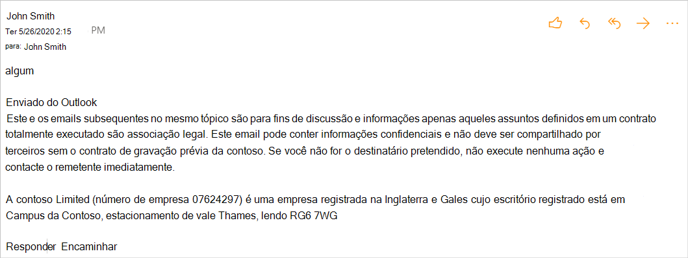

# <a name="implement-append-on-send-in-your-outlook-add-in"></a>Implementar o append-on-send no seu Outlook de usuário

No final deste passo a passo, você terá um Outlook que pode inserir um aviso de isenção de responsabilidade quando uma mensagem for enviada.

> [!NOTE]
> O suporte para esse recurso foi introduzido no conjunto de requisitos 1.9. Confira, [clientes e plataformas](../reference/requirement-sets/outlook-api-requirement-sets.md#requirement-sets-supported-by-exchange-servers-and-outlook-clients) que oferecem suporte a esse conjunto de requisitos.

## <a name="set-up-your-environment"></a>Configurar seu ambiente

Conclua [Outlook início](../quickstarts/outlook-quickstart.md?tabs=yeomangenerator) rápido que cria um projeto de complemento com o gerador Yeoman para Office Desempois.

## <a name="configure-the-manifest"></a>Configurar o manifesto

Para habilitar o recurso append-on-send no seu complemento, você deve incluir a permissão na `AppendOnSend` coleção [ExtendedPermissions](../reference/manifest/extendedpermissions.md).

Para esse cenário, em vez de executar a função ao escolher o botão Executar uma `action` ação, você executará a  `appendOnSend` função.

1. No editor de código, abra o projeto de início rápido.

1. Abra o **manifest.xml** arquivo localizado na raiz do seu projeto.

1. Selecione o nó `<VersionOverrides>` inteiro (incluindo marcas abertas e próximas) e substitua-o pelo XML a seguir.

    ```XML
    <VersionOverrides xmlns="http://schemas.microsoft.com/office/mailappversionoverrides" xsi:type="VersionOverridesV1_0">
      <VersionOverrides xmlns="http://schemas.microsoft.com/office/mailappversionoverrides/1.1" xsi:type="VersionOverridesV1_1">
        <Requirements>
          <bt:Sets DefaultMinVersion="1.3">
            <bt:Set Name="Mailbox" />
          </bt:Sets>
        </Requirements>
        <Hosts>
          <Host xsi:type="MailHost">
            <DesktopFormFactor>
              <FunctionFile resid="Commands.Url" />
              <ExtensionPoint xsi:type="MessageComposeCommandSurface">
                <OfficeTab id="TabDefault">
                  <Group id="msgComposeGroup">
                    <Label resid="GroupLabel" />
                    <Control xsi:type="Button" id="msgComposeOpenPaneButton">
                      <Label resid="TaskpaneButton.Label" />
                      <Supertip>
                        <Title resid="TaskpaneButton.Label" />
                        <Description resid="TaskpaneButton.Tooltip" />
                      </Supertip>
                      <Icon>
                        <bt:Image size="16" resid="Icon.16x16" />
                        <bt:Image size="32" resid="Icon.32x32" />
                        <bt:Image size="80" resid="Icon.80x80" />
                      </Icon>
                      <Action xsi:type="ShowTaskpane">
                        <SourceLocation resid="Taskpane.Url" />
                      </Action>
                    </Control>
                    <Control xsi:type="Button" id="ActionButton">
                      <Label resid="ActionButton.Label"/>
                      <Supertip>
                        <Title resid="ActionButton.Label"/>
                        <Description resid="ActionButton.Tooltip"/>
                      </Supertip>
                      <Icon>
                        <bt:Image size="16" resid="Icon.16x16"/>
                        <bt:Image size="32" resid="Icon.32x32"/>
                        <bt:Image size="80" resid="Icon.80x80"/>
                      </Icon>
                      <Action xsi:type="ExecuteFunction">
                        <FunctionName>appendDisclaimerOnSend</FunctionName>
                      </Action>
                    </Control>
                  </Group>
                </OfficeTab>
              </ExtensionPoint>

              <!-- Configure AppointmentOrganizerCommandSurface extension point to support
              append on sending a new appointment. -->

            </DesktopFormFactor>
          </Host>
        </Hosts>
        <Resources>
          <bt:Images>
            <bt:Image id="Icon.16x16" DefaultValue="https://localhost:3000/assets/icon-16.png"/>
            <bt:Image id="Icon.32x32" DefaultValue="https://localhost:3000/assets/icon-32.png"/>
            <bt:Image id="Icon.80x80" DefaultValue="https://localhost:3000/assets/icon-80.png"/>
          </bt:Images>
          <bt:Urls>
            <bt:Url id="Commands.Url" DefaultValue="https://localhost:3000/commands.html" />
            <bt:Url id="Taskpane.Url" DefaultValue="https://localhost:3000/taskpane.html" />
            <bt:Url id="WebViewRuntime.Url" DefaultValue="https://localhost:3000/commands.html" />
            <bt:Url id="JSRuntime.Url" DefaultValue="https://localhost:3000/runtime.js" />
          </bt:Urls>
          <bt:ShortStrings>
            <bt:String id="GroupLabel" DefaultValue="Contoso Add-in"/>
            <bt:String id="TaskpaneButton.Label" DefaultValue="Show Taskpane"/>
            <bt:String id="ActionButton.Label" DefaultValue="Perform an action"/>
          </bt:ShortStrings>
          <bt:LongStrings>
            <bt:String id="TaskpaneButton.Tooltip" DefaultValue="Opens a pane displaying all available properties."/>
            <bt:String id="ActionButton.Tooltip" DefaultValue="Perform an action when clicked."/>
          </bt:LongStrings>
        </Resources>
        <ExtendedPermissions>
          <ExtendedPermission>AppendOnSend</ExtendedPermission>
        </ExtendedPermissions>
      </VersionOverrides>
    </VersionOverrides>
    ```

> [!TIP]
> Para saber mais sobre manifestos para Outlook de Outlook, [consulte Outlook manifestos de complemento.](manifests.md)

## <a name="implement-append-on-send-handling"></a>Implementar a manipulação de anexação ao envio

Em seguida, implemente a aplicação dependendo do evento de envio.

> [!IMPORTANT]
> Se o seu add-in [ `ItemSend` ](outlook-on-send-addins.md)também implementar o tratamento de eventos ao enviar usando , chamar o manipulador ao enviar retornará um erro, pois esse cenário não `AppendOnSendAsync` é suportado.

Para esse cenário, você implementará a aplicação de um aviso de isenção de responsabilidade ao item quando o usuário enviar.

1. No mesmo projeto de início rápido, abra o arquivo **./src/commands/commands.js** no editor de código.

1. Após a `action` função, insira a seguinte função JavaScript.

    ```js
    function appendDisclaimerOnSend(event) {
      var appendText =
        '<p style = "color:blue"> <i>This and subsequent emails on the same topic are for discussion and information purposes only. Only those matters set out in a fully executed agreement are legally binding. This email may contain confidential information and should not be shared with any third party without the prior written agreement of Contoso. If you are not the intended recipient, take no action and contact the sender immediately.<br><br>Contoso Limited (company number 01624297) is a company registered in England and Wales whose registered office is at Contoso Campus, Thames Valley Park, Reading RG6 1WG</i></p>';  
      /**
        *************************************************************
         Ideal Usage - Call the getBodyType API. Use the coercionType
         it returns as the parameter value below.
        *************************************************************
      */
      Office.context.mailbox.item.body.appendOnSendAsync(
        appendText,
        {
          coercionType: Office.CoercionType.Html
        },
        function(asyncResult) {
          console.log(asyncResult);
        }
      );

      event.completed();
    }
    ```

1. No final do arquivo, adicione a seguinte instrução.

    ```js
    g.appendDisclaimerOnSend = appendDisclaimerOnSend;
    ```

## <a name="try-it-out"></a>Experimente

1. Execute o seguinte comando no diretório raiz do seu projeto. Quando você executar esse comando, o servidor Web local será acionado se ele ainda não estiver em execução e seu complemento será sideload. 

    ```command&nbsp;line
    npm start
    ```

1. Crie uma nova mensagem e adicione-se à **linha** Para.

1. No menu faixa de opções ou estouro, escolha **Executar uma ação**.

1. Envie a mensagem e abra-a  da sua pasta Caixa de **Entrada** ou Itens Enviados para exibir o aviso de isenção de responsabilidade anexado.

    

## <a name="see-also"></a>Confira também

[Manifestos de suplementos do Outlook](manifests.md)
