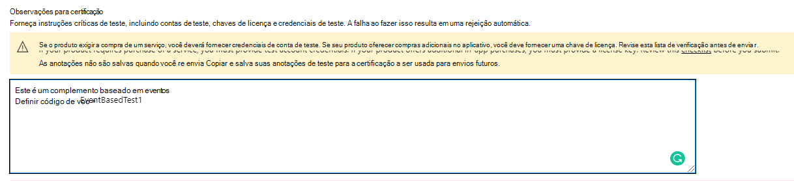

# <a name="appsource-listing-options-for-your-event-based-outlook-add-in"></a><span data-ttu-id="4228b-103">Opções de listagem do AppSource para seu Outlook de evento</span><span class="sxs-lookup"><span data-stu-id="4228b-103">AppSource listing options for your event-based Outlook add-in</span></span>

<span data-ttu-id="4228b-104">Atualmente, os complementos devem ser implantados pelos administradores de uma organização para que os usuários finais acessem a funcionalidade de recurso baseada em evento.</span><span class="sxs-lookup"><span data-stu-id="4228b-104">At present, add-ins must be deployed by an organization's admins for end-users to access the event-based feature functionality.</span></span> <span data-ttu-id="4228b-105">Estamos restringindo a ativação baseada em eventos se o usuário final adquiriu o complemento diretamente do AppSource.</span><span class="sxs-lookup"><span data-stu-id="4228b-105">We're restricting event-based activation if the end-user acquired the add-in directly from AppSource.</span></span> <span data-ttu-id="4228b-106">Por exemplo, se o complemento Contoso incluir o ponto de extensão com pelo menos um definido no nó (consulte o trecho a seguir de um manifesto de complemento de exemplo), a invocação automática do add-in só acontecerá se o complemento tiver sido instalado para o usuário final pelo administrador da organização. Caso contrário, a invocação automática do complemento será `LaunchEvent` `LaunchEvent Type` `LaunchEvents` bloqueada.</span><span class="sxs-lookup"><span data-stu-id="4228b-106">For example, if the Contoso add-in includes the `LaunchEvent` extension point with at least one defined `LaunchEvent Type` under the `LaunchEvents` node (see the following excerpt from an example add-in manifest), the automatic invocation of the add-in only happens if the add-in was installed for the end-user by their organization's admin. Otherwise, the automatic invocation of the add-in is blocked.</span></span>

```xml
...
<ExtensionPoint xsi:type="LaunchEvent">
  <LaunchEvents>
    <LaunchEvent Type="OnNewMessageCompose" FunctionName="onMessageComposeHandler"/>
    ...
```

<span data-ttu-id="4228b-107">Um usuário final ou administrador pode adquirir os complementos por meio do AppSource ou do armazenamento de inclientes.</span><span class="sxs-lookup"><span data-stu-id="4228b-107">An end-user or admin can acquire add-ins through AppSource or the inclient store.</span></span> <span data-ttu-id="4228b-108">Se o cenário principal ou o fluxo de trabalho do seu complemento exigir a ativação baseada em eventos, talvez você queira restringir seus complementos disponíveis para a implantação do administrador.</span><span class="sxs-lookup"><span data-stu-id="4228b-108">If your add-in's primary scenario or workflow requires event-based activation, you may want to restrict your add-ins available to admin deployment.</span></span> <span data-ttu-id="4228b-109">Para habilitar essa restrição, podemos fornecer URLs de código de voo.</span><span class="sxs-lookup"><span data-stu-id="4228b-109">To enable that restriction, we can provide flight code URLs.</span></span> <span data-ttu-id="4228b-110">Graças aos códigos de pré-lançamento, somente os usuários finais com essas URLs especiais podem acessar a listagem.</span><span class="sxs-lookup"><span data-stu-id="4228b-110">Thanks to the flight codes, only end-users with these special URLs can access the listing.</span></span> <span data-ttu-id="4228b-111">A seguir está uma URL de exemplo.</span><span class="sxs-lookup"><span data-stu-id="4228b-111">The following is an example URL.</span></span>

`https://appsource.microsoft.com/product/office/WA200002862?flightCodes=EventBasedTest1`

<span data-ttu-id="4228b-112">Os usuários e administradores não podem pesquisar explicitamente um complemento pelo nome no AppSource ou no armazenamento de inclientes quando um código de pré-voo está habilitado para ele.</span><span class="sxs-lookup"><span data-stu-id="4228b-112">Users and admins can't explicitly search for an add-in by its name in AppSource or the inclient store when a flight code is enabled for it.</span></span> <span data-ttu-id="4228b-113">Como criador do add-in, você pode compartilhar esses códigos de pré-lançamento em particular com os administradores da organização para implantação do complemento.</span><span class="sxs-lookup"><span data-stu-id="4228b-113">As the add-in creator, you can privately share these flight codes with organization admins for add-in deployment.</span></span>

> [!NOTE]
> <span data-ttu-id="4228b-114">Embora os usuários finais possam instalar o complemento usando um código de pré-lançamento, o complemento não incluirá a ativação baseada em evento.</span><span class="sxs-lookup"><span data-stu-id="4228b-114">While end-users can install the add-in using a flight code, the add-in won't include event-based activation.</span></span>

## <a name="specify-a-flight-code"></a><span data-ttu-id="4228b-115">Especificar um código de voo</span><span class="sxs-lookup"><span data-stu-id="4228b-115">Specify a flight code</span></span>

<span data-ttu-id="4228b-116">Você pode especificar o código de pré-voo que deseja para o seu complemento compartilhando essas informações no **Notes para** certificação quando estiver publicando seu complemento.</span><span class="sxs-lookup"><span data-stu-id="4228b-116">You can specify the flight code you want for your add-in by sharing that information in the **Notes for certification** when you're publishing your add-in.</span></span> <span data-ttu-id="4228b-117">_**Importante**:_ Os códigos de pré-lançamento são sensíveis a minúsculas.</span><span class="sxs-lookup"><span data-stu-id="4228b-117">_**Important**:_ Flight codes are case-sensitive.</span></span>



## <a name="deploy-add-in-with-flight-code"></a><span data-ttu-id="4228b-119">Implantar o add-in com código de pré-voo</span><span class="sxs-lookup"><span data-stu-id="4228b-119">Deploy add-in with flight code</span></span>

<span data-ttu-id="4228b-120">Depois que os códigos de voo são definidos, você receberá a URL da equipe de certificação do aplicativo.</span><span class="sxs-lookup"><span data-stu-id="4228b-120">After the flight codes are set, you'll receive the URL from the app certification team.</span></span> <span data-ttu-id="4228b-121">Em seguida, você pode compartilhar a URL com administradores em particular.</span><span class="sxs-lookup"><span data-stu-id="4228b-121">You can then share the URL with admins privately.</span></span>

<span data-ttu-id="4228b-122">Para implantar o complemento, o administrador pode usar as etapas a seguir.</span><span class="sxs-lookup"><span data-stu-id="4228b-122">To deploy the add-in, the admin can use the following steps.</span></span>

- <span data-ttu-id="4228b-123">Entre no admin.microsoft.com ou AppSource.com com sua conta Microsoft 365 administrador.</span><span class="sxs-lookup"><span data-stu-id="4228b-123">Sign in to admin.microsoft.com or AppSource.com with your Microsoft 365 admin account.</span></span> <span data-ttu-id="4228b-124">Se o complemento tiver o SSO (SSO) habilitado, serão necessárias credenciais de administrador global.</span><span class="sxs-lookup"><span data-stu-id="4228b-124">If the add-in has Single sign-on (SSO) enabled, global admin credentials are needed.</span></span>
- <span data-ttu-id="4228b-125">Abra a URL do código de voo em um navegador da Web.</span><span class="sxs-lookup"><span data-stu-id="4228b-125">Open the flight code URL into a web browser.</span></span>
- <span data-ttu-id="4228b-126">Na página listagem de complementos, selecione **Obter agora**.</span><span class="sxs-lookup"><span data-stu-id="4228b-126">On the add-in listing page, select **Get it now**.</span></span> <span data-ttu-id="4228b-127">Você deve ser redirecionado para o portal do aplicativo integrado.</span><span class="sxs-lookup"><span data-stu-id="4228b-127">You should be redirected to the integrated app portal.</span></span>

## <a name="unrestricted-appsource-listing"></a><span data-ttu-id="4228b-128">Listagem irrestrita do AppSource</span><span class="sxs-lookup"><span data-stu-id="4228b-128">Unrestricted AppSource listing</span></span>

<span data-ttu-id="4228b-129">Se o seu add-in não usar a ativação baseada em eventos para cenários críticos (ou seja, seu complemento funciona bem sem invocação automática), considere listar seu complemento no AppSource sem códigos de pré-lançamento especiais.</span><span class="sxs-lookup"><span data-stu-id="4228b-129">If your add-in doesn't use event-based activation for critical scenarios (that is, your add-in works well without automatic invocation), consider listing your add-in in AppSource without any special flight codes.</span></span> <span data-ttu-id="4228b-130">Se um usuário final receber seu complemento do AppSource, a ativação automática não acontecerá para o usuário.</span><span class="sxs-lookup"><span data-stu-id="4228b-130">If an end-user gets your add-in from AppSource, automatic activation won't happen for the user.</span></span> <span data-ttu-id="4228b-131">No entanto, eles podem usar outros componentes do seu complemento, como um painel de tarefas ou um comando sem interface do usuário.</span><span class="sxs-lookup"><span data-stu-id="4228b-131">However, they can use other components of your add-in such as a task pane or UI-less command.</span></span>

> [!IMPORTANT]
> <span data-ttu-id="4228b-132">Esta é uma restrição temporária.</span><span class="sxs-lookup"><span data-stu-id="4228b-132">This is a temporary restriction.</span></span> <span data-ttu-id="4228b-133">No futuro, planejamos habilitar a ativação de add-in baseado em evento para usuários finais que adquirem diretamente o seu complemento.</span><span class="sxs-lookup"><span data-stu-id="4228b-133">In future, we plan to enable event-based add-in activation for end-users who directly acquire your add-in.</span></span>

## <a name="update-existing-add-ins-to-include-event-based-activation"></a><span data-ttu-id="4228b-134">Atualizar os complementos existentes para incluir a ativação baseada em eventos</span><span class="sxs-lookup"><span data-stu-id="4228b-134">Update existing add-ins to include event-based activation</span></span>

<span data-ttu-id="4228b-135">Você pode atualizar o seu add-in existente para incluir a ativação baseada em evento e reapresentá-lo para validação e decidir se deseja uma listagem restrita ou irrestrita do AppSource.</span><span class="sxs-lookup"><span data-stu-id="4228b-135">You can update your existing add-in to include event-based activation then resubmit it for validation and decide if you want a restricted or unrestricted AppSource listing.</span></span>

<span data-ttu-id="4228b-136">Depois que o complemento atualizado for aprovado, os administradores da organização que já implantaram o complemento receberão uma mensagem de atualização no portal de administração.</span><span class="sxs-lookup"><span data-stu-id="4228b-136">After the updated add-in has been approved, organization admins who have already deployed the add-in will receive an update message in the admin portal.</span></span> <span data-ttu-id="4228b-137">A mensagem aconselha o administrador sobre as alterações de ativação baseadas em eventos.</span><span class="sxs-lookup"><span data-stu-id="4228b-137">The message advises the admin about the event-based activation changes.</span></span> <span data-ttu-id="4228b-138">Depois que o administrador aceitar as alterações, a atualização será implantada para os usuários finais.</span><span class="sxs-lookup"><span data-stu-id="4228b-138">After the admin accepts the changes, the update will be deployed to end-users.</span></span>


<span data-ttu-id="4228b-140">Para usuários finais que instalaram o add-in por conta própria, o recurso de ativação baseada em eventos não funcionará mesmo depois que o complemento for atualizado.</span><span class="sxs-lookup"><span data-stu-id="4228b-140">For end-users who installed the add-in on their own, the event-based activation feature won't work even after the add-in has been updated.</span></span>

## <a name="admin-consent-for-installing-event-based-add-ins"></a><span data-ttu-id="4228b-141">Consentimento do administrador para instalar os complementos baseados em eventos</span><span class="sxs-lookup"><span data-stu-id="4228b-141">Admin consent for installing event-based add-ins</span></span>

<span data-ttu-id="4228b-142">Sempre que um complemento baseado em  evento é implantado na seção Aplicativos Integrados do centro de administração, o administrador obtém detalhes sobre os recursos de ativação baseados em eventos do add-in no assistente de implantação.</span><span class="sxs-lookup"><span data-stu-id="4228b-142">Whenever an event-based add-in is deployed from the **Integrated Apps** section of the admin center, the admin gets details about the add-in's event-based activation capabilities in the deployment wizard.</span></span> <span data-ttu-id="4228b-143">Os detalhes aparecem na seção **Permissões e Funcionalidades do** Aplicativo.</span><span class="sxs-lookup"><span data-stu-id="4228b-143">The details appear in the **App Permissions and Capabilities** section.</span></span> <span data-ttu-id="4228b-144">O administrador deve ver todos os eventos em que o complemento pode ser ativado automaticamente.</span><span class="sxs-lookup"><span data-stu-id="4228b-144">The admin should see all the events where the add-in can automatically activate.</span></span>


<span data-ttu-id="4228b-146">Da mesma forma, quando um complemento existente é atualizado para a funcionalidade baseada em eventos, o administrador vê um status "Atualizar Pendentes" no complemento.</span><span class="sxs-lookup"><span data-stu-id="4228b-146">Similarly, when an existing add-in is updated to event-based functionality, the admin sees an "Update Pending" status on the add-in.</span></span> <span data-ttu-id="4228b-147">O complemento atualizado será implantado somente se o administrador consentir com as alterações notadas na seção Permissões e **Funcionalidades** do Aplicativo, incluindo o conjunto de eventos em que o complemento pode ser ativado automaticamente.</span><span class="sxs-lookup"><span data-stu-id="4228b-147">The updated add-in is deployed only if the admin consents to the changes noted in the **App Permissions and Capabilities** section, including the set of events where the add-in can automatically activate.</span></span>

<span data-ttu-id="4228b-148">Sempre que você adicionar qualquer novidade ao seu complemento, os administradores verão o fluxo de atualização no portal de administração e precisarão fornecer `LaunchEvent Type` consentimento para eventos adicionais.</span><span class="sxs-lookup"><span data-stu-id="4228b-148">Each time you add any new `LaunchEvent Type` to your add-in, admins will see the update flow in the admin portal and need to provide consent for additional events.</span></span>


## <a name="see-also"></a><span data-ttu-id="4228b-150">Confira também</span><span class="sxs-lookup"><span data-stu-id="4228b-150">See also</span></span>

- [<span data-ttu-id="4228b-151">Configurar seu Outlook para ativação baseada em eventos</span><span class="sxs-lookup"><span data-stu-id="4228b-151">Configure your Outlook add-in for event-based activation</span></span>](autolaunch.md)
