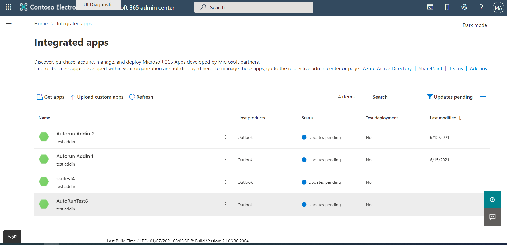
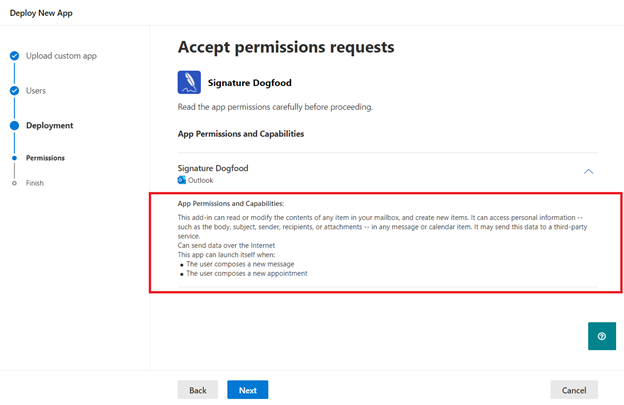

# Opções de listagem do AppSource para seu suplemento do Outlook baseado em evento

Os suplementos devem ser implantados pelos administradores de uma organização para que os usuários finais acessem o recurso [de ativação baseado em eventos](autolaunch.md) . A ativação baseada em eventos será restrita se o usuário final adquiriu o suplemento diretamente do [AppSource](https://appsource.microsoft.com). Por exemplo, se o suplemento Contoso incluir uma função baseada em eventos, a invocação automática do suplemento só ocorrerá se o suplemento for instalado para o usuário final pelo administrador de sua organização. Caso contrário, a invocação automática do suplemento será bloqueada.

Um usuário final ou administrador pode adquirir suplementos por meio do AppSource ou da Office Store no aplicativo. Se o cenário ou o fluxo de trabalho primário do suplemento exigir ativação baseada em eventos, talvez você queira restringir seu suplemento apenas à implantação de administrador. Para habilitar essa restrição, podemos fornecer URLs de código de voo para suplementos no AppSource. Graças aos códigos de voo, somente os usuários finais com essas URLs especiais podem acessar a listagem. A seguir está uma URL de exemplo.

`https://appsource.microsoft.com/product/office/WA200002862?flightCodes=EventBasedTest1`

Usuários e administradores não podem pesquisar explicitamente um suplemento pelo nome no AppSource ou na Office Store no aplicativo quando um código de voo está habilitado para ele. Como criador do suplemento, você pode compartilhar esses códigos de voo privadamente com administradores da organização para implantação de suplementos.

> [!NOTE]
> Embora os usuários finais possam instalar o suplemento usando um código de voo, o suplemento não incluirá ativação baseada em evento.

[!INCLUDE [outlook-smart-alerts-deployment](../includes/outlook-smart-alerts-deployment.md)]

## Especificar um código de voo

Para especificar o código de voo do seu suplemento, compartilhe o código nas **Anotações para certificação** ao publicar seu suplemento. **Importante**: os códigos de voo são sensíveis a maiúsculas de minúsculas.

## Implantar o suplemento com código de voo

Depois que os códigos de voo forem definidos, você receberá a URL da equipe de certificação do aplicativo. Em seguida, você pode compartilhar a URL com administradores em particular.

Para implantar o suplemento, o administrador pode usar as etapas a seguir.

- Entre em admin.microsoft.com ou AppSource.com com sua conta de administrador do Microsoft 365. Se o suplemento tiver o SSO (logon único) habilitado, serão necessárias credenciais de administrador global.
- Abra a URL do código de voo em um navegador da Web.
- Na página de listagem de suplementos, selecione **Obtê-lo agora**. Você deve ser redirecionado para o portal de aplicativo integrado.

## Listagem irrestrita do AppSource

Se o suplemento não usar ativação baseada em eventos para cenários críticos (ou seja, seu suplemento funciona bem sem invocação automática), considere listar seu suplemento no AppSource sem códigos de voo especiais. Se um usuário final receber seu suplemento do AppSource, a ativação automática não acontecerá para o usuário. No entanto, eles podem usar outros componentes do seu suplemento, como um painel de tarefas ou um comando de função.

> [!IMPORTANT]
> Essa é uma restrição temporária. No futuro, planejamos habilitar a ativação de suplemento baseada em eventos para usuários finais que adquirem diretamente seu suplemento.

## Atualizar os suplementos existentes para incluir a ativação baseada em eventos

Você pode atualizar seu suplemento existente para incluir a ativação baseada em evento e reenvia-la para validação e decidir se deseja uma listagem restrita ou irrestrita do AppSource.

Depois que o suplemento atualizado for aprovado, os administradores da organização que implantaram o suplemento receberão uma mensagem de atualização na seção **Aplicativos integrados** do centro de administração. A mensagem aconselha o administrador sobre as alterações de ativação baseadas em eventos. Depois que o administrador aceitar as alterações, a atualização será implantada para usuários finais.

Para usuários finais que instalaram o suplemento por conta própria, o recurso de ativação baseado em eventos não funcionará mesmo após a atualização do suplemento.

## Administração consentimento para instalar suplementos baseados em evento

Sempre que um suplemento baseado em evento é implantado na tela **Aplicativos Integrados** , o administrador obtém detalhes sobre os recursos de ativação baseados em eventos do suplemento no assistente de implantação. Os detalhes aparecem na seção **Permissões e Recursos do Aplicativo** . O administrador deve ver todos os eventos em que o suplemento pode ser ativado automaticamente.

Da mesma forma, quando um suplemento existente é atualizado para a funcionalidade baseada em eventos, o administrador vê um status "Atualizar Pendente" no suplemento. O suplemento atualizado será implantado somente se o administrador consentir com as alterações anotadas na seção **Permissões e Recursos do Aplicativo** , incluindo o conjunto de eventos em que o suplemento pode ser ativado automaticamente.

Sempre que você adicionar qualquer nova função de ativação baseada em evento ao seu suplemento, os administradores verão o fluxo de atualização no portal de administração e precisarão fornecer consentimento para eventos adicionais.

## Confira também

- [Configurar o suplemento do Outlook para ativação baseada em eventos](autolaunch.md)
