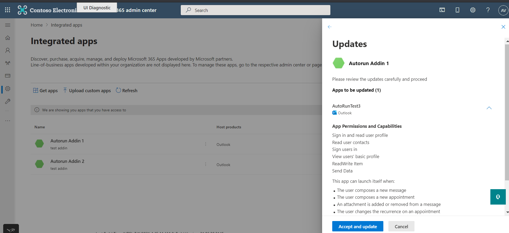

# <a name="appsource-listing-options-for-your-event-based-outlook-add-in"></a>Opções de listagem do AppSource para seu Outlook de evento

Atualmente, os complementos devem ser implantados pelos administradores de uma organização para que os usuários finais acessem a funcionalidade de recurso baseada em evento. Estamos restringindo a ativação baseada em eventos se o usuário final adquiriu o complemento diretamente do AppSource. Por exemplo, se o add-in Contoso incluir o ponto de extensão com pelo menos um definido no nó, a invocação automática do add-in só acontecerá se o complemento tiver sido instalado para o usuário final pelo administrador da organização. Caso contrário, a invocação automática do complemento será `LaunchEvent` `LaunchEvent Type` `LaunchEvents` bloqueada. Consulte o trecho a seguir de um manifesto de exemplo do complemento.

```xml
...
<ExtensionPoint xsi:type="LaunchEvent">
  <LaunchEvents>
    <LaunchEvent Type="OnNewMessageCompose" FunctionName="onMessageComposeHandler"/>
    ...
```

Um usuário final ou administrador pode adquirir os complementos por meio do AppSource ou do aplicativo Office Store. Se o cenário principal ou o fluxo de trabalho do seu complemento exigir a ativação baseada em eventos, talvez você queira restringir seus complementos disponíveis para a implantação do administrador. Para habilitar essa restrição, podemos fornecer URLs de código de voo. Graças aos códigos de pré-lançamento, somente os usuários finais com essas URLs especiais podem acessar a listagem. A seguir está uma URL de exemplo.

`https://appsource.microsoft.com/product/office/WA200002862?flightCodes=EventBasedTest1`

Os usuários e administradores não podem pesquisar explicitamente um complemento pelo nome no AppSource ou no aplicativo Office Store quando um código de pré-voo estiver habilitado para ele. Como criador do add-in, você pode compartilhar esses códigos de pré-lançamento em particular com os administradores da organização para implantação do complemento.

> [!NOTE]
> Embora os usuários finais possam instalar o complemento usando um código de pré-lançamento, o complemento não incluirá a ativação baseada em evento.

## <a name="specify-a-flight-code"></a>Especificar um código de voo

Para especificar o código de voo que você deseja para o seu complemento, compartilhe essas informações no **Notes para** certificação quando estiver publicando seu complemento. _**Importante**:_ Os códigos de pré-lançamento são sensíveis a minúsculas.


## <a name="deploy-add-in-with-flight-code"></a>Implantar o add-in com código de pré-voo

Depois que os códigos de voo são definidos, você receberá a URL da equipe de certificação do aplicativo. Em seguida, você pode compartilhar a URL com administradores em particular.

Para implantar o complemento, o administrador pode usar as etapas a seguir.

- Entre no admin.microsoft.com ou AppSource.com com sua conta Microsoft 365 administrador. Se o complemento tiver o SSO (SSO) único habilitado, serão necessárias credenciais de administrador global.
- Abra a URL do código de voo em um navegador da Web.
- Na página listagem de complementos, selecione **Obter agora**. Você deve ser redirecionado para o portal do aplicativo integrado.

## <a name="unrestricted-appsource-listing"></a>Listagem irrestrita do AppSource

Se o seu add-in não usar a ativação baseada em eventos para cenários críticos (ou seja, seu complemento funciona bem sem invocação automática), considere listar seu complemento no AppSource sem códigos de pré-lançamento especiais. Se um usuário final receber seu complemento do AppSource, a ativação automática não acontecerá para o usuário. No entanto, eles podem usar outros componentes do seu complemento, como um painel de tarefas ou um comando sem interface do usuário.

> [!IMPORTANT]
> Esta é uma restrição temporária. No futuro, planejamos habilitar a ativação de add-in baseado em evento para usuários finais que adquirem diretamente o seu complemento.

## <a name="update-existing-add-ins-to-include-event-based-activation"></a>Atualizar os complementos existentes para incluir a ativação baseada em eventos

Você pode atualizar o seu add-in existente para incluir a ativação baseada em evento e reapresentá-lo para validação e decidir se deseja uma listagem restrita ou irrestrita do AppSource.

Depois que o complemento atualizado for aprovado, os administradores da organização que já  implantaram o complemento receberão uma mensagem de atualização na seção Aplicativos integrados do centro de administração. A mensagem aconselha o administrador sobre as alterações de ativação baseadas em eventos. Depois que o administrador aceitar as alterações, a atualização será implantada para os usuários finais.


Para usuários finais que instalaram o add-in por conta própria, o recurso de ativação baseada em eventos não funcionará mesmo depois que o complemento for atualizado.

## <a name="admin-consent-for-installing-event-based-add-ins"></a>Consentimento do administrador para instalar os complementos baseados em eventos

Sempre que um complemento baseado em  evento é implantado na tela Aplicativos Integrados, o administrador obtém detalhes sobre os recursos de ativação baseada em eventos do add-in no assistente de implantação. Os detalhes aparecem na seção **Permissões e Funcionalidades do** Aplicativo. O administrador deve ver todos os eventos em que o complemento pode ser ativado automaticamente.


Da mesma forma, quando um complemento existente é atualizado para a funcionalidade baseada em eventos, o administrador vê um status "Atualizar Pendentes" no complemento. O complemento atualizado será implantado somente se o administrador consentir com as alterações notadas na seção Permissões e **Funcionalidades** do Aplicativo, incluindo o conjunto de eventos em que o complemento pode ser ativado automaticamente.

Sempre que você adicionar qualquer novidade ao seu complemento, os administradores verão o fluxo de atualização no portal de administração e precisarão fornecer `LaunchEvent Type` consentimento para eventos adicionais.



## <a name="see-also"></a>Confira também

- [Configurar seu Outlook para ativação baseada em eventos](autolaunch.md)
