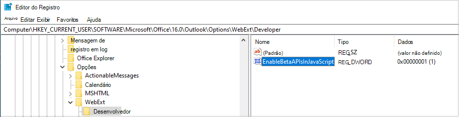
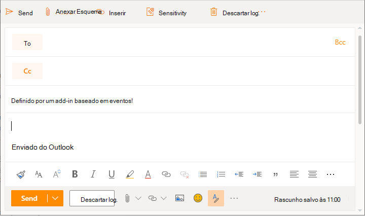
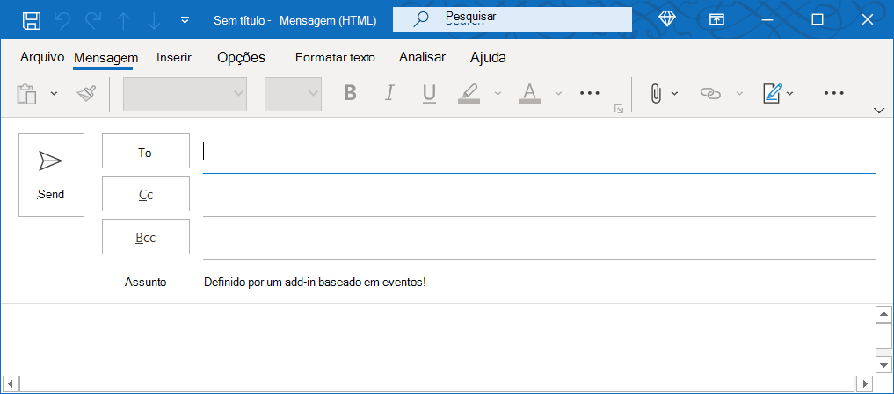

# <a name="configure-your-outlook-add-in-for-event-based-activation"></a>Configurar seu Outlook para ativação baseada em eventos

Sem o recurso de ativação baseada em evento, um usuário precisa iniciar explicitamente um complemento para concluir suas tarefas. Esse recurso permite que o seu complemento execute tarefas com base em determinados eventos, especialmente para operações que se aplicam a cada item. Você também pode se integrar ao painel de tarefas e à funcionalidade sem interface do usuário.

No final deste passo a passo, você terá um complemento que é executado sempre que um novo item é criado e define o assunto.

> [!NOTE]
> O suporte para esse recurso foi introduzido no [conjunto de requisitos 1.10](../reference/objectmodel/requirement-set-1.10/outlook-requirement-set-1.10.md). Confira, [clientes e plataformas](../reference/requirement-sets/outlook-api-requirement-sets.md#requirement-sets-supported-by-exchange-servers-and-outlook-clients) que oferecem suporte a esse conjunto de requisitos.

## <a name="supported-events"></a>Eventos com suporte

A tabela a seguir lista os eventos com suporte no momento. Quando um evento é gerado, o manipulador recebe um objeto que pode `event` incluir detalhes específicos do tipo de evento. A **coluna JSON específica** do evento inclui um link para o objeto relacionado quando aplicável. A tabela também observa os clientes com suporte para cada evento.

> [!IMPORTANT]
> Os eventos ainda em visualização só podem estar disponíveis com uma assinatura Microsoft 365 no Outlook na Web e no Windows. Para obter mais detalhes, [consulte Como visualizar](#how-to-preview) neste artigo. Eventos de visualização não devem ser usados em complementos de produção.

|Evento|Descrição|JSON específico do evento|Conjunto de requisitos mínimo|Clientes com suporte|
|---|---|---|---|---|
|`OnNewMessageCompose`|Ao compor uma nova mensagem (inclui responder, responder a todos e encaminhar), mas não ao editar, por exemplo, um rascunho.|Não aplicável|[1.10](../reference/objectmodel/requirement-set-1.10/outlook-requirement-set-1.10.md)|Windows, navegador da Web|
|`OnNewAppointmentOrganizer`|Ao criar um novo compromisso, mas não ao editar um existente.|Não aplicável|[1.10](../reference/objectmodel/requirement-set-1.10/outlook-requirement-set-1.10.md)|Windows, navegador da Web|
|`OnMessageAttachmentsChanged`|Ao adicionar ou remover anexos ao compor uma mensagem.|[AttachmentsChangedEventArgs](/javascript/api/outlook/office.attachmentschangedeventargs?view=outlook-js-1.11&preserve-view=true)|[1.11](../reference/objectmodel/requirement-set-1.11/outlook-requirement-set-1.11.md)|Windows, navegador da Web|
|`OnAppointmentAttachmentsChanged`|Ao adicionar ou remover anexos durante a composição de um compromisso.|[AttachmentsChangedEventArgs](/javascript/api/outlook/office.attachmentschangedeventargs?view=outlook-js-1.11&preserve-view=true)|[1.11](../reference/objectmodel/requirement-set-1.11/outlook-requirement-set-1.11.md)|Windows, navegador da Web|
|`OnMessageRecipientsChanged`|Ao adicionar ou remover destinatários ao compor uma mensagem.|[RecipientsChangedEventArgs](/javascript/api/outlook/office.recipientschangedeventargs?view=outlook-js-1.11&preserve-view=true)|[1.11](../reference/objectmodel/requirement-set-1.11/outlook-requirement-set-1.11.md)|Windows, navegador da Web|
|`OnAppointmentAttendeesChanged`|Ao adicionar ou remover participantes durante a composição de um compromisso.|[RecipientsChangedEventArgs](/javascript/api/outlook/office.recipientschangedeventargs?view=outlook-js-1.11&preserve-view=true)|[1.11](../reference/objectmodel/requirement-set-1.11/outlook-requirement-set-1.11.md)|Windows, navegador da Web|
|`OnAppointmentTimeChanged`|Ao alterar data/hora durante a composição de um compromisso.|[AppointmentTimeChangedEventArgs](/javascript/api/outlook/office.appointmenttimechangedeventargs?view=outlook-js-1.11&preserve-view=true)|[1.11](../reference/objectmodel/requirement-set-1.11/outlook-requirement-set-1.11.md)|Windows, navegador da Web|
|`OnAppointmentRecurrenceChanged`|Ao adicionar, alterar ou remover os detalhes de recorrência ao compor um compromisso. Se a data/hora for alterada, `OnAppointmentTimeChanged` o evento também será acionado.|[RecurrenceChangedEventArgs](/javascript/api/outlook/office.recurrencechangedeventargs?view=outlook-js-1.11&preserve-view=true)|[1.11](../reference/objectmodel/requirement-set-1.11/outlook-requirement-set-1.11.md)|Windows, navegador da Web|
|`OnInfoBarDismissClicked`|Ao descartar uma notificação ao compor uma mensagem ou item de compromisso. Somente o complemento que adicionou a notificação será notificado.|[InfobarClickedEventArgs](/javascript/api/outlook/office.infobarclickedeventargs?view=outlook-js-1.11&preserve-view=true)|[1.11](../reference/objectmodel/requirement-set-1.11/outlook-requirement-set-1.11.md)|Windows, navegador da Web|
|`OnMessageSend`|Ao enviar um item de mensagem. Para saber mais, consulte o passo a passo [alertas inteligentes](smart-alerts-onmessagesend-walkthrough.md).|Não aplicável|[Visualização](../reference/objectmodel/preview-requirement-set/outlook-requirement-set-preview.md)|Windows|
|`OnAppointmentSend`|Ao enviar um item de compromisso. Para saber mais, consulte o passo a passo [alertas inteligentes](smart-alerts-onmessagesend-walkthrough.md).|Não aplicável|[Visualização](../reference/objectmodel/preview-requirement-set/outlook-requirement-set-preview.md)|Windows|

### <a name="how-to-preview"></a>Como visualizar

Convidamos você a experimentar os eventos agora na visualização! Deixe-nos saber seus cenários e como podemos melhorar nos dando feedback por meio GitHub (consulte a seção **Comentários** no final desta página).

Para visualizar esses eventos:

- Para Outlook na Web:
  - [Configure a versão direcionada em seu Microsoft 365 locatário](/microsoft-365/admin/manage/release-options-in-office-365?view=o365-worldwide&preserve-view=true#set-up-the-release-option-in-the-admin-center).
  - Fazer referência **à biblioteca beta** no CDN ( https://appsforoffice.microsoft.com/lib/beta/hosted/office.js) . O [arquivo de definição de](https://appsforoffice.microsoft.com/lib/beta/hosted/office.d.ts) tipo para a compilação typeScript e IntelliSense é encontrado no CDN e [DefinitelyTyped](https://raw.githubusercontent.com/DefinitelyTyped/DefinitelyTyped/master/types/office-js-preview/index.d.ts). Você pode instalar esses tipos com `npm install --save-dev @types/office-js-preview` .
- Para Outlook no Windows:
  - O build mínimo necessário é 16.0.14511.10000. Participe do [programa Office Insider](https://insider.office.com) para acessar Office beta.
  - Configure o Registro. Outlook inclui uma cópia local das versões de produção e beta do Office.js em vez de carregar do CDN. Por padrão, a cópia de produção local da API é referenciada. Para alternar para a cópia beta local das APIs javaScript Outlook, você precisa adicionar essa entrada do Registro, caso contrário, as APIs beta podem não ser encontradas.
    1. Crie a chave do Registro `HKEY_CURRENT_USER\SOFTWARE\Microsoft\Office\16.0\Outlook\Options\WebExt\Developer` .
    1. Adicione uma entrada chamada `EnableBetaAPIsInJavaScript` e desmarcar o valor como `1` . A imagem a seguir mostra qual deve ser a aparência de registro.

        

## <a name="set-up-your-environment"></a>Configurar seu ambiente

Conclua [Outlook início](../quickstarts/outlook-quickstart.md?tabs=yeomangenerator) rápido que cria um projeto de complemento com o gerador Yeoman para Office Desempois.

## <a name="configure-the-manifest"></a>Configurar o manifesto

Para habilitar a ativação baseada em evento do seu add-in, você deve configurar o elemento [Runtimes](../reference/manifest/runtimes.md) e o ponto de extensão [LaunchEvent](../reference/manifest/extensionpoint.md#launchevent) `VersionOverridesV1_1` no nó do manifesto. Por enquanto, `DesktopFormFactor` é o único fator de formulário suportado.

1. No editor de código, abra o projeto de início rápido.

1. Abra o **manifest.xml** arquivo localizado na raiz do seu projeto.

1. Selecione o nó `<VersionOverrides>` inteiro (incluindo marcas abertas e próximas) e substitua-o pelo XML a seguir e salve suas alterações.

```XML
<VersionOverrides xmlns="http://schemas.microsoft.com/office/mailappversionoverrides" xsi:type="VersionOverridesV1_0">
  <VersionOverrides xmlns="http://schemas.microsoft.com/office/mailappversionoverrides/1.1" xsi:type="VersionOverridesV1_1">
    <Requirements>
      <bt:Sets DefaultMinVersion="1.3">
        <bt:Set Name="Mailbox" />
      </bt:Sets>
    </Requirements>
    <Hosts>
      <Host xsi:type="MailHost">
        <!-- Event-based activation happens in a lightweight runtime.-->
        <Runtimes>
          <!-- HTML file including reference to or inline JavaScript event handlers.
               This is used by Outlook on the web. -->
          <Runtime resid="WebViewRuntime.Url">
            <!-- JavaScript file containing event handlers. This is used by Outlook Desktop. -->
            <Override type="javascript" resid="JSRuntime.Url"/>
          </Runtime>
        </Runtimes>
        <DesktopFormFactor>
          <FunctionFile resid="Commands.Url" />
          <ExtensionPoint xsi:type="MessageReadCommandSurface">
            <OfficeTab id="TabDefault">
              <Group id="msgReadGroup">
                <Label resid="GroupLabel" />
                <Control xsi:type="Button" id="msgReadOpenPaneButton">
                  <Label resid="TaskpaneButton.Label" />
                  <Supertip>
                    <Title resid="TaskpaneButton.Label" />
                    <Description resid="TaskpaneButton.Tooltip" />
                  </Supertip>
                  <Icon>
                    <bt:Image size="16" resid="Icon.16x16" />
                    <bt:Image size="32" resid="Icon.32x32" />
                    <bt:Image size="80" resid="Icon.80x80" />
                  </Icon>
                  <Action xsi:type="ShowTaskpane">
                    <SourceLocation resid="Taskpane.Url" />
                  </Action>
                </Control>
                <Control xsi:type="Button" id="ActionButton">
                  <Label resid="ActionButton.Label"/>
                  <Supertip>
                    <Title resid="ActionButton.Label"/>
                    <Description resid="ActionButton.Tooltip"/>
                  </Supertip>
                  <Icon>
                    <bt:Image size="16" resid="Icon.16x16"/>
                    <bt:Image size="32" resid="Icon.32x32"/>
                    <bt:Image size="80" resid="Icon.80x80"/>
                  </Icon>
                  <Action xsi:type="ExecuteFunction">
                    <FunctionName>action</FunctionName>
                  </Action>
                </Control>
              </Group>
            </OfficeTab>
          </ExtensionPoint>

          <!-- Can configure other command surface extension points for add-in command support. -->

          <!-- Enable launching the add-in on the included events. -->
          <ExtensionPoint xsi:type="LaunchEvent">
            <LaunchEvents>
              <LaunchEvent Type="OnNewMessageCompose" FunctionName="onMessageComposeHandler"/>
              <LaunchEvent Type="OnNewAppointmentOrganizer" FunctionName="onAppointmentComposeHandler"/>
              <LaunchEvent Type="OnMessageAttachmentsChanged" FunctionName="onMessageAttachmentsChangedHandler" />
              <LaunchEvent Type="OnAppointmentAttachmentsChanged" FunctionName="onAppointmentAttachmentsChangedHandler" />
              <LaunchEvent Type="OnMessageRecipientsChanged" FunctionName="onMessageRecipientsChangedHandler" />
              <LaunchEvent Type="OnAppointmentAttendeesChanged" FunctionName="onAppointmentAttendeesChangedHandler" />
              <LaunchEvent Type="OnAppointmentTimeChanged" FunctionName="onAppointmentTimeChangedHandler" />
              <LaunchEvent Type="OnAppointmentRecurrenceChanged" FunctionName="onAppointmentRecurrenceChangedHandler" />
              <LaunchEvent Type="OnInfoBarDismissClicked" FunctionName="onInfobarDismissClickedHandler" />
              <LaunchEvent Type="OnMessageSend" FunctionName="onMessageSendHandler" SendMode="PromptUser" />
              <LaunchEvent Type="OnAppointmentSend" FunctionName="onAppointmentSendHandler" SendMode="PromptUser" />
            </LaunchEvents>
            <!-- Identifies the runtime to be used (also referenced by the Runtime element). -->
            <SourceLocation resid="WebViewRuntime.Url"/>
          </ExtensionPoint>
        </DesktopFormFactor>
      </Host>
    </Hosts>
    <Resources>
      <bt:Images>
        <bt:Image id="Icon.16x16" DefaultValue="https://localhost:3000/assets/icon-16.png"/>
        <bt:Image id="Icon.32x32" DefaultValue="https://localhost:3000/assets/icon-32.png"/>
        <bt:Image id="Icon.80x80" DefaultValue="https://localhost:3000/assets/icon-80.png"/>
      </bt:Images>
      <bt:Urls>
        <bt:Url id="Commands.Url" DefaultValue="https://localhost:3000/commands.html" />
        <bt:Url id="Taskpane.Url" DefaultValue="https://localhost:3000/taskpane.html" />
        <bt:Url id="WebViewRuntime.Url" DefaultValue="https://localhost:3000/commands.html" />
        <!-- Entry needed for Outlook Desktop. -->
        <bt:Url id="JSRuntime.Url" DefaultValue="https://localhost:3000/src/commands/commands.js" />
      </bt:Urls>
      <bt:ShortStrings>
        <bt:String id="GroupLabel" DefaultValue="Contoso Add-in"/>
        <bt:String id="TaskpaneButton.Label" DefaultValue="Show Taskpane"/>
        <bt:String id="ActionButton.Label" DefaultValue="Perform an action"/>
      </bt:ShortStrings>
      <bt:LongStrings>
        <bt:String id="TaskpaneButton.Tooltip" DefaultValue="Opens a pane displaying all available properties."/>
        <bt:String id="ActionButton.Tooltip" DefaultValue="Perform an action when clicked."/>
      </bt:LongStrings>
    </Resources>
  </VersionOverrides>
</VersionOverrides>
```

Outlook no Windows usa um arquivo JavaScript, enquanto Outlook na Web usa um arquivo HTML que pode fazer referência ao mesmo arquivo JavaScript. Você deve fornecer referências a ambos os arquivos no nó do manifesto como a plataforma Outlook finalmente determina se deve usar HTML ou JavaScript com base no cliente `Resources` Outlook. Como tal, para configurar o tratamento de eventos, forneça o local do HTML no elemento e, em seguida, em seu elemento filho forneça o local do arquivo JavaScript embutido ou referenciado `Runtime` `Override` pelo HTML.

> [!TIP]
> Para saber mais sobre manifestos para Outlook de Outlook, [consulte Outlook manifestos de complemento.](manifests.md)

## <a name="implement-event-handling"></a>Implementar o tratamento de eventos

Você precisa implementar o tratamento para os eventos selecionados.

Nesse cenário, você adicionará a manipulação para compor novos itens.

1. No mesmo projeto de início rápido, abra o arquivo **./src/commands/commands.js** no editor de código.

1. Após a `action` função, insira as seguintes funções JavaScript.

    ```js
    function onMessageComposeHandler(event) {
      setSubject(event);
    }
    function onAppointmentComposeHandler(event) {
      setSubject(event);
    }
    function setSubject(event) {
      Office.context.mailbox.item.subject.setAsync(
        "Set by an event-based add-in!",
        {
          "asyncContext" : event
        },
        function (asyncResult) {
          // Handle success or error.
          if (asyncResult.status !== Office.AsyncResultStatus.Succeeded) {
            console.error("Failed to set subject: " + JSON.stringify(asyncResult.error));
          }
    
          // Call event.completed() after all work is done.
          asyncResult.asyncContext.completed();
        });
    }
    ```

1. Adicione o código JavaScript a seguir no final do arquivo.

    ```js
    // 1st parameter: FunctionName of LaunchEvent in the manifest; 2nd parameter: Its implementation in this .js file.
    Office.actions.associate("onMessageComposeHandler", onMessageComposeHandler);
    Office.actions.associate("onAppointmentComposeHandler", onAppointmentComposeHandler);
    ```

1. Salve suas alterações.

> [!IMPORTANT]
> Windows: no momento, as importações não são suportadas no arquivo JavaScript onde você implementa o tratamento para a ativação baseada em eventos.

## <a name="try-it-out"></a>Experimente

1. Execute o seguinte comando no diretório raiz do seu projeto. Quando você executa este comando, o servidor web local será iniciado (se ainda não estiver em execução) e seu suplemento será transferido.

    ```command&nbsp;line
    npm start
    ```

    > [!NOTE]
    > Se o seu add-in não foi automaticamente sideload, siga as instruções em [Sideload Outlook add-ins](../outlook/sideload-outlook-add-ins-for-testing.md#sideload-manually) for testing to manually sideload the add-in in Outlook.

1. No Outlook na Web, crie uma nova mensagem.

    

1. Em Outlook no Windows, crie uma nova mensagem.

    

    > [!NOTE]
    > Se você estiver executando o seu complemento no localhost e vir o erro "Lamentamos, não foi possível acessar *{your-add-in-name-here}*. Certifique-se de ter uma conexão de rede. Se o problema continuar, tente novamente mais tarde.", talvez seja necessário habilitar uma isenção de loopback.
    >
    > 1. Close Outlook.
    > 1. Abra o **Gerenciador de Tarefas** e certifique-se de que o **msoadfsb.exe** não está em execução.
    > 1. Execute o seguinte comando:
    >
    >    ```command&nbsp;line
    >    call %SystemRoot%\System32\CheckNetIsolation.exe LoopbackExempt -a -n=1_http___localhost_300004ACA5EC-D79A-43EA-AB47-E50E47DD96FC
    >    ```
    >
    > 1. Reinicie o Outlook.

## <a name="debug"></a>Depurar

À medida que você faz alterações no tratamento de eventos de início no seu complemento, você deve estar ciente de que:

- Se você atualizou o manifesto, [remova o complemento e,](sideload-outlook-add-ins-for-testing.md#remove-a-sideloaded-add-in) em seguida, o sideload novamente.
- Se você fez alterações em arquivos que não o manifesto, feche e reabra o Outlook no Windows ou atualize a guia do navegador executando Outlook na Web.

Ao implementar sua própria funcionalidade, talvez seja necessário depurar seu código. Para obter orientações sobre como depurar a ativação de um add-in baseado em evento, consulte [Depurar](debug-autolaunch.md)seu Outlook de evento.

O log de tempo de execução também está disponível para esse recurso no Windows. Para obter mais informações, consulte [Depurar seu add-in com o log de tempo de execução.](../testing/runtime-logging.md#runtime-logging-on-windows)

## <a name="deploy-to-users"></a>Implantar para usuários

Você pode implantar os complementos baseados em eventos carregando o manifesto por meio do Centro de administração do Microsoft 365. No portal de administração, expanda a **seção Configurações** no painel de navegação e selecione **Aplicativos integrados.** Na página **Aplicativos integrados,** escolha a ação Upload **aplicativos personalizados.**


AppSource e no Office Store: a capacidade de implantar os complementos baseados em eventos ou atualizar os complementos existentes para incluir o recurso de ativação baseada em eventos deve estar disponível em breve.

> [!IMPORTANT]
> Os complementos baseados em eventos são restritos apenas a implantações gerenciadas pelo administrador. Por enquanto, os usuários não podem obter os complementos baseados em eventos no AppSource ou no Office Store. Para saber mais, consulte As opções de listagem do [AppSource para](autolaunch-store-options.md)o seu Outlook de evento.

## <a name="event-based-activation-behavior-and-limitations"></a>Comportamento e limitações de ativação baseada em evento

Espera-se que os manipuladores de eventos de início do add-in sejam curtos, leves e não invasivos possíveis. Após a ativação, o seu complemento terá um tempo limite de aproximadamente 300 segundos, o tempo máximo permitido para a execução de complementos baseados em eventos. Para sinalizar que o seu complemento concluiu o processamento de um evento de lançamento, recomendamos que o manipulador associado chame o `event.completed` método. (Observe que o código incluído após `event.completed` a instrução não é garantido para ser executado.) Sempre que um evento que seu complemento lida é disparado, o complemento é reativado e executa o manipulador de eventos associado e a janela de tempo de tempo é redefinida. O complemento termina após o tempo final, ou o usuário fecha a janela de redação ou envia o item.

Se o usuário tiver vários complementos que se inscrevem no mesmo evento, a plataforma Outlook iniciará os complementos em nenhuma ordem específica. Atualmente, apenas cinco complementos baseados em eventos podem ser executados ativamente.

O usuário pode alternar ou navegar para longe do item de email atual onde o complemento começou a ser executado. O complemento que foi lançado terminará sua operação em segundo plano.

As importações não são suportadas no arquivo JavaScript em que você implementa o tratamento para a ativação baseada em eventos no cliente Windows cliente.

Algumas Office.js APIs que alteram ou alteram a interface do usuário não são permitidas de complementos baseados em eventos. A seguir estão as APIs bloqueadas.

- Em `Office.context.auth` :
  - `getAccessToken`
  - `getAccessTokenAsync`
    > [!NOTE]
    > `OfficeRuntime.auth` tem suporte. Para obter mais informações, consulte [Enable single sign-on (SSO) in Outlook add-ins that use event-based activation](use-sso-in-event-based-activation.md).
- Em `Office.context.mailbox` :
  - `displayAppointmentForm`
  - `displayMessageForm`
  - `displayNewAppointmentForm`
  - `displayNewMessageForm`
- Em `Office.context.mailbox.item` :
  - `close`
- Em `Office.context.ui` :
  - `displayDialogAsync`
  - `messageParent`

### <a name="requesting-external-data"></a>Como solicitar dados externos

Você pode solicitar dados externos usando uma API como [Fetch](https://developer.mozilla.org/docs/Web/API/Fetch_API) ou usando [XmlHttpRequest (XHR),](https://developer.mozilla.org/docs/Web/API/XMLHttpRequest)uma API Web padrão que emite solicitações HTTP para interagir com servidores.

Esteja ciente de que você deve usar medidas de segurança adicionais ao criar XmlHttpRequests, exigindo a Política de Mesma [Origem](https://developer.mozilla.org/docs/Web/Security/Same-origin_policy) e [o CORS simples.](https://www.w3.org/TR/cors/)

Uma implementação de CORS simples não pode usar cookies e só oferece suporte a métodos simples (GET, HEAD, POST). A CORS simples aceita cabeçalhos simples com nomes de campos `Accept`, `Accept-Language`, `Content-Language`. Você também pode usar `Content-Type` um header em CORS simples, desde que o tipo de conteúdo `application/x-www-form-urlencoded` seja , ou `text/plain` `multipart/form-data` .

O suporte completo ao CORS está chegando em breve.

## <a name="see-also"></a>Confira também

- [Manifestos de suplementos do Outlook](manifests.md)
- [Como depurar os complementos baseados em eventos](debug-autolaunch.md)
- [Opções de listagem do AppSource para seu Outlook de evento](autolaunch-store-options.md)
- [Alertas Inteligentes e Passo a passo do OnMessageSend](smart-alerts-onmessagesend-walkthrough.md)
- Exemplos pnP:
  - [Use a ativação baseada em eventos do Outlook para definir a assinatura](https://github.com/OfficeDev/PnP-OfficeAddins/tree/main/Samples/outlook-set-signature)
  - [Use Outlook ativação baseada em evento para marcar destinatários externos](https://github.com/OfficeDev/PnP-OfficeAddins/tree/main/Samples/outlook-tag-external)
