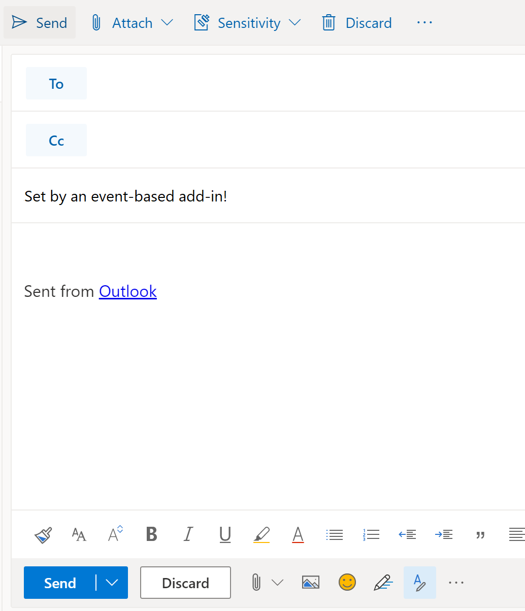

# <a name="configure-your-outlook-add-in-for-event-based-activation-preview"></a>Configurar seu suplemento do Outlook para ativação baseada em evento (visualização)

Sem o recurso de ativação baseada em eventos, um usuário precisa iniciar explicitamente um suplemento para concluir suas tarefas. Este recurso permite que seu suplemento Execute tarefas com base em determinados eventos, especialmente para operações que se aplicam a todos os itens. Você também pode se integrar ao painel de tarefas e à funcionalidade sem interface do usuário. No momento, os eventos com suporte são os seguintes.

- `OnNewMessageCompose`: Ao redigir uma nova mensagem (inclui responder, responder a todos e encaminhar)
- `OnNewAppointmentOrganizer`: Ao criar um novo compromisso

Ao final deste passo a passo, você terá um suplemento que é executado sempre que uma nova mensagem é criada.

> [!IMPORTANT]
> Este recurso só tem suporte para [Visualização](../reference/objectmodel/preview-requirement-set/outlook-requirement-set-preview.md) no Outlook na Web com uma assinatura do Office 365. Veja [como visualizar o recurso de ativação baseado em eventos](#how-to-preview-the-event-based-activation-feature) neste artigo para obter mais detalhes.
>
> Como os recursos de visualização estão sujeitos a alterações sem aviso prévio, eles não devem ser usados em suplementos de produção.

## <a name="how-to-preview-the-event-based-activation-feature"></a>Como visualizar o recurso de ativação baseado em eventos

Convidamos você a experimentar o recurso de ativação baseada em eventos! Informe-nos seus cenários e saiba como podemos melhorar enviando seus comentários por meio do GitHub (consulte a seção **comentários** no final desta página).

Para visualizar esse recurso:

- Faça referência à biblioteca **beta** na CDN ( https://appsforoffice.microsoft.com/lib/beta/hosted/office.js) . O [arquivo de definição de tipo](https://appsforoffice.microsoft.com/lib/beta/hosted/office.d.ts) para compilação TypeScript e IntelliSense é encontrado em CDN e [DefinitelyTyped](https://raw.githubusercontent.com/DefinitelyTyped/DefinitelyTyped/master/types/office-js-preview/index.d.ts). Você pode instalar esses tipos com o `npm install --save-dev @types/office-js-preview` .
- Solicite acesso aos bits de visualização do Outlook na Web usando sua conta do Microsoft 365, concluindo e enviando [este formulário de solicitação](https://aka.ms/OWAPreview). Vamos informar quando o locatário está pronto.

## <a name="set-up-your-environment"></a>Configurar seu ambiente

Conclua o [início rápido do Outlook](../quickstarts/outlook-quickstart.md?tabs=yeomangenerator) que cria um projeto de suplemento com o gerador Yeoman para suplementos do Office.

## <a name="configure-the-manifest"></a>Configurar o manifesto

Para habilitar a ativação baseada em eventos do suplemento, você deve configurar o elemento de [tempos de execução](../reference/manifest/runtimes.md) e o ponto de extensão [LaunchEvent](../reference/manifest/extensionpoint.md#launchevent-preview) no manifesto. Por enquanto, `DesktopFormFactor` é o único fator de forma com suporte.

1. Em seu editor de código, abra o projeto de início rápido.

1. Abra o arquivo **manifest. xml** localizado na raiz do seu projeto.

1. Selecione o `<VersionOverrides>` nó inteiro (incluindo marcas de abertura e fechamento) e substitua-o pelo seguinte XML.

```XML
<VersionOverrides xmlns="http://schemas.microsoft.com/office/mailappversionoverrides" xsi:type="VersionOverridesV1_0">
  <VersionOverrides xmlns="http://schemas.microsoft.com/office/mailappversionoverrides/1.1" xsi:type="VersionOverridesV1_1">
    <Requirements>
      <bt:Sets DefaultMinVersion="1.3">
        <bt:Set Name="Mailbox" />
      </bt:Sets>
    </Requirements>
    <Hosts>
      <Host xsi:type="MailHost">
        <!-- Event-based activation happens in a lightweight runtime.-->
        <Runtimes>
          <!-- HTML file including reference to or inline JavaScript event handlers.
               This is used by Outlook on the web. -->
          <Runtime resid="WebViewRuntime.Url">
            <!-- JavaScript file containing event handlers. This is used by Outlook Desktop. -->
            <Override type="javascript" resid="JSRuntime.Url"/>
          </Runtime>
        </Runtimes>
        <DesktopFormFactor>
          <FunctionFile resid="Commands.Url" />
          <ExtensionPoint xsi:type="MessageReadCommandSurface">
            <OfficeTab id="TabDefault">
              <Group id="msgReadGroup">
                <Label resid="GroupLabel" />
                <Control xsi:type="Button" id="msgReadOpenPaneButton">
                  <Label resid="TaskpaneButton.Label" />
                  <Supertip>
                    <Title resid="TaskpaneButton.Label" />
                    <Description resid="TaskpaneButton.Tooltip" />
                  </Supertip>
                  <Icon>
                    <bt:Image size="16" resid="Icon.16x16" />
                    <bt:Image size="32" resid="Icon.32x32" />
                    <bt:Image size="80" resid="Icon.80x80" />
                  </Icon>
                  <Action xsi:type="ShowTaskpane">
                    <SourceLocation resid="Taskpane.Url" />
                  </Action>
                </Control>
                <Control xsi:type="Button" id="ActionButton">
                  <Label resid="ActionButton.Label"/>
                  <Supertip>
                    <Title resid="ActionButton.Label"/>
                    <Description resid="ActionButton.Tooltip"/>
                  </Supertip>
                  <Icon>
                    <bt:Image size="16" resid="Icon.16x16"/>
                    <bt:Image size="32" resid="Icon.32x32"/>
                    <bt:Image size="80" resid="Icon.80x80"/>
                  </Icon>
                  <Action xsi:type="ExecuteFunction">
                    <FunctionName>action</FunctionName>
                  </Action>
                </Control>
              </Group>
            </OfficeTab>
          </ExtensionPoint>

          <!-- Configure AppointmentOrganizerCommandSurface extension point to support
          add-in activation on composing a new appointment. -->

          <!-- Enable launching the add-in on the included events. -->
          <ExtensionPoint xsi:type="LaunchEvent">
            <LaunchEvents>
              <LaunchEvent Type="OnNewMessageCompose" FunctionName="onMessageComposeHandler"/>
              <LaunchEvent Type="OnNewAppointmentOrganizer" FunctionName="onAppointmentComposeHandler"/>
            </LaunchEvents>
            <!-- Identifies the runtime to be used (also referenced by the Runtime element). -->
            <SourceLocation resid="WebViewRuntime.Url"/>
          </ExtensionPoint>
        </DesktopFormFactor>
      </Host>
    </Hosts>
    <Resources>
      <bt:Images>
        <bt:Image id="Icon.16x16" DefaultValue="https://localhost:3000/assets/icon-16.png"/>
        <bt:Image id="Icon.32x32" DefaultValue="https://localhost:3000/assets/icon-32.png"/>
        <bt:Image id="Icon.80x80" DefaultValue="https://localhost:3000/assets/icon-80.png"/>
      </bt:Images>
      <bt:Urls>
        <bt:Url id="Commands.Url" DefaultValue="https://localhost:3000/commands.html" />
        <bt:Url id="Taskpane.Url" DefaultValue="https://localhost:3000/taskpane.html" />
        <bt:Url id="WebViewRuntime.Url" DefaultValue="https://localhost:3000/commands.html" />
        <bt:Url id="JSRuntime.Url" DefaultValue="https://localhost:3000/runtime.js" />
      </bt:Urls>
      <bt:ShortStrings>
        <bt:String id="GroupLabel" DefaultValue="Contoso Add-in"/>
        <bt:String id="TaskpaneButton.Label" DefaultValue="Show Taskpane"/>
        <bt:String id="ActionButton.Label" DefaultValue="Perform an action"/>
      </bt:ShortStrings>
      <bt:LongStrings>
        <bt:String id="TaskpaneButton.Tooltip" DefaultValue="Opens a pane displaying all available properties."/>
        <bt:String id="ActionButton.Tooltip" DefaultValue="Perform an action when clicked."/>
      </bt:LongStrings>
    </Resources>
  </VersionOverrides>
</VersionOverrides>
```

O Outlook no Windows usa um arquivo JavaScript, enquanto o Outlook na Web usa um arquivo HTML que faz referência ao mesmo arquivo JavaScript. Você deve fornecer referências a esses arquivos no manifesto, uma vez que a plataforma do Outlook determina se deve usar HTML ou JavaScript com base no cliente do Outlook. Assim, para configurar a manipulação de eventos, forneça o local do HTML no `Runtime` elemento e, em seguida, em seu `Override` elemento filho, forneça o local do arquivo JavaScript embutido ou referenciado pelo HTML.

> [!TIP]
> Para saber mais sobre manifestos para suplementos do Outlook, confira [manifestos de suplementos do Outlook](manifests.md).

## <a name="implement-event-handling"></a>Implementar a manipulação de eventos

Você precisa implementar o tratamento dos eventos selecionados.

Neste cenário, você adicionará o tratamento para compor novos itens.

1. No mesmo projeto de início rápido, abra o arquivo **./src/Commands/Commands.js** no editor de código.

1. Após a `action` função, insira as seguintes funções de JavaScript.

    ```js
    function onMessageComposeHandler(event) {
      setSubject();
      event.completed();
    }
    function onAppointmentComposeHandler(event) {
      setSubject();
      event.completed();
    }
    function setSubject() {
      Office.context.mailbox.item.subject.setAsync("Set by an event-based add-in!");
    }
    ```

1. No final do arquivo, adicione as instruções a seguir.

    ```js
    g.onMessageComposeHandler = onMessageComposeHandler;
    g.onAppointmentComposeHandler = onAppointmentComposeHandler;
    ```

## <a name="try-it-out"></a>Experimente

1. Execute o seguinte comando no diretório raiz do seu projeto. Quando você executar este comando, o servidor da Web local será iniciado (se ainda não estiver em execução).

    ```command&nbsp;line
    npm run dev-server
    ```

1. Siga as instruções [Realizar sideload dos suplementos do Outlook para teste](sideload-outlook-add-ins-for-testing.md)para realizar o sideload do suplemento do Outlook.

1. No Outlook na Web, crie uma nova mensagem.

    

## <a name="event-based-activation-behavior-and-limitations"></a>Comportamento e limitações de ativação baseada em evento

Os suplementos que ativam com base em eventos são projetados para serem executados de forma curta, até 330 segundos. Recomendamos que você tenha seu suplemento chamar o `event.completed` método para sinalizá-lo a concluir o processamento do evento de lançamento. O suplemento também termina quando o usuário fecha a janela de redação.

Se o usuário tiver vários suplementos que se inscreveram no mesmo evento, a plataforma do Outlook iniciará os suplementos sem nenhuma ordem específica. Atualmente, apenas cinco suplementos baseados em eventos podem estar ativamente em execução. Qualquer suplemento adicional é enviado para uma fila e, em seguida, executado como os suplementos ativos anteriormente são concluídos ou desativados.

O usuário pode alternar ou navegar para fora do item de email atual onde o suplemento começou a ser executado. O suplemento que foi iniciado concluirá a operação em segundo plano.

Algumas APIs do Office. js que alteram ou alteram a interface do usuário não são permitidas a partir de suplementos baseados em eventos. A seguir estão as APIs bloqueadas.

- Em `Office.context.mailbox` :
  - `displayAppointmentForm`
  - `displayMessageForm`
  - `displayNewAppointmentForm`
  - `displayNewMessageForm`
- Em `Office.context.ui` :
  - `displayDialogAsync`
  - `messageParent`
- Em `Office.context.auth` :
  - `getAccessTokenAsync`

## <a name="see-also"></a>Confira também

[Manifestos de suplementos do Outlook](manifests.md)
