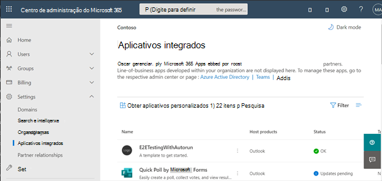

# <a name="configure-your-outlook-add-in-for-event-based-activation"></a>Configurar seu suplemento do Outlook para ativação baseada em evento

Sem o recurso de ativação baseada em evento, um usuário precisa iniciar explicitamente um suplemento para concluir suas tarefas. Esse recurso permite que o suplemento execute tarefas com base em determinados eventos, especialmente para operações que se aplicam a cada item. Você também pode integrar com o painel de tarefas e os comandos de função.

Ao final deste passo a passo, você terá um suplemento que é executado sempre que um novo item é criado e define o assunto.

> [!NOTE]
> O suporte para esse recurso foi introduzido no conjunto de requisitos [1.10](/javascript/api/requirement-sets/outlook/requirement-set-1.10/outlook-requirement-set-1.10), com eventos adicionais agora compatíveis com o conjunto de requisitos [1.11](/javascript/api/requirement-sets/outlook/requirement-set-1.11/outlook-requirement-set-1.11). Confira, [clientes e plataformas](/javascript/api/requirement-sets/outlook/outlook-api-requirement-sets#requirement-sets-supported-by-exchange-servers-and-outlook-clients) que oferecem suporte a esse conjunto de requisitos.
>
> Não há suporte para a ativação baseada em eventos no Outlook no iOS ou Android.

## <a name="supported-events"></a>Eventos com suporte

A tabela a seguir lista os eventos que estão disponíveis no momento e os clientes com suporte para cada evento. Quando um evento é gerado, o manipulador recebe um `event` objeto que pode incluir detalhes específicos para o tipo de evento. A **coluna** Descrição inclui um link para o objeto relacionado quando aplicável.

> [!IMPORTANT]
> Os eventos ainda em versão prévia só podem estar disponíveis com uma assinatura do Microsoft 365 e em um conjunto limitado de clientes com suporte, conforme mostrado na tabela a seguir. Para obter detalhes de configuração do cliente, [consulte Como visualizar](#how-to-preview) neste artigo. Eventos de visualização não devem ser usados em suplementos de produção.

|Evento|Descrição|Conjunto de requisitos mínimo e clientes com suporte|
|---|---|---|
|`OnNewMessageCompose`|Ao redigir uma nova mensagem (inclui responder, responder a todos e encaminhar), mas não ao editar, por exemplo, um rascunho.|[1.10](/javascript/api/requirement-sets/outlook/requirement-set-1.10/outlook-requirement-set-1.10)<br><br>– Windows<sup>1</sup><br>– Navegador da Web<br>- Nova interface do usuário do Mac |
|`OnNewAppointmentOrganizer`|Na criação de um novo compromisso, mas não na edição de um existente.|[1.10](/javascript/api/requirement-sets/outlook/requirement-set-1.10/outlook-requirement-set-1.10)<br><br>– Windows<sup>1</sup><br>– Navegador da Web<br>- Nova interface do usuário do Mac |
|`OnMessageAttachmentsChanged`|Ao adicionar ou remover anexos ao redigir uma mensagem.<br><br>Objeto de dados específico do evento: [AttachmentsChangedEventArgs](/javascript/api/outlook/office.attachmentschangedeventargs?view=outlook-js-1.11&preserve-view=true)|[1.11](/javascript/api/requirement-sets/outlook/requirement-set-1.11/outlook-requirement-set-1.11)<br><br>– Windows<sup>1</sup><br>– Navegador da Web|
|`OnAppointmentAttachmentsChanged`|Ao adicionar ou remover anexos ao redigir um compromisso.<br><br>Objeto de dados específico do evento: [AttachmentsChangedEventArgs](/javascript/api/outlook/office.attachmentschangedeventargs?view=outlook-js-1.11&preserve-view=true)|[1.11](/javascript/api/requirement-sets/outlook/requirement-set-1.11/outlook-requirement-set-1.11)<br><br>– Windows<sup>1</sup><br>– Navegador da Web|
|`OnMessageRecipientsChanged`|Ao adicionar ou remover destinatários ao redigir uma mensagem.<br><br>Objeto de dados específico do evento: [RecipientsChangedEventArgs](/javascript/api/outlook/office.recipientschangedeventargs?view=outlook-js-1.11&preserve-view=true)|[1.11](/javascript/api/requirement-sets/outlook/requirement-set-1.11/outlook-requirement-set-1.11)<br><br>– Windows<sup>1</sup><br>– Navegador da Web|
|`OnAppointmentAttendeesChanged`|Ao adicionar ou remover participantes ao redigir um compromisso.<br><br>Objeto de dados específico do evento: [RecipientsChangedEventArgs](/javascript/api/outlook/office.recipientschangedeventargs?view=outlook-js-1.11&preserve-view=true)|[1.11](/javascript/api/requirement-sets/outlook/requirement-set-1.11/outlook-requirement-set-1.11)<br><br>– Windows<sup>1</sup><br>– Navegador da Web|
|`OnAppointmentTimeChanged`|Ao alterar a data/hora ao compor um compromisso.<br><br>Objeto de dados específico do evento: [AppointmentTimeChangedEventArgs](/javascript/api/outlook/office.appointmenttimechangedeventargs?view=outlook-js-1.11&preserve-view=true)|[1.11](/javascript/api/requirement-sets/outlook/requirement-set-1.11/outlook-requirement-set-1.11)<br><br>– Windows<sup>1</sup><br>– Navegador da Web|
|`OnAppointmentRecurrenceChanged`|Ao adicionar, alterar ou remover os detalhes de recorrência ao redigir um compromisso. Se a data/hora for alterada, o `OnAppointmentTimeChanged` evento também será acionado.<br><br>Objeto de dados específico do evento: [RecurrenceChangedEventArgs](/javascript/api/outlook/office.recurrencechangedeventargs?view=outlook-js-1.11&preserve-view=true)|[1.11](/javascript/api/requirement-sets/outlook/requirement-set-1.11/outlook-requirement-set-1.11)<br><br>– Windows<sup>1</sup><br>– Navegador da Web|
|`OnInfoBarDismissClicked`|Ao ignorar uma notificação ao redigir uma mensagem ou item de compromisso. Somente o suplemento que adicionou a notificação será notificado.<br><br>Objeto de dados específico do evento: [InfobarClickedEventArgs](/javascript/api/outlook/office.infobarclickedeventargs?view=outlook-js-1.11&preserve-view=true)|[1.11](/javascript/api/requirement-sets/outlook/requirement-set-1.11/outlook-requirement-set-1.11)<br><br>– Windows<sup>1</sup><br>– Navegador da Web|
|`OnMessageSend`|Ao enviar um item de mensagem. Para saber mais, confira o passo a passo [de Alertas Inteligentes](smart-alerts-onmessagesend-walkthrough.md).|[Visualização](/javascript/api/requirement-sets/outlook/preview-requirement-set/outlook-requirement-set-preview)<br><br>– Windows<sup>1</sup><br>– Navegador da Web|
|`OnAppointmentSend`|Ao enviar um item de compromisso. Para saber mais, confira o passo a passo [de Alertas Inteligentes](smart-alerts-onmessagesend-walkthrough.md).|[Visualização](/javascript/api/requirement-sets/outlook/preview-requirement-set/outlook-requirement-set-preview)<br><br>– Windows<sup>1</sup><br>– Navegador da Web|
|`OnMessageCompose`|Ao redigir uma nova mensagem (inclui responder, responder a todos e encaminhar) ou editar um rascunho.|[Visualização](/javascript/api/requirement-sets/outlook/preview-requirement-set/outlook-requirement-set-preview)<br><br>– Windows<sup>1</sup><br>– Navegador da Web|
|`OnAppointmentOrganizer`|Ao criar um novo compromisso ou editar um existente.|[Visualização](/javascript/api/requirement-sets/outlook/preview-requirement-set/outlook-requirement-set-preview)<br><br>– Windows<sup>1</sup><br>– Navegador da Web|

> [!NOTE]
> <sup>1</sup> Suplementos baseados em eventos no Outlook no Windows exigem um mínimo de Windows 10 versão 1903 (build 18362) ou Windows Server 2019 versão 1903 para execução.

### <a name="how-to-preview"></a>Como visualizar

Convidamos você a experimentar os eventos agora em versão prévia! Informe-nos seus cenários e como podemos melhorar fornecendo comentários por meio do GitHub (consulte a  seção Comentários no final desta página).

Para visualizar esses eventos quando disponível:

- Para Outlook na Web:
  - [Configure a versão direcionada em seu locatário do Microsoft 365.](/microsoft-365/admin/manage/release-options-in-office-365?view=o365-worldwide&preserve-view=true#set-up-the-release-option-in-the-admin-center)
  - Fazer referência **à biblioteca beta** na CDN (https://appsforoffice.microsoft.com/lib/beta/hosted/office.js). O [arquivo de definição de tipo](https://appsforoffice.microsoft.com/lib/beta/hosted/office.d.ts) da compilação TypeScript e IntelliSense pode ser encontrado na CDN e [DefinitelyTyped](https://raw.githubusercontent.com/DefinitelyTyped/DefinitelyTyped/master/types/office-js-preview/index.d.ts). Você pode instalar esses tipos com `npm install --save-dev @types/office-js-preview`.
- Para o Outlook na nova interface do usuário do Mac:
  - O build mínimo necessário é 16,54 (21101001). Ingresse [no programa Office Insider](https://insider.office.com/join/Mac) e escolha o **Canal Beta** para acesso aos builds beta do Office.
- Para o Outlook no Windows:
  - O build mínimo necessário é 16.0.14511.10000. Ingresse [no programa Office Insider](https://insider.office.com/join/windows) e escolha o **Canal Beta** para acesso aos builds beta do Office.

## <a name="set-up-your-environment"></a>Configurar seu ambiente

Conclua [o início rápido do Outlook](../quickstarts/outlook-quickstart.md?tabs=yeomangenerator) , que cria um projeto de suplemento com o gerador Yeoman para suplementos do Office.

## <a name="configure-the-manifest"></a>Configurar o manifesto

Para habilitar a ativação baseada em evento do suplemento, você deve configurar o elemento [Runtimes](/javascript/api/manifest/runtimes) e o ponto de extensão [LaunchEvent](/javascript/api/manifest/extensionpoint#launchevent) `VersionOverridesV1_1` no nó do manifesto. Por enquanto, `DesktopFormFactor` é o único fator forma com suporte.

1. No editor de código, abra o projeto de início rápido.

1. Abra o **manifest.xml** arquivo localizado na raiz do seu projeto.

1. Selecione o nó inteiro **\<VersionOverrides\>** (incluindo marcas abertas e de fechamento) e substitua-o pelo XML a seguir e salve as alterações.

```XML
<VersionOverrides xmlns="http://schemas.microsoft.com/office/mailappversionoverrides" xsi:type="VersionOverridesV1_0">
  <VersionOverrides xmlns="http://schemas.microsoft.com/office/mailappversionoverrides/1.1" xsi:type="VersionOverridesV1_1">
    <Requirements>
      <bt:Sets DefaultMinVersion="1.10">
        <bt:Set Name="Mailbox" />
      </bt:Sets>
    </Requirements>
    <Hosts>
      <Host xsi:type="MailHost">
        <!-- Event-based activation happens in a lightweight runtime.-->
        <Runtimes>
          <!-- HTML file including reference to or inline JavaScript event handlers.
               This is used by Outlook on the web and Outlook on the new Mac UI. -->
          <Runtime resid="WebViewRuntime.Url">
            <!-- JavaScript file containing event handlers. This is used by Outlook on Windows. -->
            <Override type="javascript" resid="JSRuntime.Url"/>
          </Runtime>
        </Runtimes>
        <DesktopFormFactor>
          <FunctionFile resid="Commands.Url" />
          <ExtensionPoint xsi:type="MessageReadCommandSurface">
            <OfficeTab id="TabDefault">
              <Group id="msgReadGroup">
                <Label resid="GroupLabel" />
                <Control xsi:type="Button" id="msgReadOpenPaneButton">
                  <Label resid="TaskpaneButton.Label" />
                  <Supertip>
                    <Title resid="TaskpaneButton.Label" />
                    <Description resid="TaskpaneButton.Tooltip" />
                  </Supertip>
                  <Icon>
                    <bt:Image size="16" resid="Icon.16x16" />
                    <bt:Image size="32" resid="Icon.32x32" />
                    <bt:Image size="80" resid="Icon.80x80" />
                  </Icon>
                  <Action xsi:type="ShowTaskpane">
                    <SourceLocation resid="Taskpane.Url" />
                  </Action>
                </Control>
                <Control xsi:type="Button" id="ActionButton">
                  <Label resid="ActionButton.Label"/>
                  <Supertip>
                    <Title resid="ActionButton.Label"/>
                    <Description resid="ActionButton.Tooltip"/>
                  </Supertip>
                  <Icon>
                    <bt:Image size="16" resid="Icon.16x16"/>
                    <bt:Image size="32" resid="Icon.32x32"/>
                    <bt:Image size="80" resid="Icon.80x80"/>
                  </Icon>
                  <Action xsi:type="ExecuteFunction">
                    <FunctionName>action</FunctionName>
                  </Action>
                </Control>
              </Group>
            </OfficeTab>
          </ExtensionPoint>

          <!-- Can configure other command surface extension points for add-in command support. -->

          <!-- Enable launching the add-in on the included events. -->
          <ExtensionPoint xsi:type="LaunchEvent">
            <LaunchEvents>
              <LaunchEvent Type="OnNewMessageCompose" FunctionName="onMessageComposeHandler"/>
              <LaunchEvent Type="OnNewAppointmentOrganizer" FunctionName="onAppointmentComposeHandler"/>
              
              <!-- Other available events (currently released) -->
              <!--
              <LaunchEvent Type="OnMessageAttachmentsChanged" FunctionName="onMessageAttachmentsChangedHandler" />
              <LaunchEvent Type="OnAppointmentAttachmentsChanged" FunctionName="onAppointmentAttachmentsChangedHandler" />
              <LaunchEvent Type="OnMessageRecipientsChanged" FunctionName="onMessageRecipientsChangedHandler" />
              <LaunchEvent Type="OnAppointmentAttendeesChanged" FunctionName="onAppointmentAttendeesChangedHandler" />
              <LaunchEvent Type="OnAppointmentTimeChanged" FunctionName="onAppointmentTimeChangedHandler" />
              <LaunchEvent Type="OnAppointmentRecurrenceChanged" FunctionName="onAppointmentRecurrenceChangedHandler" />
              <LaunchEvent Type="OnInfoBarDismissClicked" FunctionName="onInfobarDismissClickedHandler" />
              -->

              <!-- Other available events (currently in preview) -->
              <!--
              <LaunchEvent Type="OnMessageSend" FunctionName="onMessageSendHandler" SendMode="PromptUser" />
              <LaunchEvent Type="OnAppointmentSend" FunctionName="onAppointmentSendHandler" SendMode="PromptUser" />
              -->
            </LaunchEvents>
            <!-- Identifies the runtime to be used (also referenced by the Runtime element). -->
            <SourceLocation resid="WebViewRuntime.Url"/>
          </ExtensionPoint>
        </DesktopFormFactor>
      </Host>
    </Hosts>
    <Resources>
      <bt:Images>
        <bt:Image id="Icon.16x16" DefaultValue="https://localhost:3000/assets/icon-16.png"/>
        <bt:Image id="Icon.32x32" DefaultValue="https://localhost:3000/assets/icon-32.png"/>
        <bt:Image id="Icon.80x80" DefaultValue="https://localhost:3000/assets/icon-80.png"/>
      </bt:Images>
      <bt:Urls>
        <bt:Url id="Commands.Url" DefaultValue="https://localhost:3000/commands.html" />
        <bt:Url id="Taskpane.Url" DefaultValue="https://localhost:3000/taskpane.html" />
        <bt:Url id="WebViewRuntime.Url" DefaultValue="https://localhost:3000/commands.html" />
        <!-- Entry needed for Outlook on Windows. -->
        <bt:Url id="JSRuntime.Url" DefaultValue="https://localhost:3000/launchevent.js" />
      </bt:Urls>
      <bt:ShortStrings>
        <bt:String id="GroupLabel" DefaultValue="Contoso Add-in"/>
        <bt:String id="TaskpaneButton.Label" DefaultValue="Show Taskpane"/>
        <bt:String id="ActionButton.Label" DefaultValue="Perform an action"/>
      </bt:ShortStrings>
      <bt:LongStrings>
        <bt:String id="TaskpaneButton.Tooltip" DefaultValue="Opens a pane displaying all available properties."/>
        <bt:String id="ActionButton.Tooltip" DefaultValue="Perform an action when clicked."/>
      </bt:LongStrings>
    </Resources>
  </VersionOverrides>
</VersionOverrides>
```

O Outlook no Windows usa um arquivo JavaScript, enquanto Outlook na Web e na nova interface do usuário do Mac usam um arquivo HTML que pode fazer referência ao mesmo arquivo JavaScript. Você deve fornecer referências `Resources` a ambos os arquivos no nó do manifesto, pois a plataforma do Outlook determina se deve usar HTML ou JavaScript com base no cliente do Outlook. Dessa forma, para configurar a manipulação de eventos, forneça o local do HTML **\<Runtime\>** no elemento e, em seu elemento filho, `Override` forneça o local do arquivo JavaScript embutido ou referenciado pelo HTML.

> [!TIP]
> 
> - Para saber mais sobre runtimes em suplementos, consulte [Runtimes em Suplementos do Office](../testing/runtimes.md).
> - Para saber mais sobre manifestos para suplementos do Outlook, consulte [manifestos de suplemento do Outlook](manifests.md).

## <a name="implement-event-handling"></a>Implementar a manipulação de eventos

Você precisa implementar a manipulação para os eventos selecionados.

Nesse cenário, você adicionará a manipulação para compor novos itens.

1. No mesmo projeto de início rápido, crie uma nova pasta chamada **launchevent** no **diretório ./src** .

1. Na pasta **./src/launchevent** , crie um novo arquivo chamado **launchevent.js**.

1. Abra o arquivo **./src/launchevent/launchevent.js** no editor de código e adicione o código JavaScript a seguir.

    ```js
    /*
    * Copyright (c) Microsoft Corporation. All rights reserved. Licensed under the MIT license.
    * See LICENSE in the project root for license information.
    */

    function onMessageComposeHandler(event) {
      setSubject(event);
    }
    function onAppointmentComposeHandler(event) {
      setSubject(event);
    }
    function setSubject(event) {
      Office.context.mailbox.item.subject.setAsync(
        "Set by an event-based add-in!",
        {
          "asyncContext": event
        },
        function (asyncResult) {
          // Handle success or error.
          if (asyncResult.status !== Office.AsyncResultStatus.Succeeded) {
            console.error("Failed to set subject: " + JSON.stringify(asyncResult.error));
          }

          // Call event.completed() after all work is done.
          asyncResult.asyncContext.completed();
        });
    }

    // 1st parameter: FunctionName of LaunchEvent in the manifest; 2nd parameter: Its implementation in this .js file.
    Office.actions.associate("onMessageComposeHandler", onMessageComposeHandler);
    Office.actions.associate("onAppointmentComposeHandler", onAppointmentComposeHandler);
    ```

1. Salve suas alterações.

> [!IMPORTANT]
> Windows: no momento, não há suporte para importações no arquivo JavaScript em que você implementa o tratamento para a ativação baseada em evento.

## <a name="update-the-commands-html-file"></a>Atualizar o arquivo HTML dos comandos

1. Na pasta **./src/commands** , abra **commands.html**.

1. Imediatamente antes da marca **de cabeçalho** de fechamento (`<\head>`), adicione uma entrada de script para incluir o código JavaScript de manipulação de eventos.

    ```html
    <script type="text/javascript" src="../launchevent/launchevent.js"></script>
    ```

1. Salve suas alterações.

## <a name="update-webpack-config-settings"></a>Atualizar as configurações webpack config

1. Abra o **webpack.config.js** arquivo encontrado no diretório raiz do projeto e conclua as etapas a seguir.

1. Localize `plugins` a matriz dentro do `config` objeto e adicione esse novo objeto no início da matriz.

    ```js
    new CopyWebpackPlugin({
      patterns: [
        {
          from: "./src/launchevent/launchevent.js",
          to: "launchevent.js",
        },
      ],
    }),
    ```

1. Salve suas alterações.

## <a name="try-it-out"></a>Experimente

1. Execute os comandos a seguir no diretório raiz do seu projeto. Quando você executar `npm start`, o servidor Web local será iniciado (se ele ainda não estiver em execução) e seu suplemento será sideload.

    ```command&nbsp;line
    npm run build
    ```
    ```command&nbsp;line
    npm start
    ```

    > [!NOTE]
    > Se o suplemento não foi carregado automaticamente no sideload, siga as instruções em [Fazer sideload de suplementos do Outlook](../outlook/sideload-outlook-add-ins-for-testing.md#sideload-manually) para testar o sideload manual do suplemento no Outlook.

1. No Outlook na Web, crie uma nova mensagem.

    

1. No Outlook na nova interface do usuário do Mac, crie uma nova mensagem.

    

1. No Outlook no Windows, crie uma nova mensagem.

    

## <a name="debug"></a>Depurar

Ao fazer alterações na manipulação de eventos de inicialização em seu suplemento, você deve estar ciente de que:

- Se você atualizou o manifesto, [remova o suplemento e](sideload-outlook-add-ins-for-testing.md#remove-a-sideloaded-add-in), em seguida, o sideload novamente. Se você estiver usando o Outlook no Windows, feche-o e reabra-o.
- Se você tiver feito alterações em arquivos diferentes do manifesto, feche e reabra o Outlook no Windows ou atualize a guia do navegador em execução Outlook na Web.

Ao implementar sua própria funcionalidade, talvez seja necessário depurar seu código. Para obter diretrizes sobre como depurar a ativação de suplemento baseado em evento, consulte [Depurar seu suplemento do Outlook baseado em evento](debug-autolaunch.md).

O log de runtime também está disponível para esse recurso no Windows. Para obter mais informações, consulte [Depurar seu suplemento com o log de runtime](../testing/runtime-logging.md#runtime-logging-on-windows).

[!INCLUDE [Loopback exemption note](../includes/outlook-loopback-exemption.md)]

## <a name="deploy-to-users"></a>Implantar para usuários

Você pode implantar suplementos baseados em eventos carregando o manifesto por meio do Centro de administração do Microsoft 365. No portal de administração, expanda **a seção Configurações** no painel de navegação e selecione **Aplicativos integrados**. Na página **Aplicativos integrados** , escolha a **ação Carregar aplicativos personalizados** .



> [!IMPORTANT]
> Os suplementos baseados em eventos são restritos somente a implantações gerenciadas pelo administrador. Por enquanto, os usuários não podem obter suplementos baseados em eventos do AppSource ou da Office Store no aplicativo. Para saber mais, confira as [opções de listagem do AppSource para seu suplemento do Outlook baseado em eventos](autolaunch-store-options.md).

## <a name="event-based-activation-behavior-and-limitations"></a>Limitações e comportamento de ativação baseado em evento

Espera-se que os manipuladores de eventos de inicialização de suplementos sejam de curta execução, leves e não invasivos possíveis. Após a ativação, o suplemento expirará em aproximadamente 300 segundos, o período máximo permitido para a execução de suplementos baseados em eventos. Para sinalizar que seu suplemento concluiu o processamento de um evento de inicialização, recomendamos que o manipulador associado chame o `event.completed` método. (Observe que o código incluído após a instrução `event.completed` não tem garantia de execução.) Sempre que um evento que seus identificadores de suplemento são disparados, o suplemento é reativado e executa o manipulador de eventos associado e a janela de tempo limite é redefinida. O suplemento termina após o tempo limite, ou o usuário fecha a janela de composição ou envia o item.

Se o usuário tiver vários suplementos que assinaram o mesmo evento, a plataforma do Outlook iniciará os suplementos em nenhuma ordem específica. Atualmente, apenas cinco suplementos baseados em eventos podem ser executados ativamente.

Em todos os clientes do Outlook com suporte, o usuário deve permanecer no item de email atual em que o suplemento foi ativado para que ele seja concluído em execução. Navegar para longe do item atual (por exemplo, alternar para outra janela ou guia de composição) encerra a operação de suplemento. O suplemento também encerra a operação quando o usuário envia a mensagem ou o compromisso que está redigindo.

Não há suporte para importações no arquivo JavaScript em que você implementa o tratamento para ativação baseada em eventos no cliente windows.

Algumas Office.js APIs que alteram ou alteram a interface do usuário não são permitidas de suplementos baseados em eventos. A seguir estão as APIs bloqueadas.

- Em `Office.context.auth`:
  - `getAccessToken`
  - `getAccessTokenAsync`
    > [!NOTE]
    > [O OfficeRuntime.auth](/javascript/api/office-runtime/officeruntime.auth) tem suporte em todas as versões do Outlook que dão suporte à ativação baseada em evento e SSO (logon único), enquanto o [Office.auth](/javascript/api/office/office.auth) só tem suporte em determinados builds do Outlook. Para obter mais informações, consulte [Habilitar SSO (logon único) em suplementos do Outlook que usam a ativação baseada em evento](use-sso-in-event-based-activation.md).
- Em `Office.context.mailbox`:
  - `displayAppointmentForm`
  - `displayMessageForm`
  - `displayNewAppointmentForm`
  - `displayNewMessageForm`
- Em `Office.context.mailbox.item`:
  - `close`
- Em `Office.context.ui`:
  - `displayDialogAsync`
  - `messageParent`

### <a name="requesting-external-data"></a>Como solicitar dados externos

Você pode solicitar dados externos usando uma API como [Fetch](https://developer.mozilla.org/docs/Web/API/Fetch_API) ou usando [XMLHttpRequest (XHR),](https://developer.mozilla.org/docs/Web/API/XMLHttpRequest)uma API Web padrão que emite solicitações HTTP para interagir com servidores.

Lembre-se de que você deve usar medidas de segurança adicionais ao usar objetos XMLHttpRequest, exigindo a Política de Mesma Origem e [CORS simples (](https://developer.mozilla.org/docs/Web/HTTP/CORS)Compartilhamento de Recursos entre Origens).[](https://developer.mozilla.org/docs/Web/Security/Same-origin_policy)

Uma [implementação de CORS](https://developer.mozilla.org/docs/Web/HTTP/CORS#simple_requests) simples:

- Não é possível usar cookies.
- Só dá suporte a métodos simples, como `GET`, `HEAD`e `POST`.
- Aceita cabeçalhos simples com nomes de campo`Accept``Accept-Language`, ou `Content-Language`.
- Pode usar o `Content-Type`, desde que o tipo de conteúdo `application/x-www-form-urlencoded`seja , `text/plain`ou `multipart/form-data`.
- Não é possível ter ouvintes de eventos registrados no objeto retornado por `XMLHttpRequest.upload`.
- Não é possível usar objetos `ReadableStream` em solicitações.

> [!NOTE]
> O suporte completo a CORS está disponível no Outlook na Web, Mac e Windows (a partir da versão 2201, build 16.0.14813.10000).

## <a name="see-also"></a>Confira também

- [Manifestos de suplementos do Outlook](manifests.md)
- [Como depurar suplementos baseados em eventos](debug-autolaunch.md)
- [Opções de listagem do AppSource para seu suplemento do Outlook baseado em evento](autolaunch-store-options.md)
- [Passo a passo de Alertas Inteligentes e OnMessageSend](smart-alerts-onmessagesend-walkthrough.md)
- Exemplos de código de Suplementos do Office:
  - [Usar a ativação baseada em eventos do Outlook para criptografar anexos, processar participantes da solicitação de reunião e reagir a alterações de data/hora do compromisso](https://github.com/OfficeDev/Office-Add-in-samples/tree/main/Samples/outlook-encrypt-attachments)
  - [Use a ativação baseada em eventos do Outlook para definir a assinatura](https://github.com/OfficeDev/Office-Add-in-samples/tree/main/Samples/outlook-set-signature)
  - [Use a ativação baseada em eventos do Outlook para marcar destinatários externos](https://github.com/OfficeDev/Office-Add-in-samples/tree/main/Samples/outlook-tag-external)
  - [Usar Alertas Inteligentes do Outlook](https://github.com/OfficeDev/Office-Add-in-samples/tree/main/Samples/outlook-check-item-categories)
