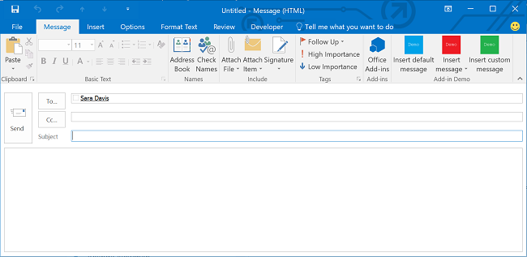

# Criar suplementos do Outlook para formulários de redação

A partir da versão 1.1 do esquema de manifestos de suplementos do Office e da versão 1.1 do Office.js, você pode criar suplementos de redação, que são suplementos do Outlook ativados nos formulários de redação. Ao contrário dos suplementos de leitura (suplementos do Outlook que são ativados no modo de leitura quando um usuário está exibindo uma mensagem ou um compromisso), os suplementos de redação estão disponíveis nos seguintes cenários de usuário:

- Redação de nova mensagem, solicitação de reunião ou compromisso em um formulário de redação.

- Exibição ou edição de compromisso existente, ou item de reunião no qual o usuário seja o organizador.
    
   > [!NOTE]
   > Se o usuário estiver na versão RTM do Outlook 2013 e do Exchange 2013 e estiver exibindo um item de reunião organizado pelo usuário, ele poderá encontrar suplementos de leitura disponíveis.
 Desde a versão do Office 2013 SP1, há uma alteração que, no mesmo cenário, somente suplementos redigidos podem ativar e estar disponíveis.

- Redação de uma mensagem de resposta embutida ou resposta a uma mensagem em um formulário de redação separado.

- Edição de uma resposta (**Aceitar**, **Provisório** ou **Recusar**) a uma solicitação de reunião ou a um item de reunião.

- Proposição de novo horário para um item de reunião.

- Encaminhamento ou resposta a uma solicitação de reunião ou a um item de reunião.

Em cada um desses cenários de redação, são mostrados os botões de comando do suplemento definidos por este. Para suplementos mais antigos que não implementam comandos de suplemento, os usuários podem escolher **Suplementos do Office** na faixa de opções para abrir o painel de seleção de suplementos, escolher e iniciar um suplemento de redação. A figura a seguir mostra comandos de suplemento em um formulário de redação.

A figura a seguir mostra o painel de seleção do suplemento composto por dois suplementos de redação que não implementam comandos de suplemento, ativado quando o usuário está compondo uma resposta embutida no Outlook.

## Tipos de suplementos disponíveis no modo de redação

Os suplementos de redação são implementados como [Comandos de suplemento para Outlook](add-in-commands-for-outlook.md). Para ativar suplementos para redação de emails ou respostas de reunião, os suplementos devem incluir um [elemento de ponto de extensão MessageComposeCommandSurface](../reference/manifest/extensionpoint.md#messagecomposecommandsurface) no manifesto. Para ativar suplementos para redação ou edição de compromissos ou reuniões em que o usuário é o organizador, os suplementos devem incluir um [elemento de ponto de extensão AppointmentOrganizerCommandSurface](../reference/manifest/extensionpoint.md#appointmentorganizercommandsurface).

> [!NOTE]
> Os suplementos desenvolvidos para servidores ou clientes sem suporte para comandos de suplemento usam [regras de ativação](activation-rules.md) em um elemento [Rule](../reference/manifest/rule.md) contido no elemento [OfficeApp](../reference/manifest/officeapp.md). Os novos suplementos devem usar comandos de suplemento, exceto quando o suplemento for desenvolvido para servidores e clientes mais antigos.

## Recursos de API disponíveis para suplementos de redação

- [Adicionar e remover anexos de um item em um formulário de redação no Outlook](add-and-remove-attachments-to-an-item-in-a-compose-form.md)
- [Obter e definir dados de item em um formulário de redação no Outlook](get-and-set-item-data-in-a-compose-form.md)
- [Obter, configurar ou adicionar destinatários ao criar um compromisso ou uma mensagem no Outlook](get-set-or-add-recipients.md)
- [Obter ou definir o assunto ao criar um compromisso ou uma mensagem no Outlook](get-or-set-the-subject.md)
- [Inserir dados no corpo ao criar um compromisso ou uma mensagem no Outlook](insert-data-in-the-body.md)
- [Obter ou definir o local ao criar um compromisso no Outlook](get-or-set-the-location-of-an-appointment.md)
- [Obter ou definir a hora ao criar um compromisso no Outlook](get-or-set-the-time-of-an-appointment.md)

## Confira também

- [Introdução aos suplementos do Outlook para Office 365](../quickstarts/outlook-quickstart.md)
