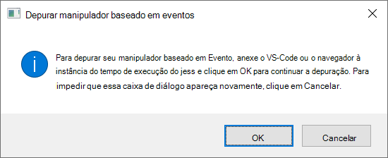
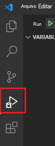
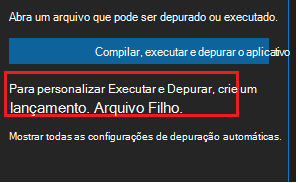
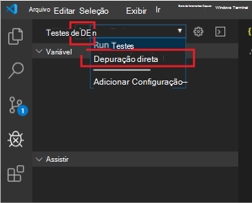

# <a name="debug-your-event-based-outlook-add-in-preview"></a>Depurar seu Outlook de eventos (visualização)

Este artigo fornece orientações de depuração à medida que você implementa a ativação baseada em [eventos](autolaunch.md) no seu complemento. O recurso de ativação baseada em evento está atualmente na visualização.

> [!IMPORTANT]
> Esse recurso de depuração só é suportado para visualização no Outlook no Windows com uma assinatura Microsoft 365. Para obter mais informações, consulte a [seção Visualização de depuração do recurso de ativação](#preview-debugging-for-the-event-based-activation-feature) baseada em evento neste artigo.

Neste artigo, abordamos os principais estágios para habilitar a depuração.

- [Marcar o complemento para depuração](#mark-your-add-in-for-debugging)
- [Configurar Visual Studio Code](#configure-visual-studio-code)
- [Anexar Visual Studio Code](#attach-visual-studio-code)
- [Depuração](#debug)

Você tem várias opções para criar seu projeto de complemento. Dependendo da opção que você está usando, as etapas podem variar. Nesse caso, se você usou o gerador Yeoman para os complementos do Office para criar seu projeto de complemento (por exemplo, fazendo o passo a passo de ativação baseada em eventos [),](autolaunch.md)siga as etapas **yo office,** caso contrário, siga as **outras** etapas. Visual Studio Code deve ser pelo menos a versão 1.56.1.

## <a name="preview-debugging-for-the-event-based-activation-feature"></a>Visualização de depuração para o recurso de ativação baseada em evento

Convidamos você a experimentar o recurso de depuração para o recurso de ativação baseada em evento! Deixe-nos saber seus cenários e como podemos melhorar nos dando feedback por meio GitHub (consulte a seção **Comentários** no final desta página).

Para visualizar esse recurso para Outlook no Windows, o build mínimo necessário é 16.0.13729.20000. Para acessar as Office beta, participe do programa [Office Insider](https://insider.office.com).

## <a name="mark-your-add-in-for-debugging"></a>Marcar seu complemento para depuração

1. De definir a chave do Registro `HKEY_CURRENT_USER\SOFTWARE\Microsoft\Office\16.0\Wef\Developer\[Add-in ID]\UseDirectDebugger` . `[Add-in ID]` é **a ID** no manifesto do complemento.

    **yo office**: em uma janela de linha de comando, navegue até a raiz da pasta do seu complemento e execute o seguinte comando.

    ```command&nbsp;line
    npm start
    ```

    Além de criar o código e iniciar o servidor local, esse comando deve definir a chave do Registro para esse `UseDirectDebugger` complemento como `1` .

    **Outros**: Adicione a `UseDirectDebugger` chave do Registro em `HKEY_CURRENT_USER\SOFTWARE\Microsoft\Office\16.0\WEF\Developer\[Add-in ID]\` . Substitua `[Add-in ID]` pela **ID do** manifesto do complemento. De definir a chave do Registro como `1` .

    [!include[Developer registry key](../includes/developer-registry-key.md)]

1. Inicie Outlook desktop (ou reinicie Outlook se ele já estiver aberto).
1. Componha uma nova mensagem ou compromisso. Você deve ver a caixa de diálogo a seguir. Não *interaja* com a caixa de diálogo ainda.

    

## <a name="configure-visual-studio-code"></a>Configurar Visual Studio Code

### <a name="yo-office"></a>yo office

1. Na janela de linha de comando, abra Visual Studio Code.

    ```command&nbsp;line
    code .
    ```

1. Em Visual Studio Code, abra o arquivo **./.vscode/launch.jse** adicione o seguinte trecho à sua lista de configurações. Salve suas alterações.

    ```json
    {
      "name": "Direct Debugging",
      "type": "node",
      "request": "attach",
      "port": 9229,
      "protocol": "inspector",
      "timeout": 600000,
      "trace": true
    }
    ```

### <a name="other"></a>Outros

1. Crie uma nova pasta chamada **Depuração** (talvez na pasta **Desktop).**
1. Abra Visual Studio Code.
1. Vá para **Pasta**  >  **Aberta do Arquivo,** navegue até a pasta que você acabou de criar e escolha **Selecionar Pasta**.
1. Na Barra de Atividades, selecione o item **Depurar** (Ctrl+Shift+D).

    

1. Selecione o **link criar um launch.jsno** arquivo.

    

1. Na lista **suspenso Selecionar Ambiente,** selecione **Borda: Iniciar** para criar um launch.jsno arquivo.
1. Adicione o trecho a seguir à sua lista de configurações. Salve suas alterações.

    ```json
    {
      "name": "Direct Debugging",
      "type": "node",
      "request": "attach",
      "port": 9229,
      "protocol": "inspector",
      "timeout": 600000,
      "trace": true
    }
    ```

## <a name="attach-visual-studio-code"></a>Anexar Visual Studio Code

1. Para encontrar o nome dobundle.js **do** bundle.js, abra a seguinte pasta no Windows Explorer e pesquise a **ID** do seu complemento (encontrada no manifesto).

    ```text
    %LOCALAPPDATA%\Microsoft\Office\16.0\Wef
    ```

    Abra a pasta prefixada com essa ID e copie seu caminho completo. Em Visual Studio Code, abra **bundle.js** dessa pasta. O padrão do caminho do arquivo deve ser o seguinte:

    `%LOCALAPPDATA%\Microsoft\Office\16.0\Wef\{[Outlook profile GUID]}\[encoding]\Javascript\[Add-in ID]_[Add-in Version]_[locale]\bundle.js`

1. Coloque pontos de interrupção bundle.js onde você deseja que o depurador pare.
1. No menu **suspenso DEPURar,** selecione o nome **Depuração Direta** e, em seguida, selecione **Executar**.

    

## <a name="debug"></a>Depuração

1. Depois de confirmar se o depurador está anexado, retorne ao Outlook e, na caixa de diálogo Manipulador baseado em Evento de **Depuração,** escolha **OK** .

1. Agora você pode atingir seus pontos de interrupção Visual Studio Code, permitindo que você depure seu código de ativação baseado em evento.

## <a name="stop-debugging"></a>Parar a depuração

Para interromper a depuração para o restante da sessão Outlook da área de trabalho atual, na caixa de diálogo Manipulador baseado em Evento de **Depuração,** escolha **Cancelar**. Para habilitar novamente a depuração, reinicie Outlook área de trabalho.

Para impedir que a caixa **de** diálogo de manipulador baseada em Evento de depuração seja exibida e pare a depuração para sessões Outlook posteriores, exclua a chave do Registro associada ou desfaça seu valor como `0` : `HKEY_CURRENT_USER\SOFTWARE\Microsoft\Office\16.0\Wef\Developer\[Add-in ID]\UseDirectDebugger` .

## <a name="see-also"></a>Confira também

- [Configurar seu Outlook para ativação baseada em eventos](autolaunch.md)
- [Depurar seu suplemento com o log do tempo de execução](../testing/runtime-logging.md#runtime-logging-on-windows)
