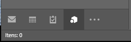
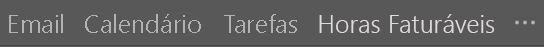
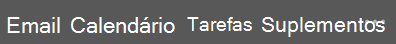
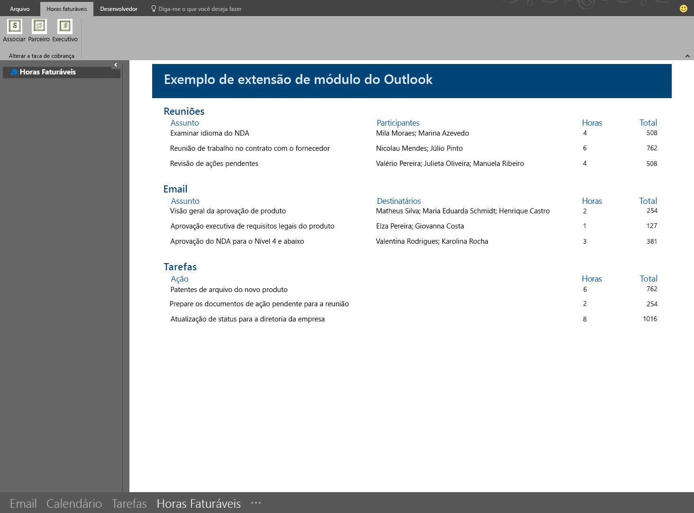

# <a name="module-extension-outlook-add-ins"></a>Suplementos de extensão de módulo do Outlook

Suplementos de extensão de módulo aparecem na barra de navegação do Outlook ao lado de emails, tarefas e calendários. Uma extensão de módulo não está limitada ao uso de informações de emails e compromissos. Você pode criar aplicativos para o Outlook a fim de facilitar o acesso às informações comerciais e às ferramentas de produtividade, sem que os usuários precisem sair do Outlook.

> [!NOTE]
> As extensões de módulo são compatíveis apenas para o Outlook 2016 ou posterior no Windows.  

## <a name="open-a-module-extension"></a>Usar uma extensão de módulo

Para abrir uma extensão de módulo, os usuários devem clicar no nome ou no ícone do módulo na barra de navegação do Outlook. Se o usuário tiver selecionado a navegação compacta, a barra de navegação terá um ícone que mostra que uma extensão foi carregada.



Se o usuário não estiver usando a navegação compacta, a barra de navegação terá duas aparências. Com uma extensão carregada, ela mostrará o nome do suplemento.



Quando mais de um suplemento é carregado, mostra a palavra **Suplementos**. Clicar em um deles abrirá a interface do usuário da extensão.



Quando você clica em uma extensão, o Outlook substitui o módulo embutido por seus módulos personalizados, para que os usuários possam interagir com o suplemento. Você pode usar todos os recursos da API JavaScript do Outlook no suplemento e criar botões de comando na faixa de opções do Outlook que interagirão com o conteúdo do suplemento. A captura de tela a seguir mostra um suplemento de exemplo integrado à barra de navegação do Outlook e que tem comandos da faixa de opções que atualizarão o conteúdo do suplemento.



## <a name="example"></a>Exemplo

A seguir há uma seção de um arquivo de manifesto que define uma extensão de módulo.

```xml
<!-- Add Outlook module extension point -->
<VersionOverrides xmlns="http://schemas.microsoft.com/office/mailappversionoverrides"
                  xsi:type="VersionOverridesV1_0">
  <VersionOverrides xmlns="http://schemas.microsoft.com/office/mailappversionoverrides/1.1"
                    xsi:type="VersionOverridesV1_1">

    <!-- Begin override of existing elements -->
    <Description resid="residVersionOverrideDesc" />

    <Requirements>
      <bt:Sets DefaultMinVersion="1.3">
        <bt:Set Name="Mailbox" />
      </bt:Sets>
    </Requirements>
    <!-- End override of existing elements -->

    <Hosts>
      <Host xsi:type="MailHost">
        <DesktopFormFactor>
          <!-- Set the URL of the file that contains the
                JavaScript function that controls the extension -->
          <FunctionFile resid="residFunctionFileUrl" />

          <!--New Extension Point - Module for a ModuleApp -->
          <ExtensionPoint xsi:type="Module">
            <SourceLocation resid="residExtensionPointUrl" />
            <Label resid="residExtensionPointLabel" />

            <CommandSurface>
              <CustomTab id="idTab">
                <Group id="idGroup">
                  <Label resid="residGroupLabel" />

                  <Control xsi:type="Button" id="group.changeToAssociate">
                    <Label resid="residChangeToAssociateLabel" />
                    <Supertip>
                      <Title resid="residChangeToAssociateLabel" />
                      <Description resid="residChangeToAssociateDesc" />
                    </Supertip>
                    <Icon>
                      <bt:Image size="16" resid="residAssociateIcon16" />
                      <bt:Image size="32" resid="residAssociateIcon32" />
                      <bt:Image size="80" resid="residAssociateIcon80" />
                    </Icon>
                    <Action xsi:type="ExecuteFunction">
                      <FunctionName>changeToAssociateRate</FunctionName>
                    </Action>
                  </Control>
                  
              </Group>
                <Label resid="residCustomTabLabel" />
              </CustomTab>
            </CommandSurface>
          </ExtensionPoint>
        </DesktopFormFactor>
      </Host>
    </Hosts>

    <Resources>
      <bt:Images>
        <bt:Image id="residAddinIcon16" 
                  DefaultValue="https://localhost:8080/Executive-16.png" />
        <bt:Image id="residAddinIcon32" 
                  DefaultValue="https://localhost:8080/Executive-32.png" />
        <bt:Image id="residAddinIcon80" 
                  DefaultValue="https://localhost:8080/Executive-80.png" />
      
        <bt:Image id="residAssociateIcon16" 
                  DefaultValue="https://localhost:8080/Associate-16.png" />
        <bt:Image id="residAssociateIcon32" 
                  DefaultValue="https://localhost:8080/Associate-32.png" />
        <bt:Image id="residAssociateIcon80" 
                  DefaultValue="https://localhost:8080/Associate-80.png" />
      </bt:Images>

      <bt:Urls>
        <bt:Url id="residFunctionFileUrl" 
                DefaultValue="https://localhost:8080/" />
        <bt:Url id="residExtensionPointUrl" 
                DefaultValue="https://localhost:8080/" />
      </bt:Urls>

      <!--Short strings must be less than 30 characters long -->
      <bt:ShortStrings>
        <bt:String id="residExtensionPointLabel" 
                    DefaultValue="Billable Hours" />
        <bt:String id="residGroupLabel" 
                    DefaultValue="Change billing rate" />
        <bt:String id="residCustomTabLabel" 
                    DefaultValue="Billable hours" />

        <bt:String id="residChangeToAssociateLabel" 
                    DefaultValue="Associate" />
      </bt:ShortStrings>

      <bt:LongStrings>
        <bt:String id="residVersionOverrideDesc" 
                    DefaultValue="Version override description" />

        <bt:String id="residChangeToAssociateDesc" 
                    DefaultValue="Change to the associate billing rate: $127/hr" />
      </bt:LongStrings>
    </Resources>
  </VersionOverrides>
</VersionOverrides>
```

## <a name="see-also"></a>Confira também

- [Manifestos de suplementos do Outlook](manifests.md)
- [Comandos de suplemento para o Outlook](add-in-commands-for-outlook.md)
- [Exemplo de horas faturáveis de extensões de módulo do Outlook](https://github.com/OfficeDev/Outlook-Add-in-JavaScript-ModuleExtension)
