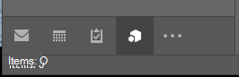

# <a name="module-extension-outlook-add-ins"></a><span data-ttu-id="5963a-103">Suplementos de extensão de módulo do Outlook</span><span class="sxs-lookup"><span data-stu-id="5963a-103">Module extension Outlook add-ins</span></span>

<span data-ttu-id="5963a-104">Suplementos de extensão de módulo aparecem na barra de navegação do Outlook ao lado de emails, tarefas e calendários.</span><span class="sxs-lookup"><span data-stu-id="5963a-104">Module extension add-ins appear in the Outlook navigation bar, right alongside mail, tasks, and calendars.</span></span> <span data-ttu-id="5963a-105">Uma extensão de módulo não está limitada ao uso de informações de emails e compromissos.</span><span class="sxs-lookup"><span data-stu-id="5963a-105">A module extension is not limited to using mail and appointment information.</span></span> <span data-ttu-id="5963a-106">Você pode criar aplicativos para o Outlook a fim de facilitar o acesso às informações comerciais e às ferramentas de produtividade, sem que os usuários precisem sair do Outlook.</span><span class="sxs-lookup"><span data-stu-id="5963a-106">You can create applications that run inside Outlook to make it easy for your users to access business information and productivity tools without ever leaving Outlook.</span></span>

> [!NOTE]
> <span data-ttu-id="5963a-107">As extensões de módulo são compatíveis apenas para o Outlook 2016 ou posterior no Windows.</span><span class="sxs-lookup"><span data-stu-id="5963a-107">Module extensions are only supported by Outlook 2016 or later on Windows.</span></span>  

## <a name="open-a-module-extension"></a><span data-ttu-id="5963a-108">Usar uma extensão de módulo</span><span class="sxs-lookup"><span data-stu-id="5963a-108">Open a module extension</span></span>

<span data-ttu-id="5963a-p102">Para abrir uma extensão de módulo, os usuários devem clicar no nome ou no ícone do módulo na barra de navegação do Outlook. Se o usuário tiver selecionado a navegação compacta, a barra de navegação terá um ícone que mostra que uma extensão foi carregada.</span><span class="sxs-lookup"><span data-stu-id="5963a-p102">To open a module extension, users click on the module's name or icon in the Outlook navigation bar. If the user has compact navigation selected, the navigation bar has an icon that shows an extension is loaded.</span></span>



<span data-ttu-id="5963a-112">Se o usuário não estiver usando a navegação compacta, a barra de navegação terá duas aparências.</span><span class="sxs-lookup"><span data-stu-id="5963a-112">If the user is not using compact navigation, the navigation bar has two looks.</span></span> <span data-ttu-id="5963a-113">Com uma extensão carregada, ela mostrará o nome do suplemento.</span><span class="sxs-lookup"><span data-stu-id="5963a-113">With one extension loaded, it shows the name of the add-in.</span></span>


<span data-ttu-id="5963a-115">Quando mais de um suplemento é carregado, mostra a palavra **Suplementos**. Clicar em um deles abrirá a interface do usuário da extensão.</span><span class="sxs-lookup"><span data-stu-id="5963a-115">When more than one add-in is loaded, it shows the word **Add-ins**. Clicking either will open the extension's user interface.</span></span>


<span data-ttu-id="5963a-117">Quando você clica em uma extensão, o Outlook substitui o módulo embutido por seus módulos personalizados, para que os usuários possam interagir com o suplemento.</span><span class="sxs-lookup"><span data-stu-id="5963a-117">When you click on an extension, Outlook replaces the built-in module with your custom module so that your users can interact with the add-in.</span></span> <span data-ttu-id="5963a-118">Você pode usar todos os recursos da API JavaScript do Outlook no suplemento e criar botões de comando na faixa de opções do Outlook que interagirão com o conteúdo do suplemento.</span><span class="sxs-lookup"><span data-stu-id="5963a-118">You can use all of the features of the Outlook JavaScript API in your add-in, and can create command buttons in the Outlook ribbon that will interact with the add-in content.</span></span> <span data-ttu-id="5963a-119">A captura de tela a seguir mostra um suplemento de exemplo integrado à barra de navegação do Outlook e que tem comandos da faixa de opções que atualizarão o conteúdo do suplemento.</span><span class="sxs-lookup"><span data-stu-id="5963a-119">The following screenshot shows an add-in that is integrated in the Outlook navigation bar and has ribbon commands that will update the content of the add-in.</span></span>


## <a name="example"></a><span data-ttu-id="5963a-121">Exemplo</span><span class="sxs-lookup"><span data-stu-id="5963a-121">Example</span></span>

<span data-ttu-id="5963a-122">A seguir há uma seção de um arquivo de manifesto que define uma extensão de módulo.</span><span class="sxs-lookup"><span data-stu-id="5963a-122">The following is a section of a manifest file that defines a module extension.</span></span>

```xml
<!-- Add Outlook module extension point -->
<VersionOverrides xmlns="http://schemas.microsoft.com/office/mailappversionoverrides"
                  xsi:type="VersionOverridesV1_0">
  <VersionOverrides xmlns="http://schemas.microsoft.com/office/mailappversionoverrides/1.1"
                    xsi:type="VersionOverridesV1_1">

    <!-- Begin override of existing elements -->
    <Description resid="residVersionOverrideDesc" />

    <Requirements>
      <bt:Sets DefaultMinVersion="1.3">
        <bt:Set Name="Mailbox" />
      </bt:Sets>
    </Requirements>
    <!-- End override of existing elements -->

    <Hosts>
      <Host xsi:type="MailHost">
        <DesktopFormFactor>
          <!-- Set the URL of the file that contains the
                JavaScript function that controls the extension -->
          <FunctionFile resid="residFunctionFileUrl" />

          <!--New Extension Point - Module for a ModuleApp -->
          <ExtensionPoint xsi:type="Module">
            <SourceLocation resid="residExtensionPointUrl" />
            <Label resid="residExtensionPointLabel" />

            <CommandSurface>
              <CustomTab id="idTab">
                <Group id="idGroup">
                  <Label resid="residGroupLabel" />

                  <Control xsi:type="Button" id="group.changeToAssociate">
                    <Label resid="residChangeToAssociateLabel" />
                    <Supertip>
                      <Title resid="residChangeToAssociateLabel" />
                      <Description resid="residChangeToAssociateDesc" />
                    </Supertip>
                    <Icon>
                      <bt:Image size="16" resid="residAssociateIcon16" />
                      <bt:Image size="32" resid="residAssociateIcon32" />
                      <bt:Image size="80" resid="residAssociateIcon80" />
                    </Icon>
                    <Action xsi:type="ExecuteFunction">
                      <FunctionName>changeToAssociateRate</FunctionName>
                    </Action>
                  </Control>
                  
              </Group>
                <Label resid="residCustomTabLabel" />
              </CustomTab>
            </CommandSurface>
          </ExtensionPoint>
        </DesktopFormFactor>
      </Host>
    </Hosts>

    <Resources>
      <bt:Images>
        <bt:Image id="residAddinIcon16" 
                  DefaultValue="https://localhost:8080/Executive-16.png" />
        <bt:Image id="residAddinIcon32" 
                  DefaultValue="https://localhost:8080/Executive-32.png" />
        <bt:Image id="residAddinIcon80" 
                  DefaultValue="https://localhost:8080/Executive-80.png" />
      
        <bt:Image id="residAssociateIcon16" 
                  DefaultValue="https://localhost:8080/Associate-16.png" />
        <bt:Image id="residAssociateIcon32" 
                  DefaultValue="https://localhost:8080/Associate-32.png" />
        <bt:Image id="residAssociateIcon80" 
                  DefaultValue="https://localhost:8080/Associate-80.png" />
      </bt:Images>

      <bt:Urls>
        <bt:Url id="residFunctionFileUrl" 
                DefaultValue="https://localhost:8080/" />
        <bt:Url id="residExtensionPointUrl" 
                DefaultValue="https://localhost:8080/" />
      </bt:Urls>

      <!--Short strings must be less than 30 characters long -->
      <bt:ShortStrings>
        <bt:String id="residExtensionPointLabel" 
                    DefaultValue="Billable Hours" />
        <bt:String id="residGroupLabel" 
                    DefaultValue="Change billing rate" />
        <bt:String id="residCustomTabLabel" 
                    DefaultValue="Billable hours" />

        <bt:String id="residChangeToAssociateLabel" 
                    DefaultValue="Associate" />
      </bt:ShortStrings>

      <bt:LongStrings>
        <bt:String id="residVersionOverrideDesc" 
                    DefaultValue="Version override description" />

        <bt:String id="residChangeToAssociateDesc" 
                    DefaultValue="Change to the associate billing rate: $127/hr" />
      </bt:LongStrings>
    </Resources>
  </VersionOverrides>
</VersionOverrides>
```

## <a name="see-also"></a><span data-ttu-id="5963a-123">Confira também</span><span class="sxs-lookup"><span data-stu-id="5963a-123">See also</span></span>

- [<span data-ttu-id="5963a-124">Manifestos de suplementos do Outlook</span><span class="sxs-lookup"><span data-stu-id="5963a-124">Outlook add-in manifests</span></span>](manifests.md)
- [<span data-ttu-id="5963a-125">Comandos de suplemento para o Outlook</span><span class="sxs-lookup"><span data-stu-id="5963a-125">Add-in commands for Outlook</span></span>](add-in-commands-for-outlook.md)
- [<span data-ttu-id="5963a-126">Exemplo de horas faturáveis de extensões de módulo do Outlook</span><span class="sxs-lookup"><span data-stu-id="5963a-126">Outlook module extensions Billable hours sample</span></span>](https://github.com/OfficeDev/Outlook-Add-in-JavaScript-ModuleExtension)
