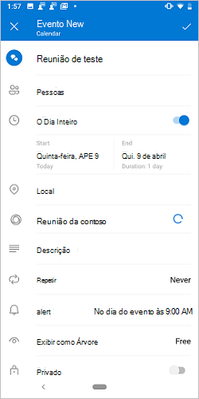
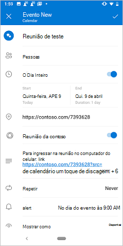
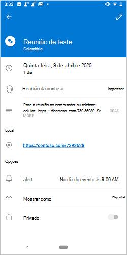

# <a name="create-an-outlook-mobile-add-in-for-an-online-meeting-provider-preview"></a>Criar um suplemento do Outlook Mobile para um provedor de reunião online (visualização)

A configuração de uma reunião online é uma experiência principal para um usuário do Outlook e é fácil [criar uma reunião do teams com o Outlook](/microsoftteams/teams-add-in-for-outlook) Mobile. No entanto, a criação de uma reunião online no Outlook com um serviço que não seja da Microsoft pode ser complicada. Ao implementar esse recurso, os provedores de serviços podem simplificar a experiência de criação de reunião online para os usuários de suplementos do Outlook.

> [!NOTE]
> Este recurso só tem suporte na [Visualização](../reference/objectmodel/preview-requirement-set/outlook-requirement-set-preview.md) no Android com uma assinatura do Office 365.

Neste artigo, você aprenderá como configurar seu suplemento do Outlook Mobile para permitir que os usuários organizem e ingressem em uma reunião usando o serviço de reunião online. Neste artigo, vamos usar um provedor de serviço de reunião online fictício, "contoso".

## <a name="configure-the-manifest"></a>Configurar o manifesto

Para permitir que os usuários criem reuniões online com seu suplemento, você deve configurar o `MobileOnlineMeetingCommandSurface` ponto de extensão no manifesto no elemento `MobileFormFactor`pai. Não há suporte para outros fatores de formulário.

O exemplo a seguir mostra um trecho do manifesto que inclui o `MobileFormFactor` elemento e `MobileOnlineMeetingCommandSurface` o ponto de extensão.

> [!TIP]
> Para saber mais sobre manifestos para suplementos do Outlook, confira [manifestos de suplemento do Outlook](manifests.md) e [Adicione suporte para comandos de suplemento do Outlook Mobile](add-mobile-support.md).

```xml
...
<VersionOverrides xmlns="http://schemas.microsoft.com/office/mailappversionoverrides" xsi:type="VersionOverridesV1_0">
  <VersionOverrides xmlns="http://schemas.microsoft.com/office/mailappversionoverrides/1.1" xsi:type="VersionOverridesV1_1">
    ...
    <Hosts>
      <Host xsi:type="MailHost">
        <MobileFormFactor>
          <FunctionFile resid="residMobileFuncUrl" />
          <ExtensionPoint xsi:type="MobileOnlineMeetingCommandSurface">
            <!-- Configure selected extension point. -->
            <Control xsi:type="MobileButton" id="onlineMeetingFunctionButton">
              <Label resid="residUILessButton0Name" />
              <Icon>
                <bt:Image resid="UiLessIcon" size="25" scale="1" />
                <bt:Image resid="UiLessIcon" size="25" scale="2" />
                <bt:Image resid="UiLessIcon" size="25" scale="3" />
                <bt:Image resid="UiLessIcon" size="32" scale="1" />
                <bt:Image resid="UiLessIcon" size="32" scale="2" />
                <bt:Image resid="UiLessIcon" size="32" scale="3" />
                <bt:Image resid="UiLessIcon" size="48" scale="1" />
                <bt:Image resid="UiLessIcon" size="48" scale="2" />
                <bt:Image resid="UiLessIcon" size="48" scale="3" />
              </Icon>
              <Action xsi:type="ExecuteFunction">
                <FunctionName>insertContosoMeeting</FunctionName>
              </Action>
            </Control>
          </ExtensionPoint>
        </MobileFormFactor>
      </Host>
    </Hosts>
    ...
  </VersionOverrides>
</VersionOverrides>
...
```

## <a name="implement-adding-online-meeting-details"></a>Implementar adicionando detalhes da reunião online

Nesta seção, saiba como o script do seu suplemento pode atualizar a reunião de um usuário para incluir detalhes online da reunião.

O exemplo a seguir mostra como você cria detalhes da reunião online. Não mostrado é como obter a ID do organizador da reunião e outros detalhes do serviço.

```js
const newBody = '<br>' +
    '<a href="https://contoso.com/meeting?id=123456789" target="_blank">Join Contoso meeting</a>' +
    '<br><br>' +
    'Phone Dial-in: +1(123)456-7890' +
    '<br><br>' +
    'Meeting ID: 123 456 789' +
    '<br><br>' +
    'Want to test your video connection?' +
    '<br><br>' +
    '<a href="https://contoso.com/testmeeting" target="_blank">Join test meeting</a>' +
    '<br><br>';
```

O exemplo a seguir mostra como definir uma função sem interface do usuário `insertContosoMeeting` chamada referenciada no manifesto para atualizar o corpo da reunião com os detalhes da reunião online.

```js
var mailboxItem;

// Office is ready.
Office.onReady(function () {
        mailboxItem = Office.context.mailbox.item;
    }
);

function insertContosoMeeting(event) {
    // Get HTML body from the client.
    mailboxItem.body.getAsync("html",
        { asyncContext: event },
        function (getBodyResult) {
            if (getBodyResult.status === Office.AsyncResultStatus.Succeeded) {
                updateBody(getBodyResult.asyncContext, getBodyResult.value);
            } else {
                console.error("Failed to get HTML body.");
                getBodyResult.asyncContext.completed({ allowEvent: false });
            }
        }
    );
}
```

O exemplo a seguir mostra uma implementação da função `updateBody` de suporte usada no exemplo anterior que acrescenta os detalhes da reunião online ao corpo atual da reunião.

```js
function updateBody(event, existingBody) {
    // Append new body to the existing body.
    mailboxItem.body.setAsync(existingBody + newBody,
        { asyncContext: event, coercionType: "html" },
        function (setBodyResult) {
            if (setBodyResult.status === Office.AsyncResultStatus.Succeeded) {
                setBodyResult.asyncContext.completed({ allowEvent: true });
            } else {
                console.error("Failed to set HTML body.");
                setBodyResult.asyncContext.completed({ allowEvent: false });
            }
        }
    );
}
```

## <a name="testing-and-validation"></a>Teste e validação

Siga as orientações usuais para [testar e validar o suplemento](testing-and-tips.md). Após o [Sideload](sideload-outlook-add-ins-for-testing.md) no Outlook na Web, no Windows ou no Mac, reinicie o Outlook no seu dispositivo móvel Android (o Android é o único cliente com suporte para agora). Em seguida, em uma nova tela de reunião, verifique se o Microsoft Teams ou o alternância do Skype foi substituído por seu próprio.

### <a name="create-meeting-ui"></a>Criar IU de reunião

Como organizador da reunião, você deve ver telas semelhantes às três imagens a seguir ao criar uma reunião.

[captura de tela da tela criar reunião no Android-ativar/desativar captura de tela da tela criar reunião no Android-carregando a captura de tela da Contoso Toggle Screen do botão criar reunião no Android-ativar/desativar ](../images/outlook-android-create-online-meeting-off-expanded.png#lightbox) [ ](../images/outlook-android-create-online-meeting-load-expanded.png#lightbox) [ ](../images/outlook-android-create-online-meeting-on-expanded.png#lightbox)

### <a name="join-meeting-ui"></a>Ingressar na IU da reunião

Como participante da reunião, você verá uma tela semelhante à seguinte imagem ao exibir a reunião.

[](../images/outlook-android-join-online-meeting-view-1-expanded.png#lightbox)

## <a name="available-apis"></a>APIs disponíveis

As seguintes APIs estão disponíveis para este recurso.

- APIs do organizador de compromissos
  - [Office. Context. Mailbox. Item. Subject](/javascript/api/outlook/office.appointmentcompose?view=outlook-js-preview#subject) ([assunto](/javascript/api/outlook/office.subject?view=outlook-js-preview))
  - [Office. Context. Mailbox. Item. Start](/javascript/api/outlook/office.appointmentcompose?view=outlook-js-preview#start) ([time](/javascript/api/outlook/office.time?view=outlook-js-preview))
  - [Office. Context. Mailbox. Item. end](/javascript/api/outlook/office.appointmentcompose?view=outlook-js-preview#end) ([time](/javascript/api/outlook/office.time?view=outlook-js-preview))
  - [Office. Context. Mailbox. Item. Location](/javascript/api/outlook/office.appointmentcompose?view=outlook-js-preview#location) ([local](/javascript/api/outlook/office.location?view=outlook-js-preview))
  - [Office. Context. Mailbox. Item. optionalAttendees](/javascript/api/outlook/office.appointmentcompose?view=outlook-js-preview#optionalattendees) ([destinatários](/javascript/api/outlook/office.recipients?view=outlook-js-preview))
  - [Office. Context. Mailbox. Item. requiredAttendees](/javascript/api/outlook/office.appointmentcompose?view=outlook-js-preview#requiredattendees) ([destinatários](/javascript/api/outlook/office.recipients?view=outlook-js-preview))
  - [Office. Context. Mailbox. Item. Body](/javascript/api/outlook/office.appointmentcompose?view=outlook-js-preview#body) ([Body. getasync](/javascript/api/outlook/office.body?view=outlook-js-preview#getasync-coerciontype--options--callback-), [Body. setasync](/javascript/api/outlook/office.body?view=outlook-js-preview#setasync-data--options--callback-))
  - [Office. Context. Mailbox. Item. loadCustomPropertiesAsync](/javascript/api/outlook/office.appointmentcompose?view=outlook-js-preview#loadcustompropertiesasync-callback--usercontext-) ([CustomProperties](/javascript/api/outlook/office.customproperties?view=outlook-js-preview))
  - [Office. Context. roamingSettings](../reference/objectmodel/preview-requirement-set/office.context.md?view=outlook-js-preview#roamingsettings-roamingsettings) ([roamingSettings](/javascript/api/outlook/office.roamingsettings?view=outlook-js-preview))
- Gerenciar fluxo de autenticação
  - [APIs de caixa de diálogo](../develop/dialog-api-in-office-add-ins.md)

## <a name="restrictions"></a>Restriction

Várias restrições se aplicam.

- Aplicável somente aos provedores de serviço de reunião online.
- Atualmente em visualização, portanto, esse recurso não deve ser usado em suplementos de produção.
- No momento, o Android é o único cliente com suporte. O suporte ao iOS estará disponível em breve.
- Somente os suplementos instalados pelo administrador serão exibidos na tela de redação da reunião, substituindo a opção Teams ou Skype padrão. Os suplementos instalados pelo usuário não serão ativados.
- O ícone do suplemento deve estar em escala de cinza usando o `#919191` código hex ou seu equivalente em [outros formatos de cor](https://convertingcolors.com/hex-color-919191.html).
- Só há suporte para um comando sem interface do usuário no modo de organizador de compromisso (compor).

## <a name="see-also"></a>Confira também

- [Suplementos do Outlook Mobile](outlook-mobile-addins.md)
- [Adicionar suporte para comandos de suplementos para Outlook Mobile](add-mobile-support.md)
