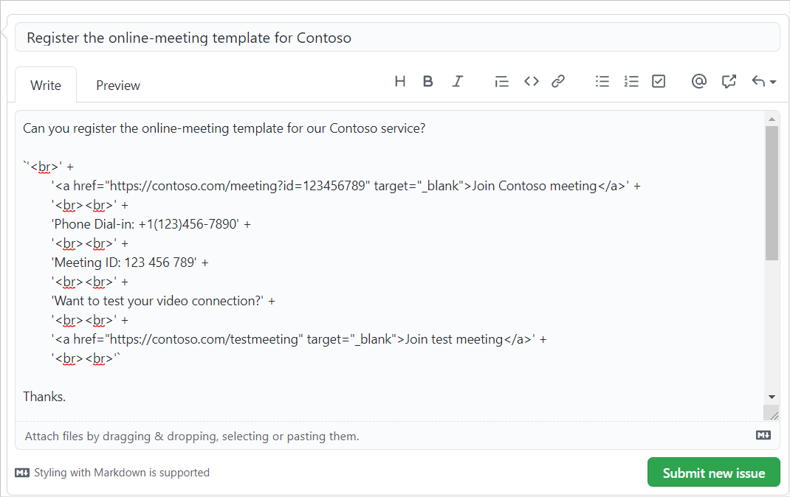

# <a name="create-an-outlook-mobile-add-in-for-an-online-meeting-provider"></a><span data-ttu-id="7b2f9-103">Criar um suplemento do Outlook Mobile para um provedor de reunião online</span><span class="sxs-lookup"><span data-stu-id="7b2f9-103">Create an Outlook mobile add-in for an online-meeting provider</span></span>

<span data-ttu-id="7b2f9-104">A configuração de uma reunião online é uma experiência principal para um usuário do Outlook e é fácil [criar uma reunião do teams com o Outlook](/microsoftteams/teams-add-in-for-outlook) Mobile.</span><span class="sxs-lookup"><span data-stu-id="7b2f9-104">Setting up an online meeting is a core experience for an Outlook user, and it's easy to [create a Teams meeting with Outlook](/microsoftteams/teams-add-in-for-outlook) mobile.</span></span> <span data-ttu-id="7b2f9-105">No entanto, a criação de uma reunião online no Outlook com um serviço que não seja da Microsoft pode ser complicada.</span><span class="sxs-lookup"><span data-stu-id="7b2f9-105">However, creating an online meeting in Outlook with a non-Microsoft service can be cumbersome.</span></span> <span data-ttu-id="7b2f9-106">Ao implementar esse recurso, os provedores de serviços podem simplificar a experiência de criação de reunião online para os usuários de suplementos do Outlook.</span><span class="sxs-lookup"><span data-stu-id="7b2f9-106">By implementing this feature, service providers can streamline the online meeting creation experience for their Outlook add-in users.</span></span>

> [!IMPORTANT]
> <span data-ttu-id="7b2f9-107">Este recurso só é suportado no Android com uma assinatura do Microsoft 365.</span><span class="sxs-lookup"><span data-stu-id="7b2f9-107">This feature is only supported on Android with a Microsoft 365 subscription.</span></span>

<span data-ttu-id="7b2f9-108">Neste artigo, você aprenderá como configurar seu suplemento do Outlook Mobile para permitir que os usuários organizem e ingressem em uma reunião usando o serviço de reunião online.</span><span class="sxs-lookup"><span data-stu-id="7b2f9-108">In this article, you'll learn how to set up your Outlook mobile add-in to enable users to organize and join a meeting using your online-meeting service.</span></span> <span data-ttu-id="7b2f9-109">Neste artigo, vamos usar um provedor de serviço de reunião online fictício, "contoso".</span><span class="sxs-lookup"><span data-stu-id="7b2f9-109">Throughout this article, we'll be using a fictional online-meeting service provider, "Contoso".</span></span>

## <a name="set-up-your-environment"></a><span data-ttu-id="7b2f9-110">Configurar seu ambiente</span><span class="sxs-lookup"><span data-stu-id="7b2f9-110">Set up your environment</span></span>

<span data-ttu-id="7b2f9-111">Conclua o [início rápido do Outlook](../quickstarts/outlook-quickstart.md?tabs=yeomangenerator) que cria um projeto de suplemento com o gerador Yeoman para suplementos do Office.</span><span class="sxs-lookup"><span data-stu-id="7b2f9-111">Complete the [Outlook quick start](../quickstarts/outlook-quickstart.md?tabs=yeomangenerator) which creates an add-in project with the Yeoman generator for Office Add-ins.</span></span>

## <a name="configure-the-manifest"></a><span data-ttu-id="7b2f9-112">Configurar o manifesto</span><span class="sxs-lookup"><span data-stu-id="7b2f9-112">Configure the manifest</span></span>

<span data-ttu-id="7b2f9-113">Para permitir que os usuários criem reuniões online com seu suplemento, você deve configurar o `MobileOnlineMeetingCommandSurface` ponto de extensão no manifesto no elemento pai `MobileFormFactor` .</span><span class="sxs-lookup"><span data-stu-id="7b2f9-113">To enable users to create online meetings with your add-in, you must configure the `MobileOnlineMeetingCommandSurface` extension point in the manifest under the parent element `MobileFormFactor`.</span></span> <span data-ttu-id="7b2f9-114">Não há suporte para outros fatores de formulário.</span><span class="sxs-lookup"><span data-stu-id="7b2f9-114">Other form factors are not supported.</span></span>

1. <span data-ttu-id="7b2f9-115">Em seu editor de código, abra o projeto de início rápido.</span><span class="sxs-lookup"><span data-stu-id="7b2f9-115">In your code editor, open the quick start project.</span></span>

1. <span data-ttu-id="7b2f9-116">Abra o arquivo **manifest.xml** localizado na raiz do seu projeto.</span><span class="sxs-lookup"><span data-stu-id="7b2f9-116">Open the **manifest.xml** file located at the root of your project.</span></span>

1. <span data-ttu-id="7b2f9-117">Selecione o `<VersionOverrides>` nó inteiro (incluindo marcas de abertura e fechamento) e substitua-o pelo seguinte XML.</span><span class="sxs-lookup"><span data-stu-id="7b2f9-117">Select the entire `<VersionOverrides>` node (including open and close tags) and replace it with the following XML.</span></span>

```xml
<VersionOverrides xmlns="http://schemas.microsoft.com/office/mailappversionoverrides" xsi:type="VersionOverridesV1_0">
  <VersionOverrides xmlns="http://schemas.microsoft.com/office/mailappversionoverrides/1.1" xsi:type="VersionOverridesV1_1">
    <Description resid="residDescription"></Description>
    <Requirements>
      <bt:Sets>
        <bt:Set Name="Mailbox" MinVersion="1.3"/>
      </bt:Sets>
    </Requirements>
    <Hosts>
      <Host xsi:type="MailHost">
        <DesktopFormFactor>
          <FunctionFile resid="residFunctionFile"/>
          <ExtensionPoint xsi:type="AppointmentOrganizerCommandSurface">
            <OfficeTab id="TabDefault">
              <Group id="apptComposeGroup">
                <Label resid="residDescription"/>
                <Control xsi:type="Button" id="insertMeetingButton">
                  <Label resid="residLabel"/>
                  <Supertip>
                    <Title resid="residLabel"/>
                    <Description resid="residTooltip"/>
                  </Supertip>
                  <Icon>
                    <bt:Image size="16" resid="icon-16"/>
                    <bt:Image size="32" resid="icon-32"/>
                    <bt:Image size="64" resid="icon-64"/>
                    <bt:Image size="80" resid="icon-80"/>
                  </Icon>
                  <Action xsi:type="ExecuteFunction">
                    <FunctionName>insertContosoMeeting</FunctionName>
                  </Action>
                </Control>
              </Group>
            </OfficeTab>
          </ExtensionPoint>
        </DesktopFormFactor>

        <MobileFormFactor>
          <FunctionFile resid="residFunctionFile"/>
          <ExtensionPoint xsi:type="MobileOnlineMeetingCommandSurface">
            <Control xsi:type="MobileButton" id="insertMeetingButton">
              <Label resid="residLabel"/>
              <Icon>
                <bt:Image size="25" scale="1" resid="icon-16"/>
                <bt:Image size="25" scale="2" resid="icon-16"/>
                <bt:Image size="25" scale="3" resid="icon-16"/>

                <bt:Image size="32" scale="1" resid="icon-32"/>
                <bt:Image size="32" scale="2" resid="icon-32"/>
                <bt:Image size="32" scale="3" resid="icon-32"/>

                <bt:Image size="48" scale="1" resid="icon-48"/>
                <bt:Image size="48" scale="2" resid="icon-48"/>
                <bt:Image size="48" scale="3" resid="icon-48"/>
              </Icon>
              <Action xsi:type="ExecuteFunction">
                <FunctionName>insertContosoMeeting</FunctionName>
              </Action>
            </Control>
          </ExtensionPoint>
        </MobileFormFactor>
      </Host>
    </Hosts>
    <Resources>
      <bt:Images>
        <bt:Image id="icon-16" DefaultValue="https://contoso.com/assets/icon-16.png"/>
        <bt:Image id="icon-32" DefaultValue="https://contoso.com/assets/icon-32.png"/>
        <bt:Image id="icon-48" DefaultValue="https://contoso.com/assets/icon-48.png"/>
        <bt:Image id="icon-64" DefaultValue="https://contoso.com/assets/icon-64.png"/>
        <bt:Image id="icon-80" DefaultValue="https://contoso.com/assets/icon-80.png"/>
      </bt:Images>
      <bt:Urls>
        <bt:Url id="residFunctionFile" DefaultValue="https://contoso.com/commands.html"/>
      </bt:Urls>
      <bt:ShortStrings>
        <bt:String id="residDescription" DefaultValue="Contoso meeting"/>
        <bt:String id="residLabel" DefaultValue="Add a contoso meeting"/>
      </bt:ShortStrings>
      <bt:LongStrings>
        <bt:String id="residTooltip" DefaultValue="Add a contoso meeting to this appointment."/>
      </bt:LongStrings>
    </Resources>
  </VersionOverrides>
</VersionOverrides>
```

> [!TIP]
> <span data-ttu-id="7b2f9-118">Para saber mais sobre manifestos para suplementos do Outlook, confira [manifestos de suplemento do Outlook](manifests.md) e [Adicione suporte para comandos de suplemento do Outlook Mobile](add-mobile-support.md).</span><span class="sxs-lookup"><span data-stu-id="7b2f9-118">To learn more about manifests for Outlook add-ins, see [Outlook add-in manifests](manifests.md) and [Add support for add-in commands for Outlook Mobile](add-mobile-support.md).</span></span>

## <a name="implement-adding-online-meeting-details"></a><span data-ttu-id="7b2f9-119">Implementar adicionando detalhes da reunião online</span><span class="sxs-lookup"><span data-stu-id="7b2f9-119">Implement adding online meeting details</span></span>

<span data-ttu-id="7b2f9-120">Nesta seção, saiba como o script do seu suplemento pode atualizar a reunião de um usuário para incluir detalhes online da reunião.</span><span class="sxs-lookup"><span data-stu-id="7b2f9-120">In this section, learn how your add-in script can update a user's meeting to include online meeting details.</span></span>

1. <span data-ttu-id="7b2f9-121">No mesmo projeto de início rápido, abra o arquivo **./src/commands/commands.js** em seu editor de código.</span><span class="sxs-lookup"><span data-stu-id="7b2f9-121">From the same quick start project, open the file **./src/commands/commands.js** in your code editor.</span></span>

1. <span data-ttu-id="7b2f9-122">Substitua todo o conteúdo do arquivo de **commands.js** pelo seguinte JavaScript.</span><span class="sxs-lookup"><span data-stu-id="7b2f9-122">Replace the entire content of the **commands.js** file with the following JavaScript.</span></span>

    ```js
    // 1. How to construct online meeting details.
    // Not shown: How to get the meeting organizer's ID and other details from your service.
    const newBody = '<br>' +
        '<a href="https://contoso.com/meeting?id=123456789" target="_blank">Join Contoso meeting</a>' +
        '<br><br>' +
        'Phone Dial-in: +1(123)456-7890' +
        '<br><br>' +
        'Meeting ID: 123 456 789' +
        '<br><br>' +
        'Want to test your video connection?' +
        '<br><br>' +
        '<a href="https://contoso.com/testmeeting" target="_blank">Join test meeting</a>' +
        '<br><br>';

    var mailboxItem;

    // Office is ready.
    Office.onReady(function () {
            mailboxItem = Office.context.mailbox.item;
        }
    );

    // 2. How to define a UI-less function named `insertContosoMeeting` (referenced in the manifest)
    //    to update the meeting body with the online meeting details.
    function insertContosoMeeting(event) {
        // Get HTML body from the client.
        mailboxItem.body.getAsync("html",
            { asyncContext: event },
            function (getBodyResult) {
                if (getBodyResult.status === Office.AsyncResultStatus.Succeeded) {
                    updateBody(getBodyResult.asyncContext, getBodyResult.value);
                } else {
                    console.error("Failed to get HTML body.");
                    getBodyResult.asyncContext.completed({ allowEvent: false });
                }
            }
        );
    }

    // 3. How to implement a supporting function `updateBody`
    //    that appends the online meeting details to the current body of the meeting.
    function updateBody(event, existingBody) {
        // Append new body to the existing body.
        mailboxItem.body.setAsync(existingBody + newBody,
            { asyncContext: event, coercionType: "html" },
            function (setBodyResult) {
                if (setBodyResult.status === Office.AsyncResultStatus.Succeeded) {
                    setBodyResult.asyncContext.completed({ allowEvent: true });
                } else {
                    console.error("Failed to set HTML body.");
                    setBodyResult.asyncContext.completed({ allowEvent: false });
                }
            }
        );
    }

    function getGlobal() {
      return typeof self !== "undefined"
        ? self
        : typeof window !== "undefined"
        ? window
        : typeof global !== "undefined"
        ? global
        : undefined;
    }

    const g = getGlobal();

    // The add-in command functions need to be available in global scope.
    g.insertContosoMeeting = insertContosoMeeting;
    ```

## <a name="testing-and-validation"></a><span data-ttu-id="7b2f9-123">Teste e validação</span><span class="sxs-lookup"><span data-stu-id="7b2f9-123">Testing and validation</span></span>

<span data-ttu-id="7b2f9-124">Siga as orientações usuais para [testar e validar o suplemento](testing-and-tips.md).</span><span class="sxs-lookup"><span data-stu-id="7b2f9-124">Follow the usual guidance to [test and validate your add-in](testing-and-tips.md).</span></span> <span data-ttu-id="7b2f9-125">Após o [Sideload](sideload-outlook-add-ins-for-testing.md) no Outlook na Web, no Windows ou no Mac, reinicie o Outlook no seu dispositivo móvel Android.</span><span class="sxs-lookup"><span data-stu-id="7b2f9-125">After [sideloading](sideload-outlook-add-ins-for-testing.md) in Outlook on the web, Windows, or Mac, restart Outlook on your Android mobile device.</span></span> <span data-ttu-id="7b2f9-126">(Android é o único cliente com suporte para agora.) Em seguida, em uma nova tela de reunião, verifique se o Microsoft Teams ou o alternância do Skype foi substituído por seu próprio.</span><span class="sxs-lookup"><span data-stu-id="7b2f9-126">(Android is the only supported client for now.) Then, on a new meeting screen, verify that the Microsoft Teams or Skype toggle is replaced with your own.</span></span>

### <a name="create-meeting-ui"></a><span data-ttu-id="7b2f9-127">Criar IU de reunião</span><span class="sxs-lookup"><span data-stu-id="7b2f9-127">Create meeting UI</span></span>

<span data-ttu-id="7b2f9-128">Como organizador da reunião, você deve ver telas semelhantes às três imagens a seguir ao criar uma reunião.</span><span class="sxs-lookup"><span data-stu-id="7b2f9-128">As a meeting organizer, you should see screens similar to the following three images when you create a meeting.</span></span>

<span data-ttu-id="7b2f9-129">[ ](../images/outlook-android-create-online-meeting-off-expanded.png#lightbox) [ ](../images/outlook-android-create-online-meeting-load-expanded.png#lightbox) [ ](../images/outlook-android-create-online-meeting-on-expanded.png#lightbox)</span><span class="sxs-lookup"><span data-stu-id="7b2f9-129">[](../images/outlook-android-create-online-meeting-off-expanded.png#lightbox) [](../images/outlook-android-create-online-meeting-load-expanded.png#lightbox) [](../images/outlook-android-create-online-meeting-on-expanded.png#lightbox)</span></span>

### <a name="join-meeting-ui"></a><span data-ttu-id="7b2f9-130">Ingressar na IU da reunião</span><span class="sxs-lookup"><span data-stu-id="7b2f9-130">Join meeting UI</span></span>

<span data-ttu-id="7b2f9-131">Como participante da reunião, você verá uma tela semelhante à seguinte imagem ao exibir a reunião.</span><span class="sxs-lookup"><span data-stu-id="7b2f9-131">As a meeting attendee, you should see a screen similar to the following image when you view the meeting.</span></span>

<span data-ttu-id="7b2f9-132">[](../images/outlook-android-join-online-meeting-view-1-expanded.png#lightbox)</span><span class="sxs-lookup"><span data-stu-id="7b2f9-132">[](../images/outlook-android-join-online-meeting-view-1-expanded.png#lightbox)</span></span>

> [!IMPORTANT]
> <span data-ttu-id="7b2f9-133">Se você não vir o link de **ingresso** , pode ser que o modelo de reunião online do seu serviço não esteja registrado nos nossos servidores.</span><span class="sxs-lookup"><span data-stu-id="7b2f9-133">If you don't see the **Join** link, it may be that the online-meeting template for your service is not registered on our servers.</span></span> <span data-ttu-id="7b2f9-134">Confira a seção [registrar seu modelo de reunião online](#register-your-online-meeting-template) para obter detalhes.</span><span class="sxs-lookup"><span data-stu-id="7b2f9-134">See the [Register your online-meeting template](#register-your-online-meeting-template) section for details.</span></span>

## <a name="register-your-online-meeting-template"></a><span data-ttu-id="7b2f9-135">Registrar seu modelo de reunião online</span><span class="sxs-lookup"><span data-stu-id="7b2f9-135">Register your online-meeting template</span></span>

<span data-ttu-id="7b2f9-136">Se quiser registrar o modelo de reunião online para o seu serviço, você pode criar um problema do GitHub com os detalhes.</span><span class="sxs-lookup"><span data-stu-id="7b2f9-136">If you would like to register the online-meeting template for your service, you can create a GitHub issue with the details.</span></span> <span data-ttu-id="7b2f9-137">Depois, entraremos em contato com você para coordenar a linha do tempo de registro.</span><span class="sxs-lookup"><span data-stu-id="7b2f9-137">After that, we'll contact you to coordinate registration timeline.</span></span>

1. <span data-ttu-id="7b2f9-138">Vá para a seção de **comentários** no final deste artigo.</span><span class="sxs-lookup"><span data-stu-id="7b2f9-138">Go to the **Feedback** section at the end of this article.</span></span>
1. <span data-ttu-id="7b2f9-139">Pressione o link **esta página** .</span><span class="sxs-lookup"><span data-stu-id="7b2f9-139">Press the **This page** link.</span></span>
1. <span data-ttu-id="7b2f9-140">Defina o **título** do novo problema como "registrar o modelo de reunião online para meu serviço", substituindo `my-service` com o nome do serviço.</span><span class="sxs-lookup"><span data-stu-id="7b2f9-140">Set the **Title** of the new issue to "Register the online-meeting template for my-service", replacing `my-service` with your service name.</span></span>
1. <span data-ttu-id="7b2f9-141">No corpo da questão, substitua a cadeia de caracteres "[Insira comentários aqui]" com a cadeia de caracteres que você definiu na `newBody` seção ou variável semelhante da seção [implementar detalhes da reunião online](#implement-adding-online-meeting-details) , anteriormente neste artigo.</span><span class="sxs-lookup"><span data-stu-id="7b2f9-141">In the issue body, replace the string "[Enter feedback here]" with the string you set in the `newBody` or similar variable from the [Implement adding online meeting details](#implement-adding-online-meeting-details) section earlier in this article.</span></span>
1. <span data-ttu-id="7b2f9-142">Clique em **Enviar novo problema**.</span><span class="sxs-lookup"><span data-stu-id="7b2f9-142">Click **Submit new issue**.</span></span>



## <a name="available-apis"></a><span data-ttu-id="7b2f9-144">APIs disponíveis</span><span class="sxs-lookup"><span data-stu-id="7b2f9-144">Available APIs</span></span>

<span data-ttu-id="7b2f9-145">As seguintes APIs estão disponíveis para este recurso.</span><span class="sxs-lookup"><span data-stu-id="7b2f9-145">The following APIs are available for this feature.</span></span>

- <span data-ttu-id="7b2f9-146">APIs do organizador de compromissos</span><span class="sxs-lookup"><span data-stu-id="7b2f9-146">Appointment Organizer APIs</span></span>
  - <span data-ttu-id="7b2f9-147">[Office. Context. Mailbox. Item. Subject](/javascript/api/outlook/office.appointmentcompose?view=outlook-js-preview&preserve-view=true#subject) ([assunto](/javascript/api/outlook/office.subject?view=outlook-js-preview&preserve-view=true))</span><span class="sxs-lookup"><span data-stu-id="7b2f9-147">[Office.context.mailbox.item.subject](/javascript/api/outlook/office.appointmentcompose?view=outlook-js-preview&preserve-view=true#subject) ([Subject](/javascript/api/outlook/office.subject?view=outlook-js-preview&preserve-view=true))</span></span>
  - <span data-ttu-id="7b2f9-148">[Office. Context. Mailbox. Item. Start](/javascript/api/outlook/office.appointmentcompose?view=outlook-js-preview&preserve-view=true#start) ([time](/javascript/api/outlook/office.time?view=outlook-js-preview&preserve-view=true))</span><span class="sxs-lookup"><span data-stu-id="7b2f9-148">[Office.context.mailbox.item.start](/javascript/api/outlook/office.appointmentcompose?view=outlook-js-preview&preserve-view=true#start) ([Time](/javascript/api/outlook/office.time?view=outlook-js-preview&preserve-view=true))</span></span>
  - <span data-ttu-id="7b2f9-149">[Office. Context. Mailbox. Item. end](/javascript/api/outlook/office.appointmentcompose?view=outlook-js-preview&preserve-view=true#end) ([time](/javascript/api/outlook/office.time?view=outlook-js-preview&preserve-view=true))</span><span class="sxs-lookup"><span data-stu-id="7b2f9-149">[Office.context.mailbox.item.end](/javascript/api/outlook/office.appointmentcompose?view=outlook-js-preview&preserve-view=true#end) ([Time](/javascript/api/outlook/office.time?view=outlook-js-preview&preserve-view=true))</span></span>
  - <span data-ttu-id="7b2f9-150">[Office. Context. Mailbox. Item. Location](/javascript/api/outlook/office.appointmentcompose?view=outlook-js-preview&preserve-view=true#location) ([local](/javascript/api/outlook/office.location?view=outlook-js-preview&preserve-view=true))</span><span class="sxs-lookup"><span data-stu-id="7b2f9-150">[Office.context.mailbox.item.location](/javascript/api/outlook/office.appointmentcompose?view=outlook-js-preview&preserve-view=true#location) ([Location](/javascript/api/outlook/office.location?view=outlook-js-preview&preserve-view=true))</span></span>
  - <span data-ttu-id="7b2f9-151">[Office. Context. Mailbox. Item. optionalAttendees](/javascript/api/outlook/office.appointmentcompose?view=outlook-js-preview&preserve-view=true#optionalattendees) ([destinatários](/javascript/api/outlook/office.recipients?view=outlook-js-preview&preserve-view=true))</span><span class="sxs-lookup"><span data-stu-id="7b2f9-151">[Office.context.mailbox.item.optionalAttendees](/javascript/api/outlook/office.appointmentcompose?view=outlook-js-preview&preserve-view=true#optionalattendees) ([Recipients](/javascript/api/outlook/office.recipients?view=outlook-js-preview&preserve-view=true))</span></span>
  - <span data-ttu-id="7b2f9-152">[Office. Context. Mailbox. Item. requiredAttendees](/javascript/api/outlook/office.appointmentcompose?view=outlook-js-preview&preserve-view=true#requiredattendees) ([destinatários](/javascript/api/outlook/office.recipients?view=outlook-js-preview&preserve-view=true))</span><span class="sxs-lookup"><span data-stu-id="7b2f9-152">[Office.context.mailbox.item.requiredAttendees](/javascript/api/outlook/office.appointmentcompose?view=outlook-js-preview&preserve-view=true#requiredattendees) ([Recipients](/javascript/api/outlook/office.recipients?view=outlook-js-preview&preserve-view=true))</span></span>
  - <span data-ttu-id="7b2f9-153">[Office. Context. Mailbox. Item. Body](/javascript/api/outlook/office.appointmentcompose?view=outlook-js-preview&preserve-view=true#body) ([Body. getasync](/javascript/api/outlook/office.body?view=outlook-js-preview&preserve-view=true#getasync-coerciontype--options--callback-), [Body. setasync](/javascript/api/outlook/office.body?view=outlook-js-preview&preserve-view=true#setasync-data--options--callback-))</span><span class="sxs-lookup"><span data-stu-id="7b2f9-153">[Office.context.mailbox.item.body](/javascript/api/outlook/office.appointmentcompose?view=outlook-js-preview&preserve-view=true#body) ([Body.getAsync](/javascript/api/outlook/office.body?view=outlook-js-preview&preserve-view=true#getasync-coerciontype--options--callback-), [Body.setAsync](/javascript/api/outlook/office.body?view=outlook-js-preview&preserve-view=true#setasync-data--options--callback-))</span></span>
  - <span data-ttu-id="7b2f9-154">[Office. Context. Mailbox. Item. loadCustomPropertiesAsync](/javascript/api/outlook/office.appointmentcompose?view=outlook-js-preview&preserve-view=true#loadcustompropertiesasync-callback--usercontext-) ([CustomProperties](/javascript/api/outlook/office.customproperties?view=outlook-js-preview&preserve-view=true))</span><span class="sxs-lookup"><span data-stu-id="7b2f9-154">[Office.context.mailbox.item.loadCustomPropertiesAsync](/javascript/api/outlook/office.appointmentcompose?view=outlook-js-preview&preserve-view=true#loadcustompropertiesasync-callback--usercontext-) ([CustomProperties](/javascript/api/outlook/office.customproperties?view=outlook-js-preview&preserve-view=true))</span></span>
  - <span data-ttu-id="7b2f9-155">[Office. Context. roamingSettings](../reference/objectmodel/preview-requirement-set/office.context.md?view=outlook-js-preview&preserve-view=true#roamingsettings-roamingsettings) ([roamingSettings](/javascript/api/outlook/office.roamingsettings?view=outlook-js-preview&preserve-view=true))</span><span class="sxs-lookup"><span data-stu-id="7b2f9-155">[Office.context.roamingSettings](../reference/objectmodel/preview-requirement-set/office.context.md?view=outlook-js-preview&preserve-view=true#roamingsettings-roamingsettings) ([RoamingSettings](/javascript/api/outlook/office.roamingsettings?view=outlook-js-preview&preserve-view=true))</span></span>
- <span data-ttu-id="7b2f9-156">Gerenciar fluxo de autenticação</span><span class="sxs-lookup"><span data-stu-id="7b2f9-156">Handle auth flow</span></span>
  - [<span data-ttu-id="7b2f9-157">APIs de caixa de diálogo</span><span class="sxs-lookup"><span data-stu-id="7b2f9-157">Dialog APIs</span></span>](../develop/dialog-api-in-office-add-ins.md)

## <a name="restrictions"></a><span data-ttu-id="7b2f9-158">Restriction</span><span class="sxs-lookup"><span data-stu-id="7b2f9-158">Restrictions</span></span>

<span data-ttu-id="7b2f9-159">Várias restrições se aplicam.</span><span class="sxs-lookup"><span data-stu-id="7b2f9-159">Several restrictions apply.</span></span>

- <span data-ttu-id="7b2f9-160">Aplicável somente aos provedores de serviço de reunião online.</span><span class="sxs-lookup"><span data-stu-id="7b2f9-160">Applicable only to online-meeting service providers.</span></span>
- <span data-ttu-id="7b2f9-161">No momento, o Android é o único cliente com suporte.</span><span class="sxs-lookup"><span data-stu-id="7b2f9-161">At present, Android is the only supported client.</span></span> <span data-ttu-id="7b2f9-162">O suporte ao iOS estará disponível em breve.</span><span class="sxs-lookup"><span data-stu-id="7b2f9-162">Support on iOS is coming soon.</span></span>
- <span data-ttu-id="7b2f9-163">Somente os suplementos instalados pelo administrador serão exibidos na tela de redação da reunião, substituindo a opção Teams ou Skype padrão.</span><span class="sxs-lookup"><span data-stu-id="7b2f9-163">Only admin-installed add-ins will appear on the meeting compose screen, replacing the default Teams or Skype option.</span></span> <span data-ttu-id="7b2f9-164">Os suplementos instalados pelo usuário não serão ativados.</span><span class="sxs-lookup"><span data-stu-id="7b2f9-164">User-installed add-ins won't activate.</span></span>
- <span data-ttu-id="7b2f9-165">O ícone do suplemento deve estar em escala de cinza usando o código hex `#919191` ou seu equivalente em [outros formatos de cor](https://convertingcolors.com/hex-color-919191.html).</span><span class="sxs-lookup"><span data-stu-id="7b2f9-165">The add-in icon should be in grayscale using hex code `#919191` or its equivalent in [other color formats](https://convertingcolors.com/hex-color-919191.html).</span></span>
- <span data-ttu-id="7b2f9-166">Só há suporte para um comando sem interface do usuário no modo de organizador de compromisso (compor).</span><span class="sxs-lookup"><span data-stu-id="7b2f9-166">Only one UI-less command is supported in Appointment Organizer (compose) mode.</span></span>

## <a name="see-also"></a><span data-ttu-id="7b2f9-167">Confira também</span><span class="sxs-lookup"><span data-stu-id="7b2f9-167">See also</span></span>

- [<span data-ttu-id="7b2f9-168">Suplementos do Outlook Mobile</span><span class="sxs-lookup"><span data-stu-id="7b2f9-168">Add-ins for Outlook Mobile</span></span>](outlook-mobile-addins.md)
- [<span data-ttu-id="7b2f9-169">Adicionar suporte para comandos de suplementos para Outlook Mobile</span><span class="sxs-lookup"><span data-stu-id="7b2f9-169">Add support for add-in commands for Outlook Mobile</span></span>](add-mobile-support.md)
