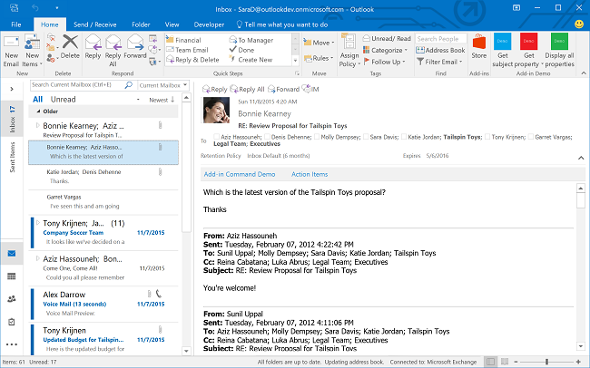

# Visão geral dos suplementos do Outlook

Os suplementos do Outlook são integrações construídas por terceiros no Outlook, utilizando nossa plataforma baseada na web. Os suplementos para Outlook têm três aspectos chave:

- O mesmo suplemento e lógica de negócios funcionam em desktop (Outlook no Windows e Mac), na Web (Microsoft 365 e Outlook.com) e em dispositivos móveis.
- Os suplementos do Outlook consistem em um manifesto, que descreve como o suplemento se integra ao Outlook (por exemplo, um botão ou um painel de tarefas), e o código JavaScript/HTML, que compõe a interface do usuário e lógica de negócios do suplemento.
- Os suplementos do Outlook podem ser adquiridos na [AppSource](https://appsource.microsoft.com) ou [sideloaded](sideload-outlook-add-ins-for-testing.md) por usuários finais ou administradores.

Os suplementos Outlook são diferentes dos suplementos COM ou VSTO, que são integrações mais antigas específicas do Outlook rodando no Windows. Ao contrário dos COM suplementos, os suplementos Outlook não têm nenhum código fisicamente instalado no dispositivo do usuário ou no cliente Outlook. Para um Outlook suplemento, o Outlook lê o manifesto e conecta os controles especificados na IU, e depois carrega o JavaScript e o HTML. Todos os componentes da web são executados no contexto de um navegador em uma caixa de areia.

Os itens do Outlook que suportam suplementos incluem mensagens de email, solicitações de reuniões, respostas e cancelamentos, e compromissos. Cada suplemento do Outlook define o contexto no qual ele está disponível, incluindo os tipos de itens e se o usuário está lendo ou compondo um item.

[!INCLUDE [publish policies note](../includes/note-publish-policies.md)]

## Pontos de extensão

Os pontos de extensão são as maneiras como os suplementos se integram ao Outlook. A seguir estão as maneiras pelas quais isso pode ser feito.

- Os suplementos podem declarar botões que aparecem nas superfícies de comando em mensagens e compromissos. Para saber mais, confira [Comandos de suplemento para o Outlook](add-in-commands-for-outlook.md).

    **Suplemento com botões de comando na Faixa de Opções**

    

- Os suplementos podem desvincular correspondências de expressões regulares ou entidades detectadas em mensagens e compromissos. Para saber mais, confira [Suplementos contextuais do Outlook](contextual-outlook-add-ins.md).

    **Suplemento contextual para uma entidade realçada (um endereço)**

    

## Itens de caixa de correio disponíveis para suplementos

Os suplementos do Outlook são ativados quando o usuário está redigindo ou lendo uma mensagem ou compromisso, mas não em outros tipos de item. Entretanto, os suplementos *não* são ativados se o item de mensagem atual, em um formulário de redação ou de leitura, estiver em uma das seguintes situações:

- Protegido por IRM (Gerenciamento de Direitos de Informação) ou criptografado de outras maneiras para proteção. Uma mensagem assinada digitalmente é um exemplo, já que a assinatura digital se baseia em um desses mecanismos.

  > [!IMPORTANT]
  >
  > - Os suplementos são ativados em mensagens assinadas digitalmente no Outlook associadas a uma assinatura do Microsoft 365. No Windows, esse suporte foi introduzido com a compilação 8711.1000.
  >
  > - A partir do Outlook, build 13229.10000, no Windows, os suplementos agora podem ser ativados nos itens protegidos por IRM. Para obter mais informações sobre este recurso em visualização prévia, consultar[ Ativação de suplementos em itens protegidos pelo Gerenciamento de Direitos de Informação (IRM)](/javascript/api/requirement-sets/outlook/preview-requirement-set/outlook-requirement-set-preview#add-in-activation-on-items-protected-by-information-rights-management-irm).

- Um relatório de entrega ou notificação que tem a classe de mensagem IPM.Report.*, incluindo NDRs (notificações de falha na entrega) e notificações de leitura, falha na leitura e atraso.

- Um arquivo .msg que é um anexo de outra mensagem.

- Um arquivo .msg aberto no sistema de arquivos.

- Em uma [caixa de correio de grupo](/microsoft-365/admin/create-groups/compare-groups?view=o365-worldwide&preserve-view=true#shared-mailboxes), em uma caixa de correio compartilhada\*, em uma caixa de correio de outro usuário\*, em uma [caixa de correio de arquivo](/office365/servicedescriptions/exchange-online-archiving-service-description/archive-features#archive-mailbox), ou em uma pasta pública.

  > [!IMPORTANT]
  > \* Suporte para cenários de acesso de delegados (por exemplo, pastas compartilhadas da caixa de correio de outro usuário) foi introduzido no [conjunto de requisitos 1.8](/javascript/api/requirement-sets/outlook/requirement-set-1.8/outlook-requirement-set-1.8). Suporte a caixas de correio compartilhada está agora em visualização. Para saber mais, consultar [Habilitar pastas compartilhadas e cenários de caixas de correio compartilhada](delegate-access.md).

- Usando um formulário personalizado.

- Criado através de [MAPI simples](https://support.microsoft.com/topic/a3d3f856-eaf6-b6d8-3617-186c0a1123c5). O MAPI simples é usado quando um usuário do Office cria ou envia um email de um aplicativo do Office no Windows com o Outlook fechado. Por exemplo, um usuário pode criar um email do Outlook enquanto trabalha no Word, o que dispara uma janela de composição do Outlook sem iniciar o aplicativo Outlook completo. No entanto, se o Outlook já estiver em execução quando o usuário criar o email a partir do Word, esse não será um cenário MAPI simples para que os suplementos do Outlook funcionem no formulário de composição, desde que outros requisitos de ativação sejam atendidos.

Em geral, o Outlook pode ativar suplementos no formato de leitura para itens na pasta Itens Enviados, com exceção dos suplementos que são ativados baseados em cadeias de correspondências de entidades conhecidas. Para saber mais sobre os motivos por trás disso, confira "Suporte para entidades conhecidas" em [Corresponder cadeias em um item do Outlook como entidades conhecidas](match-strings-in-an-item-as-well-known-entities.md).

Atualmente, há considerações adicionais ao projetar e implementar suplementos para clientes móveis. Para saber mais, consulte [Adicionar suporte móvel a um suplemento do Outlook](add-mobile-support.md#compose-mode-and-appointments).

## Clientes com suporte

Suplementos do Outlook são compatíveis com o Outlook 2013 ou posterior no Windows, Outlook 2016 ou posterior no Mac, Outlook na Web para Exchange 2013 no local e versões posteriores, Outlook no iOS, Outlook no Android e Outlook na Web e Outlook.com. Nem todos os recursos mais recentes são compatíveis com todos os [clientes](/javascript/api/requirement-sets/outlook/outlook-api-requirement-sets#requirement-sets-supported-by-exchange-servers-and-outlook-clients) ao mesmo tempo. Confira os artigos e as referências de API para esses recursos e saiba com quais aplicativos eles podem ou não ter compatibilidade.

## Introdução à criação de suplementos do Outlook

Para começar a construir suplementos do Outlook, tente o seguinte:

- [Início Rápido](../quickstarts/outlook-quickstart.md) - Criar um painel de tarefas simples.
- [Tutorial](../tutorials/outlook-tutorial.md) : saiba como criar um suplemento que insere gists do GitHub em uma nova mensagem.

## Confira também

- [Saiba mais sobre o Programa para Desenvolvedores do Microsoft 365](https://developer.microsoft.com/microsoft-365/dev-program)
- [Práticas recomendadas para o desenvolvimento de suplementos do Office](../concepts/add-in-development-best-practices.md)
- [Diretrizes de design para Suplementos do Office](../design/add-in-design.md)
- [Licenciar suplementos do Office e do SharePoint](/office/dev/store/license-your-add-ins)
- [Publicar seu Suplemento do Office](../publish/publish.md)
- [Disponibilizar suas soluções no AppSource e no Office](/office/dev/store/submit-to-the-office-store)
