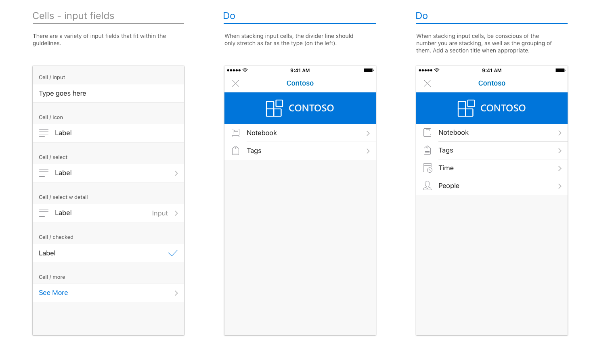
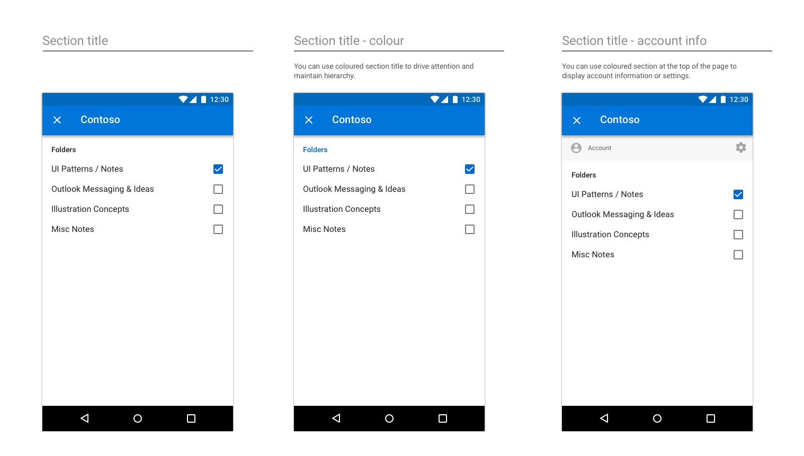
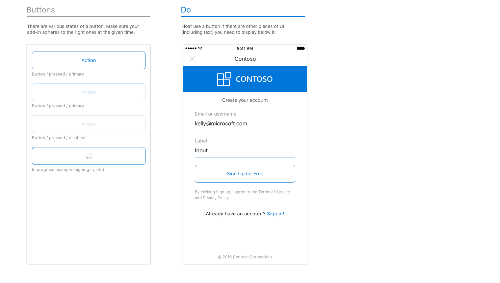
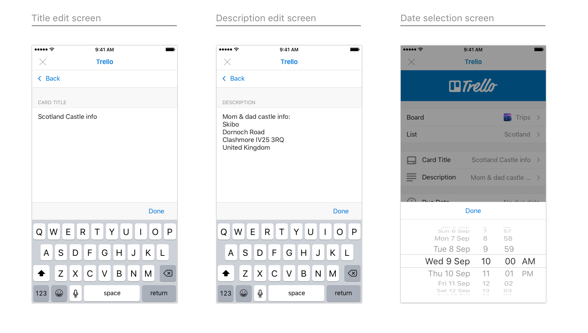

# Diretrizes de design de suplementos do OutlookOutlook add-in design guidelines

Os suplementos são uma ótima maneira de os parceiros estenderem a funcionalidade do Outlook para além do conjunto de recursos base. Os suplementos permitem que os usuários acessem experiências, tarefas e conteúdo de terceiros sem precisar sair da caixa de entrada. Uma vez instalados, os suplementos do Outlook estão disponíveis em todos os dispositivos e plataformas.Add-ins are a great way for partners to extend the functionality of Outlook beyond our core feature set. Add-ins enable users to access third-party experiences, tasks, and content without needing to leave their inbox. Once installed, Outlook add-ins are available on every platform and device.  

As seguintes diretrizes gerais o ajudarão a projetar e construir um suplemento atraente, que oferece o melhor do seu aplicativo diretamente para o Outlook – no Windows, na Web, no iOS, no Mac e no Android.The following high-level guidelines will help you design and build a compelling add-in, which brings the best of your app right into Outlook&mdash;on Windows, Web, iOS, Mac, and Android.

## PrincípiosPrinciples

1. **Se concentrar em algumas tarefas importantes. Realizá-las bem****Focus on a few key tasks; do them well**

   Os suplementos melhor projetados são fáceis de usar, concentrados e agregam valor real para os usuários. Como seu suplemento será executado dentro do Outlook, há ênfase adicional colocada nesse princípio. O Outlook é um aplicativo de produtividade – é onde as pessoas vão para realizar tarefas.The best designed add-ins are simple to use, focused, and provide real value to users. Because your add-in will run inside of Outlook, there is additional emphasis placed on this principle. Outlook is a productivity app&mdash;it's where people go to get things done.

   Você será uma extensão de nossa experiência e é importante para garantir que os cenários habilitados pareçam naturais dentro do Outlook. Considere cuidadosamente os casos de uso comuns que se beneficiarão mais de ter chamadas para eles dentro das experiências de email e calendário.You will be an extension of our experience and it is important to make sure the scenarios you enable feel like a natural fit inside of Outlook. Think carefully about which of your common use cases will benefit the most from having hooks to them from within our email and calendaring experiences.

   Um suplemento não deve tentar fazer tudo o que o seu aplicativo faz. O foco deve ser nas ações usadas com mais frequência e apropriadas, no contexto do conteúdo do Outlook. Pense em seu plano de chamada à ação e esclareça o que o usuário deve fazer quando abre o painel de tarefas.An add-in should not attempt to do everything your app does. The focus should be on the most frequently used, and appropriate, actions in the context of Outlook content. Think about your call to action and make it clear what the user should do when your task pane opens.

2. **Faça com que ele fique o mais nativo possível****Make it feel as native as possible**

   O suplemento deve ser projetado usando padrões nativos da plataforma na qual o Outlook estiver em execução. Para fazer isso, respeite e implemente as diretrizes de interação e visuais estabelecidas por cada plataforma. O Outlook tem suas próprias diretrizes e elas também é importante considerá-las. Um suplemento bem projetado será uma mistura apropriada de sua experiência, da plataforma e do Outlook.Your add-in should be designed using patterns native to the platform that Outlook is running on. To achieve this, be sure to respect and implement the interaction and visual guidelines set forth by each platform. Outlook has its own guidelines and those are also important to consider. A well-designed add-in will be an appropriate blend of your experience, the platform, and Outlook.

   Isso significa que o suplemento será visualmente diferente quando for executado no Outlook no iOS em comparação com o Outlook no Android. Recomendamos que você confira o [Framework7](https://framework7.io/) como uma opção para ajudá-lo com o estilo.This does mean that your add-in will have to visually be different when it runs in Outlook on iOS versus Android. We recommend taking a look at [Framework7](https://framework7.io/) as one option to help you with styling.

3. **Torne-o agradável de usar e acerte nos detalhes****Make it enjoyable to use and get the details right**

   As pessoas gostam de usar produtos funcionais e visualmente atraentes. Você pode ajudar a garantir o sucesso de seu suplemento ao criar uma experiência na qual você considerou cuidadosamente cada interação e detalhe visual. As etapas necessárias para concluir uma tarefa devem ser claras e relevantes. O ideal é que nenhuma ação leve mais do que um ou dois cliques.People enjoy using products that are both functionally and visually appealing. You can help ensure the success of your add-in by crafting an experience where you've carefully considered every interaction and visual detail. The necessary steps to complete a task must be clear and relevant. Ideally, no action should be further than a click or two away. 
   
   Tente não tirar um usuário do contexto para concluir uma ação.Try not to take a user out of context to complete an action. Um usuário deve ter facilidade para entrar e sair de seu suplemento e voltar para o que estava fazendo antes.A user should easily be able to get in and out of your add-in and back to whatever she was doing before. Um suplemento não deve ser um destino onde se gaste muito tempo; ele deve ser um aprimoramento de nossa funcionalidade principal.An add-in is not meant to be a destination to spend a lot of time in&mdash;it is an enhancement to our core functionality. Se feito corretamente, seu suplemento nos ajudará a cumprir a meta de tornar as pessoas mais produtivas.If done properly, your add-in will help us deliver on the goal of making people more productive.

4. **Use sua marca de forma sensata****Brand wisely**

   Valorizamos uma ótima identidade visual, e sabemos que é importante proporcionar aos usuários sua experiência única. Mas sentimos que a melhor maneira de garantir o sucesso de seu suplemento é construir uma experiência intuitiva que incorpora sutilmente elementos de sua marca versus a exibição de elementos de marca persistentes ou intrusivos que apenas distraem um usuário de se mover através de seu sistema sem restrições.We value great branding, and we know it is important to provide users with your unique experience. But we feel the best way to ensure your add-in's success is to build an intuitive experience that subtly incorporates elements of your brand versus displaying persistent or obtrusive brand elements that only distract a user from moving through your system in an unencumbered manner. 
    
   Uma boa maneira de incorporar sua marca de forma significativa é utilizar as cores, os ícones e a voz de sua marca, presumindo que esses itens não entrem em conflito com os padrões da plataforma de sua preferência ou os requisitos de acessibilidade.A good way to incorporate your brand in a meaningful way is through the use of your brand colors, icons, and voice&mdash;assuming these don't conflict with the preferred platform patterns or accessibility requirements. Tente manter o foco no conteúdo e na conclusão de tarefas, não na marca.Strive to keep the focus on content and task completion, not brand attention. 
    
   > [!NOTE]
   >  Os anúncios não devem ser mostrados em suplementos no iOS ou no Android.Ads should not be shown within add-ins on iOS or Android.

## Padrões de designDesign patterns

> [!NOTE]
> Ainda que os princípios acima se apliquem a todos os pontos de extremidade/plataformas, os seguintes padrões e exemplos são específicos para suplementos de dispositivos móveis na plataforma iOS.While the above principles apply to all endpoints/platforms, the following patterns and examples are specific to mobile add-ins on the iOS platform.

Para ajudar você a criar um suplemento bem projetado, temos [modelos](../design/ux-design-pattern-templates.md) que contêm padrões iOS de dispositivos móveis que funcionam no ambiente do Outlook Mobile. Aproveitar esses padrões específicos ajudará a garantir que seu suplemento pareça nativo na plataforma iOS e no Outlook Mobile. Esses padrões também estão detalhados abaixo. Embora não seja completa, esse é o início de uma biblioteca que continuaremos a criar conforme descobrimos novos parceiros de paradigmas que gostaríamos de incluir em seus suplementos.To help you create a well-designed add-in, we have [templates](../design/ux-design-pattern-templates.md) that contain iOS mobile patterns that work within the Outlook Mobile environment. Leveraging these specific patterns will help ensure your add-in feels native to both the iOS platform and Outlook Mobile. These patterns are also detailed below. While not exhaustive, this is the start of a library that we will continue to build upon as we uncover additional paradigms partners wish to include in their add-ins.  

### Visão geralOverview

Um suplemento típico é composto pelos seguintes componentes.A typical add-in is made up of the following components.

### CarregandoLoading

Quando um usuário toca no seu suplemento, a UX deverá ser exibida o mais rapidamente possível. Se houver qualquer atraso, use uma barra de progresso ou um indicador de atividade. Uma barra de progresso deve ser usada quando o período é determinável e um indicador de atividade deve ser usado quando o período não pode ser determinado.When a user taps on your add-in, the UX should display as quickly as possible. If there is any delay, use a progress bar or activity indicator. A progress bar should be used when the amount of time is determinable and an activity indicator should be used when the amount of time is indeterminable.

**Um exemplo de páginas de carregamento no iOS****An example of loading pages on iOS**

**Um exemplo de páginas de carregamento no Android****An example of loading pages on Android**

### Entrar/Inscrever-seSign in/Sign up

Torne seu fluxo de entrada (e inscrição) simples e fácil de usar.Make your sign in (and sign up) flow straightforward and simple to use.

**Uma página de exemplo para entrar e se inscrever no iOS****An example page to sign in and sign up on iOS**

**Uma página de entrada de exemplo no Android****An example sign in page on Android**

### Barra da marcaBrand bar

A primeira tela do seu suplemento deve incluir o elemento de identidade visual. Projetada para reconhecimento, a barra de marca também ajuda a definir o contexto para o usuário. Como a barra de navegação contém o nome da sua empresa/marca, não é necessário repetir a barra de marca nas páginas seguintes.The first screen of your add-in should include your branding element. Designed for recognition, the brand bar also helps set context for the user. Because the navigation bar contains the name of your company/brand, it's unnecessary to repeat the brand bar on subsequent pages.

**Um exemplo de identidade visual no iOS****An example of branding on iOS**

**Um exemplo de identidade visual no Android****An example of branding on Android**

### MargensMargins

Margens móveis devem ser definidas para 15px (8% da tela) de cada lado, para alinhar ao iOS do Outlook e 16px de cada lado para alinhar ao Android do Outlook.Mobile margins should be set to 15px (8% of screen) for each side, to align with Outlook iOS and 16px for each side to align with Outlook Android.

### TipografiaTypography

Uso da tipografia está alinhado ao Outlook iOS e é mantido simples para facilitar a análise.Typography usage is aligned to Outlook iOS and is kept simple for scannability.

**Tipografia no iOS****Typography on iOS**

**Tipografia no Android****Typography on Android**

### Paleta de coresColor palette

O uso da cor é sutil no Outlook iOS.  Para alinhar, pedimos que o uso da cor esteja localizado nas ações e nos estados de erro, com apenas a marca de barra usando uma cor exclusiva.Color usage is subtle in Outlook iOS.  To align, we ask that usage of color is localized to actions and error states, with only the brand bar using a unique color.

### CélulasCells

Como a barra de navegação não pode ser usada para rotular uma página, use títulos de seção em páginas de etiquetas.Since the navigation bar cannot be used to label a page, use section titles to label pages.

**Exemplos de células no iOS****Examples of cells on iOS**

* * *

* * *

* * *

**Exemplos de células no Android****Examples of cells on Android**

* * *

* * *

* * *

### AçõesActions

Mesmo que o aplicativo manipule uma infinidade de ações, considere as mais importantes que deseja que o suplemento execute e concentre-se nelas.Even if your app handles a multitude of actions, think about the most important ones you want your add-in to perform, and concentrate on those.

**Exemplos de ações no iOS****Examples of actions on iOS**

* * *

**Exemplos de ações no Android****Examples of actions on Android**

* * *

### BotõesButtons

Botões são usados quando existem outros elementos UX abaixo (versus ações, onde a ação é o último elemento na tela).Buttons are used when there are other UX elements below (vs. actions, where the action is the last element on the screen).

**Exemplos de botões no iOS****Examples of buttons on iOS**

**Exemplos de botões no Android****Examples of buttons on Android**

### GuiasTabs

Guias podem auxiliar na organização do conteúdo.Tabs can aid in content organization.

**Exemplos de guias no iOS****Examples of tabs on iOS**

**Exemplos de guias no Android****Examples of tabs on Android**

### ÍconesIcons

Os ícones devem seguir o design atual do Outlook para iOS quando possível. Use nosso padrão tamanho e cor.Icons should follow the current Outlook iOS design when possible. Use our standard size and color.

**Exemplos de ícones no iOS****Examples of icons on iOS**

**Exemplos de ícones no Android****Examples of icons on Android**

## Exemplos de ponta a pontaEnd-to-end examples

Para o lançamento de nossos suplementos do Outlook Mobile v1, trabalhamos junto a nossos parceiros que estavam criando suplementos. Como uma maneira de mostrar o potencial de seus suplementos no Outlook Mobile, nosso designer reuniu fluxos de ponta a ponta de cada suplemento, aproveitando nossas diretrizes e padrões.For our v1 Outlook Mobile Add-ins launch, we worked closely with our partners who were building add-ins. As a way to showcase the potential of their add-ins on Outlook Mobile, our designer put together end-to-end flows for each add-in, leveraging our guidelines and patterns.

> [!IMPORTANT]
> Estes exemplos destinam-se a realçar o modo ideal de abordar a interação e o design visual de um suplemento e podem não corresponder exatamente aos conjuntos de recursos nas versões enviadas dos suplementos.These examples are meant to highlight the ideal way to approach both the interaction and visual design of an add-in and may not match the exact feature sets in the shipped versions of the add-ins. 

### GIPHYGIPHY

**Um exemplo do GIPHY no iOS****An example of GIPHY on iOS**

**Um exemplo do GIPHY no Android****An example of GIPHY on Android**

### NimbleNimble

**Um exemplo do Nimble no iOS****An example of Nimble on iOS**

**Um exemplo do Nimble no Android****An example of Nimble on Android**

### TrelloTrello

**Um exemplo do Trello no iOS****An example of Trello on iOS**

* * *

* * *

**Um exemplo do Trello no Android****An example of Trello on Android**

* * *

### Dynamics CRMDynamics CRM

**Um exemplo do Dynamics CRM no iOS****An example of Dynamics CRM on iOS**

**Um exemplo do Dynamics CRM no Android****An example of Dynamics CRM on Android**

