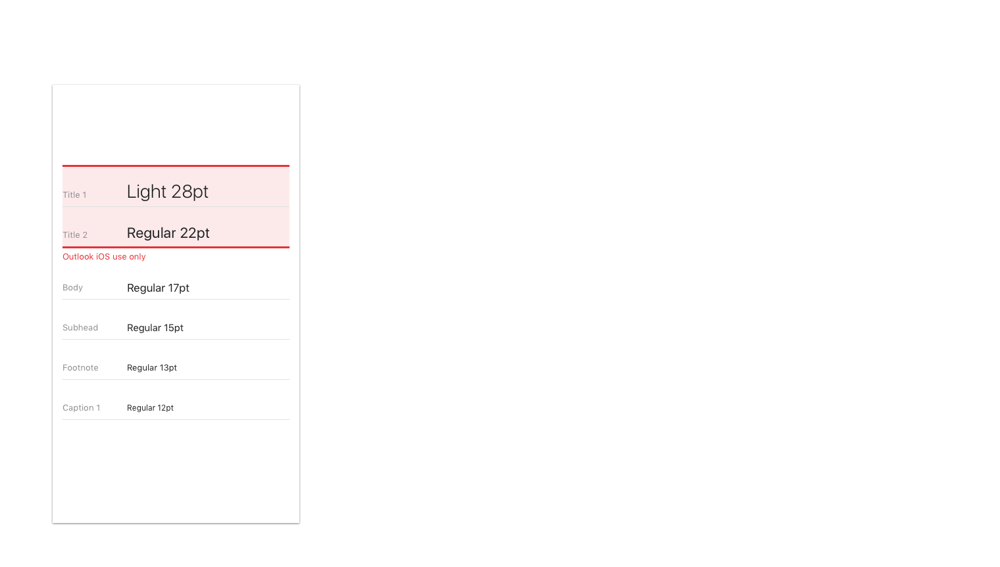
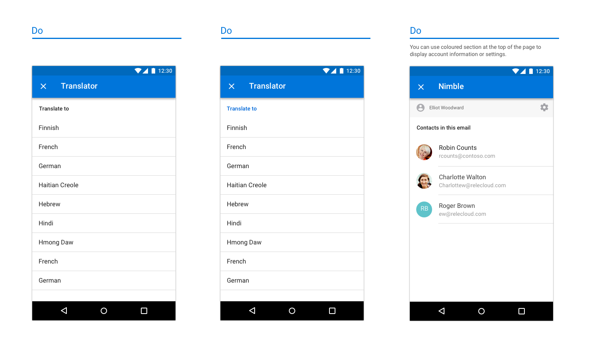
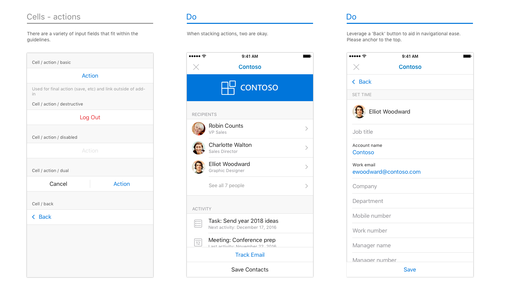
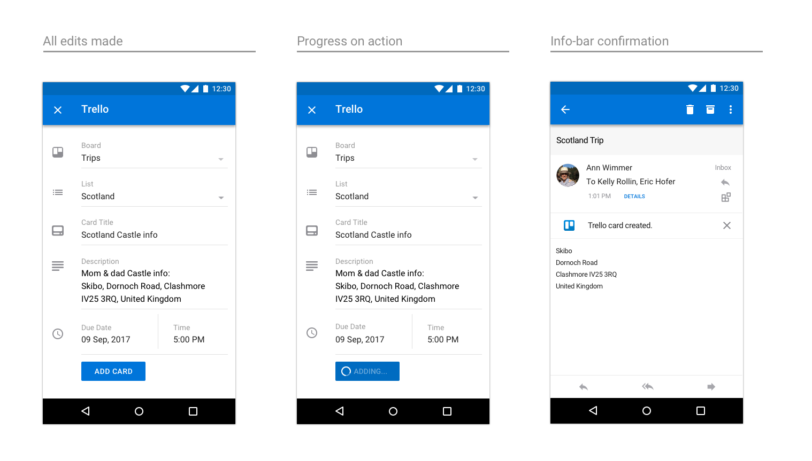

# Diretrizes de design de suplementos do Outlook

Os suplementos são uma ótima maneira de os parceiros estenderem a funcionalidade do Outlook para além do conjunto de recursos base. Os suplementos permitem que os usuários acessem experiências, tarefas e conteúdo de terceiros sem precisar sair da caixa de entrada. Uma vez instalados, os suplementos do Outlook estão disponíveis em todos os dispositivos e plataformas.  

As seguintes diretrizes gerais o ajudarão a projetar e construir um suplemento atraente, que oferece o melhor do seu aplicativo diretamente para o Outlook – no Windows, na Web, no iOS, no Mac e no Android.

## Princípios

1. **Se concentrar em algumas tarefas importantes. Realizá-las bem**

   Os suplementos melhor projetados são fáceis de usar, concentrados e agregam valor real para os usuários. Como seu suplemento será executado dentro do Outlook, há ênfase adicional colocada nesse princípio. O Outlook é um aplicativo de produtividade – é onde as pessoas vão para realizar tarefas.

   Você será uma extensão de nossa experiência e é importante para garantir que os cenários habilitados pareçam naturais dentro do Outlook. Considere cuidadosamente os casos de uso comuns que se beneficiarão mais de ter chamadas para eles dentro das experiências de email e calendário.

   Um suplemento não deve tentar fazer tudo o que o seu aplicativo faz. O foco deve ser nas ações usadas com mais frequência e apropriadas, no contexto do conteúdo do Outlook. Pense em seu plano de chamada à ação e esclareça o que o usuário deve fazer quando abre o painel de tarefas.

2. **Faça com que ele fique o mais nativo possível**

   O suplemento deve ser projetado usando padrões nativos da plataforma na qual o Outlook estiver em execução. Para fazer isso, respeite e implemente as diretrizes de interação e visuais estabelecidas por cada plataforma. O Outlook tem suas próprias diretrizes e elas também é importante considerá-las. Um suplemento bem projetado será uma mistura apropriada de sua experiência, da plataforma e do Outlook.

   Isso significa que o suplemento terá que ser visualmente diferente quando ele for executado no Outlook no iOS em comparação com o Android. 

3. **Torne-o agradável de usar e acerte nos detalhes**

   As pessoas gostam de usar produtos funcionais e visualmente atraentes. Você pode ajudar a garantir o sucesso de seu suplemento ao criar uma experiência na qual você considerou cuidadosamente cada interação e detalhe visual. As etapas necessárias para concluir uma tarefa devem ser claras e relevantes. O ideal é que nenhuma ação leve mais do que um ou dois cliques. 
   
   Tente não tirar um usuário do contexto para concluir uma ação. Um usuário deve ser capaz de entrar e sair facilmente do seu suplemento e voltar para o que estava fazendo antes. Um suplemento não deve ser um destino onde se gaste muito tempo&mdash;, ele deve ser um aprimoramento da nossa funcionalidade principal. Se feito corretamente, seu suplemento nos ajudará a cumprir a meta de tornar as pessoas mais produtivas.

4. **Use sua marca de forma sensata**

   Valorizamos uma ótima identidade visual, e sabemos que é importante proporcionar aos usuários sua experiência única. Mas sentimos que a melhor maneira de garantir o sucesso de seu suplemento é construir uma experiência intuitiva que incorpora sutilmente elementos de sua marca versus a exibição de elementos de marca persistentes ou intrusivos que apenas distraem um usuário de se mover através de seu sistema sem restrições. 
    
   Uma boa maneira de incorporar sua marca de forma significativa é utilizar as cores, os ícones e a voz da sua marca&mdash;, presumindo que esses itens não entrem em conflito com os padrões da plataforma de sua preferência ou os requisitos de acessibilidade Tente manter o foco no conteúdo e na conclusão da tarefa, não na marca. 
    
   > [!NOTE]
   >  Os anúncios não devem ser mostrados em suplementos no iOS ou no Android.

## Padrões de design

> [!NOTE]
> Ainda que os princípios acima se apliquem a todos os pontos de extremidade/plataformas, os seguintes padrões e exemplos são específicos para suplementos de dispositivos móveis na plataforma iOS.

Para ajudar você a criar um suplemento bem projetado, temos [modelos](../design/ux-design-pattern-templates.md) que contêm padrões iOS de dispositivos móveis que funcionam no ambiente do Outlook Mobile. Aproveitar esses padrões específicos ajudará a garantir que seu suplemento pareça nativo na plataforma iOS e no Outlook Mobile. Esses padrões também estão detalhados abaixo. Embora não seja completa, esse é o início de uma biblioteca que continuaremos a criar conforme descobrimos novos parceiros de paradigmas que gostaríamos de incluir em seus suplementos.  

### Visão geral

Um suplemento típico é composto pelos seguintes componentes.

### Carregando

Quando um usuário toca no seu suplemento, a UX deverá ser exibida o mais rapidamente possível. Se houver qualquer atraso, use uma barra de progresso ou um indicador de atividade. Uma barra de progresso deve ser usada quando o período é determinável e um indicador de atividade deve ser usado quando o período não pode ser determinado.

**Um exemplo de páginas de carregamento no iOS**

**Um exemplo de páginas de carregamento no Android**

### Entrar/Inscrever-se

Torne seu fluxo de entrada (e inscrição) simples e fácil de usar.

**Uma página de exemplo para entrar e se inscrever no iOS**

**Uma página de entrada de exemplo no Android**

### Barra da marca

A primeira tela do seu suplemento deve incluir o elemento de identidade visual. Projetada para reconhecimento, a barra de marca também ajuda a definir o contexto para o usuário. Como a barra de navegação contém o nome da sua empresa/marca, não é necessário repetir a barra de marca nas páginas seguintes.

**Um exemplo de identidade visual no iOS**

**Um exemplo de identidade visual no Android**

### Margens

Margens móveis devem ser definidas para 15px (8% da tela) de cada lado, para alinhar ao iOS do Outlook e 16px de cada lado para alinhar ao Android do Outlook.

### Tipografia

Uso da tipografia está alinhado ao Outlook iOS e é mantido simples para facilitar a análise.

**Tipografia no iOS**

**Tipografia no Android**

### Paleta de cores

O uso da cor é sutil no Outlook iOS.  Para alinhar, pedimos que o uso da cor esteja localizado nas ações e nos estados de erro, com apenas a marca de barra usando uma cor exclusiva.

### Células

Como a barra de navegação não pode ser usada para rotular uma página, use títulos de seção em páginas de etiquetas.

**Exemplos de células no iOS**

* * *

* * *

* * *

**Exemplos de células no Android**

* * *

* * *

* * *

### Ações

Mesmo que o aplicativo manipule uma infinidade de ações, considere as mais importantes que deseja que o suplemento execute e concentre-se nelas.

**Exemplos de ações no iOS**

* * *

**Exemplos de ações no Android**

* * *

### Botões

Botões são usados quando existem outros elementos UX abaixo (versus ações, onde a ação é o último elemento na tela).

**Exemplos de botões no iOS**

**Exemplos de botões no Android**

### Guias

Guias podem auxiliar na organização do conteúdo.

**Exemplos de guias no iOS**

**Exemplos de guias no Android**

### Ícones

Os ícones devem seguir o design atual do Outlook para iOS quando possível. Use nosso padrão tamanho e cor.

**Exemplos de ícones no iOS**

**Exemplos de ícones no Android**

## Exemplos de ponta a ponta

Para o lançamento de nossos suplementos do Outlook Mobile v1, trabalhamos junto a nossos parceiros que estavam criando suplementos. Como uma maneira de mostrar o potencial de seus suplementos no Outlook Mobile, nosso designer reuniu fluxos de ponta a ponta de cada suplemento, aproveitando nossas diretrizes e padrões.

> [!IMPORTANT]
> Estes exemplos destinam-se a realçar o modo ideal de abordar a interação e o design visual de um suplemento e podem não corresponder exatamente aos conjuntos de recursos nas versões enviadas dos suplementos. 

### GIPHY

**Um exemplo do GIPHY no iOS**

**Um exemplo do GIPHY no Android**

### Nimble

**Um exemplo do Nimble no iOS**

**Um exemplo do Nimble no Android**

### Trello

**Um exemplo do Trello no iOS**

* * *

* * *

**Um exemplo do Trello no Android**

* * *

### Dynamics CRM

**Um exemplo do Dynamics CRM no iOS**

**Um exemplo do Dynamics CRM no Android**

