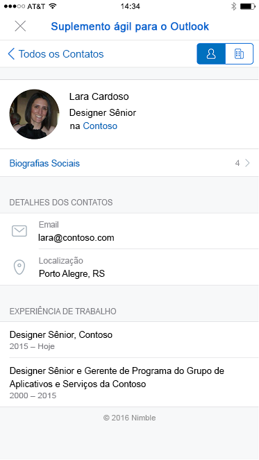
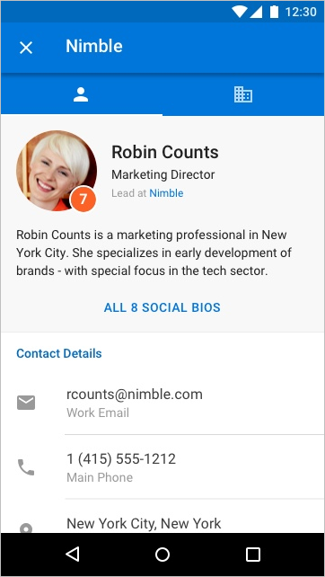

# Suplementos do Outlook Mobile

Os suplementos agora funcionam no Outlook Mobile, usando as mesmas APIs disponíveis para outros pontos de extremidade do Outlook. Se você já tiver criado um suplemento para Outlook, é fácil fazê-lo funcionar no Outlook Mobile.

Outlook de dispositivos móveis são suportados em todas as contas Microsoft 365 e contas Outlook.com. No entanto, o suporte não está disponível atualmente em contas do Gmail.

**Um painel de tarefas de exemplo no Outlook no iOS**

 

**Um painel de tarefas de exemplo no Outlook no Android**

## Qual é a diferença no celular?

- O tamanho pequeno e as rápidas interações tornam o projeto para celular um desafio. Para garantir experiências de qualidade para nossos clientes, estamos definindo critérios rígidos de validação que devem ser cumpridos por um suplemento que declara suporte a celular de forma a ser aprovado na AppSource.
  - O suplemento **DEVE** cumprir as [diretrizes de interface do usuário](outlook-addin-design.md).
  - O cenário do suplemento **DEVE** [fazer sentido no mobile](#what-makes-a-good-scenario-for-mobile-add-ins).

- Em geral, apenas o modo De Leitura de Mensagem é suportado no momento. Isso significa `MobileMessageReadCommandSurface` que é o único [ExtensionPoint](../reference/manifest/extensionpoint.md#mobilemessagereadcommandsurface) que você deve declarar na seção móvel do manifesto. No entanto, o modo Organizador de Compromissos é suportado para os complementos integrados do provedor de reuniões online que, em vez disso, declaram o ponto de extensão [MobileOnlineMeetingCommandSurface](../reference/manifest/extensionpoint.md#mobileonlinemeetingcommandsurface). Consulte o [artigo Criar um Outlook](online-meeting.md) para um provedor de reunião online para saber mais sobre esse cenário.

- A API [makeEwsRequestAsync](../reference/objectmodel/preview-requirement-set/office.context.mailbox.md#methods) não é suportada no celular, já que o aplicativo móvel usa APIs REST para se comunicar com o servidor. Se seu back-end do aplicativo precisa se conectar ao servidor do Exchange, é possível usar o token de retorno de chamada para fazer chamadas de API REST. Para obter detalhes, consulte [Usar APIs REST do Outlook de um suplemento do Outlook](use-rest-api.md).

- Quando você envia o suplemento para a loja com [MobileFormFactor](../reference/manifest/mobileformfactor.md) no manifesto, precisará concordar com nosso adendo de suplementos no iOS e precisará enviar sua ID de desenvolvedor Apple para verificação.

- Por fim, seu manifesto precisará declarar `MobileFormFactor` e ter os tipos corretos de [controles](../reference/manifest/control.md) e [tamanhos de ícone](../reference/manifest/icon.md) incluídos.

## O que forma um bom cenário para suplementos móveis?

Lembre-se de que o tamanho médio da sessão Outlook em um telefone é bem menor do que em um PC. Isso significa que seu suplemento deve ser rápido e o cenário deve permitir que o usuário entre, saia e prossiga com seu fluxo de email.

Estes são exemplos de cenários que fazem sentido no Outlook Mobile.

- O suplemento traz informações valiosas para o Outlook, para ajudar os usuários na triagem dos emails e a responder adequadamente. Exemplo: um suplemento CRM que permite ao usuário ver informações do cliente e compartilhar informações apropriadas.

- O suplemento agrega valor ao conteúdo do email do usuário, salvando as informações em um controle, uma colaboração ou um sistema semelhante. Exemplo: um suplemento que permite aos usuários ativar emails em itens de tarefa para acompanhamento de projetos, ou tíquetes de ajuda, para uma equipe de suporte.

**Uma interação de usuário de exemplo para criar um cartão do Trello com base em uma mensagem de email no iOS**

 

**Uma interação de usuário de exemplo para criar um cartão do Trello com base em uma mensagem de email no Android**

## Teste seus suplementos no celular

Para testar um complemento no Outlook Mobile, primeiro [fazer o sideload](sideload-outlook-add-ins-for-testing.md) de um complemento em uma conta Microsoft 365 ou Outlook.com na Web, Windows ou Mac. Certifique-se de que o manifesto está formatado corretamente para conter `MobileFormFactor` ou ele não será carregado no cliente Outlook no celular.

Depois que seu suplemento estiver funcionando, certifique-se de testá-lo em tamanhos de tela diferentes, incluindo celulares e tablets. Você deve verificar se ele atende às diretrizes de acessibilidade de contraste, tamanho da fonte e cor, bem como de usabilidade com um leitor de tela, como o VoiceOver no iOS ou TalkBack no Android.

A solução de problemas em dispositivos móveis pode ser difícil, pois você pode não ter as ferramentas com as que está acostumado. No entanto, uma opção para solucionar problemas no iOS é usar o Fiddler (confira este [tutorial sobre como usá-lo com um dispositivo iOS](https://www.telerik.com/blogs/using-fiddler-with-apple-ios-devices)).

> [!NOTE]
> Os complementos não funcionam em um Outlook em um navegador da Web no Android. Para obter informações sobre dispositivos com suporte, consulte [Requirements for running Office Add-ins](../concepts/requirements-for-running-office-add-ins.md#client-requirements-non-windows-smartphone-and-tablet).

## Próximas etapas

Saiba como:

- [Adicionar suporte móvel ao manifesto do seu suplemento](add-mobile-support.md).
- [Projetar uma ótima experiência móvel para seu suplemento](outlook-addin-design.md).
- [Obter um token de acesso e chamar APIs REST do Outlook](use-rest-api.md) do suplemento.
