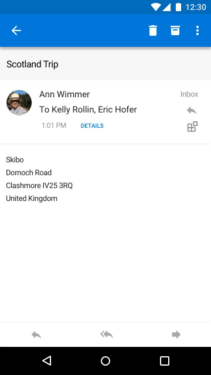

# Suplementos do Outlook MobileAdd-ins for Outlook Mobile

Add-ins now work on Outlook Mobile, using the same APIs available for other Outlook endpoints.Add-ins now work on Outlook Mobile, using the same APIs available for other Outlook endpoints. If you've built an add-in for Outlook already, it's easy to get it working on Outlook Mobile.If you've built an add-in for Outlook already, it's easy to get it working on Outlook Mobile.

Os suplementos do Outlook Mobile têm suporte em todas as contas de negócios do Microsoft 365, contas do Outlook.com e o suporte é disponibilizado em breve para contas do gmail.Outlook mobile add-ins are supported on all Microsoft 365 business accounts, Outlook.com accounts, and support is coming soon to Gmail accounts.

**Um painel de tarefas de exemplo no Outlook no iOS****An example task pane in Outlook on iOS**

 

**Um painel de tarefas de exemplo no Outlook no Android****An example task pane in Outlook on Android**

> [!IMPORTANT]
> Os suplementos não funcionam na versão moderna do Outlook em um navegador móvel.Add-ins don't work in the modern version of Outlook in a mobile browser. Para obter mais informações, consulte [Outlook em seu navegador móvel está sendo atualizado](https://techcommunity.microsoft.com/t5/outlook-blog/outlook-on-your-mobile-browser-is-being-upgraded/ba-p/1125816).For more information, see [Outlook on your mobile browser is being upgraded](https://techcommunity.microsoft.com/t5/outlook-blog/outlook-on-your-mobile-browser-is-being-upgraded/ba-p/1125816).

## Qual é a diferença no celular?What's different on mobile?

- The small size and quick interactions make designing for mobile a challenge.The small size and quick interactions make designing for mobile a challenge. To ensure quality experiences for our customers, we are setting strict validation criteria that must be met by an add-in declaring mobile support, in order to be approved in AppSource.To ensure quality experiences for our customers, we are setting strict validation criteria that must be met by an add-in declaring mobile support, in order to be approved in AppSource.
    - O suplemento **DEVE** cumprir as [diretrizes de interface do usuário](outlook-addin-design.md).The add-in **MUST** adhere to the [UI guidelines](outlook-addin-design.md).
    - O cenário do suplemento **DEVE** [fazer sentido no mobile](#what-makes-a-good-scenario-for-mobile-add-ins).The scenario for the add-in **MUST** [make sense on mobile](#what-makes-a-good-scenario-for-mobile-add-ins).

- Em geral, só há suporte para o modo de leitura de mensagens no momento.In general, only Message Read mode is supported at this time. Isso significa que `MobileMessageReadCommandSurface` é o único [ExtensionPoint](../reference/manifest/extensionpoint.md#mobilemessagereadcommandsurface) que você deve declarar na seção móvel do seu manifesto.That means `MobileMessageReadCommandSurface` is the only [ExtensionPoint](../reference/manifest/extensionpoint.md#mobilemessagereadcommandsurface) you should declare in the mobile section of your manifest. No entanto, o modo organizador de compromissos tem suporte para suplementos integrados de provedor de reunião online que, em vez disso, declare o [ponto de extensão MobileOnlineMeetingCommandSurface](../reference/manifest/extensionpoint.md#mobileonlinemeetingcommandsurface-preview).However, Appointment Organizer mode is supported for online meeting provider integrated add-ins which instead declare the [MobileOnlineMeetingCommandSurface extension point](../reference/manifest/extensionpoint.md#mobileonlinemeetingcommandsurface-preview). Confira o artigo [criar um suplemento do Outlook Mobile para um provedor de reunião online](online-meeting.md) para saber mais sobre esse cenário.See the [Create an Outlook mobile add-in for an online-meeting provider](online-meeting.md) article for more about this scenario.

- The [makeEwsRequestAsync](../reference/objectmodel/preview-requirement-set/office.context.mailbox.md#methods) API is not supported on mobile since the mobile app uses REST APIs to communicate with the server.The [makeEwsRequestAsync](../reference/objectmodel/preview-requirement-set/office.context.mailbox.md#methods) API is not supported on mobile since the mobile app uses REST APIs to communicate with the server. If your app backend needs to connect to the Exchange server, you can use the callback token to make REST API calls.If your app backend needs to connect to the Exchange server, you can use the callback token to make REST API calls. For details, see [Use the Outlook REST APIs from an Outlook add-in](use-rest-api.md).For details, see [Use the Outlook REST APIs from an Outlook add-in](use-rest-api.md).

- Quando você envia o suplemento para a loja com [MobileFormFactor](../reference/manifest/mobileformfactor.md) no manifesto, precisará concordar com nosso adendo de suplementos no iOS e precisará enviar sua ID de desenvolvedor Apple para verificação.When you submit your add-in to the store with [MobileFormFactor](../reference/manifest/mobileformfactor.md) in the manifest, you'll need to agree to our developer addendum for add-ins on iOS, and you must submit your Apple Developer ID for verification.

- Por fim, seu manifesto precisará declarar `MobileFormFactor` e ter os tipos corretos de [controles](../reference/manifest/control.md) e [tamanhos de ícone](../reference/manifest/icon.md) incluídos.Finally, your manifest will need to declare `MobileFormFactor`, and have the correct types of [controls](../reference/manifest/control.md) and [icon sizes](../reference/manifest/icon.md) included.

## O que forma um bom cenário para suplementos móveis?What makes a good scenario for mobile add-ins?

Remember that the average Outlook session length on a phone is much shorter than on a PC.Remember that the average Outlook session length on a phone is much shorter than on a PC. That means your add-in must be fast, and the scenario must allow the user to get in, get out, and get on with their email workflow.That means your add-in must be fast, and the scenario must allow the user to get in, get out, and get on with their email workflow.

Estes são exemplos de cenários que fazem sentido no Outlook Mobile.Here are examples of scenarios that make sense in Outlook Mobile.

- The add-in brings valuable information into Outlook, helping users triage their email and respond appropriately.The add-in brings valuable information into Outlook, helping users triage their email and respond appropriately. Example: a CRM add-in that lets the user see customer information and share appropriate information.Example: a CRM add-in that lets the user see customer information and share appropriate information.

- The add-in adds value to the user's email content by saving the information to a tracking, collaboration, or similar system.The add-in adds value to the user's email content by saving the information to a tracking, collaboration, or similar system. Example: an add-in that lets users turn emails into task items for project tracking, or help tickets for a support team.Example: an add-in that lets users turn emails into task items for project tracking, or help tickets for a support team.

**Uma interação de usuário de exemplo para criar um cartão do Trello com base em uma mensagem de email no iOS****An example user interaction to create a Trello card from an email message on iOS**

 

**Uma interação de usuário de exemplo para criar um cartão do Trello com base em uma mensagem de email no Android****An example user interaction to create a Trello card from an email message on Android**

## Teste seus suplementos no celularTesting your add-ins on mobile

To test an add-in on Outlook Mobile, you can sideload an add-in to an O365 or Outlook.com account.To test an add-in on Outlook Mobile, you can sideload an add-in to an O365 or Outlook.com account. In Outlook on the web, go to the settings gear, and choose **Manage Integrations** or **Manage Add-ins**. Near the top, click where it says **Click here to add a custom add-in** and upload your manifest.In Outlook on the web, go to the settings gear, and choose **Manage Integrations** or **Manage Add-ins**. Near the top, click where it says **Click here to add a custom add-in** and upload your manifest. Make sure your manifest is properly formatted to contain `MobileFormFactor` or it won't load.Make sure your manifest is properly formatted to contain `MobileFormFactor` or it won't load.

After your add-in is working, make sure to test it on different screen sizes, including phones and tablets.After your add-in is working, make sure to test it on different screen sizes, including phones and tablets. You should make sure it meets accessibility guidelines for contrast, font size, and color, as well as being usable with a screen reader such as VoiceOver on iOS or TalkBack on Android.You should make sure it meets accessibility guidelines for contrast, font size, and color, as well as being usable with a screen reader such as VoiceOver on iOS or TalkBack on Android.

A solução de problemas no Mobile pode ser difícil, já que você pode não ter as ferramentas para as quais você está acostumado.Troubleshooting on mobile can be hard since you may not have the tools you're used to. No entanto, uma opção de solução de problemas no iOS é usar o Fiddler (Confira [este tutorial sobre como usá-lo com um dispositivo IOS](https://www.telerik.com/blogs/using-fiddler-with-apple-ios-devices)).However, one option for troubleshooting on iOS is to use Fiddler (check out [this tutorial on using it with an iOS device](https://www.telerik.com/blogs/using-fiddler-with-apple-ios-devices)).

## Próximas etapasNext steps

Saiba como:Learn how to:

- [Adicionar suporte móvel ao manifesto do seu suplemento](add-mobile-support.md).[Add mobile support to your add-in's manifest](add-mobile-support.md).
- [Projetar uma ótima experiência móvel para seu suplemento](outlook-addin-design.md).[Design a great mobile experience for your add-in](outlook-addin-design.md).
- [Obter um token de acesso e chamar APIs REST do Outlook](use-rest-api.md) do suplemento.[Get an access token and call Outlook REST APIs](use-rest-api.md) from your add-in.
