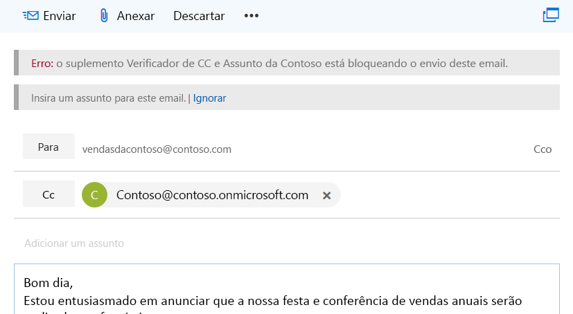
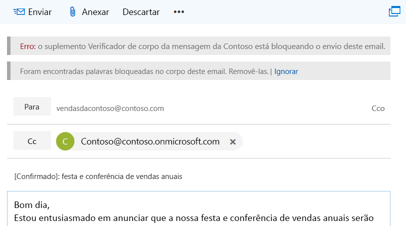

# <a name="on-send-feature-for-outlook-add-ins"></a>Recurso Ao enviar para suplementos do Outlook

O recurso Ao enviar para suplementos do Outlook fornece uma maneira de manipular uma mensagem ou item de reunião, ou impede que usuários realizem determinadas ações e permite que um suplemento defina determinadas propriedades ao enviar. Por exemplo, você pode usar o recurso Ao enviar para:

- Impedir que um usuário envie informações confidenciais ou deixe a linha de assunto em branco.  
- Adicionar um destinatário específico à linha CC em mensagens ou à linha destinatários opcionais em reuniões.

O recurso ao enviar é acionado pelo tipo de evento `ItemSend` e é sem interface de usuário.

Para obter informações sobre limitações relacionadas ao recurso Ao enviar, consulte as [Limitações](#limitations) posteriormente neste artigo.

## <a name="supported-clients-and-platforms"></a>Clientes e plataformas compatíveis

A tabela a seguir mostra combinações de cliente-servidor suportadas para o recurso de envio. Não há suporte para combinações excluídas.

| Client | Exchange Online | Exchange 2016 local<br>(Atualização cumulativa 6 ou posterior) | Exchange 2019 local<br>(Atualização cumulativa 1 ou posterior) |
|---|:---:|:---:|:---:|
|Windows:<br>versão 1910 (Build 12130,20272) ou posterior|Sim|Sim|Sim|
|MacOS<br>Build 16,30 ou posterior|Sim|Não|Não|
|Navegador da Web:<br>interface do usuário moderna do Outlook|Sim|Não aplicável|Não aplicável|
|Navegador da Web:<br>IU clássica do Outlook|Não aplicável|Sim|Sim|

> [!NOTE]
> O recurso ao enviar foi lançado no conjunto de requisitos 1,8 (Confira [suporte atual a servidor e cliente](../reference/requirement-sets/outlook-api-requirement-sets.md#requirement-sets-supported-by-exchange-servers-and-outlook-clients) para obter detalhes).

> [!IMPORTANT]
> Os suplementos que usam o recurso ao enviar não são permitidos no [AppSource](https://appsource.microsoft.com).

## <a name="how-does-the-on-send-feature-work"></a>Como o recurso Ao enviar funciona?

Você pode usar o recurso Ao enviar para criar um suplemento do Outlook que integre o evento síncrono `ItemSend`. Este evento detecta que o usuário está pressionando o botão **Enviar** (ou o botão **Enviar Atualização** para reuniões existentes) e pode ser usado para impedir que um item seja enviado se houver falha na validação. Por exemplo, quando um usuário dispara um evento de envio de mensagem, um suplemento do Outlook que usa o recurso Ao enviar pode:

- Ler e validar o conteúdo da mensagem de email
- Verificar se a mensagem inclui uma linha de assunto
- Definir um destinatário predeterminado

A validação é feita no lado do cliente no Outlook quando o evento Send é disparado e o suplemento tem até 5 minutos antes do tempo limite. Se a validação falhar, o envio do item será bloqueado e uma mensagem de erro será exibida em uma barra de informações que solicitará que o usuário execute a ação.

A captura de tela a seguir mostra uma barra de informações que notifica que o remetente adicione um assunto.

<br/>



<br/>

<br/>

A captura de tela a seguir mostra uma barra de informações que notifica que o remetente de que foram encontradas palavras bloqueadas.

<br/>



## <a name="limitations"></a>Limitações

Atualmente, o recurso Ao enviar tem as seguintes limitações.

- **AppSource** &ndash; Você não pode publicar suplementos do Outlook que usem o recurso Ao enviar no [AppSource](https://appsource.microsoft.com), pois eles falharão na validação do AppSource. Os suplementos que usam o recurso Ao enviar devem ser implantados pelos administradores.
- **Manifesto** &ndash; Somente um evento `ItemSend` tem suporte por suplemento. Se você tiver dois ou mais eventos `ItemSend` em um manifesto, haverá falha na validação.
- **Desempenho**&ndash; Várias idas e voltas ao servidor Web que hospeda o suplemento podem afetar o desempenho do suplemento. Considere os efeitos sobre o desempenho quando você cria suplemento que exigem várias mensagens ou operações baseadas em reuniões.
- **Enviar mais tarde** (somente Mac) &ndash; Se houver suplementos Ao enviar, o recurso **Enviar mais tarde** ficará indisponível.

### <a name="mailbox-typemode-limitations"></a>Limitações de tipo/modo de caixa de correio

A funcionalidade Ao enviar é compatível apenas com caixas de correio de usuários no Outlook na Web, Windows e Mac. Atualmente, a funcionalidade não tem suporte para os seguintes tipos e modos de caixa de correio.

- Caixas de correio compartilhadas\*
- Caixas de correio de grupo
- Modo offline

O Outlook não permitirá o envio se o recurso Ao enviar estiver habilitado para esses cenários de caixa de correio. No entanto, se um usuário responder a um email em uma caixa de correio de grupo, o suplemento Ao enviar não será executado e a mensagem será enviada.

> [!IMPORTANT]
> \*A funcionalidade ao enviar deve funcionar em caixas de correio compartilhadas ou pastas se o suplemento também [implementar suporte para cenários de acesso de representante](delegate-access.md).

## <a name="multiple-on-send-add-ins"></a>Vários suplementos Ao enviar

Se vários suplementos Ao enviar estiverem instalados, os suplementos serão executados na ordem em que são recebidos das APIs `getAppManifestCall` ou `getExtensibilityContext`. Se o primeiro suplemento permitir envio, o segundo suplemento poderá alterar algo que faria o primeiro bloquear o envio. No entanto, o primeiro suplemento não será executado novamente se todos os suplementos instalados tiverem permissão de envio.

Por exemplo, o Suplemento1 e o Suplemento2 usam o recurso Ao enviar. O Suplemento1 é instalado primeiro e o Suplemento2 é instalado depois. O Suplemento1 verifica se a palavra Fabrikam aparece na mensagem como uma condição para o suplemento permitir o envio.  No entanto, o Suplemento2 remove as ocorrências da palavra Fabrikam. A mensagem será enviada com todas as instâncias de Fabrikam removidas (devido à ordem de instalação do Suplemento1 e do Suplemento2).

## <a name="deploy-outlook-add-ins-that-use-on-send"></a>Implantar suplementos do Outlook que usam Ao enviar

Recomendamos que os administradores implantem suplementos do Outlook que usam o recurso Ao enviar. Os administradores precisam garantir que o suplemento Ao enviar:

- Esteja sempre presente a qualquer momento que um item de redigir é aberto (para email: novo, responder ou encaminhar).
- Não pode ser fechado ou desabilitado pelo usuário.

## <a name="install-outlook-add-ins-that-use-on-send"></a>Instalar suplementos do Outlook que usam Ao enviar

O recurso Ao enviar no Outlook exige que os suplementos sejam configurados para os tipos de eventos de envio. Selecione a plataforma que você deseja configurar.

### <a name="web-browser---classic-outlook"></a>[Navegador da Web – Outlook clássico](#tab/classic)

Os suplementos para Outlook na Web (clássicos) que usam o recurso Ao enviar serão executados para usuários aos quais é atribuída uma política de caixa de correio do Outlook na Web que tenha o sinalizador *OnSendAddinsEnabled* definido como **true**.

Para instalar um novo suplemento, execute os seguintes cmdlets do PowerShell do Exchange Online.

```powershell
$Data=Get-Content -Path '.\Contoso Message Body Checker.xml' -Encoding Byte –ReadCount 0
```

```powershell
New-App -OrganizationApp -FileData $Data -DefaultStateForUser Enabled
```

> [!NOTE]
> Para saber como usar o PowerShell para se conectar ao Exchange Online, confira [Conectar ao Exchange Online PowerShell](/powershell/exchange/exchange-online/connect-to-exchange-online-powershell/connect-to-exchange-online-powershell).

#### <a name="enable-the-on-send-feature"></a>Habilitar o recurso Ao enviar

Por padrão, a funcionalidade Ao enviar está desabilitada. Os administradores podem habilitar a funcionalidade Ao enviar executando os cmdlets do PowerShell do Exchange Online.

Para habilitar suplementos Ao enviar para todos os usuários:

1. Criar uma nova política de caixa de correio do Outlook na Web.

   ```powershell
    New-OWAMailboxPolicy OWAOnSendAddinAllUserPolicy
   ```

    > [!NOTE]
    > Os administradores podem usar uma diretiva existente, mas a funcionalidade Ao enviar tem suporte apenas para certos tipos de caixa de correio. As caixas de correio sem suporte serão impedidas de enviar por padrão no Outlook na Web.

2. Habilitar o recurso Ao enviar.

   ```powershell
    Get-OWAMailboxPolicy OWAOnSendAddinAllUserPolicy | Set-OWAMailboxPolicy –OnSendAddinsEnabled:$true
   ```

3. Atribua a política aos usuários.

   ```powershell
    Get-User -Filter {RecipientTypeDetails -eq 'UserMailbox'}|Set-CASMailbox -OwaMailboxPolicy OWAOnSendAddinAllUserPolicy
   ```

#### <a name="enable-the-on-send-feature-for-a-group-of-users"></a>Habilitar o recurso Ao enviar para um grupo de usuários

Para habilitar o recurso Ao enviar para um grupo específico de usuários, as etapas são as seguintes.  Neste exemplo, um administrador deseja habilitar apenas o recurso de suplemento Ao enviar do Outlook na Web em um ambiente para usuários do Finance (em que os usuários do Finance estão no Departamento Financeiro).

1. Crie uma nova política de caixa de correio do Outlook na Web para o grupo.

   ```powershell
    New-OWAMailboxPolicy FinanceOWAPolicy
   ```

   > [!NOTE]
   > Os administradores podem usar uma política existente, mas a funcionalidade Ao enviar é compatível apenas com certos tipos de caixa de correio (consulte [Limitações de tipo de caixa de correio](#multiple-on-send-add-ins) anteriormente neste artigo para obter mais informações). As caixas de correio sem suporte serão impedidas de enviar por padrão no Outlook na Web.

2. Habilitar o recurso Ao enviar.

   ```powershell
    Get-OWAMailboxPolicy FinanceOWAPolicy | Set-OWAMailboxPolicy –OnSendAddinsEnabled:$true
   ```

3. Atribua a política aos usuários.

   ```powershell
    $targetUsers = Get-Group 'Finance'|select -ExpandProperty members
    $targetUsers | Get-User -Filter {RecipientTypeDetails -eq 'UserMailbox'}|Set-CASMailbox -OwaMailboxPolicy FinanceOWAPolicy
   ```

> [!NOTE]
> Espere até 60 minutos para a política entrar em vigor ou reinicie os Serviços de Informações da Internet (IIS). Quando a política entrar em vigor, o recurso Ao enviar será habilitado para o grupo.

#### <a name="disable-the-on-send-feature"></a>Desabilitar o recurso Ao enviar

Para desabilitar o recurso Ao enviar de um usuário ou atribuir uma política de caixa de correio do Outlook na Web que não tenha o sinalizador habilitado, execute os seguintes cmdlets. Neste exemplo, a política de caixa de correio é *ContosoCorpOWAPolicy*.

```powershell
Get-CASMailbox joe@contoso.com | Set-CASMailbox –OWAMailboxPolicy "ContosoCorpOWAPolicy"
```

> [!NOTE]
> Para saber mais sobre como usar o cmdlet **Set-OwaMailboxPolicy** para configurar as políticas de caixa de correio da Web existentes do Outlook, confira [Set-OwaMailboxPolicy](/powershell/module/exchange/client-access/Set-OwaMailboxPolicy).

Para desabilitar o recurso Ao enviar para todos os usuários que tenham uma política específica de caixa de correio do Outlook na Web atribuída, execute os seguintes cmdlets.

```powershell
Get-OWAMailboxPolicy OWAOnSendAddinAllUserPolicy | Set-OWAMailboxPolicy –OnSendAddinsEnabled:$false
```

### <a name="web-browser---modern-outlook"></a>[Navegador da Web – Outlook moderno](#tab/modern)

Os suplementos para Outlook na Web (modernos) que usam o recurso Ao enviar devem ser executados para qualquer usuário que os tenha instalado. No entanto, se os usuários precisarem executar o suplemento para atender aos padrões de conformidade, então a política de caixa de correio deve ter o sinalizador *OnSendAddinsEnabled* definido como **true**.

Para instalar um novo suplemento, execute os seguintes cmdlets do PowerShell do Exchange Online.

```powershell
$Data=Get-Content -Path '.\Contoso Message Body Checker.xml' -Encoding Byte –ReadCount 0
```

```powershell
New-App -OrganizationApp -FileData $Data -DefaultStateForUser Enabled
```

> [!NOTE]
> Para saber como usar o PowerShell para se conectar ao Exchange Online, confira [Conectar ao Exchange Online PowerShell](/powershell/exchange/exchange-online/connect-to-exchange-online-powershell/connect-to-exchange-online-powershell).

#### <a name="disable-the-on-send-policy"></a>Desabilitar a política Ao enviar

Por padrão, a política ao enviar está habilitada. Para desabilitar a política Ao enviar para um usuário ou atribuir uma política de caixa de correio do Outlook na Web que não tenha o sinalizador habilitado, execute os seguintes cmdlets. Neste exemplo, a política de caixa de correio é *ContosoCorpOWAPolicy*.

```powershell
Get-CASMailbox joe@contoso.com | Set-CASMailbox –OWAMailboxPolicy "ContosoCorpOWAPolicy"
```

> [!NOTE]
> Para saber mais sobre como usar o cmdlet **Set-OwaMailboxPolicy** para configurar as políticas de caixa de correio da Web existentes do Outlook, confira [Set-OwaMailboxPolicy](/powershell/module/exchange/client-access/Set-OwaMailboxPolicy).

Para desabilitar a política Ao enviar para todos os usuários que tenham uma política específica de caixa de correio do Outlook na Web atribuída, execute os seguintes cmdlets.

```powershell
Get-OWAMailboxPolicy OWAOnSendAddinAllUserPolicy | Set-OWAMailboxPolicy –OnSendAddinsEnabled:$false
```

#### <a name="enable-the-on-send-policy"></a>Habilitar a política Ao enviar

Os administradores podem habilitar a funcionalidade Ao enviar executando os cmdlets do PowerShell do Exchange Online.

Para habilitar suplementos Ao enviar para todos os usuários:

1. Criar uma nova política de caixa de correio do Outlook na Web.

   ```powershell
    New-OWAMailboxPolicy OWAOnSendAddinAllUserPolicy
   ```

    > [!NOTE]
    > Os administradores podem usar uma diretiva existente, mas a funcionalidade Ao enviar tem suporte apenas para certos tipos de caixa de correio. As caixas de correio sem suporte serão impedidas de enviar por padrão no Outlook na Web.

2. Habilitar o recurso Ao enviar.

   ```powershell
    Get-OWAMailboxPolicy OWAOnSendAddinAllUserPolicy | Set-OWAMailboxPolicy –OnSendAddinsEnabled:$true
   ```

3. Atribua a política aos usuários.

   ```powershell
    Get-User -Filter {RecipientTypeDetails -eq 'UserMailbox'}|Set-CASMailbox -OwaMailboxPolicy OWAOnSendAddinAllUserPolicy
   ```

#### <a name="enable-the-on-send-policy-for-a-group-of-users"></a>Habilitar a política Ao enviar para um grupo de usuários

Para habilitar a política Ao enviar para um grupo específico de usuários, as etapas são as seguintes.  Neste exemplo, um administrador apenas deseja habilitar uma política de suplemento Ao enviar do Outlook na Web em um ambiente para usuários do Finanças (em que os usuários do Finanças estão no Departamento Financeiro).

1. Crie uma nova política de caixa de correio do Outlook na Web para o grupo.

   ```powershell
    New-OWAMailboxPolicy FinanceOWAPolicy
   ```

   > [!NOTE]
   > Os administradores podem usar uma política existente, mas a funcionalidade Ao enviar é compatível apenas com certos tipos de caixa de correio (consulte [Limitações de tipo de caixa de correio](#multiple-on-send-add-ins) anteriormente neste artigo para obter mais informações). As caixas de correio sem suporte serão impedidas de enviar por padrão no Outlook na Web.

2. Habilitar a política Ao enviar.

   ```powershell
    Get-OWAMailboxPolicy FinanceOWAPolicy | Set-OWAMailboxPolicy –OnSendAddinsEnabled:$true
   ```

3. Atribua a política aos usuários.

   ```powershell
    $targetUsers = Get-Group 'Finance'|select -ExpandProperty members
    $targetUsers | Get-User -Filter {RecipientTypeDetails -eq 'UserMailbox'}|Set-CASMailbox -OwaMailboxPolicy FinanceOWAPolicy
   ```

> [!NOTE]
> Espere até 60 minutos para a política entrar em vigor ou reinicie os Serviços de Informações da Internet (IIS). Quando a política entrar em vigor, o recurso Ao enviar será aplicado ao grupo.

### <a name="windows"></a>[Windows](#tab/windows)

Os suplementos para Outlook no Windows que usam o recurso Ao enviar devem ser executados para qualquer usuário que os tenha instalado. No entanto, se os usuários precisarem executar o suplemento para atender aos padrões de conformidade, a política de grupo **Desabilitar o envio quando as extensões da Web não puderem ser carregadas** deve estar definida como **Habilitada** em cada máquina aplicável.

Para definir as políticas de caixa de correio, os administradores podem baixar a [ferramenta Modelos administrativos](https://www.microsoft.com/download/details.aspx?id=49030) e acessar os modelos administrativos mais recentes, executando o editor de Política de grupo local, **gpedit.msc**.

#### <a name="what-the-policy-does"></a>O que a política faz

Por motivos de conformidade, os administrador podem precisar garantir que os usuários não possam enviar itens de mensagem de reunião até que o último suplemento Ao enviar esteja disponível para execução. Os administradores devem habilitar a política de grupo **Desabilitar o envio quando as extensões da Web não puderem ser carregadas** para que todos os suplementos sejam atualizados a partir do Exchange e estejam disponíveis para verificar se cada item de mensagem ou de reunião atende às regras e normas esperadas ao enviar.

|Status da política|Resultado|
|---|---|
|Desabilitado|Envio permitido. É possível enviar uma mensagem ou item de reunião sem executar o suplemento Ao enviar, mesmo que o suplemento ainda não tenha sido atualizado no Exchange.|
|Habilitado|É permitido enviar somente quando o suplemento foi atualizado do Exchange; caso contrário, o envio está bloqueado.|

#### <a name="manage-the-on-send-policy"></a>Gerenciar a política Ao enviar

Por padrão, a política Ao enviar está desabilitada. Os administradores podem habilitar a política Ao enviar ao certificar-se de que a configuração de política de grupo do usuário **Desabilitar o envio quando as extensões da Web não puderem ser carregadas** esteja definida como **Habilitada**. Para desabilitar a política para um usuário, o administrador deve defini-la como **Desabilitada**. Para gerenciar essa configuração de política, você pode fazer o seguinte.

1. Baixe a [ferramenta de Modelos Administrativos](https://www.microsoft.com/download/details.aspx?id=49030) mais recente.
1. Abra o editor de Política de Grupo Local (**gpedit.msc**).
1. Navegue até **Configuração do Usuário > Modelos Administrativos > Microsoft Outlook 2016 > Segurança > Central de Confiabilidade**.
1. Marque a configuração **Desabilitar o envio quando as extensões da Web não puderem ser carregadas**.
1. Abra o link para configuração Editar política.
1. Na caixa de diálogo **Desabilitar o envio quando as extensões da Web não puderem ser carregadas**, selecione **Habilitado** ou **Desabilitado** conforme apropriado e selecione **OK** ou **Aplique** para colocar a atualização em vigor.

### <a name="mac"></a>[Mac](#tab/unix)

Os suplementos para Outlook no Mac que usam o recurso Ao enviar devem ser executados para qualquer usuário que os tenha instalado. No entanto, se os usuários precisarem executar o suplemento para atender aos padrões de conformidade, a configuração de caixa de correio a seguir deverá ser aplicada ao computador de cada usuário. Esta configuração ou chave é compatível com CFPreference. Isso significa que é possível defini-la usando um software de gerenciamento empresarial para Mac, como o Jamf Pro.

|||
|:---|:---|
|**Domínio**|com.microsoft.outlook|
|**Chave**|OnSendAddinsWaitForLoad|
|**DataType**|Booliano|
|**Valores possíveis**|falso (padrão)<br>verdadeiro|
|**Disponibilidade**|16.27|
|**Comentários**|Essa chave cria uma política de onSendMailbox.|

#### <a name="what-the-setting-does"></a>O que a configuração faz

Por motivos de conformidade, os administradores podem precisar garantir que os usuários não possam enviar itens de mensagem ou de reunião até que os suplementos estejam disponíveis para execução. Os administradores devem habilitar a chave **OnSendAddinsWaitForLoad** para que todos os suplementos sejam atualizados no Exchange e estejam disponíveis para verificar se cada item de mensagem ou de reunião atende às regras e normas esperadas ao enviar.

|Estado da chave|Resultado|
|---|---|
|falso|Envio permitido. É possível enviar uma mensagem ou item de reunião sem executar o suplemento Ao enviar, mesmo que o suplemento ainda não tenha sido atualizado no Exchange.|
|verdadeiro|É permitido enviar somente quando o suplemento foi atualizado do Exchange; caso contrário, o envio estará bloqueado e o botão **Enviar** será desabilitado.|

---

## <a name="on-send-feature-scenarios"></a>Cenários do recurso Ao enviar

Veja a seguir os cenários com suporte e sem suporte para suplementos que usam o recurso Ao enviar.

### <a name="user-mailbox-has-the-on-send-add-in-feature-enabled-but-no-add-ins-are-installed"></a>A caixa de correio do usuário tem o recurso de suplemento Ao enviar habilitado, mas nenhum suplemento está instalado

Neste cenário, o usuário poderá enviar itens de mensagem e de reunião sem nenhum suplemento em execução.

### <a name="user-mailbox-has-the-on-send-add-in-feature-enabled-and-add-ins-that-supports-on-send-are-installed-and-enabled"></a>A caixa de correio do usuário tem o recurso de suplemento Ao enviar habilitado, e os suplementos compatíveis com Ao enviar estão instalados e habilitados

Os suplementos serão executados durante o evento de envio, que em seguida permitirão ou impedirão o usuário de enviar.

### <a name="mailbox-delegation-where-mailbox-1-has-full-access-permissions-to-mailbox-2"></a>Delegação de caixa de correio, onde a caixa de correio 1 tem permissões de acesso total à caixa de correio 2

#### <a name="web-browser-classic-outlook"></a>Navegador da Web (Outlook clássico)

|Cenário|Recurso Ao enviar da caixa de correio 1|Recurso Ao enviar da caixa de correio 2|Sessão Web do Outlook (clássico)|Resultado|Com suporte?|
|:------------|:------------|:--------------------------|:---------|:-------------|:-------------|
|1 |Habilitado|Habilitado|Nova sessão|A caixa de correio 1 não consegue enviar um item de mensagem ou de reunião da caixa de correio 2.|Não há suporte atualmente. Como alternativa, use o cenário 3.|
|2 |Desabilitado|Habilitado|Nova sessão|A caixa de correio 1 não consegue enviar um item de mensagem ou de reunião da caixa de correio 2.|Não há suporte atualmente. Como alternativa, use o cenário 3.|
|3D|Habilitado|Habilitado|Mesma sessão|Os suplementos Ao enviar atribuídos à caixa de correio 1 são executados ao enviar.|Com suporte.|
|4 |Habilitado|Desabilitado|Nova sessão|Nenhum suplemento Ao envio é executado; item de mensagem ou de reunião é enviado.|Com suporte.|

#### <a name="web-browser-modern-outlook-windows-mac"></a>Navegador da Web (Outlook moderno), Windows, Mac

Para impor o Ao enviar, os administradores devem garantir que a política tenha sido habilitada nas duas caixas de correio. Para saber como oferecer suporte ao acesso de representante em um suplemento, confira [Habilitar cenários de acesso de representante em um suplemento do Outlook](delegate-access.md).

### <a name="group-1-is-a-modern-group-mailbox-and-user-mailbox-1-is-a-member-of-group-1"></a>O grupo 1 é uma caixa de correio do grupo moderna e a caixa de correio 1 do usuário é membro do grupo 1

<br/>

|Cenário|Política Ao enviar da caixa de correio 1|Suplementos Ao enviar habilitados?|Ação da caixa de correio 1|Resultado|Com suporte?|
|:------------|:-------------------------|:-------------------|:---------|:----------|:-------------|
|1 |Habilitado|Sim|A caixa de correio 1 compõe uma nova mensagem ou reunião para o grupo 1.|Os suplementos Ao enviar são executados durante o envio.|Sim|
|2 |Habilitado|Sim|A caixa de correio 1 compõe uma nova mensagem ou reunião para o grupo 1 dentro da janela de grupo do grupo 1 no Outlook na Web.|Os suplementos Ao enviar não são executados durante o envio.|Não há suporte atualmente. Como alternativa, use o cenário 1.|

### <a name="user-mailbox-with-on-send-add-in-featurepolicy-enabled-add-ins-that-support-on-send-are-installed-and-enabled-and-offline-mode-is-enabled"></a>Caixa de correio do usuário com recurso/política de suplemento Ao enviar habilitado, os suplementos com suporte à funcionalidade Ao enviar estão instalados e habilitados e o modo offline está habilitado

Os suplementos Ao enviar serão executados de acordo com o estado online do usuário, o back-end do suplemento e o Exchange.

#### <a name="users-state"></a>Estado do usuário

Os suplementos Ao enviar serão executados durante o envio se o usuário estiver online. Se o usuário estiver offline, os suplementos Ao enviar não serão executados e o item de mensagem ou de reunião não será enviado.

#### <a name="add-in-backends-state"></a>Estado do back-end do suplemento

Um suplemento Ao enviar será executado se o seu back-end estiver online e acessível. Se o back-end estiver offline, ao enviar será desabilitado.

#### <a name="exchanges-state"></a>Estado do Exchange

Os suplementos Ao enviar serão executados durante o envio se o servidor do Exchange estiver online e acessível. Se o suplemento Ao enviar não puder alcançar o Exchange e a política ou cmdlet aplicável estiverem ativados, o envio será desabilitado.

> [!NOTE]
> No Mac, em qualquer estado offline, o botão **Enviar** (ou o botão **Enviar Atualização** para reuniões existentes) está desabilitado e uma notificação é exibida informando que sua organização não permite envio quando o usuário está offline.


## <a name="code-examples"></a>Exemplos de código

Os seguintes exemplos de código mostram como criar um suplemento simples Ao enviar. Para baixar o exemplo de código em que esses exemplos se baseiam, consulte [Outlook-Add-in-On-Send](https://github.com/OfficeDev/Outlook-Add-in-On-Send).

### <a name="manifest-version-override-and-event"></a>Manifesto, versão de substituição e evento

Um exemplo de código [Outlook-Add-in-On-Send](https://github.com/OfficeDev/Outlook-Add-in-On-Send) inclui dois manifestos:

- `Contoso Message Body Checker.xml` &ndash; Mostra como verificar se o corpo de uma mensagem apresenta palavras restritas ou informações confidenciais ao enviar.  

- `Contoso Subject and CC Checker.xml` &ndash; Mostra como adicionar um destinatário à linha CC e verifica se a mensagem inclui uma linha de assunto ao enviar.  

No arquivo de manifesto `Contoso Message Body Checker.xml`, inclua o arquivo de função e o nome da função que deve ser chamada no evento `ItemSend`. A operação é executada de maneira síncrona.

```xml
<Hosts>
    <Host xsi:type="MailHost">
        <DesktopFormFactor>
            <!-- The functionfile and function name to call on message send.  -->
            <!-- In this case, the function validateBody will be called within the JavaScript code referenced in residUILessFunctionFileUrl. -->
            <FunctionFile resid="residUILessFunctionFileUrl" />
            <ExtensionPoint xsi:type="Events">
                <Event Type="ItemSend" FunctionExecution="synchronous" FunctionName="validateBody" />
            </ExtensionPoint>
        </DesktopFormFactor>
    </Host>
</Hosts>
```

> [!IMPORTANT]
> Se você estiver usando o Visual Studio 2019 para desenvolver seu suplemento ao enviar, você pode receber um aviso de validação como o seguinte: "Este é um xsi: tipo inválido ' http://schemas.microsoft.com/office/mailappversionoverrides/1.1:Events '." Para contornar isso, você precisará de uma versão mais recente do MailAppVersionOverridesV1_1. xsd que tenha sido fornecida como um serviço de GitHub em um [blog sobre esse aviso](https://theofficecontext.com/2018/11/29/visual-studio-2017-this-is-an-invalid-xsitype-mailappversionoverrides-1-1event/).

Para o arquivo de manifesto `Contoso Subject and CC Checker.xml`, o exemplo a seguir mostra o arquivo de função e o nome da função para chamar o evento de envio de mensagem.

```xml
<Hosts>
    <Host xsi:type="MailHost">
        <DesktopFormFactor>
            <!-- The functionfile and function name to call on message send.  -->
            <!-- In this case the function validateSubjectAndCC will be called within the JavaScript code referenced in residUILessFunctionFileUrl. -->
            <FunctionFile resid="residUILessFunctionFileUrl" />
            <ExtensionPoint xsi:type="Events">
                <Event Type="ItemSend" FunctionExecution="synchronous" FunctionName="validateSubjectAndCC" />
            </ExtensionPoint>
        </DesktopFormFactor>
    </Host>
</Hosts>
```

<br/>

A API Ao enviar requer `VersionOverrides v1_1`. Veja a seguir como adicionar o nó `VersionOverrides` em seu manifesto.

```xml
 <VersionOverrides xmlns="http://schemas.microsoft.com/office/mailappversionoverrides" xsi:type="VersionOverridesV1_0">
     <!-- On Send requires VersionOverridesV1_1 -->
     <VersionOverrides xmlns="http://schemas.microsoft.com/office/mailappversionoverrides/1.1" xsi:type="VersionOverridesV1_1">
         ...
     </VersionOverrides>
</VersionOverrides>
```

> [!NOTE]
> Para obter mais informações, confira o seguinte:
> - [Manifestos de suplementos do Outlook](manifests.md)
> - [VersionOverrides](../develop/create-addin-commands.md#step-3-add-versionoverrides-element)
> - [Manifesto XML dos Suplementos do Office](../overview/add-in-manifests.md)


### <a name="event-and-item-objects-and-bodygetasync-and-bodysetasync-methods"></a>Objetos `Event` e `item`, e os métodos `body.getAsync` e `body.setAsync`

Para acessar o item de mensagem ou de reunião selecionado no momento (neste exemplo, a mensagem redigida recentemente), use o namespace `Office.context.mailbox.item`. O evento `ItemSend` é passado automaticamente pelo recurso Ao enviar para a função especificada no manifesto&mdash;neste exemplo, a função `validateBody`.

```js
var mailboxItem;

Office.initialize = function (reason) {
    mailboxItem = Office.context.mailbox.item;
}

// Entry point for Contoso Message Body Checker add-in before send is allowed.
// <param name="event">ItemSend event is automatically passed by on-send code to the function specified in the manifest.</param>
function validateBody(event) {
    mailboxItem.body.getAsync("html", { asyncContext: event }, checkBodyOnlyOnSendCallBack);
}
```

A função `validateBody` obtém o corpo atual no formato especificado (HTML) e passa o objeto de evento `ItemSend` que o código deseja para acessar o método de retorno. Além do método `getAsync`, o objeto `Body` também fornece um método `setAsync` que você pode usar para substituir o corpo pelo texto especificado.

> [!NOTE]
> Para saber mais, confira [Objeto do Evento](/javascript/api/office/office.addincommands.event) e [Body.getAsync](/javascript/api/outlook/office.Body#getasync-coerciontype--options--callback-).
  

### <a name="notificationmessages-object-and-eventcompleted-method"></a>Objeto `NotificationMessages` e método `event.completed`

A função `checkBodyOnlyOnSendCallBack` usa uma expressão regular para determinar se o corpo da mensagem contém palavras bloqueadas. Se ela encontrar uma correspondência com uma matriz de palavras restritas, bloqueará os emails de serem enviados e notificará o remetente pela barra de informações. Para fazer isso, ele usa a propriedade `notificationMessages` do objeto `Item` para retornar um objeto `NotificationMessages`. Ele, em seguida, adiciona uma notificação ao item chamando o método `addAsync`, como mostrado no exemplo a seguir.

```js
// Determine whether the body contains a specific set of blocked words. If it contains the blocked words, block email from being sent. Otherwise allow sending.
// <param name="asyncResult">ItemSend event passed from the calling function.</param>
function checkBodyOnlyOnSendCallBack(asyncResult) {
    var listOfBlockedWords = new Array("blockedword", "blockedword1", "blockedword2");
    var wordExpression = listOfBlockedWords.join('|');

    // \b to perform a "whole words only" search using a regular expression in the form of \bword\b.
    // i to perform case-insensitive search.
    var regexCheck = new RegExp('\\b(' + wordExpression + ')\\b', 'i');
    var checkBody = regexCheck.test(asyncResult.value);

    if (checkBody) {
        mailboxItem.notificationMessages.addAsync('NoSend', { type: 'errorMessage', message: 'Blocked words have been found in the body of this email. Please remove them.' });
        // Block send.
        asyncResult.asyncContext.completed({ allowEvent: false });
    }

    // Allow send.
    asyncResult.asyncContext.completed({ allowEvent: true });
}
```

Veja a seguir os parâmetros para o método `addAsync`:

- `NoSend` &ndash; uma cadeia de caractere que é uma chave especificada pelo desenvolvedor para fazer referência a uma mensagem de notificação. Você pode usá-la para modificar esta mensagem mais tarde. A chave não pode ter mais de 32 caracteres.
- `type` &ndash; uma das propriedades do parâmetro de objeto JSON. Representa o tipo de uma mensagem; os tipos correspondem aos valores da enumeração [Office.MailboxEnums.ItemNotificationMessageType](/javascript/api/outlook/office.mailboxenums.itemnotificationmessagetype). Os valores possíveis são indicador de progresso, mensagem informativa ou mensagem de erro. Neste exemplo, `type` é uma mensagem de erro.  
- `message` &ndash; uma das propriedades do parâmetro de objeto JSON. Neste exemplo, `message` é o texto da mensagem de notificação.

Para sinalizar que o suplemento terminou de processar o evento `ItemSend` disparado pela operação enviar, chame o método `event.completed({allowEvent:Boolean})`. A propriedade `allowEvent` é um booleano. Se for definido como `true`, o envio será permitido. Se definido como `false`, a mensagem de email será impedida de ser enviada.

> [!NOTE]
> Para saber mais, confira [notificationMessages](../reference/objectmodel/preview-requirement-set/office.context.mailbox.item.md#properties) e [completed](/javascript/api/office/office.addincommands.event).

### <a name="replaceasync-removeasync-and-getallasync-methods"></a>Métodos `replaceAsync`, `removeAsync` e `getAllAsync`

Além do método `addAsync`, o objeto `NotificationMessages` também inclui os métodos `replaceAsync`, `removeAsync` e `getAllAsync`.  Esses métodos não são usados neste exemplo de código.  Para saber mais, veja [NotificationMessages](/javascript/api/outlook/office.NotificationMessages).


### <a name="subject-and-cc-checker-code"></a>Código do Assunto e do verificador de CC

O exemplo de código a seguir mostra como adicionar um destinatário à linha CC e verifica se a mensagem inclui um assunto ao enviar. Este exemplo usa o recurso Ao enviar para permitir ou proibir o envio de um email.  

```js
// Invoke by Contoso Subject and CC Checker add-in before send is allowed.
// <param name="event">ItemSend event is automatically passed by on-send code to the function specified in the manifest.</param>
function validateSubjectAndCC(event) {
    shouldChangeSubjectOnSend(event);
}

// Determine whether the subject should be changed. If it is already changed, allow send. Otherwise change it.
// <param name="event">ItemSend event passed from the calling function.</param>
function shouldChangeSubjectOnSend(event) {
    mailboxItem.subject.getAsync(
        { asyncContext: event },
        function (asyncResult) {
            addCCOnSend(asyncResult.asyncContext);
            //console.log(asyncResult.value);
            // Match string.
            var checkSubject = (new RegExp(/\[Checked\]/)).test(asyncResult.value)
            // Add [Checked]: to subject line.
            subject = '[Checked]: ' + asyncResult.value;

            // Determine whether a string is blank, null, or undefined.
            // If yes, block send and display information bar to notify sender to add a subject.
            if (asyncResult.value === null || (/^\s*$/).test(asyncResult.value)) {
                mailboxItem.notificationMessages.addAsync('NoSend', { type: 'errorMessage', message: 'Please enter a subject for this email.' });
                asyncResult.asyncContext.completed({ allowEvent: false });
            }
            else {
                // If can't find a [Checked]: string match in subject, call subjectOnSendChange function.
                if (!checkSubject) {
                    subjectOnSendChange(subject, asyncResult.asyncContext);
                    //console.log(checkSubject);
                }
                else {
                    // Allow send.
                    asyncResult.asyncContext.completed({ allowEvent: true });
                }
            }
        });
}

// Add a CC to the email. In this example, CC contoso@contoso.onmicrosoft.com
// <param name="event">ItemSend event passed from calling function</param>
function addCCOnSend(event) {
    mailboxItem.cc.setAsync(['Contoso@contoso.onmicrosoft.com'], { asyncContext: event });
}

// Determine whether the subject should be changed. If it is already changed, allow send, otherwise change it.
// <param name="subject">Subject to set.</param>
// <param name="event">ItemSend event passed from the calling function.</param>
function subjectOnSendChange(subject, event) {
    mailboxItem.subject.setAsync(
        subject,
        { asyncContext: event },
        function (asyncResult) {
            if (asyncResult.status == Office.AsyncResultStatus.Failed) {
                mailboxItem.notificationMessages.addAsync('NoSend', { type: 'errorMessage', message: 'Unable to set the subject.' });

                // Block send.
                asyncResult.asyncContext.completed({ allowEvent: false });
            }
            else {
                // Allow send.
                asyncResult.asyncContext.completed({ allowEvent: true });
            }
        });
}
```

Para saber mais sobre como adicionar um destinatário à linha CC e verificar se a mensagem de e-mail inclui uma linha de assunto ao enviar e para ver as APIs que você pode usar, consulte o [exemplo Outlook-Add-in-On-Send](https://github.com/OfficeDev/Outlook-Add-in-On-Send). O código é bem comentado.

## <a name="see-also"></a>Confira também

- [Visão geral da arquitetura e dos recursos de suplementos do Outlook](outlook-add-ins-overview.md)
- [Suplemento do Outlook para demonstração de comando de suplemento](https://github.com/OfficeDev/outlook-add-in-command-demo)
