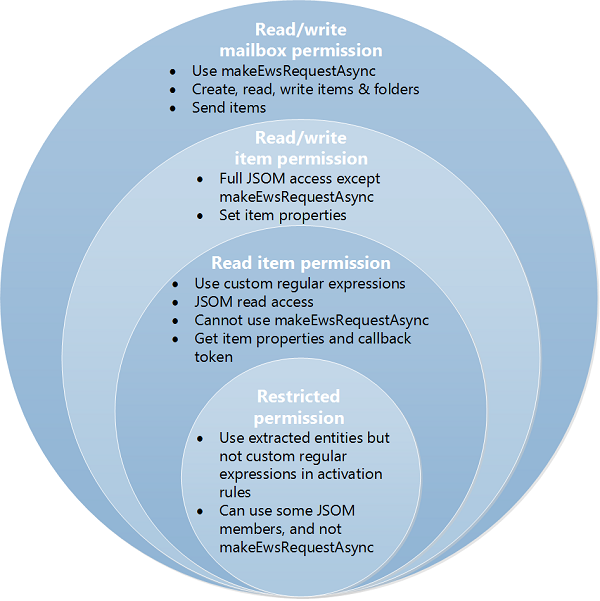

# <a name="privacy-permissions-and-security-for-outlook-add-ins"></a><span data-ttu-id="17119-103">Privacidade, permissões e segurança de suplementos do Outlook</span><span class="sxs-lookup"><span data-stu-id="17119-103">Privacy, permissions, and security for Outlook add-ins</span></span>

<span data-ttu-id="17119-104">Usuários finais, desenvolvedores e administradores podem usar os níveis de permissões em camadas do modelo de segurança para suplementos do Outlook a fim de controlar a privacidade e o desempenho.</span><span class="sxs-lookup"><span data-stu-id="17119-104">End users, developers, and administrators can use the tiered permission levels of the security model for Outlook add-ins to control privacy and performance.</span></span>

<span data-ttu-id="17119-105">Este artigo descreve as possíveis permissões que os suplementos do Outlook podem solicitar e examina o modelo de segurança das seguintes perspectivas:</span><span class="sxs-lookup"><span data-stu-id="17119-105">This article describes the possible permissions that Outlook add-ins can request, and examines the security model from the following perspectives:</span></span>

- <span data-ttu-id="17119-106">**AppSource**: integridade do suplemento</span><span class="sxs-lookup"><span data-stu-id="17119-106">**AppSource**: add-in integrity</span></span>

- <span data-ttu-id="17119-107">**Usuários finais**: questões de privacidade e desempenho</span><span class="sxs-lookup"><span data-stu-id="17119-107">**End-users**: privacy and performance concerns</span></span>

- <span data-ttu-id="17119-108">**Desenvolvedores**: opções de permissões e limites de uso do recurso</span><span class="sxs-lookup"><span data-stu-id="17119-108">**Developers**: permissions choices and resource usage limits</span></span>

- <span data-ttu-id="17119-109">**Administradores**: privilégios para definir limites de desempenho</span><span class="sxs-lookup"><span data-stu-id="17119-109">**Administrators**: privileges to set performance thresholds</span></span>

## <a name="permissions-model"></a><span data-ttu-id="17119-110">Modelo de permissões</span><span class="sxs-lookup"><span data-stu-id="17119-110">Permissions model</span></span>

<span data-ttu-id="17119-p101">Como a percepção dos clientes de segurança do suplemento pode afetar a sua adoção, a segurança do suplemento do Outlook conta com um modelo de permissões hierárquico. Um suplemento do Outlook divulga o nível de permissões necessárias, identificando os possíveis acessos e ações que o suplemento pode realizar em dados da caixa de correio do cliente.</span><span class="sxs-lookup"><span data-stu-id="17119-p101">Because customers' perception of add-in security can affect add-in adoption, Outlook add-in security relies on a tiered permissions model. An Outlook add-in would disclose the level of permissions it needs, identifying the possible access and actions that the add-in can make on the customer's mailbox data.</span></span>

<span data-ttu-id="17119-113">A versão 1.1 do esquema do manifesto inclui quatro níveis de permissões.</span><span class="sxs-lookup"><span data-stu-id="17119-113">Manifest schema version 1.1 includes four levels of permissions.</span></span>

<span data-ttu-id="17119-114">**Tabela 1. Níveis de permissão do suplemento**</span><span class="sxs-lookup"><span data-stu-id="17119-114">**Table 1. Add-in permission levels**</span></span>

|<span data-ttu-id="17119-115">**Nível de permissão**</span><span class="sxs-lookup"><span data-stu-id="17119-115">**Permission level**</span></span>|<span data-ttu-id="17119-116">**Valor no manifesto de suplemento do Outlook**</span><span class="sxs-lookup"><span data-stu-id="17119-116">**Value in Outlook add-in manifest**</span></span>|
|:-----|:-----|
|<span data-ttu-id="17119-117">Restricted</span><span class="sxs-lookup"><span data-stu-id="17119-117">Restricted</span></span>|<span data-ttu-id="17119-118">Restricted</span><span class="sxs-lookup"><span data-stu-id="17119-118">Restricted</span></span>|
|<span data-ttu-id="17119-119">Leitura de item</span><span class="sxs-lookup"><span data-stu-id="17119-119">Read item</span></span>|<span data-ttu-id="17119-120">ReadItem</span><span class="sxs-lookup"><span data-stu-id="17119-120">ReadItem</span></span>|
|<span data-ttu-id="17119-121">Leitura/gravação de item</span><span class="sxs-lookup"><span data-stu-id="17119-121">Read/write item</span></span>|<span data-ttu-id="17119-122">ReadWriteItem</span><span class="sxs-lookup"><span data-stu-id="17119-122">ReadWriteItem</span></span>|
|<span data-ttu-id="17119-123">Leitura/gravação de caixa de correio</span><span class="sxs-lookup"><span data-stu-id="17119-123">Read/write mailbox</span></span>|<span data-ttu-id="17119-124">ReadWriteMailbox</span><span class="sxs-lookup"><span data-stu-id="17119-124">ReadWriteMailbox</span></span>|

<span data-ttu-id="17119-125">Os quatro níveis de permissão são cumulativos: a permissão **leitura/gravação de caixa de correio** inclui as permissões **leitura/gravação de item**, **leitura de item** e **restrita**, **leitura/gravação de item** inclui **leitura de item** e **restrita** e a permissão **leitura de item** inclui **restrita**.</span><span class="sxs-lookup"><span data-stu-id="17119-125">The four levels of permissions are cumulative: the **read/write mailbox** permission includes the permissions of **read/write item**, **read item** and **restricted**, **read/write item** includes **read item** and **restricted**, and the **read item** permission includes **restricted**.</span></span>

<span data-ttu-id="17119-126">A figura a seguir mostra os quatro níveis de permissões e descreve os recursos oferecidos para o usuário final, para o desenvolvedor e para o administrador em cada nível.</span><span class="sxs-lookup"><span data-stu-id="17119-126">The following figure shows the four levels of permissions and describes the capabilities offered to the end user, developer, and administrator by each tier.</span></span> <span data-ttu-id="17119-127">Para saber mais sobre essas permissões, confira [Usuários finais: questões de privacidade e desempenho](#end-users-privacy-and-performance-concerns), [Desenvolvedores: opções de permissões e limites de uso de recursos](#developers-permission-choices-and-resource-usage-limits) e [Noções básicas sobre permissões de suplementos do Outlook](understanding-outlook-add-in-permissions.md).</span><span class="sxs-lookup"><span data-stu-id="17119-127">For more information about these permissions, see [End users: privacy and performance concerns](#end-users-privacy-and-performance-concerns), [Developers: permission choices and resource usage limits](#developers-permission-choices-and-resource-usage-limits), and [Understanding Outlook add-in permissions](understanding-outlook-add-in-permissions.md).</span></span>

<span data-ttu-id="17119-128">**Relacionando o modelo de quatro níveis de permissão com o usuário final, o desenvolvedor e o administrador**</span><span class="sxs-lookup"><span data-stu-id="17119-128">**Relating the four-tier permission model to the end user, developer, and administrator**</span></span>



## <a name="appsource-add-in-integrity"></a><span data-ttu-id="17119-130">AppSource: integridade do suplemento</span><span class="sxs-lookup"><span data-stu-id="17119-130">AppSource: add-in integrity</span></span>

<span data-ttu-id="17119-131">A [AppSource](https://appsource.microsoft.com) hospeda suplementos que podem ser instalados por usuários finais e administradores.</span><span class="sxs-lookup"><span data-stu-id="17119-131">[AppSource](https://appsource.microsoft.com) hosts add-ins that can be installed by end users and administrators.</span></span> <span data-ttu-id="17119-132">A AppSource impõe as seguintes medidas para manter a integridade desses suplementos do Outlook:</span><span class="sxs-lookup"><span data-stu-id="17119-132">AppSource enforces the following measures to maintain the integrity of these Outlook add-ins:</span></span>

- <span data-ttu-id="17119-133">Requer que o servidor host de um suplemento sempre use o protocolo SSL para se comunicar.</span><span class="sxs-lookup"><span data-stu-id="17119-133">Requires the host server of an add-in to always use Secure Socket Layer (SSL) to communicate.</span></span>

- <span data-ttu-id="17119-134">Requer que um desenvolvedor forneça uma prova de identidade, um acordo contratual e uma política de privacidade compatível para enviar suplementos.</span><span class="sxs-lookup"><span data-stu-id="17119-134">Requires a developer to provide proof of identity, a contractual agreement, and a compliant privacy policy to submit add-ins.</span></span> 

- <span data-ttu-id="17119-135">Suplementos de arquivos morto no modo somente leitura.</span><span class="sxs-lookup"><span data-stu-id="17119-135">Archives add-ins in read-only mode.</span></span>

- <span data-ttu-id="17119-136">Dá suporte a um sistema de revisão pelo usuário para os suplementos disponíveis para promover uma comunidade autovigilante.</span><span class="sxs-lookup"><span data-stu-id="17119-136">Supports a user-review system for available add-ins to promote a self-policing community.</span></span>

## <a name="end-users-privacy-and-performance-concerns"></a><span data-ttu-id="17119-137">Usuários finais: questões de privacidade e desempenho.</span><span class="sxs-lookup"><span data-stu-id="17119-137">End users: privacy and performance concerns</span></span>

<span data-ttu-id="17119-138">O modelo de segurança aborda questões de segurança, privacidade e desempenho de usuários finais das seguintes maneiras:</span><span class="sxs-lookup"><span data-stu-id="17119-138">The security model addresses security, privacy, and performance concerns of end users in the following ways:</span></span>

- <span data-ttu-id="17119-139">Mensagens do usuário final no Outlook que são protegidas por IRM (Gerenciamento de Direitos de Informação) não interagem com os suplementos do Outlook.</span><span class="sxs-lookup"><span data-stu-id="17119-139">End user's messages that are protected by Outlook's Information Rights Management (IRM) do not interact with Outlook add-ins.</span></span>

  > [!IMPORTANT]
  > - <span data-ttu-id="17119-140">Os suplementos são ativados em mensagens assinadas digitalmente no Outlook associadas a uma assinatura do Microsoft 365.</span><span class="sxs-lookup"><span data-stu-id="17119-140">Add-ins activate on digitally signed messages in Outlook associated with a Microsoft 365 subscription.</span></span> <span data-ttu-id="17119-141">No Windows, esse suporte foi introduzido com a compilação 8711.1000.</span><span class="sxs-lookup"><span data-stu-id="17119-141">On Windows, this support was introduced with build 8711.1000.</span></span>
  >
  > - <span data-ttu-id="17119-142">A partir do Outlook, compilação 13120.1000, no Windows, os suplementos agora podem ser ativados nos itens protegidos por IRM.</span><span class="sxs-lookup"><span data-stu-id="17119-142">Starting with Outlook build 13120.1000 on Windows, add-ins can now activate on items protected by IRM.</span></span> <span data-ttu-id="17119-143">Para obter mais informações sobre esse recurso na visualização, consulte [Ativação de suplementos em itens protegidos pela Gestão de Direitos de Informação (IRM)](../reference/objectmodel/preview-requirement-set/outlook-requirement-set-preview.md#add-in-activation-on-items-protected-by-information-rights-management-irm).</span><span class="sxs-lookup"><span data-stu-id="17119-143">For more information about this feature in preview, see [Add-in activation on items protected by Information Rights Management (IRM)](../reference/objectmodel/preview-requirement-set/outlook-requirement-set-preview.md#add-in-activation-on-items-protected-by-information-rights-management-irm).</span></span>

- <span data-ttu-id="17119-144">Antes de instalar um suplemento da AppSource, os usuários finais podem ver o acesso e as ações que o suplemento pode realizar em seus dados e deve confirmá-los explicitamente para prosseguir.</span><span class="sxs-lookup"><span data-stu-id="17119-144">Before installing an add-in from AppSource, end users can see the access and actions that the add-in can make on their data and must explicitly confirm to proceed.</span></span> <span data-ttu-id="17119-145">Nenhum suplemento do Outlook é automaticamente enviado por push a um computador cliente sem validação manual pelo usuário ou administrador.</span><span class="sxs-lookup"><span data-stu-id="17119-145">No Outlook add-in is automatically pushed onto a client computer without manual validation by the user or administrator.</span></span>

- <span data-ttu-id="17119-146">A concessão da permissão **restricted** permite que o suplemento do Outlook tenha acesso limitado apenas ao item atual.</span><span class="sxs-lookup"><span data-stu-id="17119-146">Granting the **restricted** permission allows the Outlook add-in to have limited access on only the current item.</span></span> <span data-ttu-id="17119-147">A concessão da permissão **read item** permite que o suplemento do Outlook acesse informações de identificação pessoal, como remetente e nomes dos destinatários e endereços de email, apenas no item atual.</span><span class="sxs-lookup"><span data-stu-id="17119-147">Granting the **read item** permission allows the Outlook add-in to access personal identifiable information, such as sender and recipient names and email addresses, on only the current item,.</span></span>

- <span data-ttu-id="17119-p108">Um usuário final pode instalar um suplemento do Outlook somente para si mesmo. Os suplementos do Outlook que afetam uma organização são instalados por um administrador.</span><span class="sxs-lookup"><span data-stu-id="17119-p108">An end user can install an Outlook add-in for only himself or herself. Outlook add-ins that affect an organization are installed by an administrator.</span></span>

- <span data-ttu-id="17119-150">Os usuários finais podem instalar suplementos do Outlook que permitem cenários dependentes do contexto, o que é atraente para os usuários e reduz os riscos de segurança.</span><span class="sxs-lookup"><span data-stu-id="17119-150">End users can install Outlook add-ins that enable context-sensitive scenarios that are compelling to users while minimizing the users' security risks.</span></span>

- <span data-ttu-id="17119-151">Arquivos de manifesto de suplementos do Outlook instalados são protegidos na conta de email do usuário.</span><span class="sxs-lookup"><span data-stu-id="17119-151">Manifest files of installed Outlook add-ins are secured in the user's email account.</span></span>

- <span data-ttu-id="17119-152">Dados comunicados com servidores que hospedam os Suplementos do Office são sempre criptografados de acordo com o protocolo SSL (Secure Socket Layer).</span><span class="sxs-lookup"><span data-stu-id="17119-152">Data communicated with servers hosting Office Add-ins is always encrypted according to the Secure Socket Layer (SSL) protocol.</span></span>

- <span data-ttu-id="17119-153">Aplicável apenas aos clientes avançados do Outlook: Os clientes avançados do Outlook monitoram o desempenho de suplementos do Outlook instalados, exercem controle de governança e desabilitam os suplementos do Outlook que excedem os limites nas seguintes áreas:</span><span class="sxs-lookup"><span data-stu-id="17119-153">Applicable to only the Outlook rich clients: The Outlook rich clients monitor the performance of installed Outlook add-ins, exercise governance control, and disable those Outlook add-ins that exceed limits in the following areas:</span></span>

  - <span data-ttu-id="17119-154">Tempo de resposta para ativação</span><span class="sxs-lookup"><span data-stu-id="17119-154">Response time to activate</span></span>

  - <span data-ttu-id="17119-155">Número de falhas na ativação ou reativação</span><span class="sxs-lookup"><span data-stu-id="17119-155">Number of failures to activate or reactivate</span></span>

  - <span data-ttu-id="17119-156">Uso da memória</span><span class="sxs-lookup"><span data-stu-id="17119-156">Memory usage</span></span>

  - <span data-ttu-id="17119-157">Uso da CPU</span><span class="sxs-lookup"><span data-stu-id="17119-157">CPU usage</span></span>  

  <span data-ttu-id="17119-p109">Governance deters denial-of-service attacks and maintains add-in performance at a reasonable level. The Business Bar alerts end users about Outlook add-ins that the Outlook rich client has disabled based on such governance control.</span><span class="sxs-lookup"><span data-stu-id="17119-p109">Governance deters denial-of-service attacks and maintains add-in performance at a reasonable level. The Business Bar alerts end users about Outlook add-ins that the Outlook rich client has disabled based on such governance control.</span></span>

- <span data-ttu-id="17119-160">A qualquer hora, os usuários finais podem verificar as permissões solicitadas pelos suplementos do Outlook instalados e desabilitar ou habilitar subsequentemente qualquer suplemento do Outlook no Centro de Administração do Exchange.</span><span class="sxs-lookup"><span data-stu-id="17119-160">At any time, end users can verify the permissions requested by installed Outlook add-ins, and disable or subsequently enable any Outlook add-in in the Exchange Admin Center.</span></span>

## <a name="developers-permission-choices-and-resource-usage-limits"></a><span data-ttu-id="17119-161">Desenvolvedores: opções de permissões e limites de uso do recurso.</span><span class="sxs-lookup"><span data-stu-id="17119-161">Developers: permission choices and resource usage limits</span></span>

<span data-ttu-id="17119-162">O modelo de segurança fornece aos desenvolvedores níveis granulares de permissão à sua escolha e diretrizes de desempenho rígidas a observar.</span><span class="sxs-lookup"><span data-stu-id="17119-162">The security model provides developers granular levels of permissions to choose from, and strict performance guidelines to observe.</span></span>

### <a name="tiered-permissions-increases-transparency"></a><span data-ttu-id="17119-163">Permissões hierárquicas aumentam a transparência</span><span class="sxs-lookup"><span data-stu-id="17119-163">Tiered permissions increases transparency</span></span>

<span data-ttu-id="17119-164">Os desenvolvedores devem seguir o modelo de permissões hierárquico para dar transparência e aliviar as preocupações dos usuários em relação ao que os suplementos podem fazer por seus dados e caixa de correio, promovendo indiretamente a adoção do suplemento:</span><span class="sxs-lookup"><span data-stu-id="17119-164">Developers should follow the tiered permissions model to provide transparency and alleviate users' concern about what add-ins can do to their data and mailbox, indirectly promoting add-in adoption:</span></span>

- <span data-ttu-id="17119-165">Os desenvolvedores solicitam um nível adequado de permissão para um suplemento do Outlook, com base em como o suplemento do Outlook deve ser ativado e na sua necessidade de ler ou gravar determinadas propriedades de um item, ou de criar e enviar um item.</span><span class="sxs-lookup"><span data-stu-id="17119-165">Developers request an appropriate level of permission for an Outlook add-in, based on how the Outlook add-in should be activated, and its need to read or write certain properties of an item, or to create and send an item.</span></span>

- <span data-ttu-id="17119-166">Os desenvolvedores solicitam permissão usando o elemento [Permissions](../reference/manifest/permissions.md) no manifesto do suplemento do Outlook, atribuindo um valor **Restricted**, **ReadItem**, **ReadWriteItem** ou **ReadWriteMailbox** conforme o caso.</span><span class="sxs-lookup"><span data-stu-id="17119-166">Developers request permission by using the [Permissions](../reference/manifest/permissions.md) element in the manifest of the Outlook add-in, by assigning a value of **Restricted**, **ReadItem**, **ReadWriteItem** or **ReadWriteMailbox**, as appropriate.</span></span>

  > [!NOTE]
  > <span data-ttu-id="17119-167">Observe que a permissão **ReadWriteItem** está disponível a partir do esquema de manifesto v1.1.</span><span class="sxs-lookup"><span data-stu-id="17119-167">Note that the **ReadWriteItem** permission is available starting in manifest schema v1.1.</span></span>

  <span data-ttu-id="17119-168">Os exemplos a seguir exigem a permissão **read item**.</span><span class="sxs-lookup"><span data-stu-id="17119-168">The following example requests the **read item** permission.</span></span>

  ```XML
    <Permissions>ReadItem</Permissions>
  ```

- <span data-ttu-id="17119-169">Os desenvolvedores podem solicitar a permissão **restricted** se o suplemento do Outlook for ativado em um tipo específico de itens do Outlook (compromisso ou mensagem) ou em entidades específicas extraídas (endereço número de telefone, URL) presentes no assunto ou no corpo do item.</span><span class="sxs-lookup"><span data-stu-id="17119-169">Developers can request the **restricted** permission if the Outlook add-in activates on a specific type of Outlook items (appointment or message), or on specific extracted entities (phone number, address, URL) being present in the item's subject or body.</span></span> <span data-ttu-id="17119-170">Por exemplo, a regra a seguir ativa o suplemento do Outlook se uma ou mais dessas três entidades, número de telefone, endereços postais ou URL, aparece no assunto ou no corpo da mensagem atual.</span><span class="sxs-lookup"><span data-stu-id="17119-170">For example, the following rule activates the Outlook add-in if one or more of three entities - phone number, postal address, or URL - are found in the subject or body of the current message.</span></span>

  ```XML
    <Permissions>Restricted</Permissions>
        <Rule xsi:type="RuleCollection" Mode="And">
        <Rule xsi:type="ItemIs" FormType="Read" ItemType="Message" />
        <Rule xsi:type="RuleCollection" Mode="Or">
            <Rule xsi:type="ItemHasKnownEntity" EntityType="PhoneNumber" />
            <Rule xsi:type="ItemHasKnownEntity" EntityType="Address" />
            <Rule xsi:type="ItemHasKnownEntity" EntityType="Url" />
        </Rule>
    </Rule>
  ```

- <span data-ttu-id="17119-171">Os desenvolvedores devem solicitar a permissão **read item** quando o suplemento do Outlook precisa ler as propriedades do item atual, que não sejam as entidades padrão extraídas, ou gravar propriedades personalizadas definidas pelo suplemento no item atual, mas não precisa ler ou gravar em outros itens ou criar e enviar uma mensagem na caixa de correio do usuário.</span><span class="sxs-lookup"><span data-stu-id="17119-171">Developers should request the **read item** permission if the Outlook add-in needs to read properties of the current item other than the default extracted entities, or write custom properties set by the add-in on the current item, but does not require reading or writing to other items, or creating or sending a message in the user's mailbox.</span></span> <span data-ttu-id="17119-172">Por exemplo, um desenvolvedor deve solicitar a permissão **read item** quando o suplemento do Outlook precisa procurar por uma entidade como sugestão de reunião, sugestão de tarefa, endereço de email ou nome de contato no assunto ou no corpo do item, ou usar uma expressão regular para ser ativado.</span><span class="sxs-lookup"><span data-stu-id="17119-172">For example, a developer should request **read item** permission if an Outlook add-in needs to look for an entity like a meeting suggestion, task suggestion, email address, or contact name in the item's subject or body, or uses a regular expression to activate.</span></span>

- <span data-ttu-id="17119-173">Os desenvolvedores devem solicitar a permissão **read/write item** quando o suplemento do Outlook precisa gravar propriedades do item redigido, como nomes, endereços de email, corpo e assunto, ou precisa adicionar ou remover anexos do item.</span><span class="sxs-lookup"><span data-stu-id="17119-173">Developers should request the **read/write item** permission if the Outlook add-in needs to write to properties of the composed item, such as recipient names, email addresses, body, and subject, or needs to add or remove item attachments.</span></span>

- <span data-ttu-id="17119-174">Os desenvolvedores solicitam a permissão **read/write mailbox** somente quando o suplemento do Outlook precisa fazer uma ou mais das seguintes ações usando o método [mailbox.makeEWSRequestAsync](../reference/objectmodel/preview-requirement-set/office.context.mailbox.md#methods):</span><span class="sxs-lookup"><span data-stu-id="17119-174">Developers request the **read/write mailbox** permission only if the Outlook add-in needs to do one or more of the following actions by using the [mailbox.makeEWSRequestAsync](../reference/objectmodel/preview-requirement-set/office.context.mailbox.md#methods) method:</span></span>

  - <span data-ttu-id="17119-175">Ler ou gravar em propriedades de itens na caixa de correio.</span><span class="sxs-lookup"><span data-stu-id="17119-175">Read or write to properties of items in the mailbox.</span></span>
  - <span data-ttu-id="17119-176">Criar, ler, gravar ou enviar itens na caixa de correio.</span><span class="sxs-lookup"><span data-stu-id="17119-176">Create, read, write, or send items in the mailbox.</span></span>
  - <span data-ttu-id="17119-177">Criar, ler ou gravar pastas na caixa de correio.</span><span class="sxs-lookup"><span data-stu-id="17119-177">Create, read, or write to folders in the mailbox.</span></span>

### <a name="resource-usage-tuning"></a><span data-ttu-id="17119-178">Ajuste de uso do recurso</span><span class="sxs-lookup"><span data-stu-id="17119-178">Resource usage tuning</span></span>

<span data-ttu-id="17119-p112">Os desenvolvedores devem estar cientes dos limites de uso do recurso para a ativação e incorporar o ajuste no seu fluxo de trabalho de desenvolvimento para reduzir a chance de ter um suplemento com mau desempenho negando serviço do host. Os desenvolvedores devem seguir as diretrizes ao criar regras de ativação conforme descrito em [Limites de ativação e API JavaScript para suplementos do Outlook](limits-for-activation-and-javascript-api-for-outlook-add-ins.md). Se um suplemento do Outlook deve ser executado em um cliente avançado do Outlook, os desenvolvedores devem verificar se o suplemento tem desempenho dentro dos limites de uso do recurso.</span><span class="sxs-lookup"><span data-stu-id="17119-p112">Developers should be aware of resource usage limits for activation, incorporate performance tuning in their development workflow, so as to reduce the chance of a poorly performing add-in denying service of the host. Developers should follow the guidelines in designing activation rules as described in [Limits for activation and JavaScript API for Outlook add-ins](limits-for-activation-and-javascript-api-for-outlook-add-ins.md). If an Outlook add-in is intended to run on an Outlook rich client, then developers should verify that the add-in performs within the resource usage limits.</span></span>

### <a name="other-measures-to-promote-user-security"></a><span data-ttu-id="17119-181">Outras medidas para promover a segurança do usuário</span><span class="sxs-lookup"><span data-stu-id="17119-181">Other measures to promote user security</span></span>

<span data-ttu-id="17119-182">Os desenvolvedores devem estar atentos e planejar o seguinte:</span><span class="sxs-lookup"><span data-stu-id="17119-182">Developers should be aware of and plan for the following as well:</span></span>

- <span data-ttu-id="17119-183">Desenvolvedores não podem usar controles ActiveX em suplementos porque esses não têm suporte.</span><span class="sxs-lookup"><span data-stu-id="17119-183">Developers cannot use ActiveX controls in add-ins because they are not supported.</span></span>

- <span data-ttu-id="17119-184">Os desenvolvedores devem fazer o seguinte ao enviar um suplemento do Outlook à AppSource:</span><span class="sxs-lookup"><span data-stu-id="17119-184">Developers should do the following when submitting an Outlook add-in to AppSource:</span></span>

  - <span data-ttu-id="17119-185">Criar um certificado SSL EV (validação estendida) como prova de identidade.</span><span class="sxs-lookup"><span data-stu-id="17119-185">Produce an Extended Validation (EV) SSL certificate as a proof of identity.</span></span>

  - <span data-ttu-id="17119-186">Hospedar o suplemento que estão enviando em um servidor Web que dê suporte a SSL.</span><span class="sxs-lookup"><span data-stu-id="17119-186">Host the add-in they are submitting on a web server that supports SSL.</span></span>

  - <span data-ttu-id="17119-187">Criar uma política de privacidade compatível.</span><span class="sxs-lookup"><span data-stu-id="17119-187">Produce a compliant privacy policy.</span></span>

  - <span data-ttu-id="17119-188">Estar preparados para assinar um acordo contratual ao enviar o suplemento.</span><span class="sxs-lookup"><span data-stu-id="17119-188">Be ready to sign a contractual agreement upon submitting the add-in.</span></span>

## <a name="administrators-privileges"></a><span data-ttu-id="17119-189">Administradores: privilégios</span><span class="sxs-lookup"><span data-stu-id="17119-189">Administrators: privileges</span></span>

<span data-ttu-id="17119-190">O modelo de segurança fornece os seguintes direitos e responsabilidades aos administradores:</span><span class="sxs-lookup"><span data-stu-id="17119-190">The security model provides the following rights and responsibilities to administrators:</span></span>

- <span data-ttu-id="17119-191">Podem impedir que os usuários finais instalem suplementos do Outlook, incluindo suplementos da AppSource.</span><span class="sxs-lookup"><span data-stu-id="17119-191">Can prevent end users from installing any Outlook add-in, including add-ins from AppSource.</span></span>

- <span data-ttu-id="17119-192">Podem habilitar ou desabilitar qualquer suplemento do Outlook no Centro de Administração do Exchange.</span><span class="sxs-lookup"><span data-stu-id="17119-192">Can disable or enable any Outlook add-in on the Exchange Admin Center.</span></span>

- <span data-ttu-id="17119-193">Aplicável apenas ao Outlook no Windows: pode substituir as configurações de limite de desempenho por configurações de registro de GPO.</span><span class="sxs-lookup"><span data-stu-id="17119-193">Applicable to only Outlook on Windows: Can override performance threshold settings by GPO registry settings.</span></span>

## <a name="see-also"></a><span data-ttu-id="17119-194">Confira também</span><span class="sxs-lookup"><span data-stu-id="17119-194">See also</span></span>

- [<span data-ttu-id="17119-195">Privacidade e segurança para Suplementos do Office</span><span class="sxs-lookup"><span data-stu-id="17119-195">Privacy and security for Office Add-ins</span></span>](../develop/privacy-and-security.md)
- [<span data-ttu-id="17119-196">APIs de suplemento do Outlook</span><span class="sxs-lookup"><span data-stu-id="17119-196">Outlook add-in APIs</span></span>](apis.md)
- [<span data-ttu-id="17119-197">Limites para ativação e API JavaScript para suplementos do Outlook</span><span class="sxs-lookup"><span data-stu-id="17119-197">Limits for activation and JavaScript API for Outlook add-ins</span></span>](limits-for-activation-and-javascript-api-for-outlook-add-ins.md)
