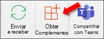

# Realizar sideload de suplementos do Outlook para teste

Você pode usar sideload para instalar um suplemento do Outlook para teste sem precisar primeiro colocá-lo em um catálogo de suplementos.

> [!IMPORTANT]
> Se o seu Outlook add-in for compatível com dispositivos móveis, o sideload do manifesto usando as instruções neste artigo para seu cliente do Outlook na Web, Windows ou Mac, siga as diretrizes na seção Testando seus **complementos em dispositivos** móveis do artigo [Add-ins for Outlook Mobile](outlook-mobile-addins.md#testing-your-add-ins-on-mobile).

## Sideload automaticamente

Se você criou seu Outlook do Outlook usando [o gerador Yeoman](../develop/yeoman-generator-overview.md) para os Office de Office, o sideload é melhor feito por meio da linha de comando no Windows. Isso aproveitará nossas ferramentas e sideload em todos os dispositivos com suporte em um comando.

1. No Windows, abra um prompt de comando e navegue até o diretório raiz do seu projeto de complemento gerado pelo Yeoman. Execute o comando `npm start`.

1. Seu Outlook de usuário será automaticamente sideload para Outlook no computador da área de trabalho. Você verá uma caixa de diálogo aparecer, informando que há uma tentativa de sideload do add-in, listando o nome e o local do arquivo de manifesto. Selecione **OK**, que registrará o manifesto.

    > [!IMPORTANT]
    > Se o manifesto contiver um erro ou o caminho para o manifesto for inválido, você receberá uma mensagem de erro.

1. Se o manifesto não contiver erros e o caminho for válido, o seu complemento agora será sideload e estará disponível na área de trabalho e no Outlook na Web. Ele também será instalado em todos os dispositivos com suporte.

## Sideload manualmente

Embora seja recomendável fazer sideload automaticamente pela linha de comando, conforme abordado na seção anterior, você também pode fazer sideload manualmente de um Outlook de entrada com base no cliente Outlook.

### Outlook na Web

O processo de sideload de um complemento no Outlook na Web depende se você está usando a versão nova ou clássica.

- Se sua barra de ferramentas de caixa de correio for parecida com a imagem a seguir, confira [Sideload de um suplemento no novo Outlook na Web](#new-outlook-on-the-web).

    

- Se sua barra de ferramentas de caixa de correio for parecida com a imagem a seguir, confira [Sideload de um suplemento no Outlook na Web clássico](#classic-outlook-on-the-web).

    

> [!NOTE]
> Se sua organização tiver incluído seu logotipo na barra de ferramentas da caixa de correio, você verá algo um pouco diferente do mostrado nas imagens anteriores.

#### Novo Outlook na Web

1. Acesse o [Outlook na Web](https://outlook.office.com).

1. Crie uma nova mensagem.

1. Escolha **...** na parte inferior da nova mensagem e selecione **Obter Suplementos** menu que aparecer.

    

1. Na caixa de diálogo **Suplementos do Outlook**, selecione **Meus suplementos**.

    

1. Localize a seção **Suplementos personalizados** no final da caixa de diálogo. Selecione o link **Adicionar um suplemento personalizado** e selecione **Adicionar do arquivo**.

    

1. Localize o arquivo de manifesto de seu suplemento personalizado e instale-o. Aceite todos os prompts durante a instalação.

#### Clássico Outlook na Web

1. Acesse o [Outlook na Web](https://outlook.office.com).

1. Escolha o ícone de engrenagem na seção superior direita da barra de ferramentas e selecione **Gerenciar suplementos**.

    

1. Na página **Gerenciar suplementos**, selecione **Suplementos** e **Meus suplementos**.

    

1. Localize a seção **Suplementos personalizados** no final da caixa de diálogo. Selecione o link **Adicionar um suplemento personalizado** e selecione **Adicionar do arquivo**.

    

1. Localize o arquivo de manifesto de seu suplemento personalizado e instale-o. Aceite todos os prompts durante a instalação.

### Outlook na área de trabalho

#### Outlook 2016 ou posterior no Windows ou Mac

1. Abra Outlook 2016 ou posterior no Windows ou Mac.

1. Selecione o botão **Obter Suplementos** na faixa de opções.

    # [Windows](#tab/windows)

    

    # [Mac](#tab/mac)

    

    ---

    > [!IMPORTANT]
    > Se você não vir o botão **Obter Complementos** na sua versão do Outlook, faça um dos seguintes:
    >
    > # [Windows](#tab/windows)
    >
    > - Se você configurou o layout da faixa de opções como Faixa de Opções Simplificada, selecione o botão de reellipse (`...`) na faixa de opções e selecione **Obter Complementos**.
    >
    >   
    >
    > - Selecione o **botão Loja** na faixa de opções, se disponível.
    >
    > - Selecione o menu **Arquivo** e selecione o botão **Gerenciar Add-ins** na guia Informações  para abrir a caixa de diálogo **Adicionar-ins** no Outlook na Web. Você pode ver mais sobre a experiência da Web na seção anterior [Sideload an add-in in Outlook na Web](#outlook-on-the-web).
    >
    > # [Mac](#tab/mac)
    >
    > - Selecione o botão de reellipse (`...`) na faixa de opções e selecione **Obter Complementos**.
    >
    >   
    >
    > - Selecione o **botão Loja** na faixa de opções, se disponível.
    >
    > ---

1. Se houver guias próximas à parte superior da caixa de diálogo, verifique se a guia **Complementos** está selecionada. Escolha **Meus complementos**.

    

1. Localize a seção **Suplementos personalizados** no final da caixa de diálogo. Selecione o link **Adicionar um suplemento personalizado** e selecione **Adicionar do arquivo**.

    

1. Localize o arquivo de manifesto de seu suplemento personalizado e instale-o. Aceite todos os prompts durante a instalação.

#### Outlook 2013 no Windows

1. Abra Outlook 2013 no Windows.

1. Selecione o menu **Arquivo** e selecione o botão **Gerenciar Complementos** na guia **Informações**. Outlook abrirá a versão da Web em um navegador.

1. Siga as etapas na [seção Sideload de](#outlook-on-the-web) um Outlook na Web de acordo com sua versão Outlook na Web.

## Remover um complemento com sideload

Em todas as versões do Outlook, a chave para remover um complemento sideload é a caixa de diálogo Meus **Complementos** que lista seus complementos instalados. Escolha a reellipse (`...`) do complemento e selecione **Remover**.

Para navegar até a caixa de diálogo Meus **Complementos** para seu cliente Outlook, use as últimas etapas listadas para [sideload manual](#sideload-manually) nas seções anteriores deste artigo.

Para remover um complemento sideload do Outlook, use as etapas descritas anteriormente neste artigo para encontrar o complemento na seção **Complementos personalizados** da caixa de diálogo que lista seus complementos instalados. Escolha a reellipse (`...`) do complemento e, em seguida, escolha **Remover** para remover esse complemento específico. Feche a caixa de diálogo.

## Confira também

- [Suplementos do Outlook Mobile](outlook-mobile-addins.md)