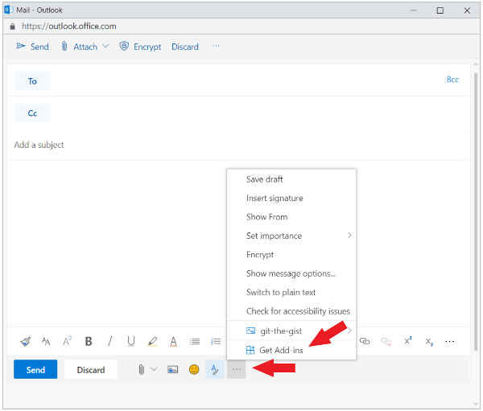

# Realizar sideload de suplementos do Outlook para testeSideload Outlook add-ins for testing

Você pode usar sideload para instalar um suplemento do Outlook para teste sem precisar primeiro colocá-lo em um catálogo de suplementos.You can use sideloading to install an Outlook add-in for testing without having to first put it in an add-in catalog.

## Realizar sideload de um suplemento do Outlook no Office 365Sideload an add-in in Outlook in Office 365

O processo de sideload de um suplemento do Outlook no Office 365 depende de se você está usando o novo Outlook na Web ou o Outlook na Web clássico.The process for sideloading an add-in in Outlook in Office 365 depends upon whether you are using the new Outlook on the web or classic Outlook on the web.

- Se sua barra de ferramentas de caixa de correio for parecida com a imagem a seguir, confira [Sideload de um suplemento no novo Outlook na Web](#sideload-an-add-in-in-the-new-outlook-on-the-web).If your mailbox toolbar looks like the following image, see [Sideload an add-in in the new Outlook on the web](#sideload-an-add-in-in-the-new-outlook-on-the-web).

    

- Se sua barra de ferramentas de caixa de correio for parecida com a imagem a seguir, confira [Sideload de um suplemento no Outlook na Web clássico](#sideload-an-add-in-in-classic-outlook-on-the-web).If your mailbox toolbar looks like the following image, see [Sideload an add-in in classic Outlook on the web](#sideload-an-add-in-in-classic-outlook-on-the-web).

    

> [!NOTE]
> Se sua organização tiver incluído seu logotipo na barra de ferramentas da caixa de correio, você verá algo um pouco diferente do mostrado nas imagens anteriores.If your organization has included its logo in the mailbox toolbar, you might see something slightly different than shown in the preceding images.

### Realizar sideload de um suplemento no novo Outlook na WebSideload an add-in in the new Outlook on the web

1. Acesse o [Outlook no Office 365](https://outlook.office.com).Go to [Outlook in Office 365](https://outlook.office.com).

1. No Outlook na Web, crie uma nova mensagem.In Outlook on the web, create a new message.   

1. Escolha **...** na parte inferior da nova mensagem e selecione **Obter Suplementos** menu que aparecer.Choose **...** from the bottom of the new message and then select **Get Add-ins** from the menu that appears.

    

1. Na caixa de diálogo **Suplementos do Outlook**, selecione **Meus suplementos**.In the **Add-Ins for Outlook** dialog box, select **My add-ins**.

    

1. Localize a seção **Suplementos personalizados** no final da caixa de diálogo.Locate the **Custom add-ins** section at the bottom of the dialog box. Selecione o link **Adicionar um suplemento personalizado** e selecione **Adicionar do arquivo**.Select the **Add a custom add-in** link, and then select **Add from file**.

    

1. Localize o arquivo de manifesto de seu suplemento personalizado e instale-o. Aceite todos os prompts durante a instalação.Locate the manifest file for your custom add-in and install it. Accept all prompts during the installation.

### Realizar sideload de um suplemento no Outlook na Web clássicoSideload an add-in in classic Outlook on the web

1. Acesse o [Outlook no Office 365](https://outlook.office.com).Go to [Outlook in Office 365](https://outlook.office.com).

1. Escolha o ícone de engrenagem na seção superior direita da barra de ferramentas e selecione **Gerenciar suplementos**.Choose the gear icon in the top-right section of the toolbar and select **Manage add-ins**.

    

1. Na página **Gerenciar suplementos**, selecione **Suplementos** e **Meus suplementos**.On the **Manage add-ins** page, select **Add-Ins**, and then select **My add-ins**.

    

1. Localize a seção **Suplementos personalizados** no final da caixa de diálogo.Locate the **Custom add-ins** section at the bottom of the dialog box. Selecione o link **Adicionar um suplemento personalizado** e selecione **Adicionar do arquivo**.Select the **Add a custom add-in** link, and then select **Add from file**.

    

1. Localize o arquivo de manifesto de seu suplemento personalizado e instale-o. Aceite todos os prompts durante a instalação.Locate the manifest file for your custom add-in and install it. Accept all prompts during the installation.

## Realizar sideload de um suplemento do Outlook na área de trabalhoSideload an add-in in Outlook on the desktop

1. Abra o Outlook 2013 ou posterior no Windows ou Outlook 2016 ou posterior no Mac.Open Outlook 2013 or later on Windows, or Outlook 2016 or later on Mac.

1. Selecione o botão **Obter Suplementos** na faixa de opções.Select the **Get Add-ins** button on the ribbon.

    

    > [!NOTE]
    > Caso não veja o botão **Obter Suplementos** em sua versão do Outlook, selecione o botão **Store** na faixa de opções.If you don't see the **Get Add-ins** button in your version of Outlook, select the **Store** button on the ribbon instead.

1. Selecione **Suplementos** e, depois, **Meus suplementos**.Select **Add-Ins**, and then select **My add-ins**.

    

1. Localize a seção **Suplementos personalizados** no final da caixa de diálogo.Locate the **Custom add-ins** section at the bottom of the dialog. Selecione o link **Adicionar um suplemento personalizado** e selecione **Adicionar do arquivo**.Select the **Add a custom add-in** link, and then select **Add from file**.

    

1. Localize o arquivo de manifesto de seu suplemento personalizado e instale-o. Aceite todos os prompts durante a instalação.Locate the manifest file for your custom add-in and install it. Accept all prompts during the installation.

## Remover um suplemento do suplementos foi feitoRemove a sideloaded add-in

Para remover um suplemento do suplementos foi feito do Outlook, use as etapas descritas anteriormente neste artigo para localizar o suplemento na seção **suplementos personalizados** da caixa de diálogo que lista seus suplementos instalados. escolha as reticências ( `...` ) para o suplemento e, em seguida, escolha **remover** para remover o suplemento específico do.To remove a sideloaded add-in from Outlook, use the steps previously described in this article to find the add-in in the **Custom add-ins** section of the dialog box that lists your installed add-ins. Choose the ellipsis (`...`) for the the add-in and then choose **Remove** to remove that specific add-in.