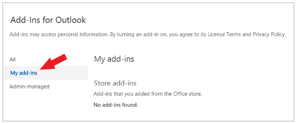

# Realizar sideload de suplementos do Outlook para testeSideload Outlook add-ins for testing

Você pode usar sideload para instalar um suplemento do Outlook para teste sem precisar primeiro colocá-lo em um catálogo de suplementos.You can use sideloading to install an Outlook add-in for testing without having to first put it in an add-in catalog.

## Sideload automaticamenteSideload automatically

Se você criou seu complemento do Outlook usando o gerador [Yeoman](https://github.com/OfficeDev/generator-office)para Os Complementos do Office, o sideload será feito da melhor maneira por meio da linha de comando.If you created your Outlook add-in using [the Yeoman generator for Office Add-ins](https://github.com/OfficeDev/generator-office), sideloading is best done through the command line. Isso aproveitará nossas ferramentas e sideload em todos os seus dispositivos com suporte em um único comando.This will take advantage of our tooling and sideload across all of your supported devices in one command.

1. Usando a linha de comando, navegue até o diretório raiz do seu projeto de complemento gerado pelo Yeoman.Using the command line, navigate to the root directory of your Yeoman generated add-in project. Execute o comando `npm start`.Run the command `npm start`.

2. O seu complemento do Outlook fará o sideload automático para o Outlook em seu computador desktop.Your Outlook add-in will automatically sideload to Outlook on your desktop computer. Você verá uma caixa de diálogo aparecer, informando que há uma tentativa de sideload do complemento, listando o nome e o local do arquivo de manifesto.You'll see a dialog appear, stating there is an attempt to sideload the add-in, listing the name and the location of the manifest file. Selecione **OK**, que registrará o manifesto.Select **OK**, which will register the manifest.

> [!IMPORTANT]
> Se o manifesto contiver um erro ou o caminho para o manifesto for inválido, você receberá uma mensagem de erro.If the manifest contains an error or the path to the manifest is invalid, you'll receive an error message.

3. Se o manifesto não contiver erros e o caminho for válido, seu complemento agora será sideloaded e estará disponível na área de trabalho e no Outlook na Web.If your manifest contains no errors and the path is valid, your add-in will now be sideloaded and available on both your desktop and in Outlook on the web. Ele também será instalado em todos os seus dispositivos compatíveis.It will also be installed across all your supported devices.

## Realizar sideload manualmenteSideload manually

Embora seja recomendável realizar o sideload automaticamente pela linha de comando, conforme abordado na seção anterior, você também pode fazer o sideload manual de um complemento do Outlook com base no cliente do Outlook.Though we strongly recommend sideloading automatically through the command line as covered in the previous section, you can also manually sideload an Outlook add-in based on the Outlook client.

### Outlook na WebOutlook on the web

O processo de sideload de um complemento no Outlook na Web depende se você está usando a versão nova ou clássica.The process for sideloading an add-in in Outlook on the web depends upon whether you are using the new or classic version.

- Se sua barra de ferramentas de caixa de correio for parecida com a imagem a seguir, confira [Sideload de um suplemento no novo Outlook na Web](#new-outlook-on-the-web).If your mailbox toolbar looks like the following image, see [Sideload an add-in in the new Outlook on the web](#new-outlook-on-the-web).

    

- Se sua barra de ferramentas de caixa de correio for parecida com a imagem a seguir, confira [Sideload de um suplemento no Outlook na Web clássico](#classic-outlook-on-the-web).If your mailbox toolbar looks like the following image, see [Sideload an add-in in classic Outlook on the web](#classic-outlook-on-the-web).

    

> [!NOTE]
> Se sua organização tiver incluído seu logotipo na barra de ferramentas da caixa de correio, você verá algo um pouco diferente do mostrado nas imagens anteriores.If your organization has included its logo in the mailbox toolbar, you might see something slightly different than shown in the preceding images.

### Novo Outlook na WebNew Outlook on the web

1. Acesse o [Outlook na Web](https://outlook.office.com).Go to [Outlook on the web](https://outlook.office.com).

1. Crie uma nova mensagem.Create a new message.

1. Escolha **...** na parte inferior da nova mensagem e selecione **Obter Suplementos** menu que aparecer.Choose **...** from the bottom of the new message and then select **Get Add-ins** from the menu that appears.

    

1. Na caixa de diálogo **Suplementos do Outlook**, selecione **Meus suplementos**.In the **Add-Ins for Outlook** dialog box, select **My add-ins**.

    

1. Localize a seção **Suplementos personalizados** no final da caixa de diálogo.Locate the **Custom add-ins** section at the bottom of the dialog box. Selecione o link **Adicionar um suplemento personalizado** e selecione **Adicionar do arquivo**.Select the **Add a custom add-in** link, and then select **Add from file**.

    

1. Localize o arquivo de manifesto de seu suplemento personalizado e instale-o. Aceite todos os prompts durante a instalação.Locate the manifest file for your custom add-in and install it. Accept all prompts during the installation.

### Outlook na Web clássicoClassic Outlook on the web

1. Acesse o [Outlook na Web](https://outlook.office.com).Go to [Outlook on the web](https://outlook.office.com).

1. Escolha o ícone de engrenagem na seção superior direita da barra de ferramentas e selecione **Gerenciar suplementos**.Choose the gear icon in the top-right section of the toolbar and select **Manage add-ins**.

    

1. Na página **Gerenciar suplementos**, selecione **Suplementos** e **Meus suplementos**.On the **Manage add-ins** page, select **Add-Ins**, and then select **My add-ins**.

    

1. Localize a seção **Suplementos personalizados** no final da caixa de diálogo.Locate the **Custom add-ins** section at the bottom of the dialog box. Selecione o link **Adicionar um suplemento personalizado** e selecione **Adicionar do arquivo**.Select the **Add a custom add-in** link, and then select **Add from file**.

    

1. Localize o arquivo de manifesto de seu suplemento personalizado e instale-o. Aceite todos os prompts durante a instalação.Locate the manifest file for your custom add-in and install it. Accept all prompts during the installation.

### Outlook na área de trabalhoOutlook on the desktop

#### Outlook 2016 ou posteriorOutlook 2016 or later

1. Abra o Outlook 2016 ou posterior no Windows ou Mac.Open Outlook 2016 or later on Windows or Mac.

1. Selecione o botão **Obter Suplementos** na faixa de opções.Select the **Get Add-ins** button on the ribbon.

    

    > [!IMPORTANT]
    > Se você não vir o botão **Obter Complementos** em sua versão do Outlook, selecione:If you don't see the **Get Add-ins** button in your version of Outlook, select:
    >
    > - **Botão Armazenar** na faixa de opções, se disponível.**Store** button on the ribbon, if available.
    >
    >   OUOR
    >
    > - **Menu** Arquivo e, em **seguida, selecione**  o botão Gerenciar Complementos na guia Informações para abrir a caixa de diálogo **Add-ins** no Outlook na Web.**File** menu, then select the **Manage Add-ins** button on the **Info** tab to open the **Add-ins** dialog in Outlook on the web. You can see more about the web experience in the previous section [Sideload an add-in in Outlook on the web](#outlook-on-the-web).You can see more about the web experience in the previous section [Sideload an add-in in Outlook on the web](#outlook-on-the-web).

1. Se houver guias próximas à parte superior da caixa de diálogo, verifique se a guia **Add-ins** está selecionada.If there are tabs near the top of the dialog, ensure that the **Add-ins** tab is selected. Escolha **Meus complementos.**Choose **My add-ins**.

    

1. Localize a seção **Suplementos personalizados** no final da caixa de diálogo.Locate the **Custom add-ins** section at the bottom of the dialog. Selecione o link **Adicionar um suplemento personalizado** e selecione **Adicionar do arquivo**.Select the **Add a custom add-in** link, and then select **Add from file**.

    

1. Localize o arquivo de manifesto de seu suplemento personalizado e instale-o. Aceite todos os prompts durante a instalação.Locate the manifest file for your custom add-in and install it. Accept all prompts during the installation.

#### Outlook 2013Outlook 2013

1. Abra o Outlook 2013 no Windows.Open Outlook 2013 on Windows.

1. Selecione **o** menu Arquivo e selecione **o botão Gerenciar Complementos** na **guia** Informações. O Outlook abrirá a versão da Web em um navegador.Select the **File** menu, then select the **Manage Add-ins** button on the **Info** tab. Outlook will open the web version in a browser.

1. Siga as etapas na [seção Sideload](#outlook-on-the-web) de um complemento no Outlook na Web de acordo com sua versão do Outlook na Web.Follow the steps in the [Sideload an add-in in Outlook on the web](#outlook-on-the-web) section according to your version of Outlook on the web.

## Remover um complemento de sideloadRemove a sideloaded add-in

Em todas as versões do Outlook, a chave para remover um complemento de sideload é a caixa de diálogo Meus **Complementos,** que lista seus complementos instalados. Escolha as reellipses ( `...` ) para o complemento e selecione **Remover**.On all versions of Outlook, the key to removing a sideloaded add-in is the **My Add-ins** dialog which lists your installed add-ins. Choose the ellipsis (`...`) for the add-in then select **Remove**.

Para navegar até a caixa de diálogo Meus **Complementos** para seu cliente do Outlook, use as últimas etapas listadas para [sideload manual](#sideload-manually) nas seções anteriores deste artigo.To navigate to the **My Add-ins** dialog box for your Outlook client, use the last steps listed for [manual sideloading](#sideload-manually) in the previous sections of this article.

Para remover um complemento de sideload do Outlook, use as etapas descritas anteriormente neste artigo para encontrar o add-in na seção de **complementos personalizados** da caixa de diálogo que lista seus complementos instalados. Escolha as reellipses ( ) para o complemento e, em seguida, escolha Remover para `...` remover esse complemento específico. To remove a sideloaded add-in from Outlook, use the steps previously described in this article to find the add-in in the **Custom add-ins** section of the dialog box that lists your installed add-ins. Choose the ellipsis (`...`) for the the add-in and then choose **Remove** to remove that specific add-in.

