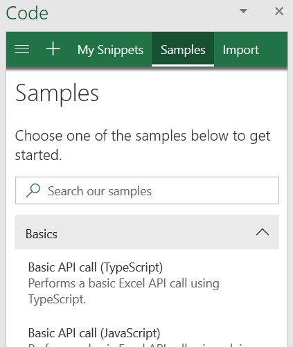

# Explorar a API JavaScript do Office usando o script LabExplore Office JavaScript API using Script Lab

O [suplemento de laboratório de script](https://appsource.microsoft.com/product/office/WA104380862), que está disponível gratuitamente no AppSource, permite explorar a API JavaScript do Office enquanto você está trabalhando em um programa do Office, como o Excel ou Word.The [Script Lab add-in](https://appsource.microsoft.com/product/office/WA104380862), which is available free from AppSource, enables you to explore the Office JavaScript API while you're working in an Office program such as Excel or Word. O script Lab é uma ferramenta conveniente para adicionar ao seu kit de ferramentas de desenvolvimento conforme você protótipo e verificar a funcionalidade desejada no seu suplemento.Script Lab is a convenient tool to add to your development toolkit as you prototype and verify functionality you want in your add-in.

## O que é o script Lab?What is Script Lab?

O script Lab é uma ferramenta para qualquer pessoa que deseje saber como desenvolver suplementos do Office usando a API JavaScript do Office no Excel, no Word ou no PowerPoint.Script Lab is a tool for anyone who wants to learn how to develop Office Add-ins using the Office JavaScript API in Excel, Word, or PowerPoint. Ele fornece o IntelliSense para que você possa ver o que está disponível e foi criado na estrutura de Mônaco, a mesma estrutura usada pelo Visual Studio Code.It provides IntelliSense so you can see what's available and is built on the Monaco framework, the same framework used by Visual Studio Code. Por meio do laboratório de scripts, você pode acessar uma biblioteca de exemplos para experimentar rapidamente recursos ou pode usar um exemplo como ponto de partida para seu próprio código.Through Script Lab, you can access a library of samples to quickly try out features or you can use a sample as the starting point for your own code. Você pode até mesmo usar o script Lab para experimentar as APIs de visualização.You can even use Script Lab to try preview APIs.

Parece bom até agora?Sounds good so far? Dê uma olhada neste vídeo de um minuto para ver o script Lab em ação.Take a look at this one-minute video to see Script Lab in action.

[![Visualizar vídeo mostrando o laboratório de script em execução no Excel, Word e PowerPoint.] (../images/screenshot-wide-youtube.png 'Vídeo do script Lab Preview')](https://aka.ms/scriptlabvideo)

## Principais recursosKey features

O script Lab oferece vários recursos para ajudá-lo a explorar a API JavaScript do Office e a funcionalidade do suplemento de protótipo.Script Lab offers a number of features to help you explore the Office JavaScript API and prototype add-in functionality.

### Explorar exemplosExplore samples

Comece rapidamente com uma coleção de trechos de código internos que mostram como concluir tarefas com a API.Get started quickly with a collection of built-in sample snippets that show how to complete tasks with the API. Você pode executar os exemplos para ver instantaneamente o resultado no painel de tarefas ou no documento, examinar os exemplos para saber como a API funciona, e até mesmo usar exemplos para executar um protótipo do seu próprio suplemento.You can run the samples to instantly see the result in the task pane or document, examine the samples to learn how the API works, and even use samples to prototype your own add-in.

### Código e estiloCode and style

Além do código JavaScript ou TypeScript que chama a API do Office JS, cada trecho também contém marcação HTML que define o conteúdo do painel de tarefas e o CSS que define a aparência do painel de tarefas.In addition to JavaScript or TypeScript code that calls the Office JS API, each snippet also contains HTML markup that defines content of the task pane and CSS that defines the appearance of the task pane. Você pode personalizar a marcação HTML e o CSS para testar o posicionamento e o estilo do elemento conforme o design do painel de tarefas do protótipo para seu próprio suplemento.You can customize the HTML markup and CSS to experiment with element placement and styling as you prototype task pane design for your own add-in.

> [!TIP]
> Para chamar APIs de visualização dentro de um trecho de código, você precisará atualizar as bibliotecas do trecho de código para`https://appsforoffice.microsoft.com/lib/beta/hosted/office.js`usar a CDN beta () `@types/office-js-preview`e as definições de tipo de visualização.To call preview APIs within a snippet, you'll need to update the snippet's libraries to use the beta CDN (`https://appsforoffice.microsoft.com/lib/beta/hosted/office.js`) and the preview type definitions `@types/office-js-preview`. Além disso, algumas APIs de visualização são acessíveis somente se você se inscreveu no [programa Office](https://products.office.com/office-insider) Insider e está executando uma compilação do Office Insider.Additionally, some preview APIs are only accessible if you've signed up for the [Office Insider program](https://products.office.com/office-insider) and are running an Insider build of Office.

### Salvar e compartilhar trechos de códigoSave and share snippets

Por padrão, os trechos de código abertos no laboratório de script serão salvos no cache do navegador.By default, snippets that you open in Script Lab will be saved to your browser cache. Para salvar um trecho permanentemente, você pode exportá-lo para um [GitHub](https://gist.github.com).To save a snippet permanently, you can export it to a [GitHub gist](https://gist.github.com). Crie uma propriedade secreta para salvar um trecho de código exclusivamente para uso próprio ou crie uma pessoa pública se você planeja compartilhá-la com outras pessoas.Create a secret gist to save a snippet exclusively for your own use, or create a public gist if you plan to share it with others.

### Importar trechosImport snippets

Você pode importar um trecho para o laboratório de script especificando a URL para o membro do [GitHub](https://gist.github.com) público onde o YAML de trecho de código está armazenado ou colando no YAML completo para o trecho de código.You can import a snippet into Script Lab either by specifying the URL to the public [GitHub gist](https://gist.github.com) where the snippet YAML is stored or by pasting in the complete YAML for the snippet. Esse recurso pode ser útil em situações em que alguém compartilhou seus trechos de código com você publicando-o em um próprio GitHub ou fornecendo a YAML de seus trechos de código.This feature may be useful in scenarios where someone else has shared their snippet with you by either publishing it to a GitHub gist or providing their snippet's YAML.

## Clientes com suporteSupported clients

O script Lab é compatível com Excel, Word e PowerPoint nos seguintes clientes.Script Lab is supported for Excel, Word, and PowerPoint on the following clients.

- Office 2013 ou posterior no WindowsOffice 2013 or later on Windows
- Office 2016 ou posterior no MacOffice 2016 or later on Mac
- Office na WebOffice on the web

## Próximas etapasNext steps

Para usar o script Lab no Excel, Word ou PowerPoint, instale o [suplemento de laboratório de script](https://appsource.microsoft.com/product/office/WA104380862) do AppSource.To use Script Lab in Excel, Word, or PowerPoint, install the [Script Lab add-in](https://appsource.microsoft.com/product/office/WA104380862) from AppSource. 

Você é bem-vindo à expansão da biblioteca de exemplo no laboratório de scripts, contribuindo novos trechos de código para o repositório do GitHub [Office-js-Snippets](https://github.com/OfficeDev/office-js-snippets#office-js-snippets) .You're welcome to expand the sample library in Script Lab by contributing new snippets to the [office-js-snippets](https://github.com/OfficeDev/office-js-snippets#office-js-snippets) GitHub repository.

Quando estiver pronto para criar seu primeiro suplemento do Office, experimente o início rápido para [Excel](../quickstarts/excel-quickstart-jquery.md), [Outlook](/outlook/add-ins/quick-start?context=office/dev/add-ins/context), [Word](../quickstarts/word-quickstart.md), [OneNote](../quickstarts/onenote-quickstart.md), [PowerPoint](../quickstarts/powerpoint-quickstart.md)ou [Project](../quickstarts/project-quickstart.md).When you're ready to create your first Office Add-in, try out the quick start for [Excel](../quickstarts/excel-quickstart-jquery.md), [Outlook](/outlook/add-ins/quick-start?context=office/dev/add-ins/context), [Word](../quickstarts/word-quickstart.md), [OneNote](../quickstarts/onenote-quickstart.md), [PowerPoint](../quickstarts/powerpoint-quickstart.md), or [Project](../quickstarts/project-quickstart.md).

## Confira tambémSee also

- [Obter o laboratório de scriptsGet Script Lab](https://appsource.microsoft.com/product/office/WA104380862)
- [Saiba mais sobre o script LabLearn more about Script Lab](https://github.com/OfficeDev/script-lab#script-lab-a-microsoft-garage-project)
- [Inscreva-se no programa devSign up for the dev program](https://developer.microsoft.com/office/dev-program)
