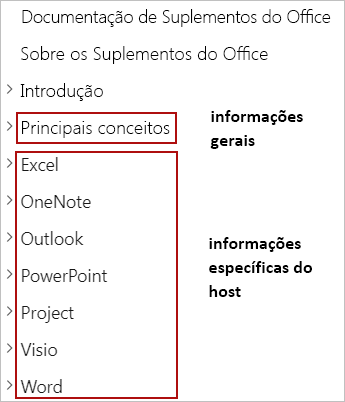

# <a name="building-office-add-ins"></a>Criando Suplementos do Office

> [!TIP]
> Examine a [Visão geral da plataforma de Suplementos do Office](office-add-ins.md) antes de ler este artigo.

Os suplementos do Office estendem a interface do usuário a e funcionalidade de aplicativos do Office e interagem com o conteúdo nos documentos do Office. Você usará tecnologias da Web conhecidas para criar suplementos do Office que estendem e interagem com o Word, Excel, PowerPoint, OneNote, Project ou Outlook. Os suplementos que você criou podem ser executados no Office em várias plataformas, incluindo Windows, Mac, iPad e em um navegador. Este artigo fornece uma introdução ao desenvolvimento de Suplementos do Office.

## <a name="creating-an-office-add-in"></a>Criar um Suplemento do Office 

Você pode criar um suplemento do Office usando o Gerador Yeoman para suplementos do Office ou Visual Studio.

### <a name="yeoman-generator-for-office-add-ins"></a>Gerador Yeoman para suplementos do Office

O [Gerador Yeoman para suplementos do Office](https://github.com/officedev/generator-office) pode ser usado para criar um projeto de suplemento do Office Node.js que pode ser gerenciado com o Visual Studio Code ou qualquer outro editor. O gerador pode criar suplementos do Office para qualquer um dos seguintes aplicativos:

- Excel
- OneNote
- Outlook
- PowerPoint
- Project
- Word
- Funções personalizadas do Excel

Você pode optar por criar o projeto usando HTML, CSS e JavaScript ou usando o Angular ou React. Para qualquer estrutura escolhida, você pode escolher entre o JavaScript e o Typescript também. Para saber mais sobre como criar suplementos com o gerador Yeoman, confira [Desenvolver Suplementos do Office com o Código do Visual Studio](../develop/develop-add-ins-vscode.md).

### <a name="visual-studio"></a>Visual Studio

O Visual Studio pode ser usado para criar suplementos do Office para o Excel, Outlook, Word e PowerPoint. Um projeto do suplemento do Office é criado como parte de uma solução do Visual Studio e usa HTML, CSS e JavaScript. Para saber mais sobre como criar suplementos usando o Visual Studio, confira [Desenvolver suplementos do Office com o Visual Studio](../develop/develop-add-ins-visual-studio.md).

[!include[Yeoman vs Visual Studio comparision](../includes/yeoman-generator-recommendation.md)]

## <a name="exploring-apis-with-script-lab"></a>Explorar APIs com o Script Lab

O Script Lab é um suplemento que permite explorar a API JavaScript para Office e executar trechos de código enquanto você trabalha em um programa do Office, como o Excel ou o Word. Ele está disponível gratuitamente através do [AppSource](https://appsource.microsoft.com/product/office/WA104380862) e é uma ferramenta útil para incluir no seu kit de ferramentas de desenvolvimento ao prototipar e verificar a funcionalidade desejada no suplemento. No Script Lab, você pode acessar uma biblioteca de exemplos internos para experimentar APIs rapidamente ou até mesmo usar uma amostra como o ponto de partida para o seu próprio código. 

O vídeo de um minuto a seguir mostra o Script Lab em ação.

[](https://aka.ms/scriptlabvideo)

Para saber mais sobre o Script Lab, confira [Explorar as APIs JavaScript para Office usando o Script Lab](../overview/explore-with-script-lab.md).

## <a name="extending-the-office-ui"></a>Estendendo a interface do usuário do Office

Um suplemento do Office pode estender a interface do usuário do Office usando comandos de suplementos e contêineres HTML como painéis de tarefas, suplementos de conteúdo ou caixas de diálogo.

- Os [comandos de suplemento](../design/add-in-commands.md) podem ser usados para adicionar guias, botões e menus personalizados à faixa de opções padrão no office ou para estender o menu de contexto padrão que aparece quando os usuários clicam com o botão direito do mouse em um texto em um documento do Office ou em um objeto no Excel. Quando os usuários selecionam um comando de suplemento, eles iniciam a tarefa que o comando de suplemento especifica, como a execução de código JavaScript, a abertura de um painel de tarefas ou a inicialização de uma caixa de diálogo.

- Os contêineres HTML como [painéis de tarefas](../design/task-pane-add-ins.md), [suplementos de conteúdo](../design/content-add-ins.md) e [caixas de diálogo](../design/dialog-boxes.md) podem ser usadas para exibir a interface do usuário personalizada e expor uma funcionalidade adicional em um aplicativo do Office. O conteúdo e a funcionalidade de cada painel de tarefas, suplemento de conteúdo ou caixa de diálogo são derivados de uma página da Web que você especifica. Essas páginas da Web podem usar a API JavaScript para Office para interagir com o conteúdo do documento do Office no qual o suplemento está sendo executado, além disso, também pode fazer outras coisas que as páginas da Web geralmente fazem, como chamar serviços Web externos, facilitar a autenticação do usuário e mais.

A imagem a seguir mostra um comando de suplemento na faixa de opções, um painel de tarefas à direita do documento e uma caixa de diálogo ou suplemento de conteúdo sobre o documento.


Para saber mais sobre como estender a interface do usuário do Office, confira [Elementos da interface do usuário do Office para suplementos do Office](../design/interface-elements.md).

## <a name="core-development-concepts"></a>Principais conceitos de desenvolvimento 

Um suplemento do Office consiste em duas partes:

- O manifesto do suplemento (um arquivo XML) que defina as configurações e recursos do suplemento.

- O aplicativo Web que defina a interface do usuário e a funcionalidade de componentes do suplemento, como painéis de tarefas, suplementos de conteúdo e caixas de diálogo.

O aplicativo Web usa a API JavaScript para Office para interagir com o conteúdo do documento do Office no qual o suplemento está sendo executado. Seu suplemento também pode fazer outras coisas que os aplicativos Web normalmente fazem, como chamar serviços Web externos, facilitar a autenticação do usuário e mais.

### <a name="defining-an-add-ins-settings-and-capabilities"></a>Definir as configurações e os recursos do suplemento

Um manifesto do suplemento do Office (um arquivo XML) define as configurações e os recursos do suplemento. Você vai configurar o manifesto para especificar itens como:

- Metadados que descrevem o suplemento (por exemplo, ID, versão, descrição, nome de exibição, local padrão).
- Aplicativos do Office onde o suplemento será executado.
- Permissões necessárias para o suplemento.
- Como o suplemento se integra ao Office, incluindo qualquer interface do usuário personalizada que o suplemento cria (por exemplo, guias personalizadas, botões da faixa de opções).
- Localização de imagens que o suplemento usa para identidade visual e iconografia de comando.
- Dimensões do suplemento (por exemplo, dimensões para suplementos de conteúdo, altura solicitada para suplementos do Outlook).
- As regras que especificam quando o suplemento é ativado no contexto de uma mensagem ou de um compromisso (somente para suplementos do Outlook).

Para saber mais sobre o manifesto, confira [Manifesto XML de suplementos do Office](add-in-manifests.md).

### <a name="interacting-with-content-in-an-office-document"></a>Interagir com o conteúdo em um documento do Office

Um suplemento do Office pode usar as APIs JavaScript para Office para interagir com o conteúdo no documento do Office no qual o documento está sendo executado. 

#### <a name="accessing-the-office-javascript-library"></a>Acessar a biblioteca JavaScript do Office

A biblioteca JavaScript do Office pode ser acessada pela CDN (rede de distribuição de conteúdo do Office JS) em: `https://appsforoffice.microsoft.com/lib/1/hosted/Office.js`. Para usar as APIs JavaScript para Office em qualquer uma das páginas da Web do seu suplemento, você deve fazer referência à CDN em uma tag `<script>` na tag `<head>` da página.

```html
<head>
    ...
    <script src="https://appsforoffice.microsoft.com/lib/1/hosted/Office.js" type="text/javascript"></script>
</head>
```

> [!NOTE]
> Para usar as APIs de visualização, referencie a versão de visualização da biblioteca JavaScript para Office na CDN: https://appsforoffice.microsoft.com/lib/beta/hosted/office.js.

Para saber mais sobre como acessar a biblioteca JavaScript para Office, incluindo como obter o IntelliSense, confira [Fazer referência à biblioteca da API JavaScript para Office de sua CDN (rede de distribuição de conteúdo)](../develop/referencing-the-javascript-api-for-office-library-from-its-cdn.md).

#### <a name="api-models"></a>Modelos de API

As API do JavaScript para Office incluem dois modelos diferentes:

- As APIs **Específicas do host** fornecem objetos fortemente tipados que podem ser usados para interagir com objetos que são nativos de um aplicativos do Office específico. Por exemplo, você pode usar as APIs JavaScript do Excel para acessar planilhas, intervalos, tabelas, gráficos e mais. As APIs específicas do host estão disponíveis atualmente para o [Excel](../reference/overview/excel-add-ins-reference-overview.md), [Word](../reference/overview/word-add-ins-reference-overview.md) e [OneNote](../reference/overview/onenote-add-ins-javascript-reference.md). Esse modelo de API usa [promessas](https://developer.mozilla.org/docs/Web/JavaScript/Reference/Global_Objects/Promise) e permite que você especifique várias operações em cada solicitação enviada ao host do Office. Operações de envio em lote dessa maneira podem melhorar significativamente o desempenho do suplemento no Office nos aplicativos Web. As APIs específicas do host foram introduzidas com o Office 2016 e não pode ser usadas para interagir com o Office 2013.

- As APIs **Comuns** podem ser usadas para acessar recursos como interface do usuário, caixas de diálogo e configurações de cliente, que são comuns entre vários tipos de aplicativos do Office. Esse modelo de API usa [retornos de chamada](https://developer.mozilla.org/docs/Glossary/Callback_function), em que você pode especificar apenas uma operação em cada solicitação enviada ao host do Office. As APIs comuns foram introduzidas com o Office 2013 e podem ser usadas para interagir com o Office 2013 ou posterior. Para obter mais detalhes do modelo de objeto API comum, que inclui APIs para interagir com o Outlook e o PowerPoint, consulte [modelo do objeto JavaScript API comum](../develop/office-javascript-api-object-model.md).

> [!NOTE]
> As funções personalizadas do Excel são executadas dentro de um tempo de execução único que prioriza a execução de cálculos e, portanto, usa um modelo de programação ligeiramente diferente. Para saber mais, confira [Arquitetura de funções personalizadas](../excel/custom-functions-architecture.md).

Para obter mais informações sobre as APIs JavaScript para Office, confira [Noções básicas da API JavaScript para Office](../develop/understanding-the-javascript-api-for-office.md).

#### <a name="api-requirement-sets"></a>Conjuntos de requisitos da API

Os [conjuntos de requisitos](../develop/office-versions-and-requirement-sets.md) são grupos nomeados de membros da API. Os conjuntos de requisitos podem ser específicos para os hosts do Office, como o conjunto de requisitos `ExcelApi 1.7` (um conjunto de APIs que só podem ser usadas no Excel) ou comuns a vários hosts, como o conjunto de requisitos `DialogApi 1.1` (um conjunto de APIs que podem ser usadas em qualquer aplicativo do Office que forneça suporte à API de Caixa de Diálogo).

Seu suplemento pode usar conjuntos de requisitos para determinar se o host do Office oferece suporte aos membros da API necessários. Para saber mais sobre isso, confira [Especificar requisitos de API e host do Office](../develop/specify-office-hosts-and-api-requirements.md).

O suporte a um conjunto de requisitos varia de acordo com o host do Office, a versão e a plataforma. Para obter informações detalhadas sobre as plataformas, os conjuntos de requisitos e as APIs comuns compatíveis com cada aplicativo do Office, confira [Disponibilidade de host e plataforma para suplementos do Office](office-add-in-availability.md).

## <a name="testing-and-debugging-an-office-add-in"></a>Teste e depuração de um suplemento do Office

Ao desenvolver seu suplemento, você pode testá-lo localmente usando uma técnica conhecida como _sideload_. O procedimento para realizar o sideload de um suplemento varia de acordo com a plataforma e, em alguns casos, também com o produto. Da mesma forma, o procedimento de depuração de um suplemento também pode variar de acordo com a plataforma e o produto. Para saber mais sobre teste e depuração, confira [Testar e depurar suplementos do Office](../testing/test-debug-office-add-ins.md).

## <a name="publishing-an-office-add-in"></a>Publicar um suplemento do Office

Quando estiver pronto para compartilhar seu suplemento com outras pessoas, você poderá fazer isso usando o método de implantação mais adequado aos seus objetivos. Por exemplo, para implantar um suplemento para os usuários dentro da organização, você pode usar a implantação centralizada ou publicar o suplemento em um catálogo de aplicativos do SharePoint. Se você quiser compartilhar seu suplemento publicamente para que qualquer pessoa possa acessá-lo, publique-o no AppSource. Para saber mais sobre publicação, confira [Implantar e publicar suplementos do Office](../publish/publish.md).

## <a name="next-steps"></a>Próximas etapas

Este artigo descreveu as diferentes maneiras de criar suplementos do Office, apresentou o Script Lab como uma ferramenta valiosa para explorar as APIs JavaScript para Office e a criação de protótipo de funcionalidade de suplemento e descreveu o desenvolvimento, teste e conceitos de publicação importantes dos suplementos do Office. Agora que você já explorou estas informações introdutórias, considere continuar sua jornada de suplementos do Office ao longo dos caminhos a seguir.

### <a name="create-an-office-add-in"></a>Criar um suplemento do Office

Você pode criar rapidamente um suplemento básico para o Excel, o OneNote, o Outlook, o PowerPoint, o Project ou o Word realizando um [início rápido de 5 minutos](../index.md). Se você já concluiu um início rápido e deseja criar um suplemento um pouco mais complexo, experiente o [tutorial](../index.md).

### <a name="explore-the-apis-with-script-lab"></a>Explorar as APIs com o Script Lab

Explore a biblioteca de amostras internas no [Script Lab](explore-with-script-lab.md) para ter uma ideia dos recursos das APIs JavaScript para Office.

### <a name="learn-more"></a>Saiba mais

Saiba mais sobre o desenvolvimento, testes e publicação de suplementos do Office explorando essa documentação.

> [!TIP]
> Para qualquer suplemento que você criar, use as informações na seção [Principais conceitos](core-concepts-office-add-ins.md) desta documentação, juntamente com as informações na seção específica do host que correspondem ao tipo de suplemento que você está criando (por exemplo, [Excel](../excel/index.md)).
>
> 

## <a name="see-also"></a>Confira também 

- [Visão geral da plataforma Suplementos do Office](office-add-ins.md)
- [Principais conceitos dos Suplementos do Office](../overview/core-concepts-office-add-ins.md)
- [Desenvolver Suplementos do Office](../develop/develop-overview.md)
- [Desenvolver Suplementos do Office com o Código do Visual Studio](../develop/develop-add-ins-vscode.md)
- [Desenvolver Suplementos do Office com o Visual Studio](../develop/develop-add-ins-visual-studio.md)
- [Fazer o design de Suplementos do Office](../design/add-in-design.md)
- [Testar e depurar Suplementos do Office](../testing/test-debug-office-add-ins.md)
- [Publish Office Add-ins](../publish/publish.md)