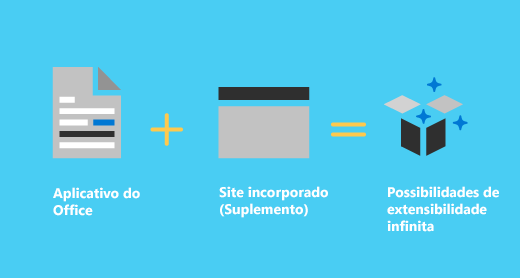
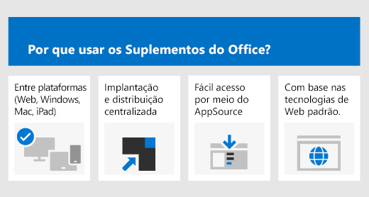
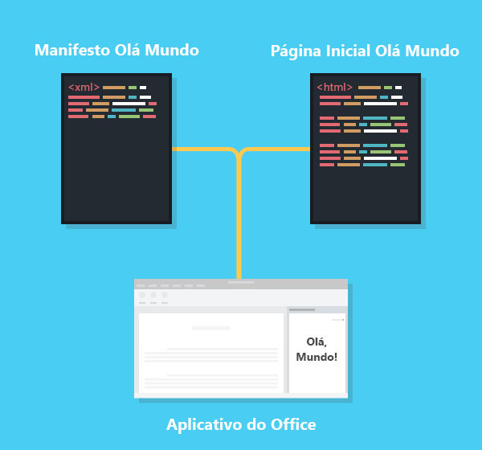

# Visão geral da plataforma de Suplementos do Office

You can use the Office Add-ins platform to build solutions that extend Office applications and interact with content in Office documents. With Office Add-ins, you can use familiar web technologies such as HTML, CSS, and JavaScript to extend and interact with Outlook, Excel, Word, PowerPoint, OneNote, and Project. Your solution can run in Office across multiple platforms, including Windows, Mac, iPad, and in a browser.

Office Add-ins can do almost anything a webpage can do inside a browser. Use the Office Add-ins platform to:

- **Add new functionality to Office clients** - Bring external data into Office, automate Office documents, expose functionality from Microsoft and others in Office clients, and more. For example, use Microsoft Graph API to connect to data that drives productivity.

- **Crie novos objetos avançados e interativos que podem ser integrados em documentos do Office** ‒ Mapas, gráficos e visualizações interativas integrados que os usuários podem adicionar a suas próprias planilhas do Excel e apresentações do PowerPoint.

## Quais são as diferenças entre os suplementos do Office e os suplementos de COM e VSTO?

COM or VSTO add-ins are earlier Office integration solutions that run only in Office on Windows. Unlike COM add-ins, Office Add-ins don't involve code that runs on the user's device or in the Office client. For an Office Add-in, the application (for example, Excel), reads the add-in manifest and hooks up the add-in’s custom ribbon buttons and menu commands in the UI. When needed, it loads the add-in's JavaScript and HTML code, which executes in the context of a browser in a sandbox.

Os Suplementos do Office oferecem as seguintes vantagens em relação aos suplementos criados usando VBA, COM ou VSTO.

- Cross-platform support. Office Add-ins run in Office on the web, Windows, Mac, and iPad.

- Centralized deployment and distribution. Admins can deploy Office Add-ins centrally across an organization.

- Easy access via AppSource. You can make your solution available to a broad audience by submitting it to AppSource.

- Based on standard web technology. You can use any library you like to build Office Add-ins.

## Componentes de um suplemento do Office

An Office Add-in includes two basic components: an XML manifest file, and your own web application. The manifest defines various settings, including how your add-in integrates with Office clients. Your web application needs to be hosted on a web server, or web hosting service, such as Microsoft Azure.

### Manifesto

O manifesto é um arquivo XML que especifica configurações e recursos do suplemento, como os seguintes:

- O nome de exibição, a descrição, a ID, a versão e a localidade padrão do suplemento.

- Como o suplemento se integra ao Office.  

- O nível de permissão e os requisitos de acesso a dados para o suplemento.

### Aplicativo Web

The most basic Office Add-in consists of a static HTML page that is displayed inside an Office application, but that doesn't interact with either the Office document or any other Internet resource. However, to create an experience that interacts with Office documents or allows the user to interact with online resources from an Office client application, you can use any technologies, both client and server side, that your hosting provider supports (such as ASP.NET, PHP, or Node.js). To interact with Office clients and documents, you use the Office.js JavaScript APIs.

## Estender os clientes do Office e interagir com eles

Os Suplementos do Office podem fazer o seguinte em um aplicativo cliente do Office.

- Estender a funcionalidade (qualquer aplicativo do Office)

- Criar novos objetos (Excel ou PowerPoint)

### Estender a funcionalidade do Office

Você pode adicionar novas funcionalidades a aplicativos do Office por meio do seguinte:  

- Botões de faixa de opções e comandos de menu personalizados (coletivamente chamados "comandos de suplemento")

- Painéis de tarefas inseríveis

Painéis personalizados de interface do usuário e de tarefa são especificados no manifesto do suplemento.  

#### Botões e comandos de menu personalizados  

You can add custom ribbon buttons and menu items to the ribbon in Office on the web and on Windows. This makes it easy for users to access your add-in directly from their Office application. Command buttons can launch different actions such as showing a task pane with custom HTML or executing a JavaScript function.  

#### Painéis de tarefas  

You can use task panes in addition to add-in commands to enable users to interact with your solution. Clients that do not support add-in commands (Office 2013 and Office on iPad) run your add-in as a task pane. Users launch task pane add-ins via the **My Add-ins** button on the **Insert** tab.

### Estender a funcionalidade do Outlook

Outlook add-ins can extend the Office app ribbon and also display contextually next to an Outlook item when you're viewing or composing it. They can work with an email message, meeting request, meeting response, meeting cancellation, or appointment when a user is viewing a received item or replying or creating a new item.

Outlook add-ins can access contextual information from the item, such as an address or tracking ID, and then use that data to access additional information on the server and from web services to create compelling user experiences. In most cases, an Outlook add-in runs without modification in the Outlook application to provide a seamless experience on the desktop, web, and tablet and mobile devices.

Confira a visão geral dos suplementos do Outlook em [Visão geral dos suplementos do Outlook](../outlook/outlook-add-ins-overview.md).

### Criar novos objetos nos documentos do Office

You can embed web-based objects called content add-ins within Excel and PowerPoint documents. With content add-ins, you can integrate rich, web-based data visualizations, media (such as a YouTube video player or a picture gallery), and other external content.

## APIs JavaScript para Office

As APIs JavaScript para Office contêm objetos e membros para a criação de suplementos e a interação com conteúdo do Office e serviços Web. Há um modelo de objeto comum que é compartilhado pelo Excel, Outlook, Word, PowerPoint, OneNote e Project. Há também modelos de objeto mais extensos específicos do aplicativo para Excel e Word. Essas APIs fornecem acesso a objetos conhecidos, como parágrafos e pastas de trabalho, o que facilita a criação de um suplemento para um aplicativo específico.

## Próximas etapas

Para obter uma introdução mais detalhada sobre o desenvolvimento de Suplementos do Office, confira [Desenvolver suplementos do Office](../develop/develop-overview.md).

## Confira também

- [Principais conceitos dos Suplementos do Office](../overview/core-concepts-office-add-ins.md)
- [Desenvolver Suplementos do Office ](../develop/develop-overview.md)
- [Fazer o design de Suplementos do Office](../design/add-in-design.md)
- [Testar e depurar Suplementos do Office](../testing/test-debug-office-add-ins.md)
- [Publish Office Add-ins](../publish/publish.md)
- [Saiba mais sobre o Programa para Desenvolvedores do Microsoft 365](https://developer.microsoft.com/microsoft-365/dev-program)
