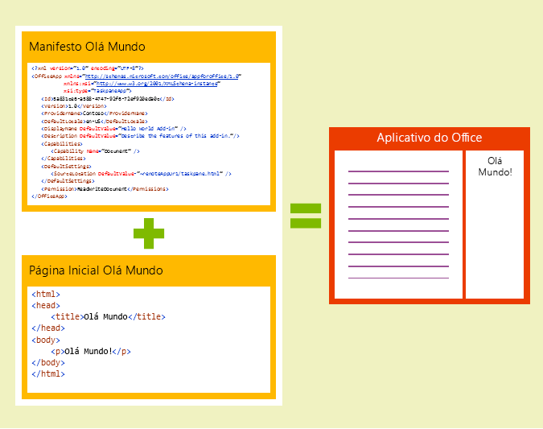
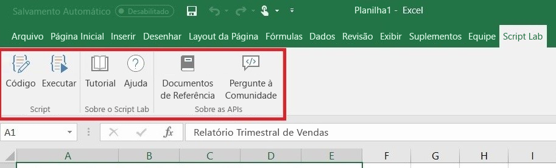
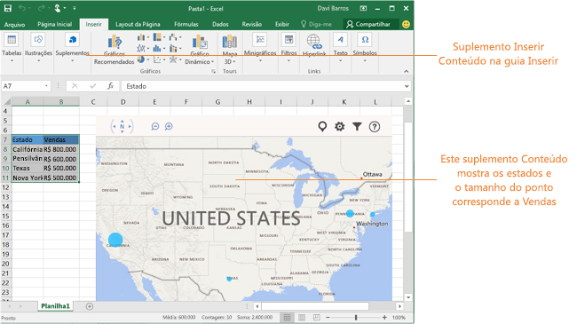

# Vis?o geral da plataforma de Suplementos do OfficeOffice Add-ins platform overview

Voc? pode usar a plataforma de suplementos do Office para criar solu??es que estendem os aplicativos do Office e interagem com conte?do nos documentos do Office. Com os suplementos do Office, voc? pode usar tecnologias web conhecidas, como HTML, CSS e JavaScript, para estender e interagir com o Word, Excel, PowerPoint, OneNote, Project e Outlook. Sua solu??o pode ser executada no Office atrav?s de v?rias plataformas, incluindo Office para Windows, Office Online, Office para Mac e Office para iPad.You can use the Office Add-ins platform to build solutions that extend Office applications and interact with content in Office documents. With Office Add-ins, you can use familiar web technologies such as HTML, CSS, and JavaScript to extend and interact with Word, Excel, PowerPoint, OneNote, Project, and Outlook. Your solution can run in Office across multiple platforms, including Office for Windows, Office Online, Office for the Mac, and Office for the iPad.

Os suplementos do Office podem fazer quase tudo que uma p?gina da Web pode fazer dentro do navegador. Use a plataforma de suplementos do Office para:Office Add-ins can do almost anything a webpage can do inside a browser. Use the Office Add-ins platform to:

-  **Adicionar novas funcionalidades para os clientes do Office** ? trazer dados externos para o Office, automatizar documentos do Office, expor a funcionalidade de terceiros em clientes do Office e muito mais. Por exemplo, use a API do Microsoft Graph para se conectar aos dados que orientam a produtividade.**Add new functionality to Office clients** - Bring external data into Office, automate Office documents, expose third-party functionality in Office clients, and more. For example, use Microsoft Graph API to connect to data that drives productivity. 
    
-  **Crie novos objetos avan?ados e interativos que podem ser integrados em documentos do Office** ? Mapas, gr?ficos e visualiza??es interativas integrados que os usu?rios podem adicionar a suas pr?prias planilhas do Excel e apresenta??es do PowerPoint.**Create new rich, interactive objects that can be embedded in Office documents** - Embed maps, charts, and interactive visualizations that users can add to their own Excel spreadsheets and PowerPoint presentations. 
    
## Quais s?o as diferen?as entre os suplementos do Office e os suplementos de COM e VSTO?How are Office Add-ins different than COM and VSTO add-ins? 

Os suplementos de COM ou VSTO s?o solu??es de integra??o anteriores do Office que s?o executadas apenas no Office para Windows. Ao contr?rio de suplementos de COM, os suplementos do Office n?o envolvem c?digo executado no dispositivo do usu?rio ou no cliente do Office. Para um suplemento Office, o aplicativo do host, por exemplo, o Excel, l? o manifesto do suplemento e conecta os comandos do menu e os bot?es da faixa de op??es personalizada do suplemento ? interface de usu?rio. Quando necess?rio, ele carrega o c?digo de HTML e o JavaScript, que s?o executados no contexto de um navegador em uma ?rea restrita.COM or VSTO add-ins are earlier Office integration solutions that run only on Office for Windows. Unlike COM add-ins, Office Add-ins don't involve code that runs on the user's device or in the Office client. For an Office Add-in, the host application, for example Excel, reads the add-in manifest and hooks up the add-in?s custom ribbon buttons and menu commands in the UI. When needed, it loads the add-in's JavaScript and HTML code, which executes in the context of a browser in a sandbox. 

Os suplementos do Office fornecem as seguintes vantagens em rela??o aos suplementos criados usando o VBA, COM ou VSTO:Office Add-ins provide the following advantages over add-ins built using VBA, COM, or VSTO: 

- Suporte ? plataforma cruzada. Os suplementos do Office podem ser executados no Office para Windows, Mac, iOS e Office Online.Cross-platform support. Office Add-ins run in Office for Windows, Mac, iOS, and Office Online. 

- SSO (logon ?nico). Os suplementos do Office integram-se facilmente com contas do Office 365 dos usu?rios.Single sign-on (SSO). Office Add-ins integrate easily with users' Office 365 accounts. 

- Implanta??o e distribui??o centralizada. Os administradores podem implantar suplementos do Office centralmente em uma organiza??o.Centralized deployment and distribution. Admins can deploy Office Add-ins centrally across an organization. 

- Acesso f?cil atrav?s da AppSource. Voc? pode disponibilizar sua solu??o para um p?blico amplo ao envi?-la para o AppSource.Easy access via AppSource. You can make your solution available to a broad audience by submitting it to AppSource. 

- Com base na tecnologia de Internet padr?o. Voc? pode usar qualquer biblioteca que gosta para criar suplementos do Office.Based on standard web technology. You can use any library you like to build Office Add-ins. 

## Componentes de um suplemento do OfficeComponents of an Office Add-in 

Um suplemento do Office inclui dois componentes b?sicos: um arquivo de manifesto XML e seu pr?prio aplicativo Web. O manifesto define v?rias configura??es, incluindo como o suplemento ? integrado a clientes do Office. O aplicativo Web deve ser hospedado em um servidor Web ou servi?o de hospedagem na Web, como o Microsoft Azure.An Office Add-in includes two basic components: an XML manifest file, and your own web application. The manifest defines various settings, including how your add-in integrates with Office clients. Your web application needs to be hosted on a web server, or web hosting service, such as Microsoft Azure.

*Figura 1. Manifesto + p?gina da Web = um Suplemento do Office**Figure 1. Manifest + webpage = an Office Add-in*

### ManifestoManifest 

O manifesto ? um arquivo XML que especifica configura??es e recursos do suplemento, como os seguintes:The manifest is an XML file that specifies settings and capabilities of the add-in, such as: 

- O nome de exibi??o, a descri??o, a ID, a vers?o e a localidade padr?o do suplemento.The add-in's display name, description, ID, version, and default locale. 

- Como o suplemento se integra ao Office.How the add-in integrates with Office.  

- O n?vel de permiss?o e os requisitos de acesso a dados para o suplemento.The permission level and data access requirements for the add-in. 

### Aplicativo WebWeb app 

O Suplemento do Office mais b?sico consiste em uma p?gina HTML est?tica que ? exibida dentro de um aplicativo do Office, mas n?o interage com o documento do Office nem com qualquer outro recurso de Internet. No entanto, para criar uma experi?ncia que interaja com os documentos do Office ou permita que o usu?rio interaja com os recursos online de um aplicativo de host do Office, voc? pode usar qualquer tecnologia, tanto do lado do cliente como do servidor, a qual seu provedor de hospedagem d? suporte (como ASP.NET, PHP ou N?.js). Para interagir com clientes e documentos do Office, voc? usa as APIs Office.js e JavaScript.The most basic Office Add-in consists of a static HTML page that is displayed inside an Office application, but that doesn't interact with either the Office document or any other Internet resource. However, to create an experience that interacts with Office documents or allows the user to interact with online resources from an Office host application, you can use any technologies, both client and server side, that your hosting provider supports (such as ASP.NET, PHP, or Node.js). To interact with Office clients and documents, you use the Office.js JavaScript APIs. 

*Figura 2. Componentes de um suplemento Hello World do Office**Figure 2. Components of a Hello World Office Add-in*

## Estender os clientes do Office e interagir com elesExtending and interacting with Office clients 

Os suplementos do Office podem fazer o seguinte em um aplicativo de host do Office:Office Add-ins can do the following within an Office host application: 

-  Estender a funcionalidade (qualquer aplicativo do Office)Extend functionality (any Office application) 

-  Criar novos objetos (Excel ou PowerPoint)Create new objects (Excel or PowerPoint) 
 
### Estender a funcionalidade do OfficeExtend Office functionality 

Voc? pode adicionar novas funcionalidades a aplicativos do Office por meio do seguinte:You can add new functionality to Office applications via the following:  

-  Bot?es de faixa de op??es e comandos de menu personalizados (coletivamente chamados "comandos de suplemento")Custom ribbon buttons and menu commands (collectively called ?add-in commands?) 

-  Pain?is de tarefas inser?veisInsertable task panes 

Pain?is personalizados de interface do usu?rio e de tarefa s?o especificados no manifesto do suplemento.Custom UI and task panes are specified in the add-in manifest.  

#### Bot?es e comandos de menu personalizadosCustom buttons and menu commands  

Voc? pode adicionar itens de menu e bot?es da faixa de op??es personalizados ? faixa de op??es, tanto no Office para ?rea de Trabalho do Windows quanto no Office Online. Isso facilita aos usu?rios o acesso ao suplemento diretamente do aplicativo do Office. Bot?es de comando podem iniciar diferentes a??es, como mostrar um painel de tarefas com c?digo HTML personalizado ou executar uma fun??o JavaScript.You can add custom ribbon buttons and menu items to the ribbon in Office for Windows Desktop and Office Online. This makes it easy for users to access your add-in directly from their Office application. Command buttons can launch different actions such as showing a task pane with custom HTML or executing a JavaScript function.  

*Figura 3. Comandos do suplemento em execu??o na ?rea de Trabalho do Excel**Figure 3. Add-in commands running in Excel Desktop*

#### Pain?is de tarefasTask panes  

Voc? pode usar pain?is de tarefas, al?m dos comandos de suplemento, para permitir que os usu?rios interajam com sua solu??o. Os clientes que n?o d?o suporte aos comandos de suplemento (Office 2013 e Office para iPad) executar?o seu suplemento como um painel de tarefas. Os usu?rios iniciam os suplementos do painel de tarefas atrav?s do bot?o **Meus suplementos** na guia **Inserir**.You can use task panes in addition to add-in commands to enable users to interact with your solution. Clients that do not support add-in commands (Office 2013 and Office for iPad) run your add-in as a task pane. Users launch task pane add-ins via the **My Add-ins** button on the **Insert** tab. 

*Figura 4. Painel de tarefas**Figure 4. Task pane*

### Estender a funcionalidade do OutlookExtend Outlook functionality 

Os suplementos do Outlook podem estender a faixa de op??es do Office e tamb?m ser exibidos contextualmente ao lado de um item do Outlook quando voc? o exibe ou redige. Eles podem trabalhar com uma mensagem de email, uma solicita??o de reuni?o, uma resposta de reuni?o, um cancelamento de reuni?o ou um compromisso quando um usu?rio est? visualizando um item recebido, ou respondendo ou criando um novo item.Outlook add-ins can extend the Office ribbon and also display contextually next to an Outlook item when you're viewing or composing it. They can work with an email message, meeting request, meeting response, meeting cancellation, or appointment when a user is viewing a received item or replying or creating a new item. 

Os suplementos do Outlook podem acessar informa??o contextual do item, como o endere?o ou a ID de rastreamento, e, em seguida, usar estes dados para acessarem informa??es adicionais sobre o servidor e de servi?os da Web para criar experi?ncias do usu?rio envolventes. Na maioria dos casos, um suplemento do Outlook ? executado sem modifica??o nos v?rios aplicativos host com suporte, incluindo Outlook, Outlook para Mac, Outlook Web App e Outlook Web App para Dispositivos para fornecer uma experi?ncia perfeita na ?rea de trabalho, na Web e em tablets e dispositivos m?veis.Outlook add-ins can access contextual information from the item, such as an address or tracking ID, and then use that data to access additional information on the server and from web services to create compelling user experiences. In most cases, an Outlook add-in runs without modification on the various supporting host applications, including Outlook, Outlook for Mac, Outlook Web App, and Outlook Web App for devices, to provide a seamless experience on the desktop, web, and tablet and mobile devices. 

Confira a vis?o geral dos suplementos do Outlook em [Vis?o geral dos suplementos do Outlook](https://docs.microsoft.com/en-us/outlook/add-ins/).For an overview of Outlook add-ins, see [Outlook add-ins overview](https://docs.microsoft.com/en-us/outlook/add-ins/). 

### Criar novos objetos nos documentos do OfficeCreate new objects in Office documents 

Voc? pode inserir objetos baseados na web, chamados de suplementos de conte?do, em documentos do Excel e PowerPoint. Com os suplementos de conte?do, voc? pode integrar visualiza??es de dados avan?adas e baseadas na Web, m?dia (como um player de v?deo do YouTube ou uma galeria de imagens) e outros tipos de conte?do externo.You can embed web-based objects called content add-ins within Excel and PowerPoint documents. With content add-ins, you can integrate rich, web-based data visualizations, media (such as a YouTube video player or a picture gallery), and other external content.

*Figura 5. Suplemento de conte?do**Figure 5. Content add-in*

## APIs JavaScript para OfficeOffice JavaScript APIs 

As APIs JavaScript para Office cont?m objetos e membros para a cria??o de suplementos e a intera??o com conte?do do Office e servi?os Web. Existe um modelo de objeto comum compartilhado pelo Excel, Outlook, Word, PowerPoint, OneNote e Project. Tamb?m existem modelos de objeto espec?ficos de host mais extensos para o Excel e o Word. Essas APIs fornecem acesso a objetos conhecidos, como par?grafos e pastas de trabalho, o que facilita a cria??o de um suplemento para um host espec?fico.The Office JavaScript APIs contain objects and members for building add-ins and interacting with Office content and web services. There is a common object model that is shared by Excel, Outlook, Word, PowerPoint, OneNote and Project. There are also more extensive host-specific object models for Excel and Word. These APIs provide access to well-known objects such as paragraphs and workbooks, which makes it easier to create an add-in for a specific host.  

## Pr?ximas etapasNext steps 

Para saber mais sobre como come?ar a criar o seu Suplemento do Office, experimente o nosso [In?cios R?pidos de 5 minutos](https://docs.microsoft.com/en-us/office/dev/add-ins/).To learn more about how to start building your Office Add-in, try out our [5-minute Quickstarts](https://docs.microsoft.com/en-us/office/dev/add-ins/). You can start building add-ins right away using Visual Studio or any other editor. Voc? pode come?ar a criar suplementos imediatamente usando o Visual Studio ou qualquer outro editor.To learn more about how to start building your Office Add-in, try out our 5-minute Quickstarts. You can start building add-ins right away using Visual Studio or any other editor. 

Para come?ar a planejar solu??es que criem experi?ncias de usu?rio eficazes e atraentes, familiarize-se com as [diretrizes de design](../design/add-in-design.md) e as [pr?ticas recomendadas](../concepts/add-in-development-best-practices.md) para suplementos do Office.To start planning solutions that create effective and compelling user experiences, get familiar with the [design guidelines](../design/add-in-design.md) and [best practices](../concepts/add-in-development-best-practices.md) for Office Add-ins.    
   
## Confira tamb?mSee also

- [Exemplos de suplementos do OfficeOffice Add-in samples](https://developer.microsoft.com/en-us/office/gallery/?filterBy=Samples)
- [No??es b?sicas da API JavaScript para OfficeUnderstanding the JavaScript API for Office](../develop/understanding-the-javascript-api-for-office.md)
- [Disponibilidade de host e plataforma para suplementos do OfficeOffice Add-in host and platform availability](../overview/office-add-in-availability.md)

    
