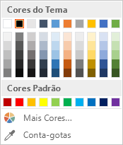
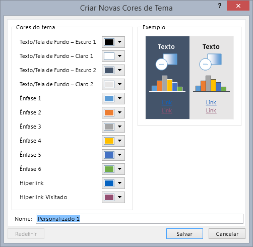
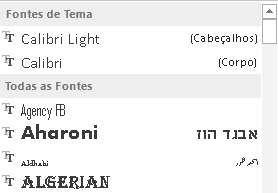
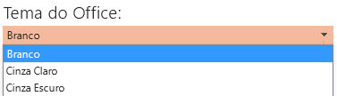
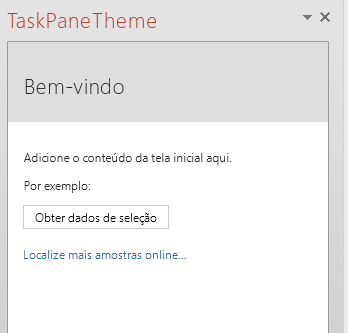
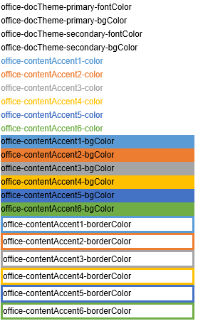

# <a name="use-document-themes-in-your-powerpoint-add-ins"></a>Usar temas de documentos em seus suplementos do PowerPoint


Um [tema do Office](https://support.office.com/en-US/Article/What-is-a-theme--7528ccc2-4327-4692-8bf5-9b5a3f2a5ef5) é composto, em parte, por um conjunto visualmente coordenado de fontes e cores que você pode aplicar em apresentações, documentos, planilhas e emails. Para aplicar ou personalizar o tema de uma apresentação no PowerPoint, use os grupos **Temas** e **Variantes** na guia **Design** da faixa de opções.  O PowerPoint atribui uma nova apresentação em branco com o **Tema do Office** padrão, mas você pode escolher outros temas disponíveis na guia **Design**, baixar temas adicionais do Office.com ou criar e personalizar seu próprio tema.

O OfficeThemes.css ajuda você a criar suplementos coordenados com o PowerPoint de duas maneiras:


-  **Em suplementos de conteúdo para PowerPoint** Use as classes de tema do documento do OfficeThemes.css para especificar fontes e cores que correspondam ao tema da apresentação na qual seu suplemento de conteúdo está inserido; e essas fontes e cores serão atualizadas dinamicamente se um usuário mudar ou personalizar o tema da apresentação.
    
-  **Em suplementos de painel de tarefa para PowerPoint** Use as classes de tema de interface de usuário do Office do OfficeThemes.css para especificar as mesmas fontes e cores de plano de fundo usadas na interface de usuário, para que seus suplementos de painel de tarefas correspondam às cores dos painéis de tarefas internos; e essas cores serão atualizadas dinamicamente se um usuário mudar o tema de interface do usuário do Office.
    

### <a name="document-theme-colors"></a>Cores de tema do documento

Todo tema de documento do Office define 12 cores. Dez dessas cores ficam disponíveis ao definir configurações de fonte, plano de fundo e outras configurações de cor em uma apresentação usando o seletor de cores:




Para exibir ou personalizar o conjunto completo de 12 cores de temas no PowerPoint, no grupo **Variantes** da guia **Design**, clique no menu suspenso **Mais**, aponte para **Cor** e clique em **Personalizar Cores** para exibir a caixa de diálogo **Criar Novas Cores de Tema**:




As quatro primeiras cores são para texto e planos de fundo. O texto criado com as cores claras sempre será legível sobre as cores escuras, e o texto criado com cores escuras sempre será legível sobre as cores claras. As seis cores seguintes são cores de ênfase que ficam sempre visíveis sobre as quatro cores de fundo possíveis. As duas últimas cores são para hiperlinks e hiperlinks visitados.


### <a name="document-theme-fonts"></a>Fontes de tema do documento

Cada tema de documento do Office também define duas fontes: uma para títulos e outra para o corpo do texto. O PowerPoint usa essas fontes para construir os estilos de texto automáticos. Além disso, as galerias **Estilos Rápidos** para texto e **WordArt** usam essas mesmas fontes de tema. Essas duas fontes ficam disponíveis como as duas primeiras seleções quando você usa o seletor de fonte:




Para exibir ou personalizar as fontes de tema no PowerPoint, no grupo **Variantes** da guia **Design**, clique no menu suspenso **Mais**, aponte para **Fontes** e clique em **Personalizar Fontes** para exibir a caixa de diálogo **Criar Novas Fontes de Tema**:


### <a name="office-ui-theme-fonts-and-colors"></a>Cores e fontes de tema da interface de usuário do Office

O Office também permite escolher entre vários temas predefinidos que especificam algumas das cores e fontes usadas na interface de usuário de todos os aplicativos do Office. Para fazer isso, use o menu suspenso **Arquivo**  >  **Conta**  >  **Tema do Office** (de qualquer aplicativo do Office).




O OfficeThemes.css inclui classes que você pode usar em seus suplementos de painel de tarefas do PowerPoint, para que eles usem essas mesmas fontes e cores. Isso permite que você projete seus suplementos de painel de tarefa para corresponder à aparência dos painéis de tarefas internos.


## <a name="using-officethemescss"></a>Como usar o OfficeThemes.css

Com o arquivo OfficeThemes.css com seus suplementos de conteúdo para PowerPoint, você pode coordenar a aparência de seu suplemento com o tema aplicado à apresentação com a qual ele está sendo executado. Com o arquivo OfficeThemes.css com seus suplementos de painel de tarefas para PowerPoint, você pode coordenar a aparência de seu suplemento com as fontes e cores da interface de usuário do Office.


### <a name="adding-the-officethemescss-file-to-your-project"></a>Como adicionar o arquivo OfficeThemes.css ao seu projeto

Use as etapas a seguir para adicionar o arquivo OfficeThemes.css ao seu projeto de suplemento e fazer referência a ele.


### <a name="to-add-officethemescss-to-your-visual-studio-project"></a>Para adicionar o OfficeThemes.css ao seu projeto do Visual Studio


1. No **Gerenciador de Soluções**, clique com o botão direito do mouse na pasta **Conteúdo** no projeto _**nome_projeto**_**Web**, aponte para **Adicionar** e clique em **Folha de Estilos**.
    
2. Dê o nome OfficeThemes para a nova folha de estilos.
    
     >**Importante**  A folha de estilo deve ser nomeada como OfficeThemes ou o recurso que atualiza dinamicamente as fontes e cores do suplemento quando um usuário muda o tema não funcionará.
3. Exclua a classe **body** padrão (`body {}`) no arquivo e copie e cole o código CSS a seguir no arquivo.
    
```
  /* The following classes describe the common theme information for office documents */ /* Basic Font and Background Colors for text */ .office-docTheme-primary-fontColor { color:#000000; } .office-docTheme-primary-bgColor { background-color:#ffffff; } .office-docTheme-secondary-fontColor { color: #000000; } .office-docTheme-secondary-bgColor { background-color: #ffffff; } /* Accent color definitions for fonts */ .office-contentAccent1-color { color:#5b9bd5; } .office-contentAccent2-color { color:#ed7d31; } .office-contentAccent3-color { color:#a5a5a5; } .office-contentAccent4-color { color:#ffc000; } .office-contentAccent5-color { color:#4472c4; } .office-contentAccent6-color { color:#70ad47; } /* Accent color for backgrounds */ .office-contentAccent1-bgColor { background-color:#5b9bd5; } .office-contentAccent2-bgColor { background-color:#ed7d31; } .office-contentAccent3-bgColor { background-color:#a5a5a5; } .office-contentAccent4-bgColor { background-color:#ffc000; } .office-contentAccent5-bgColor { background-color:#4472c4; } .office-contentAccent6-bgColor { background-color:#70ad47; } /* Accent color for borders */ .office-contentAccent1-borderColor { border-color:#5b9bd5; } .office-contentAccent2-borderColor { border-color:#ed7d31; } .office-contentAccent3-borderColor { border-color:#a5a5a5; } .office-contentAccent4-borderColor { border-color:#ffc000; } .office-contentAccent5-borderColor { border-color:#4472c4; } .office-contentAccent6-borderColor { border-color:#70ad47; } /* links */ .office-a { color: #0563c1; } .office-a:visited { color: #954f72; } /* Body Fonts */ .office-bodyFont-eastAsian { } /* East Asian name of the Font */ .office-bodyFont-latin { font-family:"Calibri"; } /* Latin name of the Font */ .office-bodyFont-script { } /* Script name of the Font */ .office-bodyFont-localized { font-family:"Calibri"; } /* Localized name of the Font. Corresponds to the default font of the culture currently used in Office.*/ /* Headers Font */ .office-headerFont-eastAsian { } .office-headerFont-latin { font-family:"Calibri Light"; } .office-headerFont-script { } .office-headerFont-localized { font-family:"Calibri Light"; } /* The following classes define font and background colors for Office UI themes. These classes should only be used in task pane add-ins */ /* Basic Font and Background Colors for PPT */ .office-officeTheme-primary-fontColor { color:#b83b1d; } .office-officeTheme-primary-bgColor { background-color:#dedede; } .office-officeTheme-secondary-fontColor { color:#262626; } .office-officeTheme-secondary-bgColor { background-color:#ffffff; } 
```

4. Se você estiver usando uma ferramenta diferente do Visual Studio para criar seu suplemento, copie o código CSS da Etapa 3 em um arquivo de texto e salve-o OfficeThemes.css.
    

### <a name="referencing-officethemescss-in-your-add-ins-html-pages"></a>Referência ao OfficeThemes.css nas páginas HTML de seu suplemento

Para usar o arquivo OfficeThemes.css em seu projeto de suplemento, adicione uma marca `<link>`que faz referência ao arquivo OfficeThemes.css dentro da marca `<head>`das páginas da Web (como um arquivo .html, .aspx ou .php) que implementa a interface de usuário de seu suplemento neste formato:


```HTML
<link href="<local_path_to_OfficeThemes.css> " rel="stylesheet" type="text/css" />
```

Para fazer isso no Visual Studio, execute estas etapas.


### <a name="to-reference-officethemescss-in-your-add-in-for-powerpoint"></a>Para fazer referência ao OfficeThemes.css em seu suplemento para PowerPoint


1. No Visual Studio de 2015, abra ou crie um novo projeto de **Suplemento do Office**.
    
2. Nas páginas HTML que implementam a interface de usuário de seu suplemento, como Home.html no modelo padrão, adicione a seguinte marca `<link>`dentro da marca `<head>` que faz referência ao arquivo OfficeThemes.css:
    
```HTML
  <link href="../../Content/OfficeThemes.css" rel="stylesheet" type="text/css" />
```

Se você estiver criando seu suplemento com uma ferramenta diferente do Visual Studio, adicione uma marca `<link>` com o mesmo formato, especificando um caminho relativo até a cópia de OfficeThemes.css que será implantada com seu suplemento.


### <a name="using-officethemescss-document-theme-classes-in-your-content-add-ins-html-page"></a>Como usar classes de tema de documento do OfficeThemes.css na página HTML de seu suplemento de conteúdo

Veja a seguir um exemplo simples de HTML em um suplemento de conteúdo que usa as classes de tema de documento do OfficeTheme.css. Para obter detalhes sobre as classes de OfficeThemes.css que correspondem às 12 cores e às duas fontes usadas no tema de um documento, confira [Classes de temas para suplementos de conteúdo](#theme-classes-for-content-add-ins).


```HTML
<body> <div id="themeSample" class="office-docTheme-primary-fontColor "> <h1 class="office-headerFont-latin">Hello world!</h1> <h1 class="office-headerFont-latin office-contentAccent1-bgColor">Hello world!</h1> <h1 class="office-headerFont-latin office-contentAccent2-bgColor">Hello world!</h1> <h1 class="office-headerFont-latin office-contentAccent3-bgColor">Hello world!</h1> <h1 class="office-headerFont-latin office-contentAccent4-bgColor">Hello world!</h1> <h1 class="office-headerFont-latin office-contentAccent5-bgColor">Hello world!</h1> <h1 class="office-headerFont-latin office-contentAccent6-bgColor">Hello world!</h1> <p class="office-bodyFont-latin office-docTheme-secondary-fontColor">Hello world!</p> </div> </body>
```

No tempo de execução, quando inserido em uma apresentação que usa o **Tema do Office** padrão, o suplemento de conteúdo é processado da seguinte maneira:


Se você alterar a apresentação a fim de usar outro tema ou personalizar o tema da apresentação, as fontes e cores especificadas com classes do OfficeThemes.css serão atualizadas de forma dinâmica a fim de corresponder com as fontes e cores do tema da apresentação. Com o mesmo exemplo de HTML usado acima, se a apresentação na qual o suplemento está inserido usar o tema **Faceta**, o processamento do suplemento ficará assim:


### <a name="using-officethemescss-office-ui-theme-classes-in-your-task-pane-add-ins-html-page"></a>Como usar classes de tema de interface de usuário do OfficeThemes.css na página HTML de seu suplemento de painel de tarefas

Além do tema do documento, os usuários podem personalizar o esquema de cores da interface de usuário do Office para todos os aplicativos do Office usando a caixa suspensa **Arquivo**  >  **Conta**  >  **Tema do Office**.

Veja a seguir um exemplo simples de HTML em um suplemento de painel de tarefa que usa classes do OfficeTheme.css para especificar a cor da fonte e cor de fundo. Para obter detalhes sobre as classes OfficeThemes.css que correspondem às fontes e cores do tema de interface de usuário do Office, confira [Classes de tema para suplementos de painel de tarefas](#theme-classes-for-task-pane-add-ins).


```HTML
<body> <div id="content-header" class="office-officeTheme-primary-fontColor office-officeTheme-primary-bgColor"> <div class="padding"> <h1>Welcome</h1> </div> </div> <div id="content-main" class="office-officeTheme-secondary-fontColor office-officeTheme-secondary-bgColor"> <div class="padding"> <p>Add home screen content here.</p> <p>For example:</p> <button id="get-data-from-selection">Get data from selection</button> <p> <a target="_blank" class="office-a" href="https://go.microsoft.com/fwlink/?LinkId=276812"> Find more samples online... </a> </p> </div> </div> </body> 
```

Durante a execução no PowerPoint com **Arquivo**  >  **Conta**  >  **Tema do Office** definido como **Branco**, o suplemento de painel tarefa será renderizado da seguinte maneira:


Se você alterar o **OfficeTheme** para **Cinza Escuro**, as fontes e cores especificadas com classes do OfficeThemes.css são atualizadas dinamicamente para renderizar da seguinte maneira:





## <a name="officethemecss-classes"></a>Classes do OfficeTheme.css


O arquivo OfficeThemes.css contém dois conjuntos de classes que você pode usar com seus suplementos de painel de tarefa e de conteúdo para o PowerPoint.


### <a name="theme-classes-for-content-add-ins"></a>Classes de tema para suplementos de conteúdo


O arquivo OfficeThemes.css fornece classes que correspondem às duas fontes e 12 cores usadas no tema de um documento. Essas classes são apropriadas para uso com suplementos de conteúdo do PowerPoint, para que as fontes e cores de seu suplemento correspondam com a apresentação na qual ele está inserido.


**Fontes de tema para suplementos de conteúdo**


|**Classe**|**Descrição**|
|:-----|:-----|
| `office-bodyFont-eastAsian`|Nome da fonte do corpo no Leste Asiático.|
| `office-bodyFont-latin`|Nome latino da fonte do corpo. "Calabri" padrão|
| `office-bodyFont-script`|Nome de script da fonte do corpo.|
| `office-bodyFont-localized`|Nome localizado da fonte do corpo. Especifica o nome da fonte padrão de acordo com a cultura usado no momento no Office.|
| `office-headerFont-eastAsian`|Nome da fonte dos cabeçalhos no Leste Asiático.|
| `office-headerFont-latin`|Nome latino da fonte dos cabeçalhos. "Calabri Light" padrão|
| `office-headerFont-script`|Nome de script da fonte dos cabeçalhos.|
| `office-headerFont-localized`|Nome localizado da fonte dos cabeçalhos. Especifica o nome da fonte padrão de acordo com a cultura usado no momento no Office.|

**Cores de tema para suplementos de conteúdo**


|**Classe**|**Descrição**|
|:-----|:-----|
| `office-docTheme-primary-fontColor`|Cor da fonte principal. Padrão #000000|
| `office-docTheme-primary-bgColor`|Cor de plano de fundo da fonte principal. Padrão #FFFFFF|
| `office-docTheme-secondary-fontColor`|Cor da fonte secundária. Padrão #000000|
| `office-docTheme-secondary-bgColor`|Cor de plano de fundo da fonte secundária. Padrão #FFFFFF|
| `office-contentAccent1-color`|Cor de destaque 1 da fonte. Padrão #5B9BD5|
| `office-contentAccent2-color`|Cor de destaque 2 da fonte. Padrão #ED7D31|
| `office-contentAccent3-color`|Cor de destaque 3 da fonte. Padrão #A5A5A5|
| `office-contentAccent4-color`|Cor de destaque 4 da fonte. Padrão #FFC000|
| `office-contentAccent5-color`|Cor de destaque 5 da fonte. Padrão #4472C4|
| `office-contentAccent6-color`|Cor de destaque 6 da fonte. Padrão #70AD47|
| `office-contentAccent1-bgColor`|Cor de destaque 1 do plano de fundo. Padrão #5B9BD5|
| `office-contentAccent2-bgColor`|Cor de destaque 2 do plano de fundo. Padrão #ED7D31|
| `office-contentAccent3-bgColor`|Cor de destaque 3 do plano de fundo. Padrão #A5A5A5|
| `office-contentAccent4-bgColor`|Cor de destaque 4 do plano de fundo. Padrão #FFC000|
| `office-contentAccent5-bgColor`|Cor de destaque 5 do plano de fundo. Padrão #4472C4|
| `office-contentAccent6-bgColor`|Cor de destaque 6 do plano de fundo. Padrão #70AD47|
| `office-contentAccent1-borderColor`|Cor de destaque 1 da borda. Padrão #5B9BD5|
| `office-contentAccent2-borderColor`|Cor de destaque 2 da borda. Padrão #ED7D31|
| `office-contentAccent3-borderColor`|Cor de destaque 3 da borda. Padrão #A5A5A5|
| `office-contentAccent4-borderColor`|Cor de destaque 4 da borda. Padrão #FFC000|
| `office-contentAccent5-borderColor`|Cor de destaque 5 da borda. Padrão #4472C4|
| `office-contentAccent6-borderColor`|Cor de destaque 6 da borda. Padrão #70AD47|
| `office-a`|Cor do hiperlink. Padrão #0563C1|
| `office-a:visited`|Cor do hiperlink visitado. Padrão #954F72|
A captura de tela a seguir mostra exemplos de todas as classes de cores do tema (exceto as cores dos dois hiperlinks) atribuídas ao texto do suplemento ao usar o tema padrão do Office.





### <a name="theme-classes-for-task-pane-add-ins"></a>Classes de tema para suplementos de painel de tarefas


O arquivo OfficeThemes.css fornece classes que correspondem às quatro cores atribuídas a fontes e planos de fundo usados pelo tema de interface de usuário do aplicativo do Office. Essas classes são apropriadas para uso com suplementos de tarefas do PowerPoint, para que as cores de seu suplemento correspondam com os painéis de tarefa internos no Office.


**Fonte e cores de plano de fundo do tema para suplementos de painel de tarefas**


|**Classe**|**Descrição**|
|:-----|:-----|
| `office-officeTheme-primary-fontColor`|Cor da fonte principal. Padrão: #B83B1D|
| `office-officeTheme-primary-bgColor`|Cor principal do plano de fundo. Padrão #DEDEDE|
| `office-officeTheme-secondary-fontColor`|Cor da fonte secundária. Padrão #262626|
| `office-officeTheme-secondary-bgColor`|Cor secundária do plano de fundo. Padrão #FFFFFF|

## <a name="additional-resources"></a>Recursos adicionais

- [Criar suplementos de painel de tarefas e de conteúdo para o PowerPoint](../powerpoint/powerpoint-add-ins.md)
