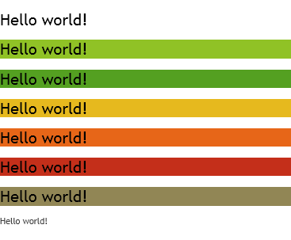

# <a name="use-document-themes-in-your-powerpoint-add-ins"></a><span data-ttu-id="7b50c-103">Usar temas de documentos em seus suplementos do PowerPoint</span><span class="sxs-lookup"><span data-stu-id="7b50c-103">Use document themes in your PowerPoint add-ins</span></span>

<span data-ttu-id="7b50c-p101">Um [tema do Office](https://support.office.com/article/create-your-own-theme-in-powerpoint-83e68627-2c17-454a-9fd8-62deb81951a6) é composto, em parte, por um conjunto visualmente coordenado de fontes e cores que é possível aplicar em apresentações, documentos, planilhas e emails. Para aplicar ou personalizar o tema de uma apresentação no PowerPoint, use os grupos **Temas** e **Variantes** na guia **Design** da faixa de opções. O PowerPoint atribui uma nova apresentação em branco com o **Tema do Office** padrão, mas é possível escolher outros temas disponíveis na guia **Design**, baixar temas adicionais do Office.com ou criar e personalizar seu próprio tema.</span><span class="sxs-lookup"><span data-stu-id="7b50c-p101">An [Office theme](https://support.office.com/article/create-your-own-theme-in-powerpoint-83e68627-2c17-454a-9fd8-62deb81951a6) consists, in part, of a visually coordinated set of fonts and colors that you can apply to presentations, documents, worksheets, and emails. To apply or customize the theme of a presentation in PowerPoint, you use the **Themes** and **Variants** groups on **Design** tab of the ribbon. PowerPoint assigns a new blank presentation with the default **Office Theme**, but you can choose other themes available on the **Design** tab, download additional themes from Office.com, or create and customize your own theme.</span></span>

<span data-ttu-id="7b50c-107">O OfficeThemes.css ajuda a criar suplementos coordenados com o PowerPoint de duas maneiras:</span><span class="sxs-lookup"><span data-stu-id="7b50c-107">Using OfficeThemes.css, helps you design add-ins that are coordinated with PowerPoint in two ways:</span></span>

- <span data-ttu-id="7b50c-p102">**Em suplementos de conteúdo para PowerPoint**. Use as classes de tema do documento do OfficeThemes.css para especificar fontes e cores que correspondam ao tema da apresentação na qual seu suplemento de conteúdo está inserido; e essas fontes e cores serão atualizadas dinamicamente se um usuário mudar ou personalizar o tema da apresentação.</span><span class="sxs-lookup"><span data-stu-id="7b50c-p102">**In content add-ins for PowerPoint**. Use the document theme classes of OfficeThemes.css to specify fonts and colors that match the theme of the presentation your content add-in is inserted into - and those fonts and colors will dynamically update if a user changes or customizes the presentation's theme.</span></span>
    
- <span data-ttu-id="7b50c-p103">**Em suplementos de painel de tarefa para PowerPoint**. Use as classes de tema de interface de usuário do Office do OfficeThemes.css para especificar as mesmas fontes e cores de plano de fundo usadas na interface de usuário, para que seus suplementos de painel de tarefas correspondam às cores dos painéis de tarefas internos; e essas cores serão atualizadas dinamicamente se um usuário mudar o tema de interface do usuário do Office.</span><span class="sxs-lookup"><span data-stu-id="7b50c-p103">**In task pane add-ins for PowerPoint**. Use the Office UI theme classes of OfficeThemes.css to specify the same fonts and background colors used in the UI so that your task pane add-ins will match the colors of built-in task panes - and those colors will dynamically update if a user changes the Office UI theme.</span></span>

### <a name="document-theme-colors"></a><span data-ttu-id="7b50c-112">Cores de tema do documento</span><span class="sxs-lookup"><span data-stu-id="7b50c-112">Document theme colors</span></span>

<span data-ttu-id="7b50c-p104">Todo tema de documento do Office define 12 cores. Dez dessas cores ficam disponíveis ao definir configurações de fonte, plano de fundo e outras configurações de cores em uma apresentação usando o seletor de cores.</span><span class="sxs-lookup"><span data-stu-id="7b50c-p104">Every Office document theme defines 12 colors. Ten of these colors are available when you set font, background, and other color settings in a presentation with the color picker.</span></span>


<span data-ttu-id="7b50c-116">Para exibir ou personalizar o conjunto completo de 12 cores de tema no PowerPoint, no grupo **variantes** na guia **design** , clique na lista suspensa **mais** e, em seguida, selecione **cores**  >  **Personalizar cores** para exibir a caixa de diálogo **criar novas cores de tema** .</span><span class="sxs-lookup"><span data-stu-id="7b50c-116">To view or customize the full set of 12 theme colors in PowerPoint, in the **Variants** group on the **Design** tab, click the **More** drop-down - then select **Colors** > **Customize Colors** to display the **Create New Theme Colors** dialog box.</span></span>


<span data-ttu-id="7b50c-p105">As quatro primeiras cores são para texto e planos de fundo. O texto criado com as cores claras sempre será legível sobre as cores escuras, e o texto criado com cores escuras sempre será legível sobre as cores claras. As seis cores seguintes são cores de ênfase que ficam sempre visíveis sobre as quatro cores de fundo possíveis. As duas últimas cores são para hiperlinks e hiperlinks visitados.</span><span class="sxs-lookup"><span data-stu-id="7b50c-p105">The first four colors are for text and backgrounds. Text that is created with the light colors will always be legible over the dark colors, and text that is created with dark colors will always be legible over the light colors. The next six are accent colors that are always visible over the four potential background colors. The last two colors are for hyperlinks and followed hyperlinks.</span></span>

### <a name="document-theme-fonts"></a><span data-ttu-id="7b50c-122">Fontes de tema do documento</span><span class="sxs-lookup"><span data-stu-id="7b50c-122">Document theme fonts</span></span>

<span data-ttu-id="7b50c-123">Cada tema de documento do Office também define duas fontes: uma para títulos e outra para o corpo do texto.</span><span class="sxs-lookup"><span data-stu-id="7b50c-123">Every Office document theme also defines two fonts -- one for headings and one for body text.</span></span> <span data-ttu-id="7b50c-124">O PowerPoint usa essas fontes para construir os estilos de texto automáticos.</span><span class="sxs-lookup"><span data-stu-id="7b50c-124">PowerPoint uses these fonts to construct automatic text styles.</span></span> <span data-ttu-id="7b50c-125">Além disso, as galerias de **estilos rápidos** para texto e **WordArt** usam essas fontes de tema.</span><span class="sxs-lookup"><span data-stu-id="7b50c-125">In addition, **Quick Styles** galleries for text and **WordArt** use these same theme fonts.</span></span> <span data-ttu-id="7b50c-126">Essas duas fontes ficam disponíveis como as duas primeiras seleções quando você usa o seletor de fonte.</span><span class="sxs-lookup"><span data-stu-id="7b50c-126">These two fonts are available as the first two selections when you select fonts with the font picker.</span></span>


<span data-ttu-id="7b50c-128">Para exibir ou personalizar fontes de tema no PowerPoint, no grupo **variantes** na guia **design** , clique na lista suspensa **mais** e, em seguida, selecione **fontes**  >  **Personalizar** fontes para exibir a caixa de diálogo **criar novas fontes de tema** .</span><span class="sxs-lookup"><span data-stu-id="7b50c-128">To view or customize theme fonts in PowerPoint, in the **Variants** group on the **Design** tab, click the **More** drop-down - then select **Fonts** > **Customize Fonts** to display the **Create New Theme Fonts** dialog box.</span></span>


### <a name="office-ui-theme-fonts-and-colors"></a><span data-ttu-id="7b50c-130">Cores e fontes de tema da interface de usuário do Office</span><span class="sxs-lookup"><span data-stu-id="7b50c-130">Office UI theme fonts and colors</span></span>

<span data-ttu-id="7b50c-131">O Office também permite escolher entre vários temas predefinidos que especificam algumas das cores e fontes usadas na interface de usuário de todos os aplicativos do Office.</span><span class="sxs-lookup"><span data-stu-id="7b50c-131">Office also lets you choose between several predefined themes that specify some of the colors and fonts used in the UI of all Office applications.</span></span> <span data-ttu-id="7b50c-132">Para fazer isso, você usa a lista suspensa de temas de conta de **arquivo**  >  **Account**  >  do**Office** (de qualquer aplicativo do Office).</span><span class="sxs-lookup"><span data-stu-id="7b50c-132">To do that, you use the **File** > **Account** > **Office Theme** drop-down (from any Office application).</span></span>


<span data-ttu-id="7b50c-p108">O OfficeThemes.css inclui classes que você pode usar em seus suplementos de painel de tarefas do PowerPoint, para que eles usem essas mesmas fontes e cores. Isso permite que você projete seus suplementos de painel de tarefa para corresponder à aparência dos painéis de tarefas internos.</span><span class="sxs-lookup"><span data-stu-id="7b50c-p108">OfficeThemes.css includes classes that you can use in your task pane add-ins for PowerPoint so they will use these same fonts and colors. This lets you design your task pane add-ins that match the appearance of built-in task panes.</span></span>

## <a name="using-officethemescss"></a><span data-ttu-id="7b50c-136">Como usar o OfficeThemes.css</span><span class="sxs-lookup"><span data-stu-id="7b50c-136">Using OfficeThemes.css</span></span>

<span data-ttu-id="7b50c-p109">Com o arquivo OfficeThemes.css com seus suplementos de conteúdo para PowerPoint, você pode coordenar a aparência de seu suplemento com o tema aplicado à apresentação com a qual ele está sendo executado. Com o arquivo OfficeThemes.css com seus suplementos de painel de tarefas para PowerPoint, você pode coordenar a aparência de seu suplemento com as fontes e cores da interface de usuário do Office.</span><span class="sxs-lookup"><span data-stu-id="7b50c-p109">Using the OfficeThemes.css file with your content add-ins for PowerPoint lets you coordinate the appearance of your add-in with the theme applied to the presentation it's running with. Using the OfficeThemes.css file with your task pane add-ins for PowerPoint lets you coordinate the appearance of your add-in with the fonts and colors of the Office UI.</span></span>

### <a name="adding-the-officethemescss-file-to-your-project"></a><span data-ttu-id="7b50c-139">Como adicionar o arquivo OfficeThemes.css ao seu projeto</span><span class="sxs-lookup"><span data-stu-id="7b50c-139">Adding the OfficeThemes.css file to your project</span></span>

<span data-ttu-id="7b50c-140">Use as etapas a seguir para adicionar o arquivo OfficeThemes.css ao seu projeto de suplemento e fazer referência a ele.</span><span class="sxs-lookup"><span data-stu-id="7b50c-140">Use the following steps to add and reference the OfficeThemes.css file to your add-in project.</span></span>

#### <a name="to-add-officethemescss-to-your-visual-studio-project"></a><span data-ttu-id="7b50c-141">Para adicionar o OfficeThemes.css ao seu projeto do Visual Studio</span><span class="sxs-lookup"><span data-stu-id="7b50c-141">To add OfficeThemes.css to your Visual Studio project</span></span>

> [!NOTE]
> <span data-ttu-id="7b50c-142">As etapas deste procedimento se aplicam apenas para Visual Studio 2015.</span><span class="sxs-lookup"><span data-stu-id="7b50c-142">The steps in this procedure only apply to Visual Studio 2015.</span></span> <span data-ttu-id="7b50c-143">Se você estiver usando o Visual Studio 2019, o arquivo OfficeThemes. CSS será criado automaticamente para todos os novos projetos de suplemento do PowerPoint que você criar.</span><span class="sxs-lookup"><span data-stu-id="7b50c-143">If you are using Visual Studio 2019, the OfficeThemes.css file is created automatically for any new PowerPoint add-in projects that you create.</span></span>

1. <span data-ttu-id="7b50c-144">No **Gerenciador de Soluções**, clique com o botão direito do mouse na pasta **Conteúdo** no projeto _**nome_projeto**_**Web**, aponte para **Adicionar** e selecione a **Folha de Estilos**.</span><span class="sxs-lookup"><span data-stu-id="7b50c-144">In **Solution Explorer**, right-click the **Content** folder in the _**project_name**_**Web** project, choose **Add**, and then select **Style Sheet**.</span></span>
    
2. <span data-ttu-id="7b50c-145">Dê o nome **OfficeThemes** para a nova folha de estilos.</span><span class="sxs-lookup"><span data-stu-id="7b50c-145">Name the new style sheet **OfficeThemes**.</span></span>
    
   > [!IMPORTANT]
   > <span data-ttu-id="7b50c-146">A folha de estilo deve ser nomeada como OfficeThemes ou o recurso que atualiza dinamicamente as fontes e cores do suplemento quando um usuário muda o tema não funcionará.</span><span class="sxs-lookup"><span data-stu-id="7b50c-146">The style sheet must be named OfficeThemes, or the feature that dynamically updates add-in fonts and colors when a user changes the theme won't work.</span></span>
   
3. <span data-ttu-id="7b50c-147">Exclua a classe **body** padrão (`body {}`) no arquivo e copie e cole o código CSS a seguir no arquivo.</span><span class="sxs-lookup"><span data-stu-id="7b50c-147">Delete the default **body** class (`body {}`) in the file, and copy and paste the following CSS code into the file.</span></span>
    
    ```css
    /* The following classes describe the common theme information for office documents */ 

    /* Basic Font and Background Colors for text */ 
    .office-docTheme-primary-fontColor { color:#000000; } 
    .office-docTheme-primary-bgColor { background-color:#ffffff; } 
    .office-docTheme-secondary-fontColor { color: #000000; } 
    .office-docTheme-secondary-bgColor { background-color: #ffffff; } 

    /* Accent color definitions for fonts */ 
    .office-contentAccent1-color { color:#5b9bd5; } 
    .office-contentAccent2-color { color:#ed7d31; } 
    .office-contentAccent3-color { color:#a5a5a5; } 
    .office-contentAccent4-color { color:#ffc000; } 
    .office-contentAccent5-color { color:#4472c4; } 
    .office-contentAccent6-color { color:#70ad47; } 

    /* Accent color for backgrounds */ 
    .office-contentAccent1-bgColor { background-color:#5b9bd5; } 
    .office-contentAccent2-bgColor { background-color:#ed7d31; } 
    .office-contentAccent3-bgColor { background-color:#a5a5a5; } 
    .office-contentAccent4-bgColor { background-color:#ffc000; } 
    .office-contentAccent5-bgColor { background-color:#4472c4; } 
    .office-contentAccent6-bgColor { background-color:#70ad47; } 

    /* Accent color for borders */ 
    .office-contentAccent1-borderColor { border-color:#5b9bd5; } 
    .office-contentAccent2-borderColor { border-color:#ed7d31; } 
    .office-contentAccent3-borderColor { border-color:#a5a5a5; } 
    .office-contentAccent4-borderColor { border-color:#ffc000; } 
    .office-contentAccent5-borderColor { border-color:#4472c4; } 
    .office-contentAccent6-borderColor { border-color:#70ad47; } 

    /* links */ 
    .office-a { color: #0563c1; } 
    .office-a:visited { color: #954f72; } 

    /* Body Fonts */ 
    .office-bodyFont-eastAsian { } /* East Asian name of the Font */ 
    .office-bodyFont-latin { font-family:"Calibri"; } /* Latin name of the Font */ 
    .office-bodyFont-script { } /* Script name of the Font */ 
    .office-bodyFont-localized { font-family:"Calibri"; } /* Localized name of the Font. Corresponds to the default font of the culture currently used in Office.*/ 

    /* Headers Font */ 
    .office-headerFont-eastAsian { } 
    .office-headerFont-latin { font-family:"Calibri Light"; } 
    .office-headerFont-script { } 
    .office-headerFont-localized { font-family:"Calibri Light"; } 

    /* The following classes define font and background colors for Office UI themes. These classes should only be used in task pane add-ins */ 

    /* Basic Font and Background Colors for PPT */ 
    .office-officeTheme-primary-fontColor { color:#b83b1d; } 
    .office-officeTheme-primary-bgColor { background-color:#dedede; } 
    .office-officeTheme-secondary-fontColor { color:#262626; } 
    .office-officeTheme-secondary-bgColor { background-color:#ffffff; }
    ```
4. <span data-ttu-id="7b50c-148">Se você estiver usando uma ferramenta diferente do Visual Studio para criar seu suplemento, copie o código CSS da Etapa 3 em um arquivo de texto e salve-o OfficeThemes.css.</span><span class="sxs-lookup"><span data-stu-id="7b50c-148">If you are using a tool other than Visual Studio to create your add-in, copy the CSS code from step 3 into a text file, making sure to save the file as OfficeThemes.css.</span></span>   

### <a name="referencing-officethemescss-in-your-add-ins-html-pages"></a><span data-ttu-id="7b50c-149">Referência ao OfficeThemes.css nas páginas HTML de seu suplemento</span><span class="sxs-lookup"><span data-stu-id="7b50c-149">Referencing OfficeThemes.css in your add-in's HTML pages</span></span>

<span data-ttu-id="7b50c-150">Para usar o arquivo OfficeThemes.css em seu projeto de suplemento, adicione uma `<link>`marca que faz referência ao arquivo OfficeThemes.css dentro da marca `<head>`das páginas da Web (como um arquivo .html, .aspx ou .php) que implementa a interface de usuário de seu suplemento neste formato:</span><span class="sxs-lookup"><span data-stu-id="7b50c-150">To use the OfficeThemes.css file in your add-in project, add a `<link>` tag that references the OfficeThemes.css file inside the `<head>` tag of the web pages (such as an .html, .aspx, or .php file) that implement the UI of your add-in in this format:</span></span>

```HTML
<link href="<local_path_to_OfficeThemes.css>" rel="stylesheet" type="text/css" />
```

<span data-ttu-id="7b50c-151">Para fazer isso no Visual Studio, execute estas etapas.</span><span class="sxs-lookup"><span data-stu-id="7b50c-151">To do this in Visual Studio, follow these steps.</span></span>

#### <a name="to-reference-officethemescss-in-your-add-in-for-powerpoint"></a><span data-ttu-id="7b50c-152">Para fazer referência ao OfficeThemes.css em seu suplemento para PowerPoint</span><span class="sxs-lookup"><span data-stu-id="7b50c-152">To reference OfficeThemes.css in your add-in for PowerPoint</span></span>

1. <span data-ttu-id="7b50c-153">Escolha **Criar um novo projeto**.</span><span class="sxs-lookup"><span data-stu-id="7b50c-153">Choose **Create a new project**.</span></span>

2. <span data-ttu-id="7b50c-154">Usando a caixa de pesquisa, insira **suplemento**.</span><span class="sxs-lookup"><span data-stu-id="7b50c-154">Using the search box, enter **add-in**.</span></span> <span data-ttu-id="7b50c-155">Escolha \*\*Suplemento do PowerPoint Web \*\*, em seguida, selecione **Próximo**.</span><span class="sxs-lookup"><span data-stu-id="7b50c-155">Choose **PowerPoint Web Add-in**, then select **Next**.</span></span>

3. <span data-ttu-id="7b50c-156">Nomeie seu projeto e selecione **Criar**.</span><span class="sxs-lookup"><span data-stu-id="7b50c-156">Name your project and select **Create**.</span></span>

3. <span data-ttu-id="7b50c-157">Na caixa de diálogo **Criar suplementos do Office**, escolha **Adicionar novas funcionalidades ao PowerPoint**e depois **Concluir** para criar o projeto.</span><span class="sxs-lookup"><span data-stu-id="7b50c-157">In the **Create Office Add-in** dialog window, choose **Add new functionalities to PowerPoint**, and then choose **Finish** to create the project.</span></span>

4. <span data-ttu-id="7b50c-p112">O Visual Studio cria uma solução, e os dois projetos dele são exibidos no **Gerenciador de Soluções**. O arquivo **Home.html** é aberto no Visual Studio.</span><span class="sxs-lookup"><span data-stu-id="7b50c-p112">Visual Studio creates a solution and its two projects appear in **Solution Explorer**. The **Home.html** file opens in Visual Studio.</span></span>

5. <span data-ttu-id="7b50c-160">Nas páginas HTML que implementam a interface de usuário de seu suplemento, como Home.html no modelo padrão, adicione a seguinte marca `<link>`dentro da marca `<head>` que faz referência ao arquivo OfficeThemes.css:</span><span class="sxs-lookup"><span data-stu-id="7b50c-160">In the HTML pages that implement the UI of your add-in, such as Home.html in the default template, add the following `<link>` tag inside the `<head>` tag that references the OfficeThemes.css file:</span></span>
    
    ```HTML
    <link href="../../Content/OfficeThemes.css" rel="stylesheet" type="text/css" />
    ```

<span data-ttu-id="7b50c-161">Se você estiver criando seu suplemento com uma ferramenta diferente do Visual Studio, adicione uma marca `<link>` com o mesmo formato, especificando um caminho relativo até a cópia de OfficeThemes.css que será implantada com seu suplemento.</span><span class="sxs-lookup"><span data-stu-id="7b50c-161">If you are creating your add-in with a tool other than Visual Studio, add a `<link>` tag with the same format specifying a relative path to the copy of OfficeThemes.css that will be deployed with your add-in.</span></span>

### <a name="using-officethemescss-document-theme-classes-in-your-content-add-ins-html-page"></a><span data-ttu-id="7b50c-162">Como usar classes de tema de documento do OfficeThemes.css na página HTML de seu suplemento de conteúdo</span><span class="sxs-lookup"><span data-stu-id="7b50c-162">Using OfficeThemes.css document theme classes in your content add-in's HTML page</span></span>

<span data-ttu-id="7b50c-p113">Veja a seguir um exemplo simples de HTML em um suplemento de conteúdo que usa as classes de tema de documento do OfficeTheme.css. Para obter detalhes sobre as classes de OfficeThemes.css que correspondem às 12 cores e às duas fontes usadas no tema de um documento, confira [Classes de temas para suplementos de conteúdo](#theme-classes-for-content-add-ins).</span><span class="sxs-lookup"><span data-stu-id="7b50c-p113">The following shows a simple example of HTML in a content add-in that uses the OfficeTheme.css document theme classes. For details about the OfficeThemes.css classes that correspond to the 12 colors and 2 fonts used in a document theme, see [Theme classes for content add-ins](#theme-classes-for-content-add-ins).</span></span>

```HTML
<body>
    <div id="themeSample" class="office-docTheme-primary-fontColor ">
        <h1 class="office-headerFont-latin">Hello world!</h1> 
        <h1 class="office-headerFont-latin office-contentAccent1-bgColor">Hello world!</h1> 
        <h1 class="office-headerFont-latin office-contentAccent2-bgColor">Hello world!</h1> 
        <h1 class="office-headerFont-latin office-contentAccent3-bgColor">Hello world!</h1> 
        <h1 class="office-headerFont-latin office-contentAccent4-bgColor">Hello world!</h1> 
        <h1 class="office-headerFont-latin office-contentAccent5-bgColor">Hello world!</h1> 
        <h1 class="office-headerFont-latin office-contentAccent6-bgColor">Hello world!</h1> 
        <p class="office-bodyFont-latin office-docTheme-secondary-fontColor">Hello world!</p> 
    </div>
</body>
```

<span data-ttu-id="7b50c-165">No tempo de execução, quando inserido em uma apresentação que usa o **tema do Office**padrão, o suplemento de conteúdo é renderizado dessa forma.</span><span class="sxs-lookup"><span data-stu-id="7b50c-165">At runtime, when inserted into a presentation that uses the default **Office Theme**, the content add-in is rendered like this.</span></span>


<span data-ttu-id="7b50c-p114">Se você alterar a apresentação a fim de usar outro tema ou personalizar o tema da apresentação, as fontes e cores especificadas com classes do OfficeThemes.css serão atualizadas de forma dinâmica a fim de corresponder com as fontes e cores do tema da apresentação. Com o mesmo exemplo de HTML usado acima, se a apresentação na qual o suplemento está inserido usar o tema **Faceta**, o processamento do suplemento ficará assim.</span><span class="sxs-lookup"><span data-stu-id="7b50c-p114">If you change the presentation to use another theme or customize the presentation's theme, the fonts and colors specified with OfficeThemes.css classes will dynamically update to correspond to the fonts and colors of the presentation's theme. Using the same HTML example as above, if the presentation the add-in is inserted into uses the **Facet** theme, the add-in rendering will look like this.</span></span>




### <a name="using-officethemescss-office-ui-theme-classes-in-your-task-pane-add-ins-html-page"></a><span data-ttu-id="7b50c-170">Como usar classes de tema de interface de usuário do OfficeThemes.css na página HTML de seu suplemento de painel de tarefas</span><span class="sxs-lookup"><span data-stu-id="7b50c-170">Using OfficeThemes.css Office UI theme classes in your task pane add-in's HTML page</span></span>

<span data-ttu-id="7b50c-171">Além do tema do documento, os usuários podem personalizar o esquema de cores da interface de usuário do Office para todos os aplicativos do Office usando a caixa suspensa **Arquivo**  >  **Conta**  >  **Tema do Office**.</span><span class="sxs-lookup"><span data-stu-id="7b50c-171">In addition to the document theme, users can customize the color scheme of the Office user interface for all Office applications using the **File** > **Account** > **Office Theme** drop-down box.</span></span>

<span data-ttu-id="7b50c-p115">Veja a seguir um exemplo simples de HTML em um suplemento de painel de tarefa que usa classes do OfficeTheme.css para especificar a cor da fonte e cor de fundo. Para obter detalhes sobre as classes OfficeThemes.css que correspondem às fontes e cores do tema de interface de usuário do Office, confira [Classes de tema para suplementos de painel de tarefas](#theme-classes-for-task-pane-add-ins).</span><span class="sxs-lookup"><span data-stu-id="7b50c-p115">The following shows a simple example of HTML in a task pane add-in that uses OfficeTheme.css classes to specify font color and background color. For details about the OfficeThemes.css classes that correspond to fonts and colors of the Office UI theme, see [Theme classes for task pane add-ins](#theme-classes-for-task-pane-add-ins).</span></span>

```HTML
<body> 
    <div id="content-header" class="office-officeTheme-primary-fontColor office-officeTheme-primary-bgColor"> 
        <div class="padding">
            <h1>Welcome</h1>
        </div> 
    </div> 
    <div id="content-main" class="office-officeTheme-secondary-fontColor office-officeTheme-secondary-bgColor"> 
        <div class="padding"> 
            <p>Add home screen content here.</p> 
            <p>For example:</p> 
            <button id="get-data-from-selection">Get data from selection</button> 
            <p><a target="_blank" class="office-a" href="https://go.microsoft.com/fwlink/?LinkId=276812">Find more samples online...</a></p>
        </div>
    </div>
</body> 
```

<br/>

<span data-ttu-id="7b50c-174">Durante a execução no PowerPoint com **Arquivo**  >  **Conta**  >  **Tema do Office** definido como **Branco**, o suplemento de painel tarefa será renderizado da maneira a seguir.</span><span class="sxs-lookup"><span data-stu-id="7b50c-174">When running in PowerPoint with **File** > **Account** > **Office Theme** set to **White**, the task pane add-in is rendered like this.</span></span>


<br/>

<span data-ttu-id="7b50c-176">Se você alterar o **OfficeTheme** para **Cinza Escuro**, as fontes e cores especificadas com classes do OfficeThemes.css são atualizadas dinamicamente para renderizar da maneira a seguir.</span><span class="sxs-lookup"><span data-stu-id="7b50c-176">If you change **OfficeTheme** to **Dark Gray**, the fonts and colors specified with OfficeThemes.css classes will dynamically update to render like this.</span></span>


<br/>

## <a name="officethemecss-classes"></a><span data-ttu-id="7b50c-178">Classes do OfficeTheme.css</span><span class="sxs-lookup"><span data-stu-id="7b50c-178">OfficeTheme.css classes</span></span>

<span data-ttu-id="7b50c-179">O arquivo OfficeThemes.css contém dois conjuntos de classes que você pode usar com seus suplementos de painel de tarefa e de conteúdo para o PowerPoint.</span><span class="sxs-lookup"><span data-stu-id="7b50c-179">The OfficeThemes.css file contains two sets of classes you can use with your content and task pane add-ins for PowerPoint.</span></span>

### <a name="theme-classes-for-content-add-ins"></a><span data-ttu-id="7b50c-180">Classes de tema para suplementos de conteúdo</span><span class="sxs-lookup"><span data-stu-id="7b50c-180">Theme classes for content add-ins</span></span>

<span data-ttu-id="7b50c-p116">O arquivo OfficeThemes.css fornece classes que correspondem às duas fontes e 12 cores usadas no tema de um documento. Essas classes são apropriadas para uso com suplementos de conteúdo do PowerPoint, para que as fontes e cores de seu suplemento correspondam com a apresentação na qual ele está inserido.</span><span class="sxs-lookup"><span data-stu-id="7b50c-p116">The OfficeThemes.css file provides classes that correspond to the 2 fonts and 12 colors used in a document theme. These classes are appropriate to use with content add-ins for PowerPoint so that your add-in's fonts and colors will be coordinated with the presentation it's inserted into.</span></span>

#### <a name="theme-fonts-for-content-add-ins"></a><span data-ttu-id="7b50c-183">Fontes de tema para suplementos de conteúdo</span><span class="sxs-lookup"><span data-stu-id="7b50c-183">Theme fonts for content add-ins</span></span>

|<span data-ttu-id="7b50c-184">**Classe**</span><span class="sxs-lookup"><span data-stu-id="7b50c-184">**Class**</span></span>|<span data-ttu-id="7b50c-185">**Descrição**</span><span class="sxs-lookup"><span data-stu-id="7b50c-185">**Description**</span></span>|
|:-----|:-----|
| `office-bodyFont-eastAsian`|<span data-ttu-id="7b50c-186">Nome da fonte do corpo no Leste Asiático.</span><span class="sxs-lookup"><span data-stu-id="7b50c-186">East Asian name of the body font.</span></span>|
| `office-bodyFont-latin`|<span data-ttu-id="7b50c-p117">Nome latino da fonte do corpo. "Calabri" padrão</span><span class="sxs-lookup"><span data-stu-id="7b50c-p117">Latin name of the body font. Default "Calabri"</span></span>|
| `office-bodyFont-script`|<span data-ttu-id="7b50c-189">Nome de script da fonte do corpo.</span><span class="sxs-lookup"><span data-stu-id="7b50c-189">Script name of the body font.</span></span>|
| `office-bodyFont-localized`|<span data-ttu-id="7b50c-p118">Nome localizado da fonte do corpo. Especifica o nome da fonte padrão de acordo com a cultura usado no momento no Office.</span><span class="sxs-lookup"><span data-stu-id="7b50c-p118">Localized name of the body font. Specifies the default font name according to the culture currently used in Office.</span></span>|
| `office-headerFont-eastAsian`|<span data-ttu-id="7b50c-192">Nome da fonte dos cabeçalhos no Leste Asiático.</span><span class="sxs-lookup"><span data-stu-id="7b50c-192">East Asian name of the headers font.</span></span>|
| `office-headerFont-latin`|<span data-ttu-id="7b50c-p119">Nome latino da fonte dos cabeçalhos. "Calabri Light" padrão</span><span class="sxs-lookup"><span data-stu-id="7b50c-p119">Latin name of the headers font. Default "Calabri Light"</span></span>|
| `office-headerFont-script`|<span data-ttu-id="7b50c-195">Nome de script da fonte dos cabeçalhos.</span><span class="sxs-lookup"><span data-stu-id="7b50c-195">Script name of the headers font.</span></span>|
| `office-headerFont-localized`|<span data-ttu-id="7b50c-p120">Nome localizado da fonte dos cabeçalhos. Especifica o nome da fonte padrão de acordo com a cultura usado no momento no Office.</span><span class="sxs-lookup"><span data-stu-id="7b50c-p120">Localized name of the headers font. Specifies the default font name according to the culture currently used in Office.</span></span>|

<br/>

#### <a name="theme-colors-for-content-add-ins"></a><span data-ttu-id="7b50c-198">Cores de tema para suplementos de conteúdo</span><span class="sxs-lookup"><span data-stu-id="7b50c-198">Theme colors for content add-ins</span></span>

|<span data-ttu-id="7b50c-199">**Classe**</span><span class="sxs-lookup"><span data-stu-id="7b50c-199">**Class**</span></span>|<span data-ttu-id="7b50c-200">**Descrição**</span><span class="sxs-lookup"><span data-stu-id="7b50c-200">**Description**</span></span>|
|:-----|:-----|
| `office-docTheme-primary-fontColor`|<span data-ttu-id="7b50c-p121">Cor da fonte principal. Padrão #000000</span><span class="sxs-lookup"><span data-stu-id="7b50c-p121">Primary font color. Default #000000</span></span>|
| `office-docTheme-primary-bgColor`|<span data-ttu-id="7b50c-p122">Cor de plano de fundo da fonte principal. Padrão #FFFFFF</span><span class="sxs-lookup"><span data-stu-id="7b50c-p122">Primary font background color. Default #FFFFFF</span></span>|
| `office-docTheme-secondary-fontColor`|<span data-ttu-id="7b50c-p123">Cor da fonte secundária. Padrão #000000</span><span class="sxs-lookup"><span data-stu-id="7b50c-p123">Secondary font color. Default #000000</span></span>|
| `office-docTheme-secondary-bgColor`|<span data-ttu-id="7b50c-p124">Cor de plano de fundo da fonte secundária. Padrão #FFFFFF</span><span class="sxs-lookup"><span data-stu-id="7b50c-p124">Secondary font background color. Default #FFFFFF</span></span>|
| `office-contentAccent1-color`|<span data-ttu-id="7b50c-p125">Cor de destaque 1 da fonte. Padrão #5B9BD5</span><span class="sxs-lookup"><span data-stu-id="7b50c-p125">Font accent color 1. Default #5B9BD5</span></span>|
| `office-contentAccent2-color`|<span data-ttu-id="7b50c-p126">Cor de destaque 2 da fonte. Padrão #ED7D31</span><span class="sxs-lookup"><span data-stu-id="7b50c-p126">Font accent color 2. Default #ED7D31</span></span>|
| `office-contentAccent3-color`|<span data-ttu-id="7b50c-p127">Cor de destaque 3 da fonte. Padrão #A5A5A5</span><span class="sxs-lookup"><span data-stu-id="7b50c-p127">Font accent color 3. Default #A5A5A5</span></span>|
| `office-contentAccent4-color`|<span data-ttu-id="7b50c-p128">Cor de destaque 4 da fonte. Padrão #FFC000</span><span class="sxs-lookup"><span data-stu-id="7b50c-p128">Font accent color 4. Default #FFC000</span></span>|
| `office-contentAccent5-color`|<span data-ttu-id="7b50c-p129">Cor de destaque 5 da fonte. Padrão #4472C4</span><span class="sxs-lookup"><span data-stu-id="7b50c-p129">Font accent color 5. Default #4472C4</span></span>|
| `office-contentAccent6-color`|<span data-ttu-id="7b50c-p130">Cor de destaque 6 da fonte. Padrão #70AD47</span><span class="sxs-lookup"><span data-stu-id="7b50c-p130">Font accent color 6. Default #70AD47</span></span>|
| `office-contentAccent1-bgColor`|<span data-ttu-id="7b50c-p131">Cor de destaque 1 do plano de fundo. Padrão #5B9BD5</span><span class="sxs-lookup"><span data-stu-id="7b50c-p131">Background accent color 1. Default #5B9BD5</span></span>|
| `office-contentAccent2-bgColor`|<span data-ttu-id="7b50c-p132">Cor de destaque 2 do plano de fundo. Padrão #ED7D31</span><span class="sxs-lookup"><span data-stu-id="7b50c-p132">Background accent color 2. Default #ED7D31</span></span>|
| `office-contentAccent3-bgColor`|<span data-ttu-id="7b50c-p133">Cor de destaque 3 do plano de fundo. Padrão #A5A5A5</span><span class="sxs-lookup"><span data-stu-id="7b50c-p133">Background accent color 3. Default #A5A5A5</span></span>|
| `office-contentAccent4-bgColor`|<span data-ttu-id="7b50c-p134">Cor de destaque 4 do plano de fundo. Padrão #FFC000</span><span class="sxs-lookup"><span data-stu-id="7b50c-p134">Background accent color 4. Default #FFC000</span></span>|
| `office-contentAccent5-bgColor`|<span data-ttu-id="7b50c-p135">Cor de destaque 5 do plano de fundo. Padrão #4472C4</span><span class="sxs-lookup"><span data-stu-id="7b50c-p135">Background accent color 5. Default #4472C4</span></span>|
| `office-contentAccent6-bgColor`|<span data-ttu-id="7b50c-p136">Cor de destaque 6 do plano de fundo. Padrão #70AD47</span><span class="sxs-lookup"><span data-stu-id="7b50c-p136">Background accent color 6. Default #70AD47</span></span>|
| `office-contentAccent1-borderColor`|<span data-ttu-id="7b50c-p137">Cor de destaque 1 da borda. Padrão #5B9BD5</span><span class="sxs-lookup"><span data-stu-id="7b50c-p137">Border accent color 1. Default #5B9BD5</span></span>|
| `office-contentAccent2-borderColor`|<span data-ttu-id="7b50c-p138">Cor de destaque 2 da borda. Padrão #ED7D31</span><span class="sxs-lookup"><span data-stu-id="7b50c-p138">Border accent color 2. Default #ED7D31</span></span>|
| `office-contentAccent3-borderColor`|<span data-ttu-id="7b50c-p139">Cor de destaque 3 da borda. Padrão #A5A5A5</span><span class="sxs-lookup"><span data-stu-id="7b50c-p139">Border accent color 3. Default #A5A5A5</span></span>|
| `office-contentAccent4-borderColor`|<span data-ttu-id="7b50c-p140">Cor de destaque 4 da borda. Padrão #FFC000</span><span class="sxs-lookup"><span data-stu-id="7b50c-p140">Border accent color 4. Default #FFC000</span></span>|
| `office-contentAccent5-borderColor`|<span data-ttu-id="7b50c-p141">Cor de destaque 5 da borda. Padrão #4472C4</span><span class="sxs-lookup"><span data-stu-id="7b50c-p141">Border accent color 5. Default #4472C4</span></span>|
| `office-contentAccent6-borderColor`|<span data-ttu-id="7b50c-p142">Cor de destaque 6 da borda. Padrão #70AD47</span><span class="sxs-lookup"><span data-stu-id="7b50c-p142">Border accent color 6. Default #70AD47</span></span>|
| `office-a`|<span data-ttu-id="7b50c-p143">Cor do hiperlink. Padrão #0563C1</span><span class="sxs-lookup"><span data-stu-id="7b50c-p143">Hyperlink color. Default #0563C1</span></span>|
| `office-a:visited`|<span data-ttu-id="7b50c-p144">Cor do hiperlink visitado. Padrão #954F72</span><span class="sxs-lookup"><span data-stu-id="7b50c-p144">Followed hyperlink color. Default #954F72</span></span>|

<br/>

<span data-ttu-id="7b50c-249">A captura de tela a seguir mostra exemplos de todas as classes de cores do tema (exceto as cores dos dois hiperlinks) atribuídas ao texto do suplemento ao usar o tema padrão do Office.</span><span class="sxs-lookup"><span data-stu-id="7b50c-249">The following screenshot shows examples of all of the theme color classes (except for the two hyperlink colors) assigned to add-in text when using the default Office theme.</span></span>


### <a name="theme-classes-for-task-pane-add-ins"></a><span data-ttu-id="7b50c-251">Classes de tema para suplementos de painel de tarefas</span><span class="sxs-lookup"><span data-stu-id="7b50c-251">Theme classes for task pane add-ins</span></span>

<span data-ttu-id="7b50c-p145">O arquivo OfficeThemes.css fornece classes que correspondem às quatro cores atribuídas a fontes e planos de fundo usados pelo tema de interface de usuário do aplicativo do Office. Essas classes são apropriadas para uso com suplementos de tarefas do PowerPoint, para que as cores de seu suplemento correspondam com os painéis de tarefa internos no Office.</span><span class="sxs-lookup"><span data-stu-id="7b50c-p145">The OfficeThemes.css file provides classes that correspond to the 4 colors assigned to fonts and backgrounds used by the Office application UI theme. These classes are appropriate to use with task add-ins for PowerPoint so that your add-in's colors will be coordinated with the other built-in task panes in Office.</span></span>

#### <a name="theme-font-and-background-colors-for-task-pane-add-ins"></a><span data-ttu-id="7b50c-254">Fonte e cores de plano de fundo do tema para suplementos de painel de tarefas</span><span class="sxs-lookup"><span data-stu-id="7b50c-254">Theme font and background colors for task pane add-ins</span></span>

|<span data-ttu-id="7b50c-255">**Classe**</span><span class="sxs-lookup"><span data-stu-id="7b50c-255">**Class**</span></span>|<span data-ttu-id="7b50c-256">**Descrição**</span><span class="sxs-lookup"><span data-stu-id="7b50c-256">**Description**</span></span>|
|:-----|:-----|
| `office-officeTheme-primary-fontColor`|<span data-ttu-id="7b50c-p146">Cor da fonte principal. Padrão #B83B1D</span><span class="sxs-lookup"><span data-stu-id="7b50c-p146">Primary font color. Default #B83B1D</span></span>|
| `office-officeTheme-primary-bgColor`|<span data-ttu-id="7b50c-p147">Cor principal do plano de fundo. Padrão #DEDEDE</span><span class="sxs-lookup"><span data-stu-id="7b50c-p147">Primary background color. Default #DEDEDE</span></span>|
| `office-officeTheme-secondary-fontColor`|<span data-ttu-id="7b50c-p148">Cor da fonte secundária. Padrão #262626</span><span class="sxs-lookup"><span data-stu-id="7b50c-p148">Secondary font color. Default #262626</span></span>|
| `office-officeTheme-secondary-bgColor`|<span data-ttu-id="7b50c-p149">Cor secundária do plano de fundo. Padrão #FFFFFF</span><span class="sxs-lookup"><span data-stu-id="7b50c-p149">Secondary background color. Default #FFFFFF</span></span>|

## <a name="see-also"></a><span data-ttu-id="7b50c-265">Confira também</span><span class="sxs-lookup"><span data-stu-id="7b50c-265">See also</span></span>

- [<span data-ttu-id="7b50c-266">Criar suplementos de painel de tarefas e de conteúdo para o PowerPoint</span><span class="sxs-lookup"><span data-stu-id="7b50c-266">Create content and task pane add-ins for PowerPoint</span></span>](../powerpoint/powerpoint-add-ins.md)
