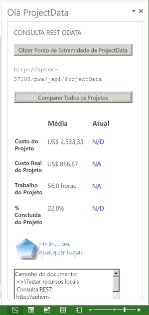

# <a name="create-a-project-add-in-that-uses-rest-with-an-on-premises-project-server-odata-service"></a>Criar um suplemento de Project que usa REST com um serviço OData local do Project Server

Este artigo descreve como criar um suplemento de painel tarefas do Project Professional 2013 que compara dados de custo e de trabalho no projeto ativo com médias de todos os projetos da instância atual do Project Web App. O suplemento usa REST com a biblioteca jQuery para acessar o serviço de relatório OData **ProjectData** no Project Server 2013.

O código deste artigo é baseado em um exemplo desenvolvido por Saurabh Sanghvi e Arvind Iyer, da Microsoft Corporation.

## <a name="prerequisites-for-creating-a-task-pane-add-in-that-reads-project-server-reporting-data"></a>Pré-requisitos para a criação de um suplemento de painel de tarefas que lê dados de relatório do Project Server

A seguir temos os pré-requisitos para a criação de um suplemento de painel de tarefas do Project que lê o serviço **ProjectData** de uma instância do Project Web App em uma instalação local do Project Server 2013:

- Verifique se você instalou os service packs e as atualizações mais recentes do Windows em seu computador de desenvolvimento local. O sistema operacional pode ser Windows 7, Windows 8, Windows Server 2008 ou Windows Server 2012.

- O Project Professional 2013 é necessário para a conexão com o Project Web App. O computador de desenvolvimento deve ter o Project Professional 2013 instalado para habilitar a depuração **F5** com o Visual Studio.

    > [!NOTE]
    > O Project Standard 2013 também pode hospedar suplementos de painel de tarefas, mas não pode fazer logon no Project Web App.

- O Visual Studio 2015 com Office Developer Tools para Visual Studio inclui modelos para criar suplementos do Office e do SharePoint. Verifique se você instalou a versão mais recente do Office Developer Tools. Confira a seção _Ferramentas_ de [Download de suplementos do Office e do SharePoint](https://developer.microsoft.com/office/docs).

- Os procedimentos e exemplos de código neste artigo acessam o serviço **ProjectData** do Project Server 2013 em um domínio local. Os métodos jQuery neste artigo não funcionam com o Project Online.

    Verifique se o serviço **ProjectData** está acessível do seu computador de desenvolvimento.

### <a name="procedure-1-to-verify-that-the-projectdata-service-is-accessible"></a>Procedimento 1. Para verificar se o serviço ProjectData está acessível

1. Para permitir que seu navegador mostre os dados XML de consultas REST diretamente, desative o modo de exibição de leitura de feed. Para saber mais sobre como fazer isso no Internet Explorer, confira o Procedimento 1, etapa 4 em [Consultar feeds OData para dados de relatório do Project](/previous-versions/office/project-odata/jj163048(v=office.15)).

2. Confira o serviço **ProjectData** usando seu navegador com a seguinte URL: **http://ServerName /ProjectServerName/_api/ProjectData**. Por exemplo, se a instância do Project Web App for `http://MyServer/pwa`, o navegador mostrará os seguintes resultados:

    ```xml
    <?xml version="1.0" encoding="utf-8"?>
        <service xml:base="http://myserver/pwa/_api/ProjectData/"
        xmlns="https://www.w3.org/2007/app"
        xmlns:atom="https://www.w3.org/2005/Atom">
        <workspace>
            <atom:title>Default</atom:title>
            <collection href="Projects">
                <atom:title>Projects</atom:title>
            </collection>
            <collection href="ProjectBaselines">
                <atom:title>ProjectBaselines</atom:title>
            </collection>
            <!-- ... and 33 more collection elements -->
        </workspace>
        </service>
    ```

3. Pode ser necessário fornecer as credenciais de rede para ver os resultados. Se o navegador exibir "Erro 403, acesso negado", você não tem permissão de logon para essa instância do Project Web App ou há algum problema de rede que exige ajuda administrativa.

## <a name="using-visual-studio-to-create-a-task-pane-add-in-for-project"></a>Usar o Visual Studio para criar um suplemento de painel de tarefas para o Project

O Office Developer Tools para Visual Studio inclui um modelo de suplemento de painel de tarefas para o Project 2013. Se você criar uma solução denominada **HelloProjectOData**, ela conterá os dois projetos do Visual Studio a seguir:

- O projeto de suplemento usa o nome da solução. Ele inclui o arquivo de manifesto XML para o suplemento e serve para o .NET Framework 4.5. O Procedimento 3 mostra as etapas para modificar o manifesto para o suplemento **HelloProjectOData**.

- O projeto Web é denominado **HelloProjectODataWeb**. Ele inclui as páginas da Web, os arquivos JavaScript, os arquivos CSS, as imagens, as referências e os arquivos de configuração para o conteúdo Web no painel de tarefas. O projeto Web serve para o .NET Framework 4. Os Procedimentos 4 e 5 mostram como modificar os arquivos no projeto Web para criar a funcionalidade do suplemento **HelloProjectOData**.

### <a name="procedure-2-to-create-the-helloprojectodata-add-in-for-project"></a>Procedimento 2. Para criar o suplemento HelloProjectOData para o Project

1. Execute o Visual Studio 2015 como administrador e selecione **Novo Projeto** na página Iniciar.

2. Na caixa de diálogo **Novo Projeto**, expanda os nós **Modelos**, **Visual C#** e **Office/SharePoint** e selecione **Suplementos do Office**. Selecione **.NET Framework 4.5.2** na lista suspensa de estrutura de destino na parte superior do painel central e, em seguida, selecione **Suplemento do Office** (veja a captura de tela a seguir).

3. Para colocar ambos os projetos do Visual Studio no mesmo diretório, selecione **Criar diretório para solução** e navegue até o local desejado.

4. No campo **Nome**, digite HelloProjectOData e escolha **OK**.

    *Figura 1. Criação de um suplemento do Office*

    

5. Na caixa de diálogo **Escolha o tipo de suplemento**, selecione **Painel de tarefas** e escolha **Avançar** (veja a captura de tela a seguir).

    *Figura 2. Como escolher o tipo de suplemento a criar*

    

6. Na caixa de diálogo **Escolha os aplicativos host**, desmarque todas as caixas de seleção, exceto o **Project** (veja a captura de tela a seguir) e escolha **Concluir**.

    *Figura 3. Como escolher o aplicativo host*

    

    O Visual Studio cria o projeto **HelloProjectOdata** e o projeto **HelloProjectODataWeb**.

A pasta **AddIn** (veja a captura de tela a seguir) contém o arquivo App.css para estilos CSS personalizados. Na subpasta **Home**, o arquivo Home.html contém referências para arquivos CSS e JavaScript que o suplemento usa, e o conteúdo HTML5 para o suplemento. Além disso, o arquivo Home.js é para o seu código JavaScript personalizado. A pasta **Scripts** inclui os arquivos da biblioteca jQuery. A subpasta **Office** inclui as bibliotecas JavaScript, como office.js e project-15.js, além das bibliotecas de linguagem para cadeias de caracteres padrão nos suplementos do Office. Na pasta **Content**, o arquivo Office.css contém os estilos padrão de todos os Suplementos do Office.

*Figura 4. Exibição de arquivos de projeto Web padrão no Gerenciador de Soluções*


O manifesto para o projeto **HelloProjectOData** é o arquivo HelloProjectOData.xml. Opcionalmente, você pode modificar o manifesto para adicionar uma descrição do suplemento, uma referência a um ícone, informações de linguagem adicionais e outras configurações. O Procedimento 3 simplesmente modifica o nome de exibição e a descrição do suplemento e adiciona um ícone.

Para saber mais sobre o manifesto, confira [Manifesto XML de suplementos do Office](../develop/add-in-manifests.md) e [Referência de esquema para manifestos de suplementos do Office (versão 1.1)](../develop/add-in-manifests.md#see-also).

### <a name="procedure-3-to-modify-the-add-in-manifest"></a>Procedimento 3. Para modificar o manifesto do suplemento

1. No Visual Studio, abra o arquivo HelloProjectOData.xml.

2. O nome de exibição padrão é o nome do projeto do Visual Studio ("HelloProjectOData"). Por exemplo, altere o valor padrão do elemento **DisplayName** para "Hello ProjectData".

3. A descrição padrão também é "HelloProjectOData". Por exemplo, altere o valor padrão do elemento Description para "Testar consultas REST do serviço ProjectData".

4. Adicione um ícone para mostrar a lista suspensa **Suplementos do Office** na guia **PROJETO** da faixa de opções. Você pode adicionar um arquivo de ícone na solução do Visual Studio ou usar uma URL para um ícone. 

As etapas a seguir mostram como adicionar um arquivo de ícone à solução do Visual Studio:

1. No **Gerenciador de Soluções**, vá até a pasta chamada Imagens.

2. Para ser exibido na lista suspensa **Suplementos do Office**, o ícone deve ter 32 x 32 pixels. Por exemplo, instale o SDK do Project 2013, escolha a pasta **Imagens** e adicione o seguinte arquivo do SDK: `\Samples\Apps\HelloProjectOData\HelloProjectODataWeb\Images\NewIcon.png`

    Como alternativa, use seu próprio ícone de 32 x 32 ou copie a imagem a seguir para um arquivo chamado NewIcon.png e, em seguida, adicione esse arquivo à pasta `HelloProjectODataWeb\Images`:

    

3. No manifesto HelloProjectOData.xml, adicione um elemento **IconUrl** abaixo do elemento **Description**, em que o valor da URL do ícone é o caminho relativo para o arquivo do ícone de 32 x 32 pixels. Por exemplo, adicione a seguinte linha: **<IconUrl DefaultValue="~remoteAppUrl/Images/NewIcon.png" />**. O arquivo de manifesto HelloProjectOData.xml agora contém o seguinte (seu valor **Id** será diferente):

    ```XML
    <?xml version="1.0" encoding="UTF-8"?>
    <OfficeApp xmlns="http://schemas.microsoft.com/office/appforoffice/1.1"
            xmlns:xsi="https://www.w3.org/2001/XMLSchema-instance" xsi:type="TaskPaneApp">
        <Id>c512df8d-a1c5-4d74-8a34-d30f6bbcbd82 </Id>
        <Version>1.0</Version>
        <ProviderName> [Provider name]</ProviderName>
        <DefaultLocale>en-US</DefaultLocale>
        <DisplayName DefaultValue="Hello ProjectData" />
        <Description DefaultValue="Test REST queries of the ProjectData service"/>
        <IconUrl DefaultValue="~remoteAppUrl/Images/NewIcon.png" />

        <Hosts>
            <Host Name="Project" />
        </Hosts>
        <DefaultSettings>
            <SourceLocation DefaultValue="~remoteAppUrl/AddIn/Home/Home.html" />
        </DefaultSettings>
        <Permissions>ReadWriteDocument</Permissions>
    </OfficeApp>
    ```

## <a name="creating-the-html-content-for-the-helloprojectodata-add-in"></a>Criar conteúdo HTML para o suplemento HelloProjectOData

O suplemento **HelloProjectOData** é um exemplo que inclui as saídas de erro e de depuração. Ele não se destina a uso em produção. Antes de começar a escrever conteúdo HTML, crie a interface do usuário e a experiência para o suplemento, e descreva as funções JavaScript que interagem com o código HTML. Para saber mais, confira [Diretrizes de design para suplementos do Office](../design/add-in-design.md). 

O painel de tarefas mostra o nome de exibição do suplemento na parte superior, que é o valor do elemento **DisplayName** no manifesto. O elemento **body** no arquivo HelloProjectOData.html contém outros elementos de interface do usuário, da seguinte maneira:

- Um subtítulo indica a funcionalidade ou o tipo de operação geral, por exemplo, **CONSULTA REST ODATA**.

- O botão **Obter Ponto de Extremidade de ProjectData** chama a função **setOdataUrl** para obter o ponto de extremidade do serviço **ProjectData** e exibi-lo em uma caixa de texto. Se o projeto não estiver conectado ao Project Web App, o suplemento chama um identificador de erro para exibir uma mensagem de erro pop-up.

- O botão **Comparar Todos os Projetos** fica desabilitado até que o suplemento obtenha um ponto de extremidade OData válido. Ao selecionar o botão, ele chama a função **retrieveOData**, que usa uma consulta REST para obter os dados de trabalho e custo do projeto do serviço **ProjectData**.

- Uma tabela exibe os valores médios de custo do projeto, custo real, trabalho e porcentagem concluída. A tabela também compara os valores atuais do projeto ativo com a média. Se o valor atual for maior que a média de todos os projetos, será exibido em vermelho. Se o valor atual for menor que a média, será exibido em verde. Se o valor atual não estiver disponível, a tabela exibirá **NA** em azul.

    A função **retrieveOData** aciona a função **parseODataResult**, que calcula e exibe os valores da tabela.

    > [!NOTE]
    > Neste exemplo, os dados de trabalho e custo para o projeto ativo são derivados dos valores publicados. Se você alterar os valores no Project, o serviço **ProjectData** não terá as alterações até que o projeto seja publicado.

### <a name="procedure-4-to-create-the-html-content"></a>Procedimento 4. Para criar o conteúdo HTML

1. No elemento **head** do arquivo Home.html, adicione elementos **link** extras para os arquivos CSS que seu suplemento usa. O modelo de projeto do Visual Studio inclui um link para o arquivo App.css que você pode usar para os estilos CSS personalizados.

2. Adicione elementos **script** extras para bibliotecas JavaScript que o suplemento usa. O modelo de projeto inclui links para os arquivos jQuery- _[versão]_.js, office.js e MicrosoftAjax.js na pasta **Scripts**.

    > [!NOTE]
    > Antes de implantar o suplemento, mude a referência office.js e a referência jQuery para a referência CDN (rede de distribuição de conteúdo). A referência CDN fornece a versão mais recente e melhora o desempenho.

    O suplemento **HelloProjectOData** também usa o arquivo SurfaceErrors.js, que exibe os erros em uma mensagem pop-up. Você pode copiar o código da seção _Programação Robusta_ de [Cria seu primeiro suplemento do painel de tarefas do Project 2013 usando um editor de texto](../project/create-your-first-task-pane-add-in-for-project-by-using-a-text-editor.md) e adicionar um arquivo SurfaceErrors.js na pasta **Scripts\Office** do projeto **HelloProjectODataWeb**.

    Esse é o código HTML atualizado para o elemento **head**, com a linha adicional para o arquivo SurfaceErrors.js:

    ```HTML
    <!DOCTYPE html>
    <html>
    <head>
    <meta charset="UTF-8" />
    <meta http-equiv="X-UA-Compatible" content="IE=Edge" />
    <title>Test ProjectData Service</title>

    <link rel="stylesheet" type="text/css" href="../Content/Office.css" />

    <!-- Add your CSS styles to the following file -->
    <link rel="stylesheet" type="text/css" href="../Content/App.css" />

    <!-- Use the CDN reference to the mini-version of jQuery when deploying your add-in. -->
    <!--<script src="http://ajax.aspnetcdn.com/ajax/jquery/jquery-1.9.0.min.js"></script> -->
    <script src="../Scripts/jquery-1.7.1.js"></script>

    <!-- Use the CDN reference to office.js when deploying your add-in. -->
    <!--<script src="https://appsforoffice.microsoft.com/lib/1/hosted/office.js"></script>-->

    <!-- Use the local script references for Office.js to enable offline debugging -->
    <script src="../Scripts/Office/1.0/MicrosoftAjax.js"></script>
    <script src="../Scripts/Office/1.0/Office.js"></script>

    <!-- Add your JavaScript to the following files -->
    <script src="../Scripts/HelloProjectOData.js"></script>
    <script src="../Scripts/SurfaceErrors.js"></script>
    </head>
    <body>
    <!-- See the code in Step 3. -->
    </body>
    </html>
    ```

3. No elemento **corpo**, exclua o código existente do modelo e adicione o código para a interface de usuário. Se um elemento deve ser preenchido com os dados ou manipulado por uma instrução jQuery, deve incluir um atributo **id** exclusivo. No código a seguir, os atributos **id** para os elementos **button**, **span** e **td** (definição de célula de tabela) que as funções jQuery usam são mostrados em negrito.

   O seguinte HTML adiciona uma imagem gráfica, que poderia ser um logotipo da empresa. Você pode usar o logotipo que quiser ou copiar o arquivo NewLogo.png do download do Project 2013 SDK e depois usar o **Gerenciamento de Soluções** para adicionar o arquivo à pasta `HelloProjectODataWeb\Images`.

    ```HTML
    <body>
        <div id="SectionContent">
        <div id="odataQueries">
            ODATA REST QUERY
        </div>
        <div id="odataInfo">
            <button class="button-wide" onclick="setOdataUrl()">Get ProjectData Endpoint</button>
            <br /><br />
            <span class="rest" id="projectDataEndPoint">Endpoint of the 
                <strong>ProjectData</strong> service</span>
            <br />
        </div>
        <div id="compareProjectData">
            <button class="button-wide" disabled="disabled" id="compareProjects"
            onclick="retrieveOData()">Compare All Projects</button>
            <br />
        </div>
        </div>
        <div id="corpInfo">
            <table class="infoTable" aria-readonly="True" style="width: 100%;">
                <tr>
                    <td class="heading_leftCol"></td>
                    <td class="heading_midCol"><strong>Average</strong></td>
                    <td class="heading_rightCol"><strong>Current</strong></td>
                </tr>
                <tr>
                    <td class="row_leftCol"><strong>Project Cost</strong></td>
                    <td class="row_midCol" id="AverageProjectCost">&amp;nbsp;</td>
                    <td class="row_rightCol" id="CurrentProjectCost">&amp;nbsp;</td>
                </tr>
                <tr>
                    <td class="row_leftCol"><strong>Project Actual Cost</strong></td>
                    <td class="row_midCol" id="AverageProjectActualCost">&amp;nbsp;</td>
                    <td class="row_rightCol" id="CurrentProjectActualCost">&amp;nbsp;</td>
                </tr>
                <tr>
                    <td class="row_leftCol"><strong>Project Work</strong></td>
                    <td class="row_midCol" id="AverageProjectWork">&amp;nbsp;</td>
                    <td class="row_rightCol" id="CurrentProjectWork">&amp;nbsp;</td>
                </tr>
                <tr>
                    <td class="row_leftCol"><strong>Project % Complete</strong></td>
                    <td class="row_midCol" id="AverageProjectPercentComplete">&amp;nbsp;</td>
                    <td class="row_rightCol" id="CurrentProjectPercentComplete">&amp;nbsp;</td>
                </tr>
            </table>
        </div>
        
        <br />
        <textarea id="odataText" rows="12" cols="40"></textarea>
    </body>
    ```

## <a name="creating-the-javascript-code-for-the-add-in"></a>Criar o código JavaScript para o suplemento

O modelo para um suplemento de painel de tarefas do Project inclui código de inicialização padrão que foi projetado para demonstrar ações get e set básicas para dados em um documento no caso de um suplemento típico do Office 2013. Como o Project 2013 não dá suporte a ações que gravam no projeto ativo e o suplemento **HelloProjectOData** não usa o método **getSelectedDataAsync**, você pode excluir o script na função **Office.initialize** e excluir as funções **setData** e **getData** do arquivo HelloProjectOData.js padrão.

O JavaScript inclui constantes globais para a consulta REST e variáveis globais que são usadas em várias funções. O botão **Obter Ponto de Extremidade de ProjectData** chama a função **setOdataUrl**, que inicia as variáveis globais e determina se o Project está conectado ao Project Web App.

O restante do arquivo HelloProjectOData.js inclui duas funções: a função **retrieveOData** é chamada quando o usuário seleciona **Comparar Todos os Projetos** e a função **parseODataResult** calcula médias e preenche a tabela de comparação com valores que são formatados com cores e unidades.

### <a name="procedure-5-to-create-the-javascript-code"></a>Procedimento 5. Para criar o código JavaScript

1. Exclua todo o código do arquivo HelloProjectOData.js padrão e adicione as variáveis globais e a função **Office.initialize**. Nomes de variáveis que estão totalmente em maiúsculas sugerem que estas são constantes. Elas serão usadas mais tarde com a variável **_pwa** para criar a consulta REST neste exemplo.

    ```js
    var PROJDATA = "/_api/ProjectData";
    var PROJQUERY = "/Projects?";
    var QUERY_FILTER = "$filter=ProjectName ne 'Timesheet Administrative Work Items'";
    var QUERY_SELECT1 = "&amp;$select=ProjectId, ProjectName";
    var QUERY_SELECT2 = ", ProjectCost, ProjectWork, ProjectPercentCompleted, ProjectActualCost";
    var _pwa;           // URL of Project Web App.
    var _projectUid;    // GUID of the active project.
    var _docUrl;        // Path of the project document.
    var _odataUrl = ""; // URL of the OData service: http[s]://ServerName /ProjectServerName /_api/ProjectData

    // The initialize function is required for all add-ins.
    Office.initialize = function (reason) {
        // Checks for the DOM to load using the jQuery ready function.
        $(document).ready(function () {
            // After the DOM is loaded, app-specific code can run.
        });
    }
    ```

2. Adicione **setOdataUrl** e as funções relacionadas. A função **setOdataUrl** chama **getProjectGuid** e **getDocumentUrl** para iniciar as variáveis globais. No [método getProjectFieldAsync](/javascript/api/office/office.document), a função anônima para o parâmetro _callback_ habilita o botão **Comparar Todos os Projetos** usando o método **removeAttr** na biblioteca jQuery e exibe a URL do serviço **ProjectData**. Se o Project não estiver conectado ao Project Web App, a função gera um erro e exibe uma mensagem de erro pop-up. O arquivo SurfaceErrors.js inclui o método **throwError**.

   > [!NOTE]
   > Se você executar o Visual Studio no computador do Project Server, use a depuração **F5**, sem comentar o código após a linha que inicializa a variável global **_pwa**. Para ativar usando o método jQuery **ajax** ao depurar no computador do Project Server, defina o valor **localhost** para a URL PWA. Se você executar o Visual Studio em um computador remoto, a URL do **localhost** não será necessária. Antes de implantar o suplemento, comente o código.

    ```js
    function setOdataUrl() {
        Office.context.document.getProjectFieldAsync(
            Office.ProjectProjectFields.ProjectServerUrl,
            function (asyncResult) {
                if (asyncResult.status == Office.AsyncResultStatus.Succeeded) {
                    _pwa = String(asyncResult.value.fieldValue);

                    // If you debug with Visual Studio on a local Project Server computer, 
                    // uncomment the following lines to use the localhost URL.
                    //var localhost = location.host.split(":", 1);
                    //var pwaStartPosition = _pwa.lastIndexOf("/");
                    //var pwaLength = _pwa.length - pwaStartPosition;
                    //var pwaName = _pwa.substr(pwaStartPosition, pwaLength);
                    //_pwa = location.protocol + "//" + localhost + pwaName;

                    if (_pwa.substring(0, 4) == "http") {
                        _odataUrl = _pwa + PROJDATA;
                        $("#compareProjects").removeAttr("disabled");
                        getProjectGuid();
                    }
                    else {
                        _odataUrl = "No connection!";
                        throwError(_odataUrl, "You are not connected to Project Web App.");
                    }
                    getDocumentUrl();
                    $("#projectDataEndPoint").text(_odataUrl);
                }
                else {
                    throwError(asyncResult.error.name, asyncResult.error.message);
                }
            }
        );
    }

    // Get the GUID of the active project.
    function getProjectGuid() {
        Office.context.document.getProjectFieldAsync(
            Office.ProjectProjectFields.GUID,
            function (asyncResult) {
                if (asyncResult.status == Office.AsyncResultStatus.Succeeded) {
                    _projectUid = asyncResult.value.fieldValue;
                }
                else {
                    throwError(asyncResult.error.name, asyncResult.error.message);
                }
            }
        );
    }

    // Get the path of the project in Project web app, which is in the form <>\ProjectName .
    function getDocumentUrl() {
        _docUrl = "Document path:\r\n" + Office.context.document.url;
    }
    ```

3. Adicione a função **retrieveOData** que relaciona valores da consulta REST e chama a função **ajax** no jQuery para obter os dados solicitados do serviço **ProjectData**. A variável **support.cors** habilita o CORS (compartilhamento de recursos entre origens) com a função **ajax**. Se a instrução **support.cors** estiver ausente ou definida como **false**, a função **ajax** retorna um erro **Sem transporte**.

   > [!NOTE]
   > O seguinte código funciona com uma instalação no local do Project Server 2013. Para o Project Online, use o OAuth para autenticação baseada em token. Para saber mais, confira [Como lidar com limitações de política de mesma origem nos Suplementos do Office](../develop/addressing-same-origin-policy-limitations.md).

   Na chamada **ajax**, use o parâmetro _headers_ ou o parâmetro _beforeSend_. O parâmetro _complete_ é uma função anônima, por isso está no mesmo escopo das variáveis no **retrieveOData**. A função para o parâmetro _complete_ exibe os resultados no controle **odataText** e também chama o método **parseODataResult** para analisar e exibir a resposta JSON. O parâmetro _error_ especifica a função **getProjectDataErrorHandler** nomeada, que grava uma mensagem de erro para o controle **odataText** e também usa o método **throwError** para exibir uma mensagem pop-up.

    ```js
    /****************************************************************
    * Functions to get and parse the Project Server reporting data.
    *****************************************************************/

    // Get data about all projects on Project Server,
    // by using a REST query with the ajax method in jQuery.
    function retrieveOData() {
        var restUrl = _odataUrl + PROJQUERY + QUERY_FILTER + QUERY_SELECT1 + QUERY_SELECT2;
        var accept = "application/json; odata=verbose";
        accept.toLocaleLowerCase();

        // Enable cross-origin scripting (required by jQuery 1.5 and later).
        // This does not work with Project Online.
        $.support.cors = true;

        $.ajax({
            url: restUrl,
            type: "GET",
            contentType: "application/json",
            data: "",      // Empty string for the optional data.
            //headers: { "Accept": accept },
            beforeSend: function (xhr) {
                xhr.setRequestHeader("ACCEPT", accept);
            },
            complete: function (xhr, textStatus) {
                // Create a message to display in the text box.
                var message = "\r\ntextStatus: " + textStatus +
                    "\r\nContentType: " + xhr.getResponseHeader("Content-Type") +
                    "\r\nStatus: " + xhr.status +
                    "\r\nResponseText:\r\n" + xhr.responseText;

                // xhr.responseText is the result from an XmlHttpRequest, which
                // contains the JSON response from the OData service.
                parseODataResult(xhr.responseText, _projectUid);

                // Write the document name, response header, status, and JSON to the odataText control.
                $("#odataText").text(_docUrl);
                $("#odataText").append("\r\nREST query:\r\n" + restUrl);
                $("#odataText").append(message);

                if (xhr.status != 200 &amp;&amp; xhr.status != 1223 &amp;&amp; xhr.status != 201) {
                    $("#odataInfo").append("<div>" + htmlEncode(restUrl) + "</div>");
                }
            },
            error: getProjectDataErrorHandler
        });
    }

    function getProjectDataErrorHandler(data, errorCode, errorMessage) {
        $("#odataText").text("Error code: " + errorCode + "\r\nError message: \r\n"
        + errorMessage);
        throwError(errorCode, errorMessage);
    }
    ```

4. Adicione o método **parseODataResult**, que desserializa e processa a resposta JSON do serviço OData. O método **parseODataResult** calcula valores médios dos dados de trabalho e de custo com precisão de uma ou duas casas decimais, formata valores com a cor correta, adiciona uma unidade (**$**, **hrs** ou **%**) e finalmente exibe os valores nas células da tabela especificada.

   Se o GUID do projeto ativo corresponde ao valor **ProjectId**, a variável **myProjectIndex** é definida para o índice do projeto. Se **myProjectIndex** indica que o projeto ativo é publicado no Project Server, o método **parseODataResult** formata e exibe os dados de custo e trabalhos para o projeto. Se o projeto ativo não for publicado, os valores para o projeto ativo serão exibidos como um **ND** azul.

    ```js
    // Calculate the average values of actual cost, cost, work, and percent complete
    // for all projects, and compare with the values for the current project.
    function parseODataResult(oDataResult, currentProjectGuid) {
        // Deserialize the JSON string into a JavaScript object.
        var res = Sys.Serialization.JavaScriptSerializer.deserialize(oDataResult);
        var len = res.d.results.length;
        var projActualCost = 0;
        var projCost = 0;
        var projWork = 0;
        var projPercentCompleted = 0;
        var myProjectIndex = -1;
        for (i = 0; i < len; i++) {
            // If the current project GUID matches the GUID from the OData query,  
            // store the project index.
            if (currentProjectGuid.toLocaleLowerCase() == res.d.results[i].ProjectId) {
                myProjectIndex = i;
            }
            projCost += Number(res.d.results[i].ProjectCost);
            projWork += Number(res.d.results[i].ProjectWork);
            projActualCost += Number(res.d.results[i].ProjectActualCost);
            projPercentCompleted += Number(res.d.results[i].ProjectPercentCompleted);
        }
        var avgProjCost = projCost / len;
        var avgProjWork = projWork / len;
        var avgProjActualCost = projActualCost / len;
        var avgProjPercentCompleted = projPercentCompleted / len;

        // Round off cost to two decimal places, and round off other values to one decimal place.
        avgProjCost = avgProjCost.toFixed(2);
        avgProjWork = avgProjWork.toFixed(1);
        avgProjActualCost = avgProjActualCost.toFixed(2);
        avgProjPercentCompleted = avgProjPercentCompleted.toFixed(1);

        // Display averages in the table, with the correct units.
        document.getElementById("AverageProjectCost").innerHTML = "$"
            + avgProjCost;
        document.getElementById("AverageProjectActualCost").innerHTML
            = "$" + avgProjActualCost;
        document.getElementById("AverageProjectWork").innerHTML
            = avgProjWork + " hrs";
        document.getElementById("AverageProjectPercentComplete").innerHTML
            = avgProjPercentCompleted + "%";

        // Calculate and display values for the current project.
        if (myProjectIndex != -1) {
            var myProjCost = Number(res.d.results[myProjectIndex].ProjectCost);
            var myProjWork = Number(res.d.results[myProjectIndex].ProjectWork);
            var myProjActualCost = Number(res.d.results[myProjectIndex].ProjectActualCost);
            var myProjPercentCompleted =
            Number(res.d.results[myProjectIndex].ProjectPercentCompleted);

            myProjCost = myProjCost.toFixed(2);
            myProjWork = myProjWork.toFixed(1);
            myProjActualCost = myProjActualCost.toFixed(2);
            myProjPercentCompleted = myProjPercentCompleted.toFixed(1);

            document.getElementById("CurrentProjectCost").innerHTML = "$" + myProjCost;

            if (Number(myProjCost) <= Number(avgProjCost)) {
                document.getElementById("CurrentProjectCost").style.color = "green"
            }
            else {
                document.getElementById("CurrentProjectCost").style.color = "red"
            }

            document.getElementById("CurrentProjectActualCost").innerHTML = "$" + myProjActualCost;

            if (Number(myProjActualCost) <= Number(avgProjActualCost)) {
                document.getElementById("CurrentProjectActualCost").style.color = "green"
            }
            else {
                document.getElementById("CurrentProjectActualCost").style.color = "red"
            }

            document.getElementById("CurrentProjectWork").innerHTML = myProjWork + " hrs";

            if (Number(myProjWork) <= Number(avgProjWork)) {
                document.getElementById("CurrentProjectWork").style.color = "red"
            }
            else {
                document.getElementById("CurrentProjectWork").style.color = "green"
            }

            document.getElementById("CurrentProjectPercentComplete").innerHTML = myProjPercentCompleted + "%";

            if (Number(myProjPercentCompleted) <= Number(avgProjPercentCompleted)) {
                document.getElementById("CurrentProjectPercentComplete").style.color = "red"
            }
            else {
                document.getElementById("CurrentProjectPercentComplete").style.color = "green"
            }
        }
        else {
            document.getElementById("CurrentProjectCost").innerHTML = "NA";
            document.getElementById("CurrentProjectCost").style.color = "blue"

            document.getElementById("CurrentProjectActualCost").innerHTML = "NA";
            document.getElementById("CurrentProjectActualCost").style.color = "blue"

            document.getElementById("CurrentProjectWork").innerHTML = "NA";
            document.getElementById("CurrentProjectWork").style.color = "blue"

            document.getElementById("CurrentProjectPercentComplete").innerHTML = "NA";
            document.getElementById("CurrentProjectPercentComplete").style.color = "blue"
        }
    }
    ```

## <a name="testing-the-helloprojectodata-add-in"></a>Testar o aplicativo HelloProjectOData

Para testar e depurar o suplemento **HelloProjectOData** com o Visual Studio 2015, o Project Professional 2013 deve estar instalado no computador de desenvolvimento. Para habilitar cenários de teste diferentes, certifique-se de poder escolher se o Project abre no caso de arquivos no computador local ou se ele se conecta ao Project Web App. Por exemplo, siga estas etapas:

1. Na guia **ARQUIVO** na faixa de opções, escolha a guia **Informações** no modo de exibição Backstage e escolha **Gerenciar Contas**.

2. Na caixa de diálogo **Contas do Project Web App**, a lista **Contas disponíveis** pode ter várias contas do Project Web App além da conta **Computador** local. Na seção **Ao iniciar**, selecione **Escolher uma conta**.

3. Feche o Project para que o Visual Studio possa iniciá-lo na depuração do suplemento.

Os testes básicos devem incluir o seguinte:

- Execute o suplemento no Visual Studio, e abra um projeto publicado do Project Web App que contém dados de custos e trabalho. Verifique se o suplemento exibe o ponto de extremidade **ProjectData** e se exibe corretamente os dados de custo e de trabalho na tabela. Você pode usar a saída no controle **odataText** para verificar a consulta REST e outras informações.

- Execute o suplemento novamente escolhendo o perfil do computador local na caixa de diálogo **Login** quando o Project inicia. Abra um arquivo .mpp local e teste o suplemento. Verifique se o suplemento exibe uma mensagem de erro ao tentar acessar o ponto de extremidade **ProjectData**.

- Execute o suplemento novamente e crie um projeto com tarefas com dados de custo e de trabalho. Você pode salvar o projeto no Project Web App, mas não o publique. Verifique se o suplemento exibe dados do Project Server, mas **NA** para o projeto atual.

### <a name="procedure-6-to-test-the-add-in"></a>Procedimento 6. Para testar o suplemento

1. Execute o Project Professional 2013, conecte-se ao Project Web App e crie um projeto de teste. Atribua tarefas aos recursos locais ou a recursos da empresa, defina vários valores de porcentagem concluída em algumas tarefas e publique o projeto. Feche o projeto, o que permite que o Visual Studio inicie o Project para depurar o suplemento.

2. No Visual Studio, pressione **F5**. Faça logon no Project Web App e abra o projeto que você criou na etapa anterior. Você pode abrir o projeto no modo somente leitura ou no modo de edição.

3. Na guia **PROJETO** da faixa de opções, na lista suspensa **Suplementos do Office**, selecione **Hello ProjectData** (confira a Figura 5). O botão **Comparar Todos os Projetos** deve estar desativado.

    *Figura 5. Iniciando o suplemento HelloProjectOData*

    

4. No painel de tarefas **Hello ProjectData**, selecione **Obter Ponto de Extremidade de ProjectData**. A linha **projectDataEndPoint** deve mostrar a URL do serviço **ProjectData** e o botão **Comparar Todos os Projetos** deve estar habilitado (confira a Figura 6).

5. Selecione **Comparar Todos os Projetos**. O suplemento pode pausar enquanto recupera os dados do serviço **ProjectData** e deve exibir os valores médios e atuais formatados na tabela.

    *Figura 6. Exibindo resultados da consulta REST*

    

6. Examine a saída na caixa de texto. Ela deve mostrar o caminho do documento, a consulta REST, as informações de status e os resultados JSON das chamadas a **ajax** e **parseODataResult**. A saída ajuda a entender, a criar e a depurar o código no método **parseODataResult**, como `projCost += Number(res.d.results[i].ProjectCost);`.

    Veja a seguir um exemplo de saída com quebras de linha e espaços adicionados ao texto para fins de esclarecimentos, para três projetos em uma instância do Project Web App:

    ```json
    Document path: <>\WinProj test1

    REST query:
    http://sphvm-37189/pwa/_api/ProjectData/Projects?$filter=ProjectName ne 'Timesheet Administrative Work Items'
        &amp;$select=ProjectId, ProjectName, ProjectCost, ProjectWork, ProjectPercentCompleted, ProjectActualCost

    textStatus: success
    ContentType: application/json;odata=verbose;charset=utf-8
    Status: 200

    ResponseText:
    {"d":{"results":[
    {"__metadata":
        {"id":"http://sphvm-37189/pwa/_api/ProjectData/Projects(guid'ce3d0d65-3904-e211-96cd-00155d157123')",
        "uri":"http://sphvm-37189/pwa/_api/ProjectData/Projects(guid'ce3d0d65-3904-e211-96cd-00155d157123')",
        "type":"ReportingData.Project"},
        "ProjectId":"ce3d0d65-3904-e211-96cd-00155d157123",
        "ProjectActualCost":"0.000000",
        "ProjectCost":"0.000000",
        "ProjectName":"Task list created in PWA",
        "ProjectPercentCompleted":0,
        "ProjectWork":"16.000000"},
    {"__metadata":
        {"id":"http://sphvm-37189/pwa/_api/ProjectData/Projects(guid'c31023fc-1404-e211-86b2-3c075433b7bd')",
        "uri":"http://sphvm-37189/pwa/_api/ProjectData/Projects(guid'c31023fc-1404-e211-86b2-3c075433b7bd')",
        "type":"ReportingData.Project"},
        "ProjectId":"c31023fc-1404-e211-86b2-3c075433b7bd",
        "ProjectActualCost":"700.000000",
        "ProjectCost":"2400.000000",
        "ProjectName":"WinProj test 2",
        "ProjectPercentCompleted":29,
        "ProjectWork":"48.000000"},
    {"__metadata":
        {"id":"http://sphvm-37189/pwa/_api/ProjectData/Projects(guid'dc81fbb2-b801-e211-9d2a-3c075433b7bd')",
        "uri":"http://sphvm-37189/pwa/_api/ProjectData/Projects(guid'dc81fbb2-b801-e211-9d2a-3c075433b7bd')",
        "type":"ReportingData.Project"},
        "ProjectId":"dc81fbb2-b801-e211-9d2a-3c075433b7bd",
        "ProjectActualCost":"1900.000000",
        "ProjectCost":"5200.000000",
        "ProjectName":"WinProj test1",
        "ProjectPercentCompleted":37,
        "ProjectWork":"104.000000"}
    ]}}
    ```

7. Pare a depuração (pressione **Shift+F5**) e pressione **F5** novamente para executar uma nova instância do Project. Na caixa de diálogo **Login**, escolha o perfil local **Computador**, e não o Project Web App. Crie ou abra um arquivo .mpp de projeto local, abra o painel de tarefas **Hello ProjectData** e selecione **Obter Ponto de Extremidade de ProjectData**. O suplemento deve exibir um erro **Sem conexão!** (confira a Figura 7) e o botão **Comparar Todos os Projetos** deve permanecer desativado.

   *Figura 7. Uso do suplemento sem uma conexão do Project Web App*

   

8. Pare a depuração e pressione **F5** novamente. Faça logon no Project Web App e crie um projeto com dados de custo e de trabalho. Você pode salvar o projeto, mas não o publique.

   No painel de tarefas **Hello ProjectData**, quando você seleciona **Comparar Todos os Projetos**, deve ver um **ND** nos campos da coluna **Atual** (confira a Figura 8).

   *Figura 8. Comparação de um projeto não publicado com outros projetos*

   

Mesmo que seu suplemento tenha funcionado corretamente nos testes anteriores, há outros testes que devem ser executados. Por exemplo:

- Abra um projeto do Project Web App que não tenha nenhum dado de custo ou de trabalho para as tarefas. Você deve ver valores zerados nos campos da coluna **Atual**.

- Teste um projeto sem tarefas.

- Se você modificar o suplemento e publicá-lo, deve executar testes semelhantes novamente com o suplemento publicado. Para outras considerações, confira [Próximas etapas](#next-steps).

> [!NOTE]
> Há limites para a quantidade de dados que pode ser retornada em uma consulta do serviço **ProjectData**. A quantidade de dados varia conforme a entidade. Por exemplo, o conjunto de entidades **Projects** tem um limite padrão de 100 projetos por consulta, mas o conjunto de entidades **Risks** tem um limite padrão de 200. Para uma instalação de produção, o código no exemplo **HelloProjectOData** deve ser modificado para habilitar consultas de mais de 100 projetos. Para saber mais, confira [Próximas etapas](#next-steps) e [Consultar feeds OData para dados de relatório do Project](/previous-versions/office/project-odata/jj163048(v=office.15)).

## <a name="example-code-for-the-helloprojectodata-add-in"></a>Exemplo de código para o suplemento de HelloProjectOData

### <a name="helloprojectodatahtml-file"></a>Arquivo HelloProjectOData.html

O código a seguir está no arquivo `Pages\HelloProjectOData.html` do projeto **HelloProjectODataWeb**.

```HTML
<!DOCTYPE html>
<html>
    <head>
        <meta charset="UTF-8" />
        <meta http-equiv="X-UA-Compatible" content="IE=Edge" />
        <title>Test ProjectData Service</title>

        <link rel="stylesheet" type="text/css" href="../Content/Office.css" />

        <!-- Add your CSS styles to the following file -->
        <link rel="stylesheet" type="text/css" href="../Content/App.css" />

        <!-- Use the CDN reference to the mini-version of jQuery when deploying your add-in. -->
        <!--<script src="http://ajax.aspnetcdn.com/ajax/jquery/jquery-1.9.0.min.js"></script> -->
        <script src="../Scripts/jquery-1.7.1.js"></script>

        <!-- Use the CDN reference to Office.js when deploying your add-in -->
        <!--<script src="https://appsforoffice.microsoft.com/lib/1/hosted/office.js"></script>-->

        <!-- Use the local script references for Office.js to enable offline debugging -->
        <script src="../Scripts/Office/1.0/MicrosoftAjax.js"></script>
        <script src="../Scripts/Office/1.0/Office.js"></script>

        <!-- Add your JavaScript to the following files -->
        <script src="../Scripts/HelloProjectOData.js"></script>
        <script src="../Scripts/SurfaceErrors.js"></script>
    </head>
    <body>
        <div id="SectionContent">
        <div id="odataQueries">
            ODATA REST QUERY
        </div>
        <div id="odataInfo">
            <button class="button-wide" onclick="setOdataUrl()">Get ProjectData Endpoint</button>
            <br />
            <br />
            <span class="rest" id="projectDataEndPoint">Endpoint of the 
            <strong>ProjectData</strong> service</span>
            <br />
        </div>
        <div id="compareProjectData">
            <button class="button-wide" disabled="disabled" id="compareProjects"
            onclick="retrieveOData()">
            Compare All Projects</button>
            <br />
        </div>
        </div>
        <div id="corpInfo">
        <table class="infoTable" aria-readonly="True" style="width: 100%;">
            <tr>
            <td class="heading_leftCol"></td>
            <td class="heading_midCol"><strong>Average</strong></td>
            <td class="heading_rightCol"><strong>Current</strong></td>
            </tr>
            <tr>
            <td class="row_leftCol"><strong>Project Cost</strong></td>
            <td class="row_midCol" id="AverageProjectCost">&amp;nbsp;</td>
            <td class="row_rightCol" id="CurrentProjectCost">&amp;nbsp;</td>
            </tr>
            <tr>
            <td class="row_leftCol"><strong>Project Actual Cost</strong></td>
            <td class="row_midCol" id="AverageProjectActualCost">&amp;nbsp;</td>
            <td class="row_rightCol" id="CurrentProjectActualCost">&amp;nbsp;</td>
            </tr>
            <tr>
            <td class="row_leftCol"><strong>Project Work</strong></td>
            <td class="row_midCol" id="AverageProjectWork">&amp;nbsp;</td>
            <td class="row_rightCol" id="CurrentProjectWork">&amp;nbsp;</td>
            </tr>
            <tr>
            <td class="row_leftCol"><strong>Project % Complete</strong></td>
            <td class="row_midCol" id="AverageProjectPercentComplete">&amp;nbsp;</td>
            <td class="row_rightCol" id="CurrentProjectPercentComplete">&amp;nbsp;</td>
            </tr>
        </table>
        </div>
        
        <br />
        <textarea id="odataText" rows="12" cols="40"></textarea>
    </body>
</html>
```

### <a name="helloprojectodatajs-file"></a>Arquivo HelloProjectOData.js

O código a seguir está no arquivo `Scripts\Office\HelloProjectOData.js` do projeto **HelloProjectODataWeb**.

```js
/* File: HelloProjectOData.js
* JavaScript functions for the HelloProjectOData example task pane app.
* October 2, 2012
*/

var PROJDATA = "/_api/ProjectData";
var PROJQUERY = "/Projects?";
var QUERY_FILTER = "$filter=ProjectName ne 'Timesheet Administrative Work Items'";
var QUERY_SELECT1 = "&amp;$select=ProjectId, ProjectName";
var QUERY_SELECT2 = ", ProjectCost, ProjectWork, ProjectPercentCompleted, ProjectActualCost";
var _pwa;           // URL of Project Web App.
var _projectUid;    // GUID of the active project.
var _docUrl;        // Path of the project document.
var _odataUrl = ""; // URL of the OData service: http[s]://ServerName /ProjectServerName /_api/ProjectData

// The initialize function is required for all add-ins.
Office.initialize = function (reason) {
    // Checks for the DOM to load using the jQuery ready function.
    $(document).ready(function () {
        // After the DOM is loaded, app-specific code can run.
    });
}

// Set the global variables, enable the Compare All Projects button,
// and display the URL of the ProjectData service.
// Display an error if Project is not connected with Project Web App.
function setOdataUrl() {
    Office.context.document.getProjectFieldAsync(
        Office.ProjectProjectFields.ProjectServerUrl,
        function (asyncResult) {
            if (asyncResult.status == Office.AsyncResultStatus.Succeeded) {
                _pwa = String(asyncResult.value.fieldValue);

                // If you debug with Visual Studio on a local Project Server computer,
                // uncomment the following lines to use the localhost URL.
                //var localhost = location.host.split(":", 1);
                //var pwaStartPosition = _pwa.lastIndexOf("/");
                //var pwaLength = _pwa.length - pwaStartPosition;
                //var pwaName = _pwa.substr(pwaStartPosition, pwaLength);
                //_pwa = location.protocol + "//" + localhost + pwaName;

                if (_pwa.substring(0, 4) == "http") {
                    _odataUrl = _pwa + PROJDATA;
                    $("#compareProjects").removeAttr("disabled");
                    getProjectGuid();
                }
                else {
                    _odataUrl = "No connection!";
                    throwError(_odataUrl, "You are not connected to Project Web App.");
                }
                getDocumentUrl();
                $("#projectDataEndPoint").text(_odataUrl);
            }
            else {
                throwError(asyncResult.error.name, asyncResult.error.message);
            }
        }
    );
}

// Get the GUID of the active project.
function getProjectGuid() {
    Office.context.document.getProjectFieldAsync(
        Office.ProjectProjectFields.GUID,
        function (asyncResult) {
            if (asyncResult.status == Office.AsyncResultStatus.Succeeded) {
                _projectUid = asyncResult.value.fieldValue;
            }
            else {
                throwError(asyncResult.error.name, asyncResult.error.message);
            }
        }
    );
}

// Get the path of the project in Project web app, which is in the form <>\ProjectName .
function getDocumentUrl() {
    _docUrl = "Document path:\r\n" + Office.context.document.url;
}

/****************************************************************
* Functions to get and parse the Project Server reporting data.
*****************************************************************/

// Get data about all projects on Project Server,
// by using a REST query with the ajax method in jQuery.
function retrieveOData() {
    var restUrl = _odataUrl + PROJQUERY + QUERY_FILTER + QUERY_SELECT1 + QUERY_SELECT2;
    var accept = "application/json; odata=verbose";
    accept.toLocaleLowerCase();

    // Enable cross-origin scripting (required by jQuery 1.5 and later).
    // This does not work with Project Online.
    $.support.cors = true;

    $.ajax({
        url: restUrl,
        type: "GET",
        contentType: "application/json",
        data: "",      // Empty string for the optional data.
        //headers: { "Accept": accept },
        beforeSend: function (xhr) {
            xhr.setRequestHeader("ACCEPT", accept);
        },
        complete: function (xhr, textStatus) {
            // Create a message to display in the text box.
            var message = "\r\ntextStatus: " + textStatus +
                "\r\nContentType: " + xhr.getResponseHeader("Content-Type") +
                "\r\nStatus: " + xhr.status +
                "\r\nResponseText:\r\n" + xhr.responseText;

            // xhr.responseText is the result from an XmlHttpRequest, which 
            // contains the JSON response from the OData service.
            parseODataResult(xhr.responseText, _projectUid);

            // Write the document name, response header, status, and JSON to the odataText control.
            $("#odataText").text(_docUrl);
            $("#odataText").append("\r\nREST query:\r\n" + restUrl);
            $("#odataText").append(message);

            if (xhr.status != 200 &amp;&amp; xhr.status != 1223 &amp;&amp; xhr.status != 201) {
                $("#odataInfo").append("<div>" + htmlEncode(restUrl) + "</div>");
            }
        },
        error: getProjectDataErrorHandler
    });
}

function getProjectDataErrorHandler(data, errorCode, errorMessage) {
    $("#odataText").text("Error code: " + errorCode + "\r\nError message: \r\n"
        + errorMessage);
    throwError(errorCode, errorMessage);
}

// Calculate the average values of actual cost, cost, work, and percent complete
// for all projects, and compare with the values for the current project.
function parseODataResult(oDataResult, currentProjectGuid) {
    // Deserialize the JSON string into a JavaScript object.
    var res = Sys.Serialization.JavaScriptSerializer.deserialize(oDataResult);
    var len = res.d.results.length;
    var projActualCost = 0;
    var projCost = 0;
    var projWork = 0;
    var projPercentCompleted = 0;
    var myProjectIndex = -1;

    for (i = 0; i < len; i++) {
        // If the current project GUID matches the GUID from the OData query,  
        // then store the project index.
        if (currentProjectGuid.toLocaleLowerCase() == res.d.results[i].ProjectId) {
            myProjectIndex = i;
        }
        projCost += Number(res.d.results[i].ProjectCost);
        projWork += Number(res.d.results[i].ProjectWork);
        projActualCost += Number(res.d.results[i].ProjectActualCost);
        projPercentCompleted += Number(res.d.results[i].ProjectPercentCompleted);

    }
    var avgProjCost = projCost / len;
    var avgProjWork = projWork / len;
    var avgProjActualCost = projActualCost / len;
    var avgProjPercentCompleted = projPercentCompleted / len;

    // Round off cost to two decimal places, and round off other values to one decimal place.
    avgProjCost = avgProjCost.toFixed(2);
    avgProjWork = avgProjWork.toFixed(1);
    avgProjActualCost = avgProjActualCost.toFixed(2);
    avgProjPercentCompleted = avgProjPercentCompleted.toFixed(1);

    // Display averages in the table, with the correct units. 
    document.getElementById("AverageProjectCost").innerHTML = "$"
        + avgProjCost;
    document.getElementById("AverageProjectActualCost").innerHTML
        = "$" + avgProjActualCost;
    document.getElementById("AverageProjectWork").innerHTML
        = avgProjWork + " hrs";
    document.getElementById("AverageProjectPercentComplete").innerHTML
        = avgProjPercentCompleted + "%";

    // Calculate and display values for the current project.
    if (myProjectIndex != -1) {

        var myProjCost = Number(res.d.results[myProjectIndex].ProjectCost);
        var myProjWork = Number(res.d.results[myProjectIndex].ProjectWork);
        var myProjActualCost = Number(res.d.results[myProjectIndex].ProjectActualCost);
        var myProjPercentCompleted = Number(res.d.results[myProjectIndex].ProjectPercentCompleted);

        myProjCost = myProjCost.toFixed(2);
        myProjWork = myProjWork.toFixed(1);
        myProjActualCost = myProjActualCost.toFixed(2);
        myProjPercentCompleted = myProjPercentCompleted.toFixed(1);

        document.getElementById("CurrentProjectCost").innerHTML = "$" + myProjCost;

        if (Number(myProjCost) <= Number(avgProjCost)) {
            document.getElementById("CurrentProjectCost").style.color = "green"
        }
        else {
            document.getElementById("CurrentProjectCost").style.color = "red"
        }

        document.getElementById("CurrentProjectActualCost").innerHTML = "$" + myProjActualCost;

        if (Number(myProjActualCost) <= Number(avgProjActualCost)) {
            document.getElementById("CurrentProjectActualCost").style.color = "green"
        }
        else {
            document.getElementById("CurrentProjectActualCost").style.color = "red"
        }

        document.getElementById("CurrentProjectWork").innerHTML = myProjWork + " hrs";

        if (Number(myProjWork) <= Number(avgProjWork)) {
            document.getElementById("CurrentProjectWork").style.color = "red"
        }
        else {
            document.getElementById("CurrentProjectWork").style.color = "green"
        }

        document.getElementById("CurrentProjectPercentComplete").innerHTML = myProjPercentCompleted + "%";

        if (Number(myProjPercentCompleted) <= Number(avgProjPercentCompleted)) {
            document.getElementById("CurrentProjectPercentComplete").style.color = "red"
        }
        else {
            document.getElementById("CurrentProjectPercentComplete").style.color = "green"
        }
    }
    else {    // The current project is not published.
        document.getElementById("CurrentProjectCost").innerHTML = "NA";
        document.getElementById("CurrentProjectCost").style.color = "blue"

        document.getElementById("CurrentProjectActualCost").innerHTML = "NA";
        document.getElementById("CurrentProjectActualCost").style.color = "blue"

        document.getElementById("CurrentProjectWork").innerHTML = "NA";
        document.getElementById("CurrentProjectWork").style.color = "blue"

        document.getElementById("CurrentProjectPercentComplete").innerHTML = "NA";
        document.getElementById("CurrentProjectPercentComplete").style.color = "blue"
    }
}
```

### <a name="appcss-file"></a>Arquivo App.css

O código a seguir está no arquivo `Content\App.css` do projeto **HelloProjectODataWeb**.

```css
/*
*  File: App.css for the HelloProjectOData app.
*  Updated: 10/2/2012
*/

body
{
    font-size: 11pt;
}
h1
{
    font-size: 22pt;
}
h2
{
    font-size: 16pt;
}

/******************************************************************
Code label class
******************************************************************/

.rest 
{
    font-family: 'Courier New';
    font-size: 0.9em;
}

/******************************************************************
Button classes
******************************************************************/

.button-wide {
    width: 210px;
    margin-top: 2px;
}
.button-narrow 
{
    width: 80px;
    margin-top: 2px;
}

/******************************************************************
Table styles
******************************************************************/

.infoTable
{
    text-align: center; 
    vertical-align: middle
}
.heading_leftCol
{
    width: 20px;
    height: 20px;
}
.heading_midCol
{
    width: 100px;
    height: 20px;
    font-size: medium; 
    font-weight: bold; 
}
.heading_rightCol
{
    width: 101px;
    height: 20px;
    font-size: medium;
    font-weight: bold;
}
.row_leftCol
{
    width: 20px;
    font-size: small;
    font-weight: bold;
}
.row_midCol
{
    width: 100px;
}
.row_rightCol
{
    width: 101px;
}
.logo
{
    width: 135px;
    height: 53px;
}
```

### <a name="surfaceerrorsjs-file"></a>Arquivo SurfaceErrors.js

Você pode copiar o código para o arquivo SurfaceErrors.js da seção _Programação Robusta_ de [Criar seu primeiro suplemento de painel de tarefas para o Project 2013 usando um editor de texto](../project/create-your-first-task-pane-add-in-for-project-by-using-a-text-editor.md).

## <a name="next-steps"></a>Próximas etapas

Se **HelloProjectOData** fosse um suplemento de produção a ser vendido no AppSource ou distribuído em um catálogo de suplementos do SharePoint, ele deveria ser projetado de forma diferente. Por exemplo, não haveria nenhuma saída de depuração em uma caixa de texto e provavelmente nenhum botão para obter o ponto de extremidade do **ProjectData**. Você também precisaria reescrever a função **retireveOData** para lidar com instâncias do Project Web App que tenham mais de 100 projetos.

O suplemento deveria conter mais verificações de erro, além de lógica para capturar e explicar ou mostrar casos extremos. Por exemplo, se uma instância do Project Web App tiver mil projetos com uma duração média de cinco dias e custo médio de US$ 2.400, e o projeto ativo for o único que tem uma duração de mais de 20 dias, a comparação de custo e trabalho poderá ficar desequilibrada. Isso poderia ser exibido com um gráfico de frequência. Você poderia adicionar opções para exibir a duração, comparar projetos de tamanhos semelhantes ou comparar projetos de um mesmo departamento ou de departamentos diferentes. Ou poderia adicionar uma forma de o usuário selecionar os campos a exibir em uma lista.

Para outras consultas do serviço **ProjectData**, há limites para o comprimento da cadeia de consulta, que afeta o número de etapas que uma consulta pode executar de um conjunto pai para um objeto em um conjunto filho. Por exemplo, uma consulta de duas etapas de **Projects** para **Tasks** para itens de tarefa funciona, mas uma consulta de três etapas, como **Projects** para **Tasks** para **Assignments** para itens de atribuição pode exceder o comprimento máximo de URL padrão. Para saber mais, confira [Consultar feeds OData para dados de relatório do Project](/previous-versions/office/project-odata/jj163048(v=office.15)).

Se você modificar o suplemento **HelloProjectOData** para uso em produção, siga estas etapas:

- No arquivo HelloProjectOData.html, para obter melhor desempenho, mude a referência ao office.js do projeto local para a referência da CDN:

    ```HTML
    <script src="https://appsforoffice.microsoft.com/lib/1/hosted/office.js"></script>
    ```

- Reescreva a função **retrieveOData** para habilitar consultas de mais de 100 projetos. Por exemplo, você pode obter o número de projetos com uma consulta `~/ProjectData/Projects()/$count` e para usar os operadores _$skip_ e _$top_ na consulta REST para dados de projeto. Execute várias consultas em sequência e tire a média dos dados de cada consulta. Cada consulta de dados de projeto teria a forma: 

  `~/ProjectData/Projects()?skip= [numSkipped]&amp;$top=100&amp;$filter=[filter]&amp;$select=[field1,field2, ???????]`

  For more information, see [OData System Query Options Using the REST Endpoint](/previous-versions/dynamicscrm-2015/developers-guide/gg309461(v=crm.7)). You can also use the [Set-SPProjectOdataConfiguration](/powershell/module/sharepoint-server/Set-SPProjectOdataConfiguration?view=sharepoint-ps) command in Windows PowerShell to override the default page size for a query of the **Projects** entity set (or any of the 33 entity sets). See [ProjectData - Project OData service reference](/previous-versions/office/project-odata/jj163015(v=office.15)).

- Para implantar o suplemento, confira [Publicar seu suplemento do Office](../publish/publish.md).

## <a name="see-also"></a>Confira também

- [Suplementos do painel de tarefas para Project](project-add-ins.md)
- [Criar seu primeiro suplemento de painel de tarefas para o Project 2013 usando um editor de texto](create-your-first-task-pane-add-in-for-project-by-using-a-text-editor.md)
- [ProjectData - referência do serviço OData do Project](/previous-versions/office/project-odata/jj163015(v=office.15))
- [Manifesto XML dos Suplementos do Office](../develop/add-in-manifests.md)
- [Publicar seu Suplemento do Office](../publish/publish.md)
