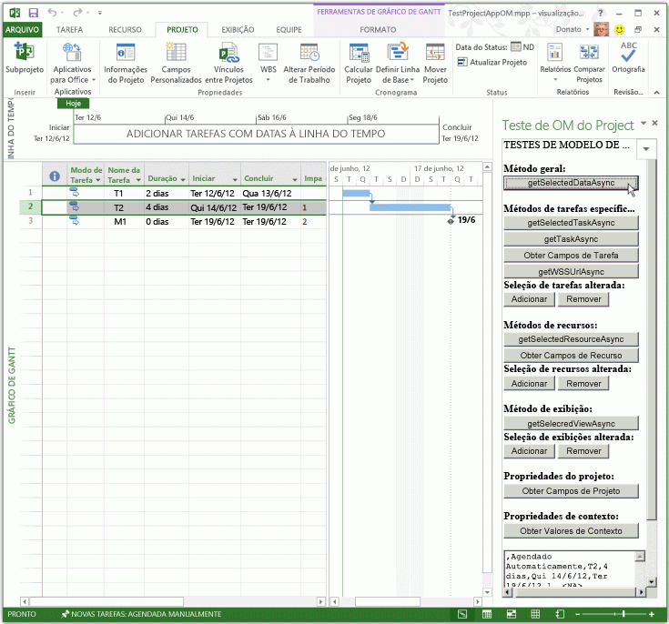
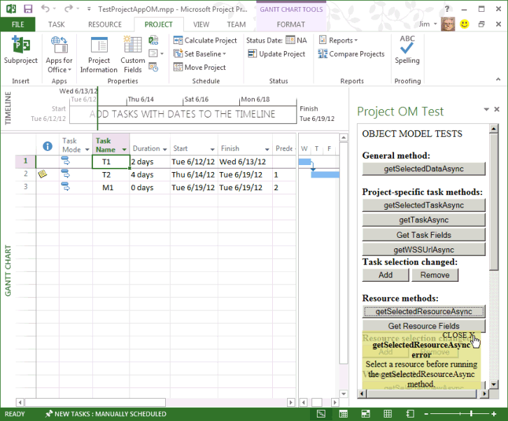

# <a name="create-your-first-task-pane-add-in-for-microsoft-project-by-using-a-text-editor"></a>Crie o seu primeiro suplemento de painel de tarefas para o Microsoft Project usando um editor de texto

Você pode criar um suplemento de painel de tarefas para o Project Standard 2013, o Project Professional 2013 ou versões posteriores usando o gerador Yeoman para suplementos do Office. Este artigo descreve como criar um suplemento simples que usa um manifesto XML que aponta para um arquivo HTML em um compartilhamento de arquivos. O suplemento de exemplo teste do Project OM testa algumas funções de JavaScript que usam o modelo de objeto para suplementos. Depois que você usar a **Central de confiabilidade** no projeto para registrar o compartilhamento de arquivo que contém o arquivo de manifesto, você pode abrir a tarefa do painel suplemento do **Projeto** na faixa de opções. (O código de exemplo deste artigo é baseado em um aplicativo de teste de Arvind Iyer, da Microsoft Corporation).

O Project usa o mesmo esquema de manifesto de suplemento que outros clientes do Microsoft Office, e grande parte da mesma API Java. O código completo para o suplemento que está descrito neste artigo está disponível no subdiretório `Samples\Apps` do download do SDK do Project 2013.

O suplemento de exemplo Teste do Project OM pode obter o GUID de uma tarefa, as propriedades do aplicativo e o projeto ativo. Se o Project Professional 2013 abre um projeto que está em uma biblioteca do SharePoint, o suplemento pode mostrar a URL do projeto. 

O [download do SDK do Project 2013](https://www.microsoft.com/download/details.aspx?id=30435%20) inclui o código-fonte completo. Ao extrair e instalar o SDK e exemplos que estão no arquivo Project2013SDK.msi, confira o `\Samples\Apps\Copy_to_AppManifests_FileShare`subdiretório do arquivo de manifesto e o `\Samples\Apps\Copy_to_AppSource_FileShare`subdiretório do código-fonte. 

O exemplo JSOMCall.html usa funções JavaScript nos arquivos office.js e project-15.js, que estão incluídos. Você pode usar os arquivos de depuração correspondentes (office.debug.js e project-15.debug.js) para examinar as funções.

Para ver uma introdução sobre como usar o JavaScript em suplementos do Office, confira [Noções básicas sobre a API JavaScript para Office](../develop/understanding-the-javascript-api-for-office.md).

## <a name="procedure-1-to-create-the-add-in-manifest-file"></a>Procedimento 1. Para criar o arquivo de manifesto do suplemento

Crie um arquivo XML em um diretório local. O arquivo XML inclui o elemento **OfficeApp** e elementos filhos, que estão descritos em [Manifesto XML de suplementos do Office](../develop/add-in-manifests.md). Por exemplo, crie um arquivo denominado JSOM_SimpleOMCalls.xml contendo o seguinte XML (altere o valor do GUID do elemento **Id**).

```XML
<?xml version="1.0" encoding="utf-8"?>
   <OfficeApp xmlns="http://schemas.microsoft.com/office/appforoffice/1.1"
              xmlns:xsi="https://www.w3.org/2001/XMLSchema-instance"
              xsi:type="TaskPaneApp">
     <Id>93A26520-9414-492F-994B-4983A1C7A607</Id>
     <Version>15.0</Version>
     <ProviderName>Microsoft</ProviderName>
     <DefaultLocale>en-us</DefaultLocale>
     <DisplayName DefaultValue="Project OM Test">
       <Override Locale="fr-fr" Value="Le Project OM Test"/>
     </DisplayName>
     <Description DefaultValue="Test the task pane add-in object model for Project - English (US)">
       <Override Locale="fr-fr" Value="Test the task pane add-in object model for Project - French (France)"/>
     </Description>
     <Hosts>
       <Host Name="Project"/>
       <Host Name="Workbook"/>
       <Host Name="Document"/>
     </Hosts>
    <DefaultSettings>
       <SourceLocation DefaultValue="\\ServerName\AppSource\JSOMCall.html">
         <Override Locale="fr-fr" Value="\\ServerName\AppSource\JSOMCall.html"/>
       </SourceLocation>
     </DefaultSettings>
     <Permissions>ReadWriteDocument</Permissions>
     <IconUrl DefaultValue="http://officeimg.vo.msecnd.net/_layouts/images/general/office_logo.jpg">
       <Override Locale="fr-fr" Value="http://officeimg.vo.msecnd.net/_layouts/images/general/office_logo.jpg"/>
     </IconUrl>
     <AllowSnapshot>true</AllowSnapshot>
   </OfficeApp>
```

Para o Project, o elemento **OfficeApp** deve incluir o valor do atributo `xsi:type="TaskPaneApp"`. O elemento **Id** é um GUID. O valor **SourceLocation** deve ser um caminho de compartilhamento de arquivos ou uma URL do SharePoint para o arquivo de origem HTML do suplemento ou o aplicativo web que é executado no painel de tarefas. Confira [Suplementos do painel de tarefas para o Project](../project/project-add-ins.md) para acessar uma explicação dos outros elementos no arquivo do manifesto.

O Procedimento 2 mostra como criar o arquivo HTML que o manifesto JSOM_SimpleOMCalls.xml especifica para o suplemento de teste do Project. Botões especificados no arquivo HTML chamam funções JavaScript relacionadas. Você pode adicionar funções JavaScript no arquivo HTML ou colocá-las em um arquivo .js separado.

## <a name="procedure-2-to-create-the-source-files-for-the-project-om-test-add-in"></a>Procedimento 2. Para criar os arquivos de origem para o suplemento Teste de modelo de objeto do Project

1. Crie um arquivo HTML com um nome especificado pelo elemento **SourceLocation** no manifesto JSOM_SimpleOMCalls.xml. 

   Por exemplo, crie o arquivo JSOMCall.html no `C:\Project\AppSource` diretório. Embora você possa usar um editor de texto simples para criar os arquivos de origem, é mais fácil usar uma ferramenta como o código do Visual Studio, que funciona com tipos específicos de documentos (como HTML e JavaScript) e tem outros auxílios de edição. Se você ainda não tiver feito o exemplo da Pesquisa do Bing descrito em [Suplementos de painel de tarefas para Project](../project/project-add-ins.md), o Procedimento 3 mostra como criar o `\\ServerName\AppSource` compartilhamento de arquivos que o manifesto especifica.

   O arquivo JSOMCall.html usa o arquivo MicrosoftAjax.js comum para a funcionalidade AJAX e o arquivo Office.js para a funcionalidade de suplemento em aplicativos do Microsoft Office 2013.

    ```HTML
    <!DOCTYPE html>
    <html>
        <head>
            <title>Project OM Sample Code</title>
            <meta http-equiv="X-UA-Compatible" content="IE=Edge" />
            <script type="text/javascript" src="MicrosoftAjax.js"></script>

            <!-- Use the CDN reference to office.js when deploying your add-in. -->
            <!-- <script src="https://appsforoffice.microsoft.com/lib/1/hosted/Office.js"></script> -->
            <script type="text/javascript" src="Office.js"></script>
            <script type="text/javascript" src="JSOM_Sample.js"></script>
        </head>
        <body>
            <div id="Common_JSOM_API">
                OBJECT MODEL TESTS
            </div>

            <textarea id="text" rows="6" cols="25">This is the text result.</textarea>
        </body>
    </html>
    ```

   O elemento **textarea** especifica uma caixa de texto que mostra os resultados das funções de JavaScript.

   > [!NOTE]
   > Para o exemplo de teste do Project funcionar, copie os seguintes arquivos de download de SDK do Project 2013 no mesmo diretório do arquivo JSOMCall.html: Office.js, Project 15.js e MicrosoftAjax.js.

   A etapa 2 adiciona o arquivo JSOM_Sample.js para funções específicas que o suplemento de amostra de Teste de modelo de objeto do Project utiliza. Nas etapas posteriores, você adicionará outros elementos HTML para botões que acionam funções de JavaScript.

2. Crie um arquivo JavaScript denominado JSOM_Sample.js na mesma pasta do arquivo de JSOMCall.html. 

   O código a seguir obtém as informações de contexto e documentação do aplicativo usando funções no arquivo Office.js. O objeto **text** é a ID do controle **textarea** no arquivo HTML.

   A variável **\_projDoc** é inicializada com um objeto **ProjectDocument**. O código inclui algumas funções de tratamento de erros simples e a função **getContextValues** que obtém o contexto do aplicativo e as propriedades contextuais do documento do Project. Para saber mais sobre o modelo de objeto do JavaScript para o Project, confira [API do JavaScript para Office](/office/dev/add-ins/reference/javascript-api-for-office).

    ```js
    /*
    * JavaScript functions for the Project OM Test example app
    * in the Project 2013 SDK.
    */

    var _projDoc;
    var _app;
    var taskGuid;
    var resourceGuid;

    // The initialize function is required for all add-ins.
    Office.initialize = function (reason) {
        // Checks for the DOM to load using the jQuery ready function.
        $(document).ready(function () {
            // After the DOM is loaded, app-specific code can run.
            _projDoc = Office.context.document;
            _app = Office.context;
        });
    }

    function logError(errorText) {
        text.value = "Error in " + errorText;
    }

    function logEventError(erroneousEvent) {
        logError("event " + erroneousEvent);
    }

    function logMethodError(methodName, errorName, errorMessage) {
        logError(methodName + " method.\nError name: " + errorName + "\nMessage: " + errorMessage);
    }

    // . . . Add other JavaScript functions here.

    function getContextValues() {
        getDocumentUrl();
        getDocumentMode();
        getApplicationContentLanguage();
        getApplicationDisplayLanguage();
    }

    function getDocumentUrl() {
        text.value ="Document URL:\n" +_projDoc.url;
    }

    function getDocumentMode() {
        var docMode = _projDoc.mode;
        text.value = text.value + "\n\nDocument mode: " + docMode;
    }

    function getApplicationContentLanguage() {
        text.value = text.value + "\nApp language: " + _app.contentLanguage;
    }

    function getApplicationDisplayLanguage() {
        text.value = text.value + "\nDisplay language: " + _app.displayLanguage;
    }
    ```

   Confira as informações sobre as funções no arquivo Office.debug.js em [API JavaScript para Office](/office/dev/add-ins/reference/javascript-api-for-office). Por exemplo, a função **getDocumentUrl** obtém o caminho de URL ou do arquivo do projeto aberto.

3. Adicione funções JavaScript que acionam funções assíncronas em Office.js e Project-15.js para acessar dados selecionados:

   - Por exemplo, **getSelectedDataAsync** é uma função geral no Office.js que obtém texto não formatado para os dados selecionados. Para saber mais, confira [objeto AsyncResult](/javascript/api/office/office.asyncresult).

   - A função **getSelectedTaskAsync** em Project-15.js obtém o GUID da tarefa selecionada. Da mesma forma, a função **getSelectedResourceAsync** obtém o GUID do recurso selecionado. Se você chamar essas funções quando uma tarefa ou um recurso não estiver selecionado, as funções mostrarão um erro indefinido.

   - A função **getTaskAsync** obtém o nome da tarefa e os nomes dos recursos atribuídos. Se a tarefa estiver em uma lista de tarefas do SharePoint sincronizada, **getTaskAsync** obtém a ID de tarefa na lista do SharePoint. Caso contrário, a ID de tarefa do SharePoint é 0.

     > [!NOTE]
     > Para fins de demonstração, o código de exemplo inclui um bug. Se **taskGuid** estiver indefinida, os erros da função **getTaskAsync** são desativados. Se você obtiver um  GUID de tarefas válido e depois selecionar uma tarefa diferente, a função **getTaskAsync** obterá dados para a tarefa mais recente que foi operada pela função **getSelectedTaskAsync**.
  
   - **getTaskFields**, **getResourceFields** e **getProjectFields** são funções locais que chamam **getTaskFieldAsync**, **getResourceFieldAsync** ou **getProjectFieldAsync** várias vezes para obter campos especificados de uma tarefa ou um recurso. No arquivo project-15.debug.js, as enumerações **ProjectTaskFields** e **ProjectResourceFields** mostram quais campos têm suporte.

   - A função **getSelectedViewAsync** obtém o tipo de exibição (definido na enumeração **ProjectViewTypes** no projeto 15.debug.js) e o nome do modo de exibição.

   - Se o projeto é sincronizado com uma lista de tarefas do SharePoint, a função **getWSSUrlAsync** obtém a URL e o nome da lista de tarefas. Se o projeto não está sincronizado com uma lista de tarefas do SharePoint, a função **getWSSUrlAsync** falha.

     > [!NOTE]
     > Para obter a URL do SharePoint e o nome da lista de tarefas, recomendamos que você use a função **getProjectFieldAsync** com as constantes **WSSUrl** e **WSSList** na enumeração [ProjectProjectFields](/javascript/api/office/office.projectprojectfields).

   Cada uma das funções no código a seguir inclui uma função anônima que é especificada por `function (asyncResult)`, que é um retorno de chamada que obtém o resultado assíncrono. Em vez de funções anônimas, você poderia usar funções nomeadas, que podem ajudar na capacidade de manutenção de suplementos complexos.

    ```js
    // Get the data in the selected cells of the grid in the active view.
    function getSelectedDataAsync() {
        _projDoc.getSelectedDataAsync(
            Office.CoercionType.Text,
            { ValueFormat: "Formatted" },
            function (asyncResult) {
                if (asyncResult.status == Office.AsyncResultStatus.Succeeded)
                    text.value = asyncResult.value;
                else
                    logMethodError("getSelectedDataAsync", asyncResult.error.name,
                                   asyncResult.error.message);
            }
        );
    }

    // Get the GUID of the selected task.
    function getSelectedTaskAsync() {
        _projDoc.getSelectedTaskAsync(function (asyncResult) {
            if (asyncResult.status == Office.AsyncResultStatus.Succeeded) {
                text.value = asyncResult.value;
                taskGuid = asyncResult.value;
            }
            else {
                logMethodError("getSelectedTaskAsync", asyncResult.error.name,
                                   asyncResult.error.message);
            }
        });
    }

    // Get the GUID of the selected resource.
    function getSelectedResourceAsync() {
        _projDoc.getSelectedResourceAsync(function (asyncResult) {
            if (asyncResult.status == Office.AsyncResultStatus.Succeeded) {
                text.value = asyncResult.value;
                resourceGuid = asyncResult.value;
            }
            else {
                logMethodError("getSelectedResourceAsync", asyncResult.error.name,
                                   asyncResult.error.message);
            }
        });
    }

    // Get data for the specified task.
    function getTaskAsync() {
        if (taskGuid != undefined) {
            _projDoc.getTaskAsync(
                taskGuid,
                function (asyncResult) {
                    if (asyncResult.status === Office.AsyncResultStatus.Failed) {
                        logMethodError("getTaskAsync", asyncResult.error.name,
                                   asyncResult.error.message);
                    } else {
                        var taskInfo = asyncResult.value;
                        var taskOutput = "Task name: " + taskInfo.taskName +
                                         "\nGUID: " + taskGuid +
                                         "\nWSS Id: " + taskInfo.wssTaskId +
                                         "\nResourceNames: " + taskInfo.resourceNames;
                        text.value = taskOutput;
                    }
                }
            );
        } else {
            text.value = 'Task GUID not valid:\n' + taskGuid;
        } 
    }

    // Get additional data for task fields.
    function getTaskFields() {
        text.value = "";

        _projDoc. getTaskFieldAsync(taskGuid, Office.ProjectTaskFields.Name,
            function (asyncResult) {
                if (asyncResult.status == Office.AsyncResultStatus.Succeeded) {
                    text.value = text.value + "Name: "
                        + asyncResult.value.fieldValue + "\n";
                }
                else {
                    logMethodError("getTaskFieldAsync", asyncResult.error.name,
                                   asyncResult.error.message);
                }
            }
        );

        _projDoc.getTaskFieldAsync(taskGuid, Office.ProjectTaskFields.ID,
            function (asyncResult) {
                if (asyncResult.status == Office.AsyncResultStatus.Succeeded) {
                    text.value = text.value + "ID: "
                        + asyncResult.value.fieldValue + "\n";
                }
                else {
                    logMethodError("getTaskFieldAsync", asyncResult.error.name,
                                   asyncResult.error.message);
                }
            }
        );

        _projDoc.getTaskFieldAsync(taskGuid, Office.ProjectTaskFields.Start,
            function (asyncResult) {
                if (asyncResult.status == Office.AsyncResultStatus.Succeeded) {
                    text.value = text.value + "Start: "
                        + asyncResult.value.fieldValue + "\n";
                }
                else {
                    logMethodError("getTaskFieldAsync", asyncResult.error.name,
                                   asyncResult.error.message);
                }
            }
        );

        _projDoc.getTaskFieldAsync(taskGuid, Office.ProjectTaskFields.Duration,
            function (asyncResult) {
                if (asyncResult.status == Office.AsyncResultStatus.Succeeded) {
                    text.value = text.value + "Duration: "
                        + asyncResult.value.fieldValue + "\n";
                }
                else {
                    logMethodError("getTaskFieldAsync", asyncResult.error.name,
                                   asyncResult.error.message);
                }
            }
        );

        _projDoc.getTaskFieldAsync(taskGuid, Office.ProjectTaskFields.Priority,
            function (asyncResult) {
                if (asyncResult.status == Office.AsyncResultStatus.Succeeded) {
                    text.value = text.value + "Priority: "
                        + asyncResult.value.fieldValue + "\n";
                }
                else {
                    logMethodError("getTaskFieldAsync", asyncResult.error.name,
                                   asyncResult.error.message);
                }
            }
        );

        _projDoc.getTaskFieldAsync(taskGuid, Office.ProjectTaskFields.Notes,
            function (asyncResult) {
                if (asyncResult.status == Office.AsyncResultStatus.Succeeded) {
                    text.value = text.value + "Notes: "
                        + asyncResult.value.fieldValue + "\n";
                }
                else {
                    logMethodError("getTaskFieldAsync", asyncResult.error.name,
                                   asyncResult.error.message);
                }
            }
        ); 
    }

    // Get data for the specified resource fields.
    function getResourceFields() {
        text.value = "";

        _projDoc.getResourceFieldAsync(resourceGuid, Office.ProjectResourceFields.Name,
            function (asyncResult) {
                if (asyncResult.status == Office.AsyncResultStatus.Succeeded) {
                    text.value = text.value + "Resource name: " + asyncResult.value.fieldValue + "\n";
                }
                else {
                    logMethodError("getResourceFieldAsync", asyncResult.error.name,
                                   asyncResult.error.message);
                }
            }
        );

        _projDoc.getResourceFieldAsync(resourceGuid, Office.ProjectResourceFields.Cost,
            function (asyncResult) {
                if (asyncResult.status == Office.AsyncResultStatus.Succeeded) {
                    text.value = text.value + "Cost: " + asyncResult.value.fieldValue + "\n";
                }
                else {
                    logMethodError("getResourceFieldAsync", asyncResult.error.name,
                                   asyncResult.error.message);
                }
            }
        );

        _projDoc.getResourceFieldAsync(resourceGuid, Office.ProjectResourceFields.StandardRate,
            function (asyncResult) {
                if (asyncResult.status == Office.AsyncResultStatus.Succeeded) {
                    text.value = text.value + "Standard Rate: " + asyncResult.value.fieldValue + "\n";
                }
                else {
                    logMethodError("getResourceFieldAsync", asyncResult.error.name, asyncResult.error.message);
                }
            }
        );

        _projDoc.getResourceFieldAsync(resourceGuid, Office.ProjectResourceFields.ActualCost,
            function (asyncResult) {
                if (asyncResult.status == Office.AsyncResultStatus.Succeeded) {
                    text.value = text.value + "Actual Cost: " + asyncResult.value.fieldValue + "\n";
                }
                else {
                    logMethodError("getResourceFieldAsync", asyncResult.error.name, asyncResult.error.message);
                }
            }
        );

        _projDoc.getResourceFieldAsync(resourceGuid, Office.ProjectResourceFields.ActualWork,
            function (asyncResult) {
                if (asyncResult.status == Office.AsyncResultStatus.Succeeded) {
                    text.value = text.value + "Actual Work: " + asyncResult.value.fieldValue + "\n";
                }
                else {
                    logMethodError("getResourceFieldAsync", asyncResult.error.name,
                                   asyncResult.error.message);
                }
            }
        );

        _projDoc.getResourceFieldAsync(resourceGuid, Office.ProjectResourceFields.Units,
            function (asyncResult) {
                if (asyncResult.status == Office.AsyncResultStatus.Succeeded) {
                    text.value = text.value + "Units: " + asyncResult.value.fieldValue + "\n";
                }
                else {
                    logMethodError("getResourceFieldAsync", asyncResult.error.name,
                                   asyncResult.error.message);
                }
            }
        );
    }

    // Get the URL and list name of the synchronized SharePoint task list.
    // Recommended: use getProjectField instead.
    function getWSSUrlAsync() {
        _projDoc.getWSSUrlAsync(function (asyncResult) {
            if (asyncResult.status == Office.AsyncResultStatus.Succeeded) {
                text.value = "SharePoint URL:\n" + asyncResult.value.serverUrl
                    + "\nList name: " + asyncResult.value.listName;
            }
            else {
                logMethodError("getWSSUrlAsync", asyncResult.error.name, asyncResult.error.message);
            }
        });
    }

    // Get the type and name of the selected view.
    function getSelectedViewAsync() {
        _projDoc.getSelectedViewAsync(function (asyncResult) {
            text.value = "View type: " + asyncResult.value.viewType
                + "\nName: " + asyncResult.value.viewName;
        });
    }

    // Get information about the active project.
    function getProjectFields() {
        text.value = "";

        _projDoc.getProjectFieldAsync(Office.ProjectProjectFields.GUID,
            function (asyncResult) {
                if (asyncResult.status == Office.AsyncResultStatus.Succeeded) {
                    text.value = text.value + "Project GUID: " + asyncResult.value.fieldValue + "\n";
                }
                else {
                    logMethodError("getProjectFieldAsync", asyncResult.error.name, asyncResult.error.message);
                }
            }
        );

        _projDoc.getProjectFieldAsync(Office.ProjectProjectFields.Start,
            function (asyncResult) {
                if (asyncResult.status == Office.AsyncResultStatus.Succeeded) {
                    text.value = text.value + "\nStart: " + asyncResult.value.fieldValue + "\n";
                }
                else {
                    logMethodError("getProjectFieldAsync", asyncResult.error.name, asyncResult.error.message);
                }
            }
        );

        _projDoc.getProjectFieldAsync(Office.ProjectProjectFields.Finish,
            function (asyncResult) {
                if (asyncResult.status == Office.AsyncResultStatus.Succeeded) {
                    text.value = text.value + "\nFinish: " + asyncResult.value.fieldValue + "\n";
                }
                else {
                    logMethodError("getProject " + errorText);
                }
            }
        );

        _projDoc.getProjectFieldAsync(Office.ProjectProjectFields.CurrencyDigits,
            function (asyncResult) {
                if (asyncResult.status == Office.AsyncResultStatus.Succeeded) {
                    text.value = text.value + "\nCurrency digits: " + asyncResult.value.fieldValue + "\n";
                }
                else {
                    logMethodError("getProjectFieldAsync", asyncResult.error.name, asyncResult.error.message);
                }
            }
        );

        _projDoc.getProjectFieldAsync(Office.ProjectProjectFields.CurrencySymbol,
            function (asyncResult) {
                if (asyncResult.status == Office.AsyncResultStatus.Succeeded) {
                    text.value = text.value + "Currency symbol: " + asyncResult.value.fieldValue + "\n";
                }
                else {
                    logMethodError("getProjectFieldAsync", asyncResult.error.name, asyncResult.error.message);
                }
            }
        );

        _projDoc.getProjectFieldAsync(Office.ProjectProjectFields.CurrencySymbolPosition,
            function (asyncResult) {
                if (asyncResult.status == Office.AsyncResultStatus.Succeeded) {
                    text.value = text.value + "\nSymbol position: " + asyncResult.value.fieldValue + "\n";
                }
                else {
                    logMethodError("getProjectFieldAsync", asyncResult.error.name, asyncResult.error.message);
                }
            }
        );

        _projDoc.getProjectFieldAsync(Office.ProjectProjectFields.ProjectServerUrl,
            function (asyncResult) {
                if (asyncResult.status == Office.AsyncResultStatus.Succeeded) {
                    text.value = text.value + "\nProject web app URL:\n  " + asyncResult.value.fieldValue + "\n";
                }
                else {
                    logMethodError("getProjectFieldAsync", asyncResult.error.name, asyncResult.error.message);
                }
            }
        );

        _projDoc.getProjectFieldAsync(Office.ProjectProjectFields.WSSUrl,
            function (asyncResult) {
                if (asyncResult.status == Office.AsyncResultStatus.Succeeded) {
                    text.value = text.value + "\nSharePoint URL:\n  " + asyncResult.value.fieldValue + "\n";
                }
                else {
                    logMethodError("getProjectFieldAsync", asyncResult.error.name, asyncResult.error.message);
                }
            }
        );

        _projDoc.getProjectFieldAsync(Office.ProjectProjectFields.WSSList,
            function (asyncResult) {
                if (asyncResult.status == Office.AsyncResultStatus.Succeeded) {
                    text.value = text.value + "\nSharePoint list: " + asyncResult.value.fieldValue + "\n";
                }
                else {
                    logMethodError("getProjectFieldAsync", asyncResult.error.name, asyncResult.error.message);
                }
            }
        );
    }
    ```

4. Adicione retornos de chamada e funções de manipulador de eventos JavaScript para registrar a seleção de tarefas, a seleção de recursos, exibir os manipuladores de eventos de alteração de seleção e desfazer o registro dos manipuladores de eventos. A função **manageEventHandlerAsync** adiciona ou remove o manipulador de eventos específico, dependendo do parâmetro _operation_. A operação pode ser **addHandlerAsync** ou **removeHandlerAsync**.

   As funções **manageTaskEventHandler**, **manageResourceEventHandler** e **manageViewEventHandler** podem adicionar ou remover um manipulador de eventos, como especificado pelo parâmetro _docMethod_.

    ```js
    // Task selection changed event handler.
    function onTaskSelectionChanged(eventArgs) {
        text.value = "In task selection change event handler";
    }

    // Resource selection changed event handler.
    function onResourceSelectionChanged(eventArgs) {
        text.value = "In Resource selection changed event handler";
    }

    // View selection changed event handler.
    function onViewSelectionChanged(eventArgs) {
        text.value = "In View selection changed event handler";
    }

    // Add or remove the specified event handler.
    function manageEventHandlerAsync(eventType, handler, operation, onComplete) {
        _projDoc[operation]   //The operation is addHandlerAsync or removeHandlerAsync.
        (
            eventType,
            handler,
            function (asyncResult) {
                if (onComplete) {
                    onComplete(asyncResult, operation);
                } else {
                    var message = "Operation: " + operation;
                    message = message + "\nStatus: " + asyncResult.status + "\n";
                    text.value = message;
                }
            }
        );
    }

    // Write the asyncResult status from the manageEventHandlerAsync function (optional). 
    function onComplete(asyncResult, operation) {
        var message = "In onComplete function for " + operation;
        message = message + "\nStatus: " + asyncResult.status;
        text.value = message;
    }

    // Add or remove a task selection changed event handler.
    function manageTaskEventHandler(docMethod) {
        manageEventHandlerAsync(
            Office.EventType.TaskSelectionChanged,      // The task selection changed event.
            onTaskSelectionChanged,                     // The event handler.
            docMethod,                // The Office.Document method to add or remove an event handler.
            onComplete                // Manages the successful asyncResult data (optional).
        );
    }

    // Add or remove a resource selection changed event handler.
    function manageResourceEventHandler(docMethod) {
        manageEventHandlerAsync(
            Office.EventType.ResourceSelectionChanged,  // The resource selection changed event.
            onResourceSelectionChanged,                 // The event handler.
            docMethod,                // The Office.Document method to add or remove an event handler.
            onComplete                // Manages the successful asyncResult data (optional).
        );
    }

    // Add or remove a view selection changed event handler.
    function manageViewEventHandler(docMethod) {
        manageEventHandlerAsync(
            Office.EventType.ViewSelectionChanged,      // The view selection changed event.
            onViewSelectionChanged,                     // The event handler.
            docMethod,                // The Office.Document method to add or remove an event handler.
            onComplete                // Manages the successful asyncResult data (optional).
        );
    }
    ```

5. Para o corpo do documento HTML, adicione botões que chamam funções JavaScript para teste. Por exemplo, no elemento **div** para a API JSOM comum, adicione um botão de entrada que chama a função geral **getSelectedDataAsync**.

    ```HTML
    <body>
        <div id="Common_JSOM_API">
        OBJECT MODEL TESTS
        <br /><br />
        <strong>General function:</strong>
        <br />
        <input id="Button5" class="button-wide" type="button" onclick="getSelectedDataAsync()" 
            value="getSelectedDataAsync" />
        </div>
        <!--  more code . . .  -->
    ```

6. Adicione uma seção **div** com botões para funções de tarefas específicas do projeto e para o evento **TaskSelectionChanged**.

    ```HTML
    <div id="ProjectSpecificTask">
      <br />
      <strong>Project-specific task methods:</strong><br />
      <button class="button-wide" onclick="getSelectedTaskAsync()">getSelectedTaskAsync</button><br />
      <button class="button-wide" onclick="getTaskAsync()">getTaskAsync</button><br />
      <button class="button-wide" onclick="getTaskFields()">Get Task Fields</button><br />
      <button class="button-wide" onclick="getWSSUrlAsync()">getWSSUrlAsync</button>
      <strong>Task selection changed:</strong>
      <button class="button-narrow" onclick="manageTaskEventHandler('addHandlerAsync')">Add</button>
      <button class="button-narrow" onclick="manageTaskEventHandler('removeHandlerAsync')">Remove</button>
    </div>
    ```

7. Adicionar seções **div** com botões para os métodos de recursos e eventos, métodos de exibição e eventos, propriedades do projeto e propriedades do contexto

    ```HTML
    <div id="ResourceMethods">
      <br />
      <strong>Resource methods:</strong>
      <button class="button-wide" onclick="getSelectedResourceAsync()">getSelectedResourceAsync</button><br />
      <button class="button-wide" onclick="getResourceFields()">Get Resource Fields</button><br />
      <strong>Resource selection changed:</strong>
      <button class="button-narrow" onclick="manageResourceEventHandler('addHandlerAsync')">Add</button>
      <button class="button-narrow" onclick="manageResourceEventHandler('removeHandlerAsync')">Remove</button>
    </div>
    <div id="ViewMethods">
      <br />
      <strong>View method:</strong>
      <button class="button-wide" onclick="getSelectedViewAsync()">getSelectedViewAsync</button><br />
      <strong>View selection changed:</strong>
      <button class="button-narrow" onclick="manageViewEventHandler('addHandlerAsync')">Add</button>
      <button class="button-narrow" onclick="manageViewEventHandler('removeHandlerAsync')">Remove</button>
    </div>
    <div id="ProjectMethods">
      <br />
      <strong>Project properties:</strong>
      <button class="button-wide" onclick="getProjectFields()">Get Project Fields</button><br />
    </div>
    <div id="ContextVariables">
      <br />
      <strong>Context properties:</strong>
      <button class="button-wide" onclick="getContextValues()">Get Context Values</button>
    </div>
    ```

8. Para formatar elementos de botão, adicione um elemento CSS **style**. Por exemplo, adicione o seguinte como um filho do elemento **head**.

    ```HTML
    <style type="text/css">
        .button-wide
        {
            width: 210px;
            margin-top: 2px;
        }
        .button-narrow
        {
            width: 80px;
            margin-top: 2px;
        }
    </style>
    ```

O Procedimento 3 mostra como instalar e usar os recursos do suplemento Teste de modelo de objeto do Project.

## <a name="procedure-3-to-install-and-use-the-project-om-test-add-in"></a>Procedimento 3. Para instalar e usar o suplemento Teste de modelo de objeto do Project

1. Crie um compartilhamento de arquivos para o diretório que contém o manifesto JSOM_SimpleOMCalls.xml. Você pode criar o compartilhamento de arquivos no computador local ou em um computador remoto que esteja acessível na rede. Por exemplo, se o manifesto estiver no diretório `C:\Project\AppManifests` no computador local, execute o seguinte comando:

    `Net share AppManifests=C:\Project\AppManifests`

2. Crie um compartilhamento de arquivos para o diretório que contenha os arquivos HTML e JavaScript para o suplemento Teste de modelo de objeto do Project. Verifique se o caminho de compartilhamento do arquivo corresponde ao caminho especificado no manifesto JSOM_SimpleOMCalls.xml. Por exemplo, se os arquivos estão no diretório `C:\Project\AppSource` no computador local, execute o seguinte comando:

    `net share AppSource=C:\Project\AppSource`

3. No Project, abra a caixa de diálogo **Opções do Project**, escolha **Central de Confiabilidade** e escolha **Configurações da Central de Confiabilidade**.

   O procedimento para registrar um suplemento também está descrito em [Suplementos do painel de tarefas para o Project](../project/project-add-ins.md), com informações adicionais.

4. Na caixa de diálogo **Central de Confiabilidade**, no painel esquerdo, escolha **Catálogos de Suplementos Confiáveis**.

5. Se você já tiver adicionado o caminho `\\ServerName\AppManifests` para o suplemento Pesquisa do Bing, pule esta etapa. Caso contrário, no painel **Catálogos de Suplementos Confiáveis**, adicione o caminho `\\ServerName\AppManifests` na caixa de texto **URL do Catálogo**, escolha **Adicionar catálogo**, habilite o compartilhamento de rede como origem padrão (confira a Figura 1) e escolha **OK**.

   *Figura 1. Adicionar um compartilhamento de arquivos de rede para manifestos de suplementos*

   

6. Depois de adicionar novos suplementos ou alterar o código-fonte, reinicie o Project. Na faixa de opções **PROJETO**, escolha o menu suspenso **Suplementos do Office** e escolha **Ver Tudo**. Na caixa de diálogo **Inserir Suplemento**, escolha **PASTA COMPARTILHADA** (confira a Figura 2), selecione **Teste de modelo de objeto do Project** e escolha **Inserir**. O suplemento Teste de modelo de objeto do Project inicia em um painel de tarefas.

   *Figura 2. Iniciando o suplemento do Teste de Modelo de Objeto do Project contido em um compartilhamento de arquivo*

   

7. No Project, crie e salve um projeto simples que tenha pelo menos duas tarefas. Por exemplo, crie tarefas chamadas T1 e T2 e um marco chamado M1, e defina as durações das tarefas e os predecessores de maneira semelhante à Figura 3. Escolha a guia **PROJETO** na faixa de opções, selecione a linha inteira para a tarefa T2 e escolha o botão **getSelectedDataAsync** no painel de tarefas. A Figura 3 mostra os dados que estão selecionados na caixa de texto do suplemento **Teste de modelo de objeto do Project**.

   *Figura 3. Usando o suplemento do Teste de Modelo de Objeto do Project*

   

8. Selecione a célula na coluna **Duração** da primeira tarefa e escolha o botão **getSelectedDataAsync** no suplemento **Teste de modelo de objeto do Project**. A função **getSelectedDataAsync** define o valor da caixa de texto para mostrar `2 days`. 

9. Selecione as três células de **Duração** para todas as três tarefas. A função **getSelectedDataAsync** retorna valores de texto separados por ponto e vírgula para células selecionadas em linhas diferentes, por exemplo, `2 days;4 days;0 days`.

   A função **getSelectedDataAsync** retorna valores de texto separados por vírgula para células selecionadas em uma linha. Por exemplo, na Figura 3, a linha inteira da tarefa T2 está selecionada. Quando você escolhe **getSelectedDataAsync**, a caixa de texto mostra o seguinte: `,Auto Scheduled,T2,4 days,Thu 6/14/12,Tue 6/19/12,1,,<NA>`

   As colunas **Indicadores** e **Nomes de Recursos** estão vazias, portanto, a matriz de texto mostra valores vazios para essas colunas. O valor `<NA>` é para a célula **Adicionar Nova Coluna**.

10. Selecione qualquer célula na linha da tarefa T2, ou a linha inteira da tarefa T2, e escolha **getSelectedTaskAsync**. A caixa de texto mostra o valor de tarefa do GUID, por exemplo, `{25D3E03B-9A7D-E111-92FC-00155D3BA208}`. O Project armazena esse valor na variável global **taskGuid** do suplemento **Teste de modelo de objeto do Project**.

11. Selecione **getTaskAsync**. Se a variável **taskGuid** contém o GUID para a tarefa T2, a caixa de texto exibe as informações da tarefa. O valor **ResourceNames** fica vazio.

    Create two local resources R1 andR2, assign them to task T2 at 50% each, and choose  **getTaskAsync** again. The results in the text box include the resource information. If the task is in a synchronized SharePoint task list, the results also include the SharePoint task ID.

    - Nome da tarefa: `T2`
    - GUID: `{25D3E03B-9A7D-E111-92FC-00155D3BA208}`
    - Id da WSS: `0`
    - ResourceNames: `R1[50%],R2[50%]`

12. Selecione o botão **Get Task Fields**. A função **getTaskFields** chama a função **getTaskfieldAsync** várias vezes para o nome da tarefa, o índice, a data de início, a duração, a prioridade e as anotações da tarefa.

    - Nome: `T2`
    - ID: `2`
    - Início: `Thu 6/14/12`
    - Duração: `4d`
    - Prioridade: `500`
    - Observações: essa é uma anotação de tarefa T2. É apenas uma anotação de teste. Se fosse uma anotação de verdade, teria algumas informações reais.

13. Selecione o botão **getWSSUrlAsync**. Se o projeto é um dos tipos a seguir, os resultados mostram a URL e o nome da lista de tarefas.

    - Uma lista de tarefas do SharePoint importada no Project Server.
    - Uma lista de tarefas do SharePoint importada no Project Professional, depois salva novamente no SharePoint (sem usar o Project Server).

    > [!NOTE]
    > Se o Project Professional estiver instalado em um computador com Windows Server, para poder salvar o projeto de volta no SharePoint, use o **Gerenciador de Servidores** para adicionar o recurso **Experiência Desktop**.

    Se o projeto for um projeto local, ou se você usar o Project Professional para abrir um projeto gerenciado pelo Project Server, o método **getWSSUrlAsync** mostrará um erro indefinido.

    - URL do SharePoint: `http://ServerName`
    - Nome da lista: `Test task list`

14. Selecione o botão **Adicionar** na seção **Evento TaskSelectionChanged**, que chama a função **manageTaskEventHandler** para registrar um evento alterado de seleção de tarefa e retorna `In onComplete function for addHandlerAsync Status: succeeded` na caixa de texto. Selecione uma tarefa diferente. A caixa de texto mostra `In task selection changed event handler`, que é o resultado da função de retorno de chamada para o evento de alteração de seleção de tarefa. Escolha o botão **Remover** para cancelar o registro do manipulador de eventos.

15. Para usar os métodos de recurso, primeiro selecione um modo de exibição, como **Folha de Recursos**, **Uso de Recursos** ou **Formulário de recursos** e selecione um recurso no modo de exibição. Escolha **getSelectedResourceAsync** para iniciar a variável **resourceGuid** e escolha **Get Resource Fields** a fim de chamar **getResourceFieldAsync** várias vezes para as propriedades do recurso. Você também pode adicionar ou remover o manipulador de eventos da alteração da seleção do recurso.

    - Nome do recurso: `R1`
    - Custo: `$800.00`
    - Taxa padrão: `$50.00/h`
    - Custo real: `$0.00`
    - Trabalho real: `0h`
    - Unidades: `100%`

16. Selecione **getSelectedViewAsync** para exibir o tipo e o nome do modo de exibição ativo. Você também pode adicionar ou remover o manipulador de eventos da alteração da seleção de exibição. Por exemplo, se **Formulário de Recursos** é o modo de exibição ativo, a função **getSelectedViewAsync** mostra o seguinte na caixa de texto:

    - Tipo de exibição: `6`
    - Nome: `Resource Form`

17. Selecione **Get Project Fields** para chamar a função **getProjectFieldAsync** várias vezes para propriedades diferentes do projeto ativo. Se o projeto é aberto do Project Web App, a função **getProjectFieldAsync** pode obter a URL da instância do Project Web App.

    - GUID do projeto: `9845922E-DAB4-E111-8AF3-00155D3BA208`
    - Início: `Tue 6/12/12`
    - Término: `Tue 6/19/12`
    - Dígitos da moeda: `2`
    - Símbolo da moeda: `$`
    - Posição do símbolo: `0`
    - URL do Project Web App: `http://servername/pwa`
  
18. Selecione o botão **Get Context Values** para obter as propriedades do documento e o aplicativo no qual o suplemento está sendo executado, obtendo propriedades dos objetos **Office.Context.document** e **Office.context.application**. Por exemplo, se o arquivo Project1.mpp estiver na área de trabalho do computador local, a URL do documento será `C:\Users\UserAlias\Desktop\Project1.mpp`. Se o arquivo .mpp estiver em uma biblioteca do SharePoint, o valor será a URL do documento. Se você usar o Project Professional 2013 para abrir um projeto chamado Project1 do Project Web App, a URL do documento será `<>\Project1`.

    - URL do documento: `<>\Project1`
    - Modo do documento: `readWrite`
    - Idioma do aplicativo: `en-US`
    - Idioma de exibição: `en-US`

19. Você pode atualizar o suplemento após editar o código-fonte fechando e reiniciando o Project. Na faixa de opções **Projeto** a lista suspensa **Suplementos do Office** mantém a lista de suplementos usados recentemente.

## <a name="example"></a>Exemplo

O download do SDK do Project 2013 contém o código completo no arquivo JSOMCall.html, o arquivo JSOM_Sample.js e os arquivos Office.js, Office.debug.js, Project-15.js e Project-15.debug.js relacionados. Este é o código no arquivo JSOMCall.html.

```HTML
<!DOCTYPE html>
<html>
    <head>
        <title>Project OM Sample Code</title>
        <meta http-equiv="X-UA-Compatible" content="IE=Edge"/>

        <script type="text/javascript" src="MicrosoftAjax.js"></script>

        <!-- Use the CDN reference to office.js when deploying your add-in. -->
        <!-- <script src="https://appsforoffice.microsoft.com/lib/1/hosted/Office.js"></script> -->
        <script type="text/javascript" src="Office.js"></script>
        <script type="text/javascript" src="JSOM_Sample.js"></script>

        <style type="text/css">
            .button-wide {
                width: 210px;
                margin-top: 2px;
            }
            .button-narrow 
            {
                width: 80px;
                margin-top: 2px;
            }
        </style>
    </head>

    <body>
        <div id="Common_JSOM_API">
            OBJECT MODEL TESTS
            <br /><br />
            <strong>General method:</strong>
            <br />
            <input id="Button5" class="button-wide" type="button" onclick="getSelectedDataAsync()" 
                value="getSelectedDataAsync" />
        </div>
        <div id="ProjectSpecificTask">
            <br />
            <strong>Project-specific task methods:</strong><br />
            <button class="button-wide" onclick="getSelectedTaskAsync()">getSelectedTaskAsync</button><br />
            <button class="button-wide" onclick="getTaskAsync()">getTaskAsync</button><br />
            <button class="button-wide" onclick="getTaskFields()">Get Task Fields</button><br />
            <button class="button-wide" onclick="getWSSUrlAsync()">getWSSUrlAsync</button>
            <strong>Task selection changed:</strong>
            <button class="button-narrow" onclick="manageTaskEventHandler('addHandlerAsync')">Add</button>
            <button class="button-narrow" onclick="manageTaskEventHandler('removeHandlerAsync')">Remove</button>
        </div>
        <div id="ResourceMethods">
            <br />
            <strong>Resource methods:</strong>
            <button class="button-wide" onclick="getSelectedResourceAsync()">getSelectedResourceAsync</button><br />
            <button class="button-wide" onclick="getResourceFields()">Get Resource Fields</button><br />
            <strong>Resource selection changed:</strong>
            <button class="button-narrow" onclick="manageResourceEventHandler('addHandlerAsync')">Add</button>
            <button class="button-narrow" onclick="manageResourceEventHandler('removeHandlerAsync')">Remove</button>
        </div>
        <div id="ViewMethods">
            <br />
            <strong>View method:</strong>
            <button class="button-wide" onclick="getSelectedViewAsync()">getSelectedViewAsync</button><br />
            <strong>View selection changed:</strong>
            <button class="button-narrow" onclick="manageViewEventHandler('addHandlerAsync')">Add</button>
            <button class="button-narrow" onclick="manageViewEventHandler('removeHandlerAsync')">Remove</button>
        </div>
        <div id="ProjectMethods">
            <br />
            <strong>Project properties:</strong>
            <button class="button-wide" onclick="getProjectFields()">Get Project Fields</button><br />
        </div>
        <div id="ContextVariables">
            <br />
            <strong>Context properties:</strong>
            <button class="button-wide" onclick="getContextValues()">Get Context Values</button>
        </div>
        <br />
        <textarea id="text" rows="10" cols="25">This is the text result.</textarea>
    </body>
</html
```

## <a name="robust-programming"></a>Programação robusta

O suplemento **Teste de modelo de objeto do Project** é um exemplo que mostra o uso de algumas funções JavaScript do Project 2013 nos arquivos Project-15.js e Office.js. O exemplo é somente para teste e não inclui verificações de erro robustas. Por exemplo, se você não selecionar um recurso e executar a função **getSelectedResourceAsync**, a variável **resourceGuid** não inicia e as chamadas para **getResourceFieldAsync** retornam um erro. Para um suplemento de produção, você deve verificar se há erros específicos e ignorar os resultados, ocultar funcionalidades que não se aplicam ou notificar o usuário para escolher um modo de exibição e fazer uma seleção válida antes de usar uma função.

Para obter um exemplo simples, a saída de erro no código a seguir inclui a variável **actionMessage** que especifica a ação a tomar para evitar erros na função **getSelectedResourceAsync**.

```js
function logError(errorText) {
    text.value = "Error in " + errorText;
}

function logMethodError(methodName, errorName, errorMessage, actionMessage) {
    logError(methodName + " method.\nError name: " + errorName
        + "\nMessage: " + errorMessage
        + "\n\nAction: " + actionMessage);
}

// Get the GUID of the selected resource.
function getSelectedResourceAsync() {
    _projDoc.getSelectedResourceAsync(function (asyncResult) {
        if (asyncResult.status == Office.AsyncResultStatus.Succeeded) {
            text.value = asyncResult.value;
            resourceGuid = asyncResult.value;
        }
        else {
            var actionMessage = "Select a resource before running the getSelectedResourceAsync method.";
            logMethodError("getSelectedResourceAsync", asyncResult.error.name,
                               asyncResult.error.message, actionMessage);
        }
    });
}
```

O exemplo **HelloProject_OData** no download do SDK do Project 2013 inclui o arquivo SurfaceErrors.js que usa a biblioteca JQuery para exibir uma mensagem de erro pop-up. A Figura 4 mostra a mensagem de erro em uma notificação do sistema.

O código a seguir no arquivo SurfaceErrors.js inclui a função **throwError** que cria um objeto **Toast**.

```js
/*
 * Show error messages in a "toast" notification.
 */

// Throws a custom defined error.
function throwError(errTitle, errMessage) {
    try {
        // Define and throw a custom error.
        var customError = { name: errTitle, message: errMessage }
        throw customError;
    }
    catch (err) {
        // Catch the error and display it to the user.
        Toast.showToast(err.name, err.message);
    }
}

// Add a dynamically-created div "toast" for displaying errors to the user.
var Toast = {

    Toast: "divToast",
    Close: "btnClose",
    Notice: "lblNotice",
    Output: "lblOutput",

    // Show the toast with the specified information.
    showToast: function (title, message) {

        if (document.getElementById(this.Toast) == null) {
            this.createToast();
        }

        document.getElementById(this.Notice).innerText = title;
        document.getElementById(this.Output).innerText = message;

        $("#" + this.Toast).hide();
        $("#" + this.Toast).show("slow");
    },

    // Create the display for the toast.
    createToast: function () {
        var divToast;
        var lblClose;
        var btnClose;
        var divOutput;
        var lblOutput;
        var lblNotice;

        // Create the container div.
        divToast = document.createElement("div");
        var toastStyle = "background-color:rgba(220, 220, 128, 0.80);" +
            "position:absolute;" +
            "bottom:0px;" +
            "width:90%;" +
            "text-align:center;" +
            "font-size:11pt;";
        divToast.setAttribute("style", toastStyle);
        divToast.setAttribute("id", this.Toast);

        // Create the close button.
        lblClose = document.createElement("div");
        lblClose.setAttribute("id", this.Close);
        var btnStyle = "text-align:right;" +
            "padding-right:10px;" +
            "font-size:10pt;" +
            "cursor:default";
        lblClose.setAttribute("style", btnStyle);
        lblClose.appendChild(document.createTextNode("CLOSE "));

        btnClose = document.createElement("span");
        btnClose.setAttribute("style", "cursor:pointer;");
        btnClose.setAttribute("onclick", "Toast.close()");
        btnClose.innerText = "X";
        lblClose.appendChild(btnClose);

        // Create the div to contain the toast title and message.
        divOutput = document.createElement("div");
        divOutput.setAttribute("id", "divOutput");
        var outputStyle = "margin-top:0px;";
        divOutput.setAttribute("style", outputStyle);

        lblNotice = document.createElement("span");
        lblNotice.setAttribute("id", this.Notice);
        var labelStyle = "font-weight:bold;margin-top:0px;";
        lblNotice.setAttribute("style", labelStyle);

        lblOutput = document.createElement("span");
        lblOutput.setAttribute("id", this.Output);

        // Add the child nodes to the toast div.
        divOutput.appendChild(lblNotice);
        divOutput.appendChild(document.createElement("br"));
        divOutput.appendChild(lblOutput);
        divToast.appendChild(lblClose);
        divToast.appendChild(divOutput);

        // Add the toast div to the document body.
        document.body.appendChild(divToast);
    },

    // Close the toast.
    close: function () {
        $("#" + this.Toast).hide("slow");
    }
}
```

Para usar a função **throwError**, inclua a biblioteca JQuery e o script SurfaceErrors.js no arquivo JSOMCall.html e adicione uma chamada para **throwError** em outras funções JavaScript, como **logMethodError**.

> [!NOTE]
> Antes de implantar o suplemento, mude a referência office.js e a referência jQuery para a referência CDN (rede de distribuição de conteúdo). A referência CDN fornece a versão mais recente e melhora o desempenho.

```HTML
<!DOCTYPE html>
<html>
<head>
    <title>Project OM Sample Code</title>
    <meta http-equiv="X-UA-Compatible" content="IE=Edge" />

    <script type="text/javascript" src="MicrosoftAjax.js"></script>

    <!-- Use the CDN reference to Office.js and jQuery when deploying your add-in. -->
    <!-- <script src="https://appsforoffice.microsoft.com/lib/1/hosted/Office.js"></script> -->
    <script type="text/javascript" src="Office.js"></script>
    <script type="text/javascript" src="http://ajax.microsoft.com/ajax/jQuery/jquery-1.9.0.min.js"></script>

    <script type="text/javascript" src="JSOM_Sample.js"></script>
    <script type="text/javascript" src="SurfaceErrors.js"></script>

    <!-- . . . INVALID USE OF SYMBOLS . . . -->
</head>

```

<br/>

```js
function logMethodError(methodName, errorName, errorMessage, actionMessage) {
    logError(methodName + " method.\nError name: " + errorName
        + "\nMessage: " + errorMessage
        + "\n\nAction: " + actionMessage);

    throwError(methodName + " error", actionMessage);
}
```

<br/>

*Figura 4. Funções no arquivo SurfaceErrors.js podem mostrar uma notificação "toast"*




## <a name="see-also"></a>Confira também

- [Suplementos do painel de tarefas para Project](../project/project-add-ins.md)
- [Noções básicas da API JavaScript para suplementos](../develop/understanding-the-javascript-api-for-office.md)
- [API JavaScript para suplementos do Office](/office/dev/add-ins/reference/javascript-api-for-office)
- [Referência de esquema para manifestos de suplementos do Office (versão 1.1)](../develop/add-in-manifests.md)
- [Download do SDK do Project 2013](https://www.microsoft.com/download/details.aspx?id=30435%20)
