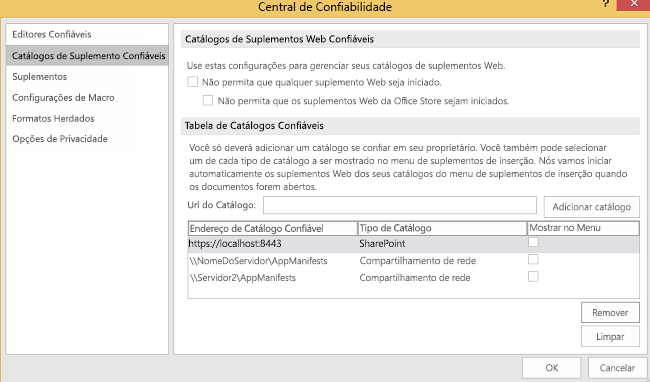
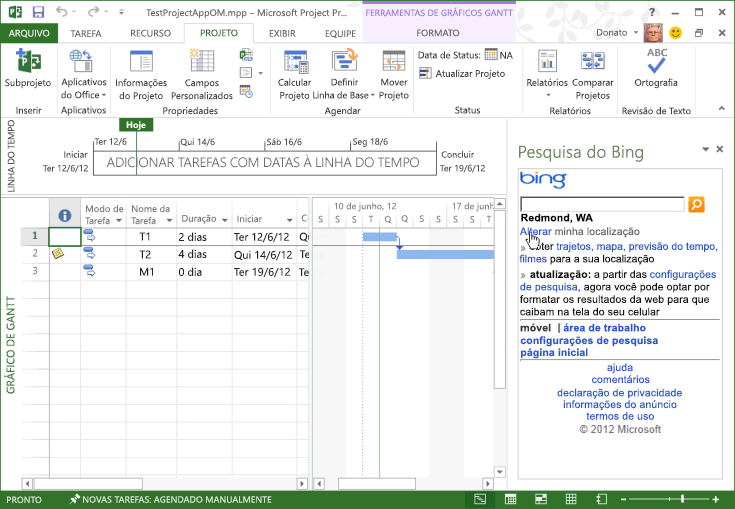

# <a name="task-pane-add-ins-for-project"></a><span data-ttu-id="6d240-102">Suplementos do painel de tarefas para Project</span><span class="sxs-lookup"><span data-stu-id="6d240-102">Task pane add-ins for Project</span></span>

<span data-ttu-id="6d240-p101">Tanto o Project Standard 2013 quanto o Project Professional 2013 incluem suporte para suplementos de painel de tarefas. Você pode executar suplementos de painel de tarefas comuns que foram desenvolvidos para o Word 2013 ou o Excel 2013. Você também pode desenvolver suplementos personalizados que manipulam eventos de seleção no Project e integram tarefas, recursos, exibição e outros dados de nível de célula em um projeto com listas do SharePoint, Suplementos do SharePoint, Web Parts, serviços Web e aplicativos corporativos.</span><span class="sxs-lookup"><span data-stu-id="6d240-p101">Project Standard 2013 and Project Professional 2013 both include support for task pane add-ins. You can run general task pane add-ins that are developed for Word 2013 or Excel 2013. You can also develop custom add-ins that handle selection events in Project and integrate task, resource, view, and other cell-level data in a project with SharePoint lists, SharePoint Add-ins, Web Parts, web services, and enterprise applications.</span></span>

> [!NOTE]
> <span data-ttu-id="6d240-p102">O [download do SDK do Project 2013](https://www.microsoft.com/en-us/download/details.aspx?id=30435%20) inclui suplementos de exemplo que mostram como usar o modelo de objeto do suplemento no Project e como usar o serviço OData para relatar os dados no Project Server 2013. Ao extrair e instalar o SDK, confira o subdiretório `\Samples\Apps\`.</span><span class="sxs-lookup"><span data-stu-id="6d240-p102">The [Project 2013 SDK download](https://www.microsoft.com/en-us/download/details.aspx?id=30435%20) includes sample add-ins that show how to use the add-in object model for Project, and how to use the OData service for reporting data in Project Server 2013. When you extract and install the SDK, see the `\Samples\Apps\` subdirectory.</span></span>

<span data-ttu-id="6d240-107">Para ver uma introdução sobre os suplementos do Office, confira [Visão geral da plataforma de suplementos do Office](../overview/office-add-ins.md).</span><span class="sxs-lookup"><span data-stu-id="6d240-107">For an introduction to Office Add-ins, see [Office Add-ins platform overview](../overview/office-add-ins.md).</span></span>

## <a name="add-in-scenarios-for-project"></a><span data-ttu-id="6d240-108">Cenários de suplementos do Project</span><span class="sxs-lookup"><span data-stu-id="6d240-108">Add-in scenarios for Project</span></span>

<span data-ttu-id="6d240-p103">Os gerentes de projeto podem usar suplementos de painel de tarefas do Project para ajudá-los nas atividades de gerenciamento de projeto. Em vez de sair do Project e abrir outro aplicativo para procurar informações usadas com frequência, os gerentes de projeto podem acessar as informações diretamente no projeto. O conteúdo de um suplemento de painel de tarefas pode ser contextual, baseado na tarefa selecionada, no recurso, no modo de exibição ou em outros dados em uma célula de um gráfico de Gantt, no modo de exibição de uso da tarefa ou no modo de exibição de uso dos recursos.</span><span class="sxs-lookup"><span data-stu-id="6d240-p103">Project managers can use Project task pane add-ins to help with project management activities. Instead of leaving Project and opening another application to search for frequently used information, project managers can directly access the information within Project. The content in a task pane add-in can be context-sensitive, based on the selected task, resource, view, or other data in a cell in a Gantt chart, task usage view, or resource usage view.</span></span>

> [!NOTE]
> <span data-ttu-id="6d240-112">Com o Project Professional 2013, é possível desenvolver suplementos de painel de tarefas que acessam instalações locais do Project Server 2013, do Project Online e instalações locais ou online do SharePoint 2013. O Project Standard 2013 não dá suporte à integração direta com dados do Project Server ou listas de tarefas do SharePoint que são sincronizadas com o Project Server.</span><span class="sxs-lookup"><span data-stu-id="6d240-112">With Project Professional 2013, you can develop task pane add-ins that access on-premises installations of Project Server 2013, Project Online, and on-premises or online SharePoint 2013.Project Standard 2013 does not support direct integration with Project Server data or SharePoint task lists that are synchronized with Project Server.</span></span>

<span data-ttu-id="6d240-113">Cenários de suplementos do Project incluem o seguinte:</span><span class="sxs-lookup"><span data-stu-id="6d240-113">Add-in scenarios for Project include the following:</span></span>

-  <span data-ttu-id="6d240-p104">**Plano de projeto** Exibir dados de projetos relacionados que podem afetar o agendamento. Um suplemento de painel de tarefas pode integrar dados relevantes de outros projetos no Project Server 2013. Por exemplo, você pode exibir a coleção de departamento de projetos e datas de marco ou exibir dados específicos de outros projetos que são baseados em um campo personalizado selecionado.</span><span class="sxs-lookup"><span data-stu-id="6d240-p104">**Project scheduling** View data from related projects that can affect scheduling. A task pane add-in can integrate relevant data from other projects in Project Server 2013. For example, you can view the departmental collection of projects and milestone dates, or view specified data from other projects that are based on a selected custom field.</span></span>
    
-  <span data-ttu-id="6d240-117">**Gerenciamento de recursos** Exiba o pool de recursos completo no Project Server 2013 ou um subconjunto baseado em qualificações especificadas, incluindo a disponibilidade de dados de custo e recursos, para ajudar a selecionar recursos apropriados.</span><span class="sxs-lookup"><span data-stu-id="6d240-117">**Resource management** View the complete resource pool in Project Server 2013 or a subset based on specified skills, including cost data and resource availability, to help select appropriate resources.</span></span>
    
-  <span data-ttu-id="6d240-p105">**Status e aprovações** Use um aplicativo Web em um suplemento de painel de tarefas para atualizar ou exibir dados de um aplicativo de ERP (planejamento de recursos corporativos) externo, de um sistema de quadro de horários ou de um aplicativo de contabilidade. Ou crie uma Web Part de aprovação de status personalizada que pode ser usada no Project Web App e no Project Professional 2013.</span><span class="sxs-lookup"><span data-stu-id="6d240-p105">**Statusing and approvals** Use a web application in a task pane add-in to update or view data from an external enterprise resource planning (ERP) application, timesheet system, or accounting application. Or, create a custom status approval Web Part that can be used within both Project Web App and Project Professional 2013.</span></span>
    
-  <span data-ttu-id="6d240-p106">**Comunicação da equipe** Comunique-se com os membros da equipe e os recursos diretamente de um suplemento de painel de tarefas, dentro do contexto de um projeto. Ou mantenha um conjunto de anotações contextuais para si mesmo facilmente enquanto trabalha em um projeto.</span><span class="sxs-lookup"><span data-stu-id="6d240-p106">**Team communication** Communicate with team members and resources directly from a task pane add-in, within the context of a project. Or, easily maintain a set of context-sensitive notes for yourself as you work in a project.</span></span>
    
-  <span data-ttu-id="6d240-p107">**Pacotes de trabalho** Pesquise tipos específicos de modelos de projeto nas bibliotecas do SharePoint e em coleções de modelos online. Por exemplo, encontre modelos para projetos de construção e adicione-os à sua coleção de modelos do Project.</span><span class="sxs-lookup"><span data-stu-id="6d240-p107">**Work packages** Search for specified kinds of project templates within SharePoint libraries and online template collections. For example, find templates for construction projects and add them to your Project template collection.</span></span>
    
-  <span data-ttu-id="6d240-p108">**Itens relacionados** Exiba metadados, documentos e mensagens relacionadas a tarefas específicas em um plano de projeto. Por exemplo, você pode usar o Project Professional 2013 para gerenciar um projeto que foi importado de uma lista de tarefas do SharePoint e ainda sincronizar a lista de tarefas com as alterações no projeto. Um suplemento de painel de tarefas pode mostrar campos adicionais ou metadados que o Project não importou para tarefas na lista do SharePoint.</span><span class="sxs-lookup"><span data-stu-id="6d240-p108">**Related items** View metadata, documents, and messages that are related to specific tasks in a project plan. For example, you can use Project Professional 2013 to manage a project that was imported from a SharePoint task list, and still synchronize the task list with changes in the project. A task pane add-in can show additional fields or metadata that Project did not import for tasks in the SharePoint list.</span></span>
    
-  <span data-ttu-id="6d240-p109">**Usar modelos de objeto do Project Server** Use o GUID de uma tarefa selecionada com métodos na PSI (Project Server Interface) ou no CSOM (modelo de objeto do lado do cliente) do Project Server. Por exemplo, o aplicativo Web para um suplemento pode ler e atualizar os dados de status de uma tarefa e recurso selecionados ou integrar com um aplicativo de quadro de horários externo.</span><span class="sxs-lookup"><span data-stu-id="6d240-p109">**Use the Project Server object models** Use the GUID of a selected task with methods in the Project Server Interface (PSI) or the client-side object model (CSOM) of Project Server. For example, the web application for an add-in can read and update the statusing data of a selected task and resource, or integrate with an external timesheet application.</span></span>
    
-  <span data-ttu-id="6d240-p110">**Obter dados de relatório** Use consultas LINQ, REST (Representational State Transfer) ou JavaScript para localizar informações relacionadas a uma tarefa ou recurso selecionado no serviço OData para tabelas de relatório no Project Web App. Consultas que usam o serviço OData podem ser feitas com instalação online ou local do Project Server 2013.</span><span class="sxs-lookup"><span data-stu-id="6d240-p110">**Get reporting data** Use Representational State Transfer (REST), JavaScript, or LINQ queries to find related information for a selected task or resource in the OData service for reporting tables in Project Web App. Queries that use the OData service can be done with an online or an on-premises installation of Project Server 2013.</span></span>
    
    <span data-ttu-id="6d240-131">Por exemplo, confira [Criar um suplemento do Project que usa REST com um serviço OData local do Project Server](../project/create-a-project-add-in-that-uses-rest-with-an-on-premises-odata-service.md).</span><span class="sxs-lookup"><span data-stu-id="6d240-131">For example, see [Create a Project add-in that uses REST with an on-premises Project Server OData  service](../project/create-a-project-add-in-that-uses-rest-with-an-on-premises-odata-service.md).</span></span>
    
## <a name="developing-project-add-ins"></a><span data-ttu-id="6d240-132">Desenvolver suplementos do Project</span><span class="sxs-lookup"><span data-stu-id="6d240-132">Developing Project add-ins</span></span>

<span data-ttu-id="6d240-p111">A biblioteca JavaScript para suplementos do Project inclui extensões do alias de namespace do **Office** que permitem que os desenvolvedores acessem propriedades de aplicativo do Project e tarefas, recursos e modos de exibição em um projeto. As extensões de biblioteca JavaScript no arquivo Project-15.js são usadas em um suplemento do Project criado com o Visual Studio 2015. Office.js, Office.debug.js, Project-15.js, Project-15.debug.js e arquivos relacionados também são fornecidos no download do SDK do Project 2013.</span><span class="sxs-lookup"><span data-stu-id="6d240-p111">The JavaScript library for Project add-ins includes extensions of the  **Office** namespace alias that enable developers to access properties of the Project application and tasks, resources, and views in a project. The JavaScript library extensions in the Project-15.js file are used in a Project add-in created with Visual Studio 2015. The Office.js, Office.debug.js, Project-15.js, Project-15.debug.js, and related files are also provided in the Project 2013 SDK download.</span></span>

<span data-ttu-id="6d240-p112">Para criar um suplemento, você pode usar um editor de texto simples para criar uma página da Web HTML e arquivos JavaScript relacionados, arquivos CSS e consultas REST. Além de uma página HTML ou um aplicativo Web, um suplemento requer um arquivo de manifesto XML de configuração. O Project pode usar um arquivo de manifesto que inclui um atributo **type** especificado como **TaskPaneExtension**. O arquivo de manifesto pode ser usado por vários aplicativos clientes do Office 2013, ou você pode criar um arquivo de manifesto que seja específico para o Project 2013. Para saber mais, confira a seção _Noções básicas sobre desenvolvimento_ em [Visão geral da plataforma de suplementos do Office](../overview/office-add-ins.md).</span><span class="sxs-lookup"><span data-stu-id="6d240-p112">To create an add-in, you can use a simple text editor to create an HTML webpage and related JavaScript files, CSS files, and REST queries. In addition to an HTML page or a web application, an add-in requires an XML manifest file for configuration. Project can use a manifest file that includes a  **type** attribute that is specified as **TaskPaneExtension**. The manifest file can be used by multiple Office 2013 client applications, or you can create a manifest file that is specific for Project 2013. For more information, see the  _Development basics_ section in [Office Add-ins platform overview](../overview/office-add-ins.md).</span></span>

<span data-ttu-id="6d240-p113">Para aplicativos personalizados complexos e depuração mais fácil, recomendamos que você use o Visual Studio 2015 no desenvolvimento de sites para suplementos. O Visual Studio 2015 inclui modelos para projetos de suplementos em que você pode escolher o tipo de suplemento (painel de tarefas, conteúdo ou email) e o aplicativo host (Project, Word, Excel ou Outlook).  Para obter um exemplo que integra dados do Project Online, confira [Conectar um suplemento de painel de tarefas do Project ao PWA](http://blogs.msdn.com/b/project_programmability/archive/2012/11/02/connecting-a-project-task-pane-app-to-pwa.aspx) no blog Project Programmability do MSDN.</span><span class="sxs-lookup"><span data-stu-id="6d240-p113">For complex custom applications, and for easier debugging, we recommend that you use Visual Studio 2015 to develop websites for add-ins. Visual Studio 2015 include templates for add-in projects, where you can choose the kind of add-in (task pane, content, or mail) and the host application (Project, Word, Excel, or Outlook).  For an example that integrates with data from Project Online, see [Connecting a Project task pane add-in to PWA](http://blogs.msdn.com/b/project_programmability/archive/2012/11/02/connecting-a-project-task-pane-app-to-pwa.aspx) in the Project Programmability blog on MSDN.</span></span>

<span data-ttu-id="6d240-143">Quando você instala o download do SDK do Project 2013, o subdiretório `\Samples\Apps\` inclui os seguintes suplementos de exemplo:</span><span class="sxs-lookup"><span data-stu-id="6d240-143">When you install the Project 2013 SDK download, the  `\Samples\Apps\` subdirectory includes the following sample add-ins:</span></span>


-  <span data-ttu-id="6d240-p114">**Pesquisa do Bing:** O arquivo de manifesto BingSearch.xml aponta para a página de pesquisa do Bing para dispositivos móveis. Como o aplicativo Web Bing já existe na Internet, o suplemento Pesquisa do Bing não usa outros arquivos de código-fonte ou o modelo de objeto de suplemento para o Project.</span><span class="sxs-lookup"><span data-stu-id="6d240-p114">**Bing Search:** The BingSearch.xml manifest file points to the Bing search page for mobile devices. Because the Bing web app already exists on the Internet, the Bing Search add-in does not use other source code files or the add-in object model for Project.</span></span>
    
-  <span data-ttu-id="6d240-p115">**Teste de modelo de objeto do Project:** O arquivo de manifesto JSOM_SimpleOMCalls.xml e o arquivo JSOM_Call.html são, juntos, um exemplo que testa o modelo de objeto e a funcionalidade do suplemento no Project 2013. O arquivo HTML faz referência ao arquivo JSOM_Sample.js, que tem funções JavaScript que usam o arquivo Office.js e o arquivo Project-15.js na funcionalidade principal. O download do SDK inclui todos os arquivos de código-fonte necessários e o arquivo XML do manifesto para o suplemento Teste de modelo de objeto do Project. O desenvolvimento e a instalação do exemplo Teste de modelo de objeto do Project está descrito em [Criar seu primeiro suplemento de painel de tarefas para o Project 2013 usando um editor de texto](../project/create-your-first-task-pane-add-in-for-project-by-using-a-text-editor.md).</span><span class="sxs-lookup"><span data-stu-id="6d240-p115">**Project OM Test:** The JSOM_SimpleOMCalls.xml manifest file and the JSOM_Call.html file are, together, an example that tests the object model and add-in functionality in Project 2013. The HTML file references the JSOM_Sample.js file, which has JavaScript functions that use the Office.js file and the Project-15.js file for the primary functionality. The SDK download includes all of the necessary source code files and the manifest XML file for the Project OM Test add-in. The development and installation of the Project OM Test sample is described in [Create your first task pane add-in for Project 2013 by using a text editor](../project/create-your-first-task-pane-add-in-for-project-by-using-a-text-editor.md).</span></span>
    
-  <span data-ttu-id="6d240-p116">**HelloProject_OData:** Essa é uma solução do Visual Studio para o Project Professional 2013 que resume os dados do projeto ativo, como custo, trabalho e porcentagem concluída, e os compara com a média de todos os projetos publicados na instância do Project Web App onde o projeto ativo está armazenado. O desenvolvimento, a instalação e o teste do exemplo, que usa o protocolo REST com o serviço **ProjectData** no Project Web App, estão descritos em [Criar um suplemento do Project que usa REST com um serviço OData local do Project Server](../project/create-a-project-add-in-that-uses-rest-with-an-on-premises-odata-service.md).</span><span class="sxs-lookup"><span data-stu-id="6d240-p116">**HelloProject_OData:** This is a Visual Studio solution for Project Professional 2013 that summarizes data from the active project, such as cost, work, and percent complete, and compares that with the average for all published projects in the Project Web App instance where the active project is stored. The development, installation, and testing of the sample, which uses the REST protocol with the **ProjectData** service in Project Web App, is described in [Create a Project add-in that uses REST with an on-premises Project Server OData service](../project/create-a-project-add-in-that-uses-rest-with-an-on-premises-odata-service.md).</span></span>
    

### <a name="creating-an-add-in-manifest-file"></a><span data-ttu-id="6d240-152">Criar um arquivo de manifesto do suplemento</span><span class="sxs-lookup"><span data-stu-id="6d240-152">Creating an add-in manifest file</span></span>


<span data-ttu-id="6d240-153">O arquivo de manifesto especifica a URL do suplemento, a página da Web ou aplicativo Web, o tipo de suplemento (painel de tarefas do Project), URLs opcionais de conteúdo para outros idiomas e localidades, e outras propriedades.</span><span class="sxs-lookup"><span data-stu-id="6d240-153">The manifest file specifies the URL of the add-in webpage or web application, the kind of add-in (task pane for Project), optional URLs of content for other languages and locales, and other properties.</span></span>


### <a name="procedure-1-to-create-the-add-in-manifest-file-for-bing-search"></a><span data-ttu-id="6d240-p117">Procedimento 1. Para criar o arquivo de manifesto do suplemento para Pesquisa do Bing</span><span class="sxs-lookup"><span data-stu-id="6d240-p117">Procedure 1. To create the add-in manifest file for Bing Search</span></span>


- <span data-ttu-id="6d240-p118">Crie um arquivo XML em um diretório local. O arquivo XML inclui o elemento **OfficeApp** e elementos filhos, que estão descritos em [Manifesto XML dos suplementos do Office](../develop/add-in-manifests.md). Por exemplo, crie um arquivo denominado BingSearch.xml que contém o XML a seguir.</span><span class="sxs-lookup"><span data-stu-id="6d240-p118">Create an XML file in a local directory. The XML file includes the  **OfficeApp** element and child elements, which are described in the [Office Add-ins XML manifest](../develop/add-in-manifests.md). For example, create a file named BingSearch.xml that contains the following XML.</span></span>
    
    ```XML
    <?xml version="1.0" encoding="utf-8"?>
    <OfficeApp xmlns="http://schemas.microsoft.com/office/appforoffice/1.0" 
                xmlns:xsi="http://www.w3.org/2001/XMLSchema-instance" 
              xsi:type="TaskPaneApp">
      <Id>1234-5678</Id>
      <Version>15.0</Version>
      <ProviderName>Microsoft</ProviderName>
      <DefaultLocale>en-us</DefaultLocale>
      <DisplayName DefaultValue="Bing Search">
      </DisplayName>
      <Description DefaultValue="Search selected data on Bing">
      </Description>
      <IconUrl DefaultValue="http://officeimg.vo.msecnd.net/_layouts/images/general/office_logo.jpg">
      </IconUrl>
      <Capabilities>
        <Capability Name="Project"/>
      </Capabilities>
      <DefaultSettings>
        <SourceLocation DefaultValue="http://m.bing.com">
        </SourceLocation>
      </DefaultSettings>
      <Permissions>ReadWriteDocument</Permissions>
    </OfficeApp>
    ```

- <span data-ttu-id="6d240-159">Abaixo estão os elementos obrigatórios no manifesto do suplemento:</span><span class="sxs-lookup"><span data-stu-id="6d240-159">Following are the required elements in the add-in manifest:</span></span>
  - <span data-ttu-id="6d240-160">No elemento **OfficeApp**, o atributo `xsi:type="TaskPaneApp"` especifica que o suplemento é um tipo de painel de tarefas.</span><span class="sxs-lookup"><span data-stu-id="6d240-160">In the  **OfficeApp** element, the `xsi:type="TaskPaneApp"` attribute specifies that the add-in is a task pane type.</span></span>
  - <span data-ttu-id="6d240-161">O elemento **Id** é um UUID e precisa ser exclusivo.</span><span class="sxs-lookup"><span data-stu-id="6d240-161">The  **Id** element is a UUID and must be unique.</span></span>
  - <span data-ttu-id="6d240-p119">O elemento **Version** é a versão do suplemento. O elemento **ProviderName** é o nome da empresa ou do desenvolvedor que fornece o suplemento. O elemento **DefaultLocale** especifica a localidade padrão para as cadeias de caracteres no manifesto.</span><span class="sxs-lookup"><span data-stu-id="6d240-p119">The  **Version** element is the version of the add-in. The **ProviderName** element is the name of the company or developer who provides the add-in. The **DefaultLocale** element specifies the default locale for the strings in the manifest.</span></span>
  - <span data-ttu-id="6d240-p120">O elemento **DisplayName** é o nome que mostra a lista suspensa **Suplemento do Painel de Tarefas** na guia **EXIBIÇÃO** da faixa de opções do Project 2013. O nome pode conter no máximo 32 caracteres.</span><span class="sxs-lookup"><span data-stu-id="6d240-p120">The  **DisplayName** element is the name that shows in the **Task Pane Add-in** drop-down list in the **VIEW** tab of the ribbon in Project 2013. The value can contain up to 32 characters.</span></span>
  - <span data-ttu-id="6d240-p121">O elemento **Description** contém a descrição do suplemento para a localidade padrão. O nome pode conter no máximo 2000 caracteres.</span><span class="sxs-lookup"><span data-stu-id="6d240-p121">The  **Description** element contains the add-in description for the default locale. The value can contain up to 2000 characters.</span></span>
  - <span data-ttu-id="6d240-169">O elemento **Recursos** contém um ou mais elementos filhos **Capability** que especificam o aplicativo host.</span><span class="sxs-lookup"><span data-stu-id="6d240-169">The  **Capabilities** element contains one or more **Capability** child elements that specify the host application.</span></span>
  - <span data-ttu-id="6d240-p122">O elemento **DefaultSettings** inclui o elemento **SourceLocation**, que especifica o caminho de um arquivo HTML em um compartilhamento de arquivo ou a URL de uma página da Web que o suplemento usa. Um suplemento de painel de tarefas ignora os elementos **RequestedHeight** e **RequestedWidth**.</span><span class="sxs-lookup"><span data-stu-id="6d240-p122">The  **DefaultSettings** element includes the **SourceLocation** element, which specifies the path of an HTML file on a file share or the URL of a webpage that the add-in uses. A task pane add-in ignores the **RequestedHeight** element and the **RequestedWidth** element.</span></span>
  - <span data-ttu-id="6d240-p123">O elemento **IconUrl** é opcional. Ele pode ser um ícone em um compartilhamento de arquivo ou a URL de um ícone em um aplicativo Web.</span><span class="sxs-lookup"><span data-stu-id="6d240-p123">The  **IconUrl** element is optional. It can be an icon on a file share or the URL of an icon in a web application.</span></span>
    
- <span data-ttu-id="6d240-p124">(Opcional) Adicione elementos **Override** que têm valores de outras localidades. Por exemplo, o manifesto a seguir fornece elementos **Override** para valores em francês de **DisplayName**, **Description**, **IconUrl** e **SourceLocation**.</span><span class="sxs-lookup"><span data-stu-id="6d240-p124">(Optional) Add  **Override** elements that have values for other locales. For example, the following manifest provides **Override** elements for French values of **DisplayName**,  **Description**,  **IconUrl**, and  **SourceLocation**.</span></span>
    
    ```XML
    <?xml version="1.0" encoding="utf-8"?>
    <OfficeApp xmlns="http://schemas.microsoft.com/office/appforoffice/1.0" 
                xmlns:xsi="http://www.w3.org/2001/XMLSchema-instance" 
              xsi:type="TaskPaneApp">
      <Id>1234-5678</Id>
      <Version>15.0</Version>
      <ProviderName>Microsoft</ProviderName>
      <DefaultLocale>en-us</DefaultLocale>
      <DisplayName DefaultValue="Bing Search">
        <Override Locale="fr-fr" Value="Bing Search"/>
      </DisplayName>
      <Description DefaultValue="Search selected data on Bing">
        <Override Locale="fr-fr" Value="Search selected data on Bing"></Override>
      </Description>
      <IconUrl DefaultValue="http://officeimg.vo.msecnd.net/_layouts/images/general/office_logo.jpg">
        <Override Locale="fr-fr" Value="http://officeimg.vo.msecnd.net/_layouts/images/general/office_logo.jpg"/>
      </IconUrl>
      <Capabilities>
        <Capability Name="Project"/>
      </Capabilities>
      <DefaultSettings>
        <SourceLocation DefaultValue="http://m.bing.com">
          <Override Locale="fr-fr" Value="http://m.bing.com"/>
        </SourceLocation>
      </DefaultSettings>
      <Permissions>ReadWriteDocument</Permissions>
    </OfficeApp>
    ```


## <a name="installing-project-add-ins"></a><span data-ttu-id="6d240-176">Instalar suplementos do Project</span><span class="sxs-lookup"><span data-stu-id="6d240-176">Installing Project add-ins</span></span>


<span data-ttu-id="6d240-p125">No Project 2013, é possível instalar suplementos como soluções autônomas em um compartilhamento de arquivos ou em um catálogo de suplementos particular. Também é possível avaliar e comprar suplementos no AppSource.</span><span class="sxs-lookup"><span data-stu-id="6d240-p125">In Project 2013, you can install add-ins as stand-alone solutions on a file share, or in a private add-in catalog. You can also review and purchase add-ins in AppSource.</span></span>

<span data-ttu-id="6d240-p126">Pode haver vários arquivos XML do manifesto do suplemento e subdiretórios em um compartilhamento de arquivos. Você pode adicionar ou remover locais e catálogos do diretório do manifesto usando a guia **Catálogos de Suplementos Confiáveis** na caixa de diálogo **Central de Confiabilidade** no Project 2013. Para mostrar um suplemento no Project, o elemento **SourceLocation** em um manifesto deve apontar para um site ou arquivo de origem HTML existente.</span><span class="sxs-lookup"><span data-stu-id="6d240-p126">There can be multiple add-in manifest XML files and subdirectories in a file share. You can add or remove manifest directory locations and catalogs by using the  **Trusted Add-in Catalogs** tab in the **Trust Center** dialog box in Project 2013. To show an add-in in Project, the **SourceLocation** element in a manifest must point to an existing website or HTML source file.</span></span>


> [!NOTE]
> <span data-ttu-id="6d240-p127">O Internet Explorer 9 ou posterior precisa estar instalado, mas não precisa ser o navegador padrão. Os Suplementos do Office exigem componentes no Internet Explorer 9. O navegador padrão pode ser o Internet Explorer 9, o Safari 5.0.6, o Firefox 5, o Chrome 13 ou uma versão mais recente de um desses navegadores.</span><span class="sxs-lookup"><span data-stu-id="6d240-p127">Internet Explorer 9 (or later) must be installed, but does not have to be the default browser. Office Add-ins require components in Internet Explorer 9. The default browser can be Internet Explorer 9, Safari 5.0.6, Firefox 5, Chrome 13, or a later version of one of these browsers.</span></span>

<span data-ttu-id="6d240-p128">No procedimento 2, o suplemento Pesquisa do Bing é instalado no computador local onde o Project 2013 está instalado. No entanto, como a infraestrutura do suplemento não usa caminhos de arquivo local diretamente, como `C:\Project\AppManifests`, você pode criar um compartilhamento de rede no computador local. Se preferir, você pode criar um compartilhamento de arquivos em um computador remoto.</span><span class="sxs-lookup"><span data-stu-id="6d240-p128">In Procedure 2, the Bing Search add-in is installed on the local computer where Project 2013 is installed. However, because the add-in infrastructure does not directly use local file paths such as  `C:\Project\AppManifests`, you can create a network share on the local computer. If you prefer, you can create a file share on a remote computer.</span></span>


### <a name="procedure-2-to-install-the-bing-search-add-in"></a><span data-ttu-id="6d240-p129">Procedimento 2. Para instalar o suplemento Pesquisa do Bing</span><span class="sxs-lookup"><span data-stu-id="6d240-p129">Procedure 2. To install the Bing Search add-in</span></span>


1. <span data-ttu-id="6d240-p130">Crie um diretório local para manifestos de suplemento. Por exemplo, crie o diretório `C:\Project\AppManifests`.</span><span class="sxs-lookup"><span data-stu-id="6d240-p130">Create a local directory for add-in manifests. For example, create the  `C:\Project\AppManifests` directory.</span></span>
    
2. <span data-ttu-id="6d240-192">Compartilhe diretório `C:\Project\AppManifests` asAppManifests, para que o caminho de rede até o compartilhamento de arquivo se torne `\\ServerName\AppManifests`.</span><span class="sxs-lookup"><span data-stu-id="6d240-192">Share the  `C:\Project\AppManifests` directory asAppManifests, so the network path to the file share becomes  `\\ServerName\AppManifests`.</span></span>
    
3. <span data-ttu-id="6d240-193">Copie o arquivo de manifesto BingSearch.xml para o diretório `C:\Project\AppManifests`.</span><span class="sxs-lookup"><span data-stu-id="6d240-193">Copy the BingSearch.xml manifest file to the  `C:\Project\AppManifests` directory.</span></span>
    
4. <span data-ttu-id="6d240-194">No Project 2013, abra caixa de diálogo **Opções do Project**, escolha **Central de Confiabilidade** e escolha **Configurações da Central de Confiabilidade**.</span><span class="sxs-lookup"><span data-stu-id="6d240-194">In Project 2013, open the  **Project Options** dialog box, choose **Trust Center**, and then choose  **Trust Center Settings**.</span></span>
    
5. <span data-ttu-id="6d240-195">Na caixa de diálogo **Central de Confiabilidade**, no painel esquerdo, escolha **Catálogos de Suplementos Confiáveis**.</span><span class="sxs-lookup"><span data-stu-id="6d240-195">In the  **Trust Center** dialog box, in the left pane, choose **Trusted Add-in Catalogs**.</span></span>
    
6. <span data-ttu-id="6d240-196">No painel **Catálogos de Suplementos Confiáveis** (confira a Figura 1), adicione o caminho `\\ServerName\AppManifests` à caixa de texto **URL do Catálogo**, escolha **Adicionar Catálogo** e escolha **OK**.</span><span class="sxs-lookup"><span data-stu-id="6d240-196">In the  **Trusted Add-in Catalogs** pane (see Figure 1), add the `\\ServerName\AppManifests` path in the **Catalog Url** text box, choose **Add Catalog**, and then choose  **OK**.</span></span>
    
    > [!NOTE]
    > <span data-ttu-id="6d240-p131">A Figura 1 mostra dois compartilhamentos de arquivo e uma URL hipotética para um catálogo particular na lista **Endereços do Catálogo Confiável**. Apenas um compartilhamento de arquivo pode ser o compartilhamento de arquivos padrão, e apenas uma URL de catálogo pode ser o catálogo padrão. Por exemplo, se você definir `\\Server2\AppManifests` como o padrão, o Project limpará a caixa de seleção **Padrão** para `\\ServerName\AppManifests`. Se você alterar a seleção padrão, escolha **Limpar** para remover suplementos instalados e reinicie o Project. Se você adicionar um suplemento ao compartilhamento de arquivo padrão ou catálogo do SharePoint enquanto o Project estiver aberto, reinicie o Project.</span><span class="sxs-lookup"><span data-stu-id="6d240-p131">Figure 1 shows two file shares and one hypothetical URL for a private catalog in the  **Trusted Catalog Address** list. Only one file share can be the default file share and only one catalog URL can be the default catalog. For example, if you set `\\Server2\AppManifests` as the default, Project clears the **Default** check box for `\\ServerName\AppManifests`.If you change the default selection, you can choose  **Clear** to remove installed add-ins, and then restart Project. If you add an add-in to the default file share or SharePoint catalog while Project is open, you should restart Project.</span></span>

    <span data-ttu-id="6d240-201">*Figura 1. Usando a Central de Confiabilidade para adicionar catálogos de manifestos de suplemento*</span><span class="sxs-lookup"><span data-stu-id="6d240-201">*Figure 1. Using the Trust Center to add catalogs of add-in manifests*</span></span>

    

7. <span data-ttu-id="6d240-p132">Na faixa de opções **Project**, escolha o menu suspenso **Suplementos do Office** e escolha **Ver Tudo**. Na caixa de diálogo **Inserir Suplemento**, escolha **PASTA COMPARTILHADA** (confira a Figura 2).</span><span class="sxs-lookup"><span data-stu-id="6d240-p132">On the  **Project** ribbon, choose the **Office Add-ins** drop-down menu, and then choose **See All**. In the  **Insert Add-in** dialog box, choose **SHARED FOLDER** (see Figure 2).</span></span>
    
    <span data-ttu-id="6d240-205">*Figura 2. Iniciando um suplemento que está em um compartilhamento de arquivos*</span><span class="sxs-lookup"><span data-stu-id="6d240-205">*Figure 2. Starting an add-in that is on a file share*</span></span>

    

8. <span data-ttu-id="6d240-207">Selecione o suplemento Pesquisa do Bing e escolha **Inserir**.</span><span class="sxs-lookup"><span data-stu-id="6d240-207">Select the Bing Search add-in, and then choose  **Insert**.</span></span>
    
    <span data-ttu-id="6d240-p133">O suplemento Pesquisa do Bing é exibido em um painel de tarefas, como na Figura 3. Você pode redimensionar o painel de tarefas manualmente e usar o suplemento Pesquisa do Bing.</span><span class="sxs-lookup"><span data-stu-id="6d240-p133">The Bing Search add-in shows in a task pane, as in Figure 3. You can manually resize the task pane, and use the Bing Search add-in.</span></span>

    <span data-ttu-id="6d240-210">*Figura 3. Usando o suplemento Pesquisa do Bing*</span><span class="sxs-lookup"><span data-stu-id="6d240-210">*Figure 3. Using the Bing Search add-in*</span></span>

    


## <a name="distributing-project-add-ins"></a><span data-ttu-id="6d240-212">Distribuir suplementos do Project</span><span class="sxs-lookup"><span data-stu-id="6d240-212">Distributing Project add-ins</span></span>


<span data-ttu-id="6d240-p134">É possível distribuir suplementos usando um compartilhamento de arquivos, um catálogo de suplementos em uma biblioteca do SharePoint ou o AppSource. Saiba mais em [Publicar seu suplemento do Office](../publish/publish.md).</span><span class="sxs-lookup"><span data-stu-id="6d240-p134">You can distribute add-ins through a file share, an add-in catalog in a SharePoint library, or AppSource. For more information, see [Publish your Office Add-in](../publish/publish.md).</span></span>


## <a name="see-also"></a><span data-ttu-id="6d240-215">Veja também</span><span class="sxs-lookup"><span data-stu-id="6d240-215">See also</span></span>

- [<span data-ttu-id="6d240-216">Visão geral da plataforma Suplementos do Office</span><span class="sxs-lookup"><span data-stu-id="6d240-216">Office Add-ins platform overview</span></span>](../overview/office-add-ins.md)
- [<span data-ttu-id="6d240-217">Manifesto XML dos Suplementos do Office</span><span class="sxs-lookup"><span data-stu-id="6d240-217">Office Add-ins XML manifest</span></span>](../develop/add-in-manifests.md)
- [<span data-ttu-id="6d240-218">JavaScript API para Office</span><span class="sxs-lookup"><span data-stu-id="6d240-218">JavaScript API for Office</span></span>](https://dev.office.com/reference/add-ins/javascript-api-for-office)
- [<span data-ttu-id="6d240-219">Criar seu primeiro suplemento de painel de tarefas para o Project 2013 usando um editor de texto</span><span class="sxs-lookup"><span data-stu-id="6d240-219">Create your first task pane add-in for Project 2013 by using a text editor</span></span>](create-your-first-task-pane-add-in-for-project-by-using-a-text-editor.md)
- [<span data-ttu-id="6d240-220">Criar um suplemento de Project que usa REST com um serviço local do Project Server OData</span><span class="sxs-lookup"><span data-stu-id="6d240-220">Create a Project add-in that uses REST with an on-premises Project Server OData service</span></span>](create-a-project-add-in-that-uses-rest-with-an-on-premises-odata-service.md)
- [<span data-ttu-id="6d240-221">Conectar um suplemento de painel de tarefas do Project ao PWA</span><span class="sxs-lookup"><span data-stu-id="6d240-221">Connecting a Project task pane add-in to PWA</span></span>](http://blogs.msdn.com/b/project_programmability/archive/2012/11/02/connecting-a-project-task-pane-app-to-pwa.aspx)
- [<span data-ttu-id="6d240-222">Download do SDK do Project 2013</span><span class="sxs-lookup"><span data-stu-id="6d240-222">Project 2013 SDK download</span></span>](https://www.microsoft.com/en-us/download/details.aspx?id=30435%20)
    
