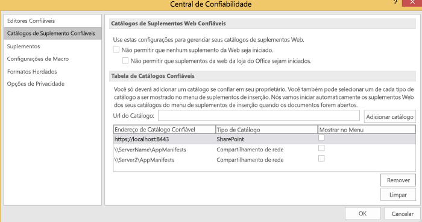
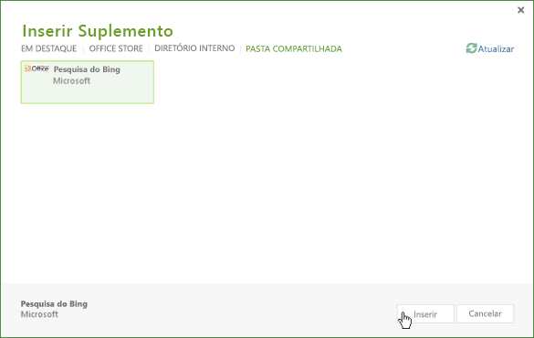

# <a name="task-pane-add-ins-for-project"></a>Suplementos do painel de tarefas para Project

Tanto o Project Standard 2013 quanto o Project Professional 2013 incluem suporte para suplementos de painel de tarefas. Você pode executar suplementos de painel de tarefas comuns que foram desenvolvidos para o Word 2013 ou o Excel 2013. Você também pode desenvolver suplementos personalizados que manipulam eventos de seleção no Project e integram tarefas, recursos, exibição e outros dados de nível de célula em um projeto com listas do SharePoint, Suplementos do SharePoint, Web Parts, serviços Web e aplicativos corporativos.

> [!NOTE]
> O [download do SDK do Project 2013](https://www.microsoft.com/en-us/download/details.aspx?id=30435%20) inclui suplementos de exemplo que mostram como usar o modelo de objeto do suplemento no Project e como usar o serviço OData para relatar os dados no Project Server 2013. Ao extrair e instalar o SDK, confira o subdiretório `\Samples\Apps\`.

Para ver uma introdução sobre os suplementos do Office, confira [Visão geral da plataforma de suplementos do Office](../overview/office-add-ins.md).

## <a name="add-in-scenarios-for-project"></a>Cenários de suplementos do Project

Os gerentes de projeto podem usar suplementos de painel de tarefas do Project para ajudá-los nas atividades de gerenciamento de projeto. Em vez de sair do Project e abrir outro aplicativo para procurar informações usadas com frequência, os gerentes de projeto podem acessar as informações diretamente no projeto. O conteúdo de um suplemento de painel de tarefas pode ser contextual, baseado na tarefa selecionada, no recurso, no modo de exibição ou em outros dados em uma célula de um gráfico de Gantt, no modo de exibição de uso da tarefa ou no modo de exibição de uso dos recursos.

> [!NOTE]
> Com o Project Professional 2013, é possível desenvolver suplementos de painel de tarefas que acessam instalações locais do Project Server 2013, do Project Online e instalações locais ou online do SharePoint 2013. O Project Standard 2013 não dá suporte à integração direta com dados do Project Server ou listas de tarefas do SharePoint que são sincronizadas com o Project Server.

Cenários de suplementos do Project incluem o seguinte:

-  **Plano de projeto** Exibir dados de projetos relacionados que podem afetar o agendamento. Um suplemento de painel de tarefas pode integrar dados relevantes de outros projetos no Project Server 2013. Por exemplo, você pode exibir a coleção de departamento de projetos e datas de marco ou exibir dados específicos de outros projetos que são baseados em um campo personalizado selecionado.
    
-  **Gerenciamento de recursos** Exiba o pool de recursos completo no Project Server 2013 ou um subconjunto baseado em qualificações especificadas, incluindo a disponibilidade de dados de custo e recursos, para ajudar a selecionar recursos apropriados.
    
-  **Status e aprovações** Use um aplicativo Web em um suplemento de painel de tarefas para atualizar ou exibir dados de um aplicativo de ERP (planejamento de recursos corporativos) externo, de um sistema de quadro de horários ou de um aplicativo de contabilidade. Ou crie uma Web Part de aprovação de status personalizada que pode ser usada no Project Web App e no Project Professional 2013.
    
-  **Comunicação da equipe** Comunique-se com os membros da equipe e os recursos diretamente de um suplemento de painel de tarefas, dentro do contexto de um projeto. Ou mantenha um conjunto de anotações contextuais para si mesmo facilmente enquanto trabalha em um projeto.
    
-  **Pacotes de trabalho** Pesquise tipos específicos de modelos de projeto nas bibliotecas do SharePoint e em coleções de modelos online. Por exemplo, encontre modelos para projetos de construção e adicione-os à sua coleção de modelos do Project.
    
-  **Itens relacionados** Exiba metadados, documentos e mensagens relacionadas a tarefas específicas em um plano de projeto. Por exemplo, você pode usar o Project Professional 2013 para gerenciar um projeto que foi importado de uma lista de tarefas do SharePoint e ainda sincronizar a lista de tarefas com as alterações no projeto. Um suplemento de painel de tarefas pode mostrar campos adicionais ou metadados que o Project não importou para tarefas na lista do SharePoint.
    
-  **Usar modelos de objeto do Project Server** Use o GUID de uma tarefa selecionada com métodos na PSI (Project Server Interface) ou no CSOM (modelo de objeto do lado do cliente) do Project Server. Por exemplo, o aplicativo Web para um suplemento pode ler e atualizar os dados de status de uma tarefa e recurso selecionados ou integrar com um aplicativo de quadro de horários externo.
    
-  **Obter dados de relatório** Use consultas LINQ, REST (Representational State Transfer) ou JavaScript para localizar informações relacionadas a uma tarefa ou recurso selecionado no serviço OData para tabelas de relatório no Project Web App. Consultas que usam o serviço OData podem ser feitas com instalação online ou local do Project Server 2013.
    
    Por exemplo, confira [Criar um suplemento do Project que usa REST com um serviço OData local do Project Server](../project/create-a-project-add-in-that-uses-rest-with-an-on-premises-odata-service.md).
    
## <a name="developing-project-add-ins"></a>Desenvolver suplementos do Project

A biblioteca JavaScript para suplementos do Project inclui extensões do alias de namespace do **Office** que permitem que os desenvolvedores acessem propriedades de aplicativo do Project e tarefas, recursos e modos de exibição em um projeto. As extensões de biblioteca JavaScript no arquivo Project-15.js são usadas em um suplemento do Project criado com o Visual Studio 2015. Office.js, Office.debug.js, Project-15.js, Project-15.debug.js e arquivos relacionados também são fornecidos no download do SDK do Project 2013.

Para criar um suplemento, você pode usar um editor de texto simples para criar uma página da Web HTML e arquivos JavaScript relacionados, arquivos CSS e consultas REST. Além de uma página HTML ou um aplicativo Web, um suplemento requer um arquivo de manifesto XML de configuração. O Project pode usar um arquivo de manifesto que inclui um atributo **type** especificado como **TaskPaneExtension**. O arquivo de manifesto pode ser usado por vários aplicativos clientes do Office 2013, ou você pode criar um arquivo de manifesto que seja específico para o Project 2013. Para saber mais, confira a seção _Noções básicas sobre desenvolvimento_ em [Visão geral da plataforma de suplementos do Office](../overview/office-add-ins.md).

Para aplicativos personalizados complexos e depuração mais fácil, recomendamos que você use o Visual Studio 2015 no desenvolvimento de sites para suplementos. O Visual Studio 2015 inclui modelos para projetos de suplementos em que você pode escolher o tipo de suplemento (painel de tarefas, conteúdo ou email) e o aplicativo host (Project, Word, Excel ou Outlook).  Para obter um exemplo que integra dados do Project Online, confira [Conectar um suplemento de painel de tarefas do Project ao PWA](http://blogs.msdn.com/b/project_programmability/archive/2012/11/02/connecting-a-project-task-pane-app-to-pwa.aspx) no blog Project Programmability do MSDN.

Quando você instala o download do SDK do Project 2013, o subdiretório `\Samples\Apps\` inclui os seguintes suplementos de exemplo:


-  **Pesquisa do Bing:** O arquivo de manifesto BingSearch.xml aponta para a página de pesquisa do Bing para dispositivos móveis. Como o aplicativo Web Bing já existe na Internet, o suplemento Pesquisa do Bing não usa outros arquivos de código-fonte ou o modelo de objeto de suplemento para o Project.
    
-  **Teste de modelo de objeto do Project:** O arquivo de manifesto JSOM_SimpleOMCalls.xml e o arquivo JSOM_Call.html são, juntos, um exemplo que testa o modelo de objeto e a funcionalidade do suplemento no Project 2013. O arquivo HTML faz referência ao arquivo JSOM_Sample.js, que tem funções JavaScript que usam o arquivo Office.js e o arquivo Project-15.js na funcionalidade principal. O download do SDK inclui todos os arquivos de código-fonte necessários e o arquivo XML do manifesto para o suplemento Teste de modelo de objeto do Project. O desenvolvimento e a instalação do exemplo Teste de modelo de objeto do Project está descrito em [Criar seu primeiro suplemento de painel de tarefas para o Project 2013 usando um editor de texto](../project/create-your-first-task-pane-add-in-for-project-by-using-a-text-editor.md).
    
-  **HelloProject_OData:** Essa é uma solução do Visual Studio para o Project Professional 2013 que resume os dados do projeto ativo, como custo, trabalho e porcentagem concluída, e os compara com a média de todos os projetos publicados na instância do Project Web App onde o projeto ativo está armazenado. O desenvolvimento, a instalação e o teste do exemplo, que usa o protocolo REST com o serviço **ProjectData** no Project Web App, estão descritos em [Criar um suplemento do Project que usa REST com um serviço OData local do Project Server](../project/create-a-project-add-in-that-uses-rest-with-an-on-premises-odata-service.md).
    

### <a name="creating-an-add-in-manifest-file"></a>Criar um arquivo de manifesto do suplemento


O arquivo de manifesto especifica a URL do suplemento, a página da Web ou aplicativo Web, o tipo de suplemento (painel de tarefas do Project), URLs opcionais de conteúdo para outros idiomas e localidades, e outras propriedades.


### <a name="procedure-1-to-create-the-add-in-manifest-file-for-bing-search"></a>Procedimento 1. Para criar o arquivo de manifesto do suplemento para Pesquisa do Bing


- Crie um arquivo XML em um diretório local. O arquivo XML inclui o elemento **OfficeApp** e elementos filhos, que estão descritos em [Manifesto XML dos suplementos do Office](../develop/add-in-manifests.md). Por exemplo, crie um arquivo denominado BingSearch.xml que contém o XML a seguir.
    
    ```XML
    <?xml version="1.0" encoding="utf-8"?>
    <OfficeApp xmlns="http://schemas.microsoft.com/office/appforoffice/1.0" 
                xmlns:xsi="http://www.w3.org/2001/XMLSchema-instance" 
              xsi:type="TaskPaneApp">
      <Id>1234-5678</Id>
      <Version>15.0</Version>
      <ProviderName>Microsoft</ProviderName>
      <DefaultLocale>en-us</DefaultLocale>
      <DisplayName DefaultValue="Bing Search">
      </DisplayName>
      <Description DefaultValue="Search selected data on Bing">
      </Description>
      <IconUrl DefaultValue="http://officeimg.vo.msecnd.net/_layouts/images/general/office_logo.jpg">
      </IconUrl>
      <Capabilities>
        <Capability Name="Project"/>
      </Capabilities>
      <DefaultSettings>
        <SourceLocation DefaultValue="http://m.bing.com">
        </SourceLocation>
      </DefaultSettings>
      <Permissions>ReadWriteDocument</Permissions>
    </OfficeApp>
    ```

- Abaixo estão os elementos obrigatórios no manifesto do suplemento:
  - No elemento **OfficeApp**, o atributo `xsi:type="TaskPaneApp"` especifica que o suplemento é um tipo de painel de tarefas.
  - O elemento **Id** é um UUID e precisa ser exclusivo.
  - O elemento **Version** é a versão do suplemento. O elemento **ProviderName** é o nome da empresa ou do desenvolvedor que fornece o suplemento. O elemento **DefaultLocale** especifica a localidade padrão para as cadeias de caracteres no manifesto.
  - O elemento **DisplayName** é o nome que mostra a lista suspensa **Suplemento do Painel de Tarefas** na guia **EXIBIÇÃO** da faixa de opções do Project 2013. O nome pode conter no máximo 32 caracteres.
  - O elemento **Description** contém a descrição do suplemento para a localidade padrão. O nome pode conter no máximo 2000 caracteres.
  - O elemento **Recursos** contém um ou mais elementos filhos **Capability** que especificam o aplicativo host.
  - O elemento **DefaultSettings** inclui o elemento **SourceLocation**, que especifica o caminho de um arquivo HTML em um compartilhamento de arquivo ou a URL de uma página da Web que o suplemento usa. Um suplemento de painel de tarefas ignora os elementos **RequestedHeight** e **RequestedWidth**.
  - O elemento **IconUrl** é opcional. Ele pode ser um ícone em um compartilhamento de arquivo ou a URL de um ícone em um aplicativo Web.
    
- (Opcional) Adicione elementos **Override** que têm valores de outras localidades. Por exemplo, o manifesto a seguir fornece elementos **Override** para valores em francês de **DisplayName**, **Description**, **IconUrl** e **SourceLocation**.
    
    ```XML
    <?xml version="1.0" encoding="utf-8"?>
    <OfficeApp xmlns="http://schemas.microsoft.com/office/appforoffice/1.0" 
                xmlns:xsi="http://www.w3.org/2001/XMLSchema-instance" 
              xsi:type="TaskPaneApp">
      <Id>1234-5678</Id>
      <Version>15.0</Version>
      <ProviderName>Microsoft</ProviderName>
      <DefaultLocale>en-us</DefaultLocale>
      <DisplayName DefaultValue="Bing Search">
        <Override Locale="fr-fr" Value="Bing Search"/>
      </DisplayName>
      <Description DefaultValue="Search selected data on Bing">
        <Override Locale="fr-fr" Value="Search selected data on Bing"></Override>
      </Description>
      <IconUrl DefaultValue="http://officeimg.vo.msecnd.net/_layouts/images/general/office_logo.jpg">
        <Override Locale="fr-fr" Value="http://officeimg.vo.msecnd.net/_layouts/images/general/office_logo.jpg"/>
      </IconUrl>
      <Capabilities>
        <Capability Name="Project"/>
      </Capabilities>
      <DefaultSettings>
        <SourceLocation DefaultValue="http://m.bing.com">
          <Override Locale="fr-fr" Value="http://m.bing.com"/>
        </SourceLocation>
      </DefaultSettings>
      <Permissions>ReadWriteDocument</Permissions>
    </OfficeApp>
    ```


## <a name="installing-project-add-ins"></a>Instalar suplementos do Project


No Project 2013, é possível instalar suplementos como soluções autônomas em um compartilhamento de arquivos ou em um catálogo de suplementos particular. Também é possível avaliar e comprar suplementos no AppSource.

Pode haver vários arquivos XML do manifesto do suplemento e subdiretórios em um compartilhamento de arquivos. Você pode adicionar ou remover locais e catálogos do diretório do manifesto usando a guia **Catálogos de Suplementos Confiáveis** na caixa de diálogo **Central de Confiabilidade** no Project 2013. Para mostrar um suplemento no Project, o elemento **SourceLocation** em um manifesto deve apontar para um site ou arquivo de origem HTML existente.


> [!NOTE]
> O Internet Explorer 9 ou posterior precisa estar instalado, mas não precisa ser o navegador padrão. Os Suplementos do Office exigem componentes no Internet Explorer 9. O navegador padrão pode ser o Internet Explorer 9, o Safari 5.0.6, o Firefox 5, o Chrome 13 ou uma versão mais recente de um desses navegadores.

No procedimento 2, o suplemento Pesquisa do Bing é instalado no computador local onde o Project 2013 está instalado. No entanto, como a infraestrutura do suplemento não usa caminhos de arquivo local diretamente, como `C:\Project\AppManifests`, você pode criar um compartilhamento de rede no computador local. Se preferir, você pode criar um compartilhamento de arquivos em um computador remoto.


### <a name="procedure-2-to-install-the-bing-search-add-in"></a>Procedimento 2. Para instalar o suplemento Pesquisa do Bing


1. Crie um diretório local para manifestos de suplemento. Por exemplo, crie o diretório `C:\Project\AppManifests`.
    
2. Compartilhe diretório `C:\Project\AppManifests` asAppManifests, para que o caminho de rede até o compartilhamento de arquivo se torne `\\ServerName\AppManifests`.
    
3. Copie o arquivo de manifesto BingSearch.xml para o diretório `C:\Project\AppManifests`.
    
4. No Project 2013, abra caixa de diálogo **Opções do Project**, escolha **Central de Confiabilidade** e escolha **Configurações da Central de Confiabilidade**.
    
5. Na caixa de diálogo **Central de Confiabilidade**, no painel esquerdo, escolha **Catálogos de Suplementos Confiáveis**.
    
6. No painel **Catálogos de Suplementos Confiáveis** (confira a Figura 1), adicione o caminho `\\ServerName\AppManifests` à caixa de texto **URL do Catálogo**, escolha **Adicionar Catálogo** e escolha **OK**.
    
    > [!NOTE]
    > A Figura 1 mostra dois compartilhamentos de arquivo e uma URL hipotética para um catálogo particular na lista **Endereços do Catálogo Confiável**. Apenas um compartilhamento de arquivo pode ser o compartilhamento de arquivos padrão, e apenas uma URL de catálogo pode ser o catálogo padrão. Por exemplo, se você definir `\\Server2\AppManifests` como o padrão, o Project limpará a caixa de seleção **Padrão** para `\\ServerName\AppManifests`. Se você alterar a seleção padrão, escolha **Limpar** para remover suplementos instalados e reinicie o Project. Se você adicionar um suplemento ao compartilhamento de arquivo padrão ou catálogo do SharePoint enquanto o Project estiver aberto, reinicie o Project.

    *Figura 1. Usando a Central de Confiabilidade para adicionar catálogos de manifestos de suplemento*

    

7. Na faixa de opções **Project**, escolha o menu suspenso **Suplementos do Office** e escolha **Ver Tudo**. Na caixa de diálogo **Inserir Suplemento**, escolha **PASTA COMPARTILHADA** (confira a Figura 2).
    
    *Figura 2. Iniciando um suplemento que está em um compartilhamento de arquivos*

    

8. Selecione o suplemento Pesquisa do Bing e escolha **Inserir**.
    
    O suplemento Pesquisa do Bing é exibido em um painel de tarefas, como na Figura 3. Você pode redimensionar o painel de tarefas manualmente e usar o suplemento Pesquisa do Bing.

    *Figura 3. Usando o suplemento Pesquisa do Bing*

    


## <a name="distributing-project-add-ins"></a>Distribuir suplementos do Project


É possível distribuir suplementos usando um compartilhamento de arquivos, um catálogo de suplementos em uma biblioteca do SharePoint ou o AppSource. Saiba mais em [Publicar seu suplemento do Office](../publish/publish.md).


## <a name="see-also"></a>Veja também

- [Visão geral da plataforma Suplementos do Office](../overview/office-add-ins.md)
- [Manifesto XML dos Suplementos do Office](../develop/add-in-manifests.md)
- [JavaScript API para Office](https://dev.office.com/reference/add-ins/javascript-api-for-office)
- [Criar seu primeiro suplemento de painel de tarefas para o Project 2013 usando um editor de texto](create-your-first-task-pane-add-in-for-project-by-using-a-text-editor.md)
- [Criar um suplemento de Project que usa REST com um serviço local do Project Server OData](create-a-project-add-in-that-uses-rest-with-an-on-premises-odata-service.md)
- [Conectar um suplemento de painel de tarefas do Project ao PWA](http://blogs.msdn.com/b/project_programmability/archive/2012/11/02/connecting-a-project-task-pane-app-to-pwa.aspx)
- [Download do SDK do Project 2013](https://www.microsoft.com/en-us/download/details.aspx?id=30435%20)
    
