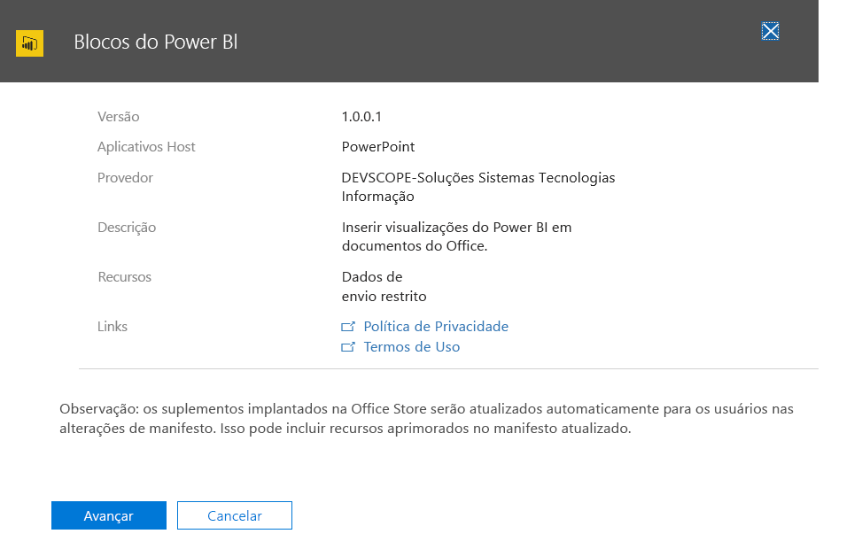

# Publicar Suplementos do Office usando a Implanta??o Centralizada por meio do Centro de administra??o do Office 365Publish Office Add-ins using Centralized Deployment via the Office 365 admin center

No Centro de administra??o do Office 365, ? mais f?cil para o administrador implantar Suplementos do Office para usu?rios e grupos dentro da organiza??o. Os suplementos implantados por meio do Centro de administra??o ficam dispon?veis imediatamente para os usu?rios nos aplicativos do Office, sem a necessidade de configura??o do cliente. Voc? pode usar a Implanta??o Centralizada para implantar suplementos internos, al?m de suplementos fornecidos por ISVs.The Office 365 admin center makes it easy for an administrator to deploy Office Add-ins to users and groups within their organization. Add-ins deployed via the admin center are available to users in their Office applications right away, with no client configuration required. You can use Centralized Deployment to deploy internal add-ins as well as add-ins provided by ISVs.

Atualmente, o Centro de administra??o do Office 365 tem suporte para os seguintes cen?rios:The Office 365 admin center currently supports the following scenarios:

- Implanta??o Centralizada de suplementos novos e atualizados para usu?rios, grupos ou para uma organiza??o.Centralized Deployment of new and updated add-ins to individuals, groups, or an organization.
- Implanta??o para v?rias plataformas, inclusive Windows e Office Online; em breve para Mac.Deployment to multiple platforms, including Windows and Office Online, with Mac coming soon.
- Implanta??o no idioma ingl?s e para locat?rios no mundo inteiro.Deployment to English language and worldwide tenants.
- Implanta??o de suplementos hospedados na nuvem.Deployment of cloud-hosted add-ins.
- Implanta??o de suplementos hospedados em um firewall.Deployment of add-ins that are hosted within a firewall.
- Implanta??o de suplementos do AppSource.Deployment of AppSource add-ins.
- Instala??o autom?tica de um suplemento para usu?rios que iniciam o aplicativo do Office.Automatic installation of an add-in for users when they launch the Office application.
- Remo??o autom?tica de um suplemento para os usu?rios se o administrador desativar ou excluir o suplemento ou se os usu?rios forem removidos do Azure Active Directory ou de um grupo no qual o suplemento foi implantado.Automatic removal of an add-in for users if the admin turns off or deletes the add-in, or if users are removed from Azure Active Directory or from a group to which the add-in has been deployed.

A Implanta??o Centralizada ? a maneira recomendada para o administrador do Office 365 implantar Suplementos do Office em uma organiza??o, desde que a organiza??o atenda a todos os requisitos para usar a Implanta??o Centralizada.Centralized Deployment is the recommended way for an Office 365 admin to deploy Office add-ins within an organization, provided that the organization meets all requirements for using Centralized Deployment. Confira informa??es sobre como determinar se sua organiza??o pode usar a Implanta??o Centralizada em [Determinar se a Implanta??o Centralizada de suplementos funciona para sua organiza??o do Office 365](https://support.office.com/en-us/article/Determine-if-Centralized-Deployment-of-add-ins-works-for-your-Office-365-organization-B4527D49-4073-4B43-8274-31B7A3166F92).For information about how to determine if your organization can use Centralized Deployment, see [Determine if Centralized Deployment of add-ins works for your Office 365 organization](https://support.office.com/en-us/article/Determine-if-Centralized-Deployment-of-add-ins-works-for-your-Office-365-organization-B4527D49-4073-4B43-8274-31B7A3166F92).

> [!NOTE]
> Em um ambiente local sem conex?o com o Office 365, ou para implantar Suplementos do SharePoint ou Office que visam o Office 2013, use um [Cat?logo de suplementos do SharePoint](publish-task-pane-and-content-add-ins-to-an-add-in-catalog.md).In an on-premises environment with no connection to Office 365, or to deploy SharePoint add-ins or Office Add-ins that target Office 2013, use a [SharePoint add-in catalog](publish-task-pane-and-content-add-ins-to-an-add-in-catalog.md). Para implantar suplementos COM ou VSTO, use o Windows Installer ou o recurso ClickOnce, como descrito em [Implantando uma solu??o do Office](https://msdn.microsoft.com/en-us/library/bb386179.aspx).To deploy COM/VSTO add-ins, use ClickOnce or Windows Installer, as described in [Deploying an Office solution](https://msdn.microsoft.com/en-us/library/bb386179.aspx).

## Abordagem recomendada para implantar Suplementos do OfficeRecommended approach for deploying Office Add-ins

Considere implantar os suplementos do Office em fases para ajudar a garantir que a implanta??o corra bem. Recomendamos o plano a seguir:Consider deploying Office Add-ins in a phased approach to help ensure that the deployment goes smoothly. We recommend the following plan:

1. Implante o suplemento em um pequeno conjunto de partes interessadas de neg?cios e membros do departamento de TI.Deploy the add-in to a small set of business stakeholders and members of the IT department. Se a implanta??o for bem-sucedida, v? para a etapa 2.If the deployment is successful, move on to step 2.

2. Implante o suplemento para um conjunto maior de pessoas que usar?o o suplemento dentro da empresa.Deploy the add-in to a larger set of individuals within the business who will be using the add-in. Se a implanta??o for bem-sucedida, v? para a etapa 3.If the deployment is successful, move on to step 3.

3. Implante o suplemento para todo o conjunto de pessoas que usar?o o suplemento.Deploy the add-in to the full set of individuals who will be using the add-in.

Dependendo do tamanho do p?blico-alvo, conv?m adicionar etapas a ou remover etapas deste procedimento.Depending on the size of the target audience, you may want to add steps to or remove steps from this procedure.

## Publicar um suplemento por meio da Implanta??o CentralizadaPublish an Office Add-in via Centralized Deployment

Antes de come?ar, confirme se a sua organiza??o atende a todos os requisitos para usar a Implanta??o Centralizada, conforme descrito em [Determinar se a Implanta??o Centralizada de suplementos funciona para sua organiza??o do Office 365](https://support.office.com/en-us/article/Determine-if-Centralized-Deployment-of-add-ins-works-for-your-Office-365-organization-B4527D49-4073-4B43-8274-31B7A3166F92).Before you begin, confirm that your organization meets all requirements for using Centralized Deployment, as described in [Determine if Centralized Deployment of add-ins works for your Office 365 organization](https://support.office.com/en-us/article/Determine-if-Centralized-Deployment-of-add-ins-works-for-your-Office-365-organization-B4527D49-4073-4B43-8274-31B7A3166F92).

Se sua organiza??o atender aos requisitos, conclua as etapas a seguir para publicar um suplemento do Office por meio da Implanta??o Centralizada:If your organization meets all requirements, complete the following steps to publish an Office Add-in via Centralized Deployment:

1. Entre no Office 365 com uma conta corporativa ou de estudante.Sign in to Office 365 with your work or school account.
2. Selecione o ?cone do inicializador de aplicativos no canto superior esquerdo e escolha **Administrador**.Select the app launcher icon in the upper-left and choose **Admin**.
3. No menu de navega??o, escolha **Configura??es** > **Servi?os e suplementos**.In the navigation menu, choose **Settings** > **Services & add-ins**.
4. Se voc? vir uma mensagem na parte superior da p?gina anunciando o novo Centro de administra??o do Office 365, escolha a mensagem para ir para a Visualiza??o do Centro de administra??o (consulte [Sobre o Centro de administra??o do Office 365](https://support.office.com/en-ie/article/About-the-Office-365-admin-center-758befc4-0888-4009-9f14-0d147402fd23)).If you see a message on the top of the page announcing the new Office 365 admin center, choose the message to go to the Admin Center Preview (see [About the Office 365 admin center](https://support.office.com/en-ie/article/About-the-Office-365-admin-center-758befc4-0888-4009-9f14-0d147402fd23)).
5. Escolha **Carregar um Suplemento** na parte superior da p?gina.Choose **Upload Add-in** at the top of the page. 
6. Escolha uma das op??es a seguir na p?gina **Implanta??o Centralizada**:Choose one of the following options on the **Centralized Deployment** page:

    - **Desejo adicionar um Suplemento do AppSource.****I want to add an Add-in from AppSource.**
    - **Tenho o arquivo de manifesto (.xml) neste dispositivo.****I have the manifest file (.xml) on this device.** Para esta op??o, escolha **Navegar** para localizar o arquivo de manifesto (.xml) que voc? deseja usar.For this option, choose **Browse** to locate the manifest file (.xml) that you want to use.
    - **Tenho uma URL para o arquivo de manifesto.****I have a URL for the manifest file.** Para esta op??o, digite a URL do manifesto no campo fornecido.For this option, type the manifest's URL in the field provided.

    

7.  Escolha **Avan?ar**.Choose **Next**.

8.  Se tiver selecionado a op??o para adicionar um suplemento do AppSource, escolha o suplemento.If you selected the option to add an Add-in from AppSource, select the add-in. ? poss?vel exibir suplementos dispon?veis por meio das categorias **Sugeridos para voc?**, **Classifica??o** ou **Nome**.Notice that you can view available add-ins via categories of **Suggested for you**, **Rating**, or **Name**. Voc? s? pode adicionar suplementos gratuitos do AppSource. Atualmente n?o ? poss?vel adicionar suplementos pagos.You may only add free add-ins from AppSource; adding paid add-ins isn't currently supported.

    > [!NOTE]
    > Com a op??o do AppSource, as atualiza??es e os aprimoramentos do suplemento ser?o disponibilizadas automaticamente para usu?rios sem necessidade de interven??o.With the AppSource option, updates and enhancements to the add-in will automatically be made available to users without your intervention.

    

9. O suplemento j? est? habilitado.The add-in is now enabled. Na p?gina para o suplemento, o status ? **Ativo**, como o mostrado para o suplemento Bloco do Power BI na captura de tela abaixo.On the page for the add-in, its status is **On**, like that shown for the Power BI Tiles add-in in the screenshot below. Na se??o **Quem tem acesso**, escolha **Editar** para atribuir o suplemento para usu?rios e/ou grupos.In the **Who has access** section, choose **Edit** to assign the add-in to users and/or groups.

    

10. Na **p?gina Editar quem tem acesso**, escolha **Todos** ou **Usu?rios/grupos espec?ficos**.On the **Edit who has access page**, choose either **Everyone** or **Specific Users/Groups**. Use a caixa Pesquisar para encontrar usu?rios e/ou grupos para quem voc? quer implantar o suplemento.Use the Search box to find the users and/or groups to whom you want to deploy the add-in.

    

    > [!NOTE]
    > Para suplementos de SSO (logon ?nico), os usu?rios e grupos atribu?dos tamb?m ser?o compartilhados com suplementos que compartilham a mesma ID de Aplicativo do Azure.For single sign-on (SSO) add-ins, the users and groups assigned will also be shared with add-ins that share the same Azure App ID. Todas as altera??es nas atribui??es do usu?rio tamb?m se aplicar?o a esses suplementos. Os suplementos relacionados ser?o mostrados nessa p?gina.Any changes to user assignments will also apply to those add-ins. The related add-ins will be shown on this page. Apenas em suplementos de SSO, essa p?gina exibir? a lista de permiss?es do Microsoft Graph exigida pelo suplemento.For SSO add-ins only, this page will display the list of Microsoft Graph permissions that the add-in requires.

11. Depois de terminar, escolha **Salvar**, revise as configura??es do suplemento e escolha **Fechar**.When finished, choose **Save**, review the add-in settings, and then choose **Close**. Voc? ver? o suplemento juntamente com outros aplicativos no Office 365.You now see your add-in along with other apps in Office 365.

    > [!NOTE]
    >  Quando um administrador escolhe **Salvar**, o consentimento ? fornecido para todos os usu?rios.When an administrator chooses **Save**, consent is given for all users. 

    

> [!TIP]
> Quando voc? implanta um novo suplemento para usu?rios e/ou grupos em sua organiza??o, envie um email descrevendo quando e como usar o suplemento e incluindo links para conte?do relevante da Ajuda, perguntas frequentes ou outros recursos de suporte.When you deploy a new add-in to users and/or groups in your organization, consider sending them an email that describes when and how to use the add-in, and includes links to relevant Help content, FAQs, or other support resources.

## Considera??es ao conceder acesso a um suplementoConsiderations when granting access to an add-in

Os administradores podem atribuir um suplemento a todos na organiza??o ou a usu?rios e/ou grupos espec?ficos de dentro da organiza??o.Admins can assign an add-in to everyone in the organization or to specific users and/or groups within the organization. A lista a seguir descreve as implica??es de cada op??o:The following list describes the implications of each option:

- **Todos**: Como o nome sugere, essa op??o atribui o suplemento a todos os usu?rios no locat?rio.**Everyone**: As the name implies, this option assigns the add-in to every user in the tenant. Use essa op??o com cautela e apenas para suplementos que sejam realmente universais para sua organiza??o.Use this option sparingly and only for add-ins that are truly universal to your organization.

- **Usu?rios**: Se voc? atribuir um suplemento a usu?rios individuais, ser? necess?rio atualizar as configura??es da Central de implanta??o para o suplemento sempre que quiser atribu?-lo a outros usu?rios.**Users**: If you assign an add-in to individual users, you'll need to update the Central Deployment settings for the add-in each time you want to assign it additional users. Da mesma forma, ser? necess?rio atualizar as configura??es da Central de implanta??o para o suplemento sempre que voc? quiser remover o acesso do usu?rio ao suplemento.Likewise, you'll need to update the Central Deployment settings for the add-in each time you want to remove a user's access to the add-in.

- **Grupos**: Se voc? atribuir um suplemento a um grupo, os usu?rios adicionados ao grupo ser?o atribu?dos automaticamente ao suplemento.**Groups**: If you assign an add-in to a group, users who are added to the group will automatically be assigned the add-in. Da mesma forma, quando um usu?rio ? removido de um grupo, ele automaticamente perde o acesso ao suplemento.Likewise, when a user is removed from a group, the user automatically loses access to the add-in. Em ambos os casos, nenhuma a??o adicional ? necess?ria por parte do administrador do Office 365.In either case, no additional action is required from the Office 365 admin.

Em geral, para facilitar a manuten??o, recomendamos atribuir suplementos usando grupos sempre que poss?vel.In general, for ease of maintenance, we recommend assigning add-ins by using groups whenever possible. No entanto, em situa??es em que voc? deseja restringir o acesso do suplemento a um n?mero muito pequeno de usu?rios, pode ser mais pr?tico atribuir o suplemento a usu?rios espec?ficos.However, in situations where you want to restrict add-in access to a very small number of users, it may be more practical to assign the add-in to specific users. 

## Estados de suplementosAdd-in states

A tabela a seguir descreve os estados diferentes de um suplemento.The following table describes the different states of an add-in.

|EstadoState|Como o estado ocorreHow the state occurs|ImpactoImpact|
|-----|--------------------|------|
|**Ativo****Active**|O administrador carregou o suplemento e o atribuiu a usu?rios e/ou grupos.Admin uploaded the add-in and assigned it to users and/or groups.|Os usu?rios e/ou grupos atribu?dos ao suplemento o veem nos clientes do Office relevantes.Users and/or groups assigned to the add-in see it in the relevant Office clients.|
|**Desativado****Turned off**|O administrador desativou o suplemento.Admin turned off the add-in.|Os usu?rios e/ou grupos atribu?dos ao suplemento j? n?o t?m acesso a ele.Users and/or groups assigned to the add-in no longer have access to it. Se o estado do suplemento for alterado de **Desativado** para **Ativo**, os usu?rios e os grupos recuperar?o o acesso a ele.If the add-in state is changed from **Turned off** to **Active**, the users and groups will regain access to it.|
|**Exclu?do****Deleted**|O administrador excluiu o suplemento.Admin deleted the add-in.|Os usu?rios e/ou grupos atribu?dos ao suplemento j? n?o t?m acesso a ele.Users and/or groups assigned the add-in no longer have access to it.|

## Atualizar suplementos do Office que s?o publicados por meio de Implanta??o CentralizadaUpdating Office Add-ins that are published via Centralized Deployment

Depois de um suplemento do Office ter sido publicado por meio de Implanta??o Centralizada, as altera??es feitas ao aplicativo Web do suplemento automaticamente estar?o dispon?veis para todos os usu?rios assim que as altera??es forem implementadas no aplicativo Web.After an Office Add-in has been published via Centralized Deployment, any changes made to the add-in's web application will automatically be available to all users as soon as those changes are implemented in the web application. As altera??es feitas a um [arquivo de manifesto XML](../develop/add-in-manifests.md) de um suplemento, por exemplo, para atualizar o ?cone, texto ou comandos do suplemento, ocorrem da seguinte maneira:Changes made to an add-in's [XML manifest file](../develop/add-in-manifests.md), for example, to update the add-in's icon, text, or add-in commands, happen as follows:

- **Suplemento de linha de neg?cios**: Se um administrador tiver carregado explicitamente um arquivo de manifesto durante a implementa??o da Implanta??o Centralizada por meio do Centro de administra??o do Office 365, o administrador dever? carregar um novo arquivo de manifesto que cont?m as altera??es desejadas.**Line-of-business add-in**: If an admin explicitly uploaded a manifest file when implementing Centralized Deployment via the Office 365 admin center, the admin must upload a new manifest file that contains the desired changes. Depois que o arquivo de manifesto atualizado for carregado, o suplemento ser? atualizado na pr?xima vez que os aplicativos relevantes do Office iniciarem.After the updated manifest file has been uploaded, the next time the relevant Office applications start, the add-in will update.

- **Suplemento do AppSource**: se um administrador selecionar um suplemento do AppSource durante a implementa??o da Implanta??o Centralizada pelo Centro de administra??o do Office 365, e as atualiza??es de suplementos ocorrerem no AppSource, o suplemento ser? atualizado posteriormente pela Implanta??o Centralizada. Da pr?xima vez que os aplicativos relevantes do Office iniciarem, o suplemento ser? atualizado.**AppSource add-in**: If an admin selected an add-in from AppSource when implementing Centralized Deployment via the Office 365 admin center, and the add-in updates in AppSource, the add-in will update later via Centralized Deployment. The next time the relevant Office applications start, the add-in will update.

## Experi?ncia do usu?rio final com suplementosEnd user experience with add-ins

Depois que um suplemento tiver sido publicado por meio de Implanta??o Centralizada, os usu?rios finais podem come?ar a us?-lo em qualquer plataforma que o suplemento suporte.After an add-in has been published via Centralized Deployment, end users may start using it on any platform that the add-in supports. 

Se o suplemento tiver suporte para comandos, eles ser?o exibidos na Faixa de Op??es do Office a todos os usu?rios para os quais o suplemento for implantado.If the add-in supports add-in commands, the commands will appear on the Office application ribbon for all users to whom the add-in is deployed. No exemplo a seguir, o comando **Pesquisar Cita??o** aparece na faixa de op??es para o suplemento **Cita??es**.In the following example, the command **Search Citation** appears in the ribbon for the **Citations** add-in. 

Caso contr?rio, os usu?rios podem adicion?-lo ao aplicativo do Office da seguinte maneira:If the add-in does not support add-in commands, users can add it to their Office application by doing the following:

1.  Nos aplicativos Word 2016, Excel 2016 ou PowerPoint 2016, escolha **Inserir** > **Meus Suplementos**.In Word 2016, Excel 2016, or PowerPoint 2016, choose **Insert** > **My Add-ins**.
2.  Escolha **Administrador Gerenciado**, na janela do suplemento.Choose the **Admin Managed** tab in the add-in window.
3.  Escolha o suplemento e escolha **Adicionar**.Choose the add-in, and then choose **Add**. 

    
    
## Confira tamb?mSee also
[Determine se a Implanta??o Centralizada de suplementos funciona para sua organiza??o do Office 365](https://support.office.com/en-us/article/Determine-if-Centralized-Deployment-of-add-ins-works-for-your-Office-365-organization-b4527d49-4073-4b43-8274-31b7a3166f92)For information about how to determine if your organization can use Centralized Deployment, see [Determine if Centralized Deployment of add-ins works for your Office 365 organization](https://support.office.com/en-us/article/Determine-if-Centralized-Deployment-of-add-ins-works-for-your-Office-365-organization-b4527d49-4073-4b43-8274-31b7a3166f92).
    
