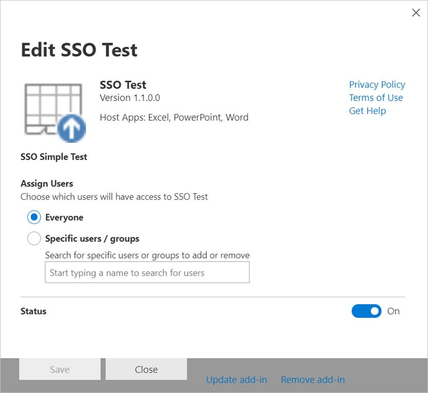

# Publicar suplementos do Office usando a implantação centralizada por meio do centro de administração do Microsoft 365

O centro de administração do Microsoft 365 facilita para um administrador implantar os suplementos do Office para usuários e grupos dentro de sua organização. Os suplementos implantados por meio do Centro de administração ficam disponíveis imediatamente para os usuários nos aplicativos do Office, sem a necessidade de configuração do cliente. É possível usar a Implantação Centralizada para implantar suplementos internos, além de suplementos fornecidos por ISVs.

O centro de administração do Microsoft 365 atualmente oferece suporte aos seguintes cenários.

- Implantação Centralizada de suplementos novos e atualizados para usuários, grupos ou para uma organização.
- Implantação para várias plataformas de cliente, incluindo Windows, Mac e a Web. Para o Outlook, a implantação para iOS e Android também é suportada. (No entanto, enquanto a instalação do Excel, Outlook, Word e suplementos do PowerPoint no iPad é suportada, a implantação centralizada para iPad **não** é suportada.)
- Implantação no idioma inglês e para locatários no mundo inteiro.
- Implantação de suplementos hospedados na nuvem.
- Implantação de suplementos hospedados em um firewall.
- Implantação de suplementos do AppSource.
- Instalação automática de um suplemento para usuários que iniciam o aplicativo do Office.
- Remoção automática de um suplemento para os usuários se o administrador desativar ou excluir o suplemento ou se os usuários forem removidos do Azure Active Directory ou de um grupo no qual o suplemento foi implantado.

A implantação centralizada é a maneira recomendada para o administrador do Microsoft 365 implantar suplementos do Office em uma organização, desde que a organização atenda a todos os requisitos para usar a implantação centralizada. Para obter informações sobre como determinar se sua organização pode usar a implantação centralizada, consulte [determinar se a implantação centralizada de suplementos funciona para sua organização do Microsoft 365](/office365/admin/manage/centralized-deployment-of-add-ins).

> [!NOTE]
> Em um ambiente local sem conexão com o Microsoft 365, ou para implantar suplementos do SharePoint ou suplementos do Office que são direcionados para o Office 2013, use um [Catálogo de aplicativos do SharePoint](publish-task-pane-and-content-add-ins-to-an-add-in-catalog.md). Para implantar suplementos COM ou VSTO, use o Windows Installer ou o recurso ClickOnce, como descrito em [Implantando uma solução do Office](/visualstudio/vsto/deploying-an-office-solution).

## Abordagem recomendada para implantar Suplementos do Office

Consider deploying Office Add-ins in a phased approach to help ensure that the deployment goes smoothly. We recommend the following plan:

1. Deploy the add-in to a small set of business stakeholders and members of the IT department. If the deployment is successful, move on to step 2.

2. Deploy the add-in to a larger set of individuals within the business who will be using the add-in. If the deployment is successful, move on to step 3.

3. Implante o suplemento para todo o conjunto de pessoas que usarão o suplemento.

Dependendo do tamanho do público-alvo, convém adicionar etapas a ou remover etapas deste procedimento.

## Publicar um suplemento por meio da Implantação Centralizada

Antes de começar, confirme se a sua organização atende a todos os requisitos para usar a implantação centralizada, conforme descrito em [determinar se a implantação centralizada de suplementos funciona para sua organização do Microsoft 365](/microsoft-365/admin/manage/centralized-deployment-of-add-ins).

Se sua organização atender aos requisitos, conclua as etapas a seguir para publicar um suplemento do Office por meio da Implantação Centralizada:

1. Entre no Microsoft 365 com sua conta corporativa ou de educação.
2. Selecione o ícone do inicializador de aplicativos no canto superior esquerdo e escolha **Administrador**.
3. No menu de navegação, pressione **Mostrar mais** e, em seguida, escolha **Configurações** > **Serviços e suplementos**.
4. Se você vir uma mensagem na parte superior da página anunciando o novo centro de administração do Microsoft 365, escolha a mensagem para ir para a visualização do centro de administração (consulte [About The Microsoft 365 Admin Center](/microsoft-365/admin/admin-overview/about-the-admin-center)).
5. Escolha **Implantar Suplemento** na parte superior da página.
6. Escolha **Avançar** depois de analisar os requisitos.
7. Escolha uma das opções a seguir na página **Implantação Centralizada**:

    - **Desejo adicionar um Suplemento da Office Store.**
    - **I have the manifest file (.xml) on this device.** For this option, choose **Browse** to locate the manifest file (.xml) that you want to use.
    - **I have a URL for the manifest file.** For this option, type the manifest's URL in the field provided.

    

8. Se tiver selecionado a opção para adicionar um suplemento da Office Store, escolha o suplemento. É possível exibir suplementos disponíveis por meio das categorias **Sugeridos para você**, **Classificação** ou **Nome**. Você pode adicionar apenas suplementos gratuitos da Office Store. Atualmente não é possível adicionar suplementos pagos.

    > [!NOTE]
    > Com a opção da Office Store, as atualizações e os aprimoramentos do suplemento estão disponíveis automaticamente para usuários sem necessidade de intervenção.

    

9. Escolha **continuar** após analisar os detalhes do suplemento, política de privacidade e termos de licença.

    

10. Na página **atribuir usuários** , escolha **todos**, **usuários/grupos específicos**ou **apenas eu**. Use a caixa Pesquisar para encontrar usuários e grupos para quem você quer implantar o suplemento. Para suplementos do Outlook, você também pode escolher o método de implantação **fixo**, **disponível**ou **opcional**.

    

    > [!NOTE]
    > Um sistema de [logon único (SSO)](../develop/sso-in-office-add-ins.md) para suplementos está atualmente em versão prévia e não deve ser usado para suplementos de produção. Quando for implantado um suplemento que use o SSO, os usuários e grupos atribuídos também são compartilhados com suplementos que compartilham a mesma ID de aplicativo Azure. Todas as alterações nas atribuições do usuário também são aplicadas a esses suplementos. Os suplementos relacionados serão mostrados nessa página. Apenas em suplementos de SSO, essa página exibe a lista de permissões do Microsoft Graph exigida pelo suplemento.

11. Quando terminar, escolha **implantar**. Este processo pode levar até três minutos. Conclua a passo a passo, pressionando **Avançar**. Você verá o suplemento juntamente com outros aplicativos no Office 365.

    > [!NOTE]
    > Quando um administrador escolhe **implantar**, o consentimento é fornecido para todos os usuários.

    

> [!TIP]
> Quando você implanta um novo suplemento para usuários e/ou grupos em sua organização, envie um email descrevendo quando e como usar o suplemento e incluindo links para conteúdo relevante da Ajuda, perguntas frequentes ou outros recursos de suporte.

## Considerações ao conceder acesso a um suplemento

Admins can assign an add-in to everyone in the organization or to specific users and/or groups within the organization. The following list describes the implications of each option:

- **Everyone**: As the name implies, this option assigns the add-in to every user in the tenant. Use this option sparingly and only for add-ins that are truly universal to your organization.

- **Users**: If you assign an add-in to individual users, you'll need to update the Central Deployment settings for the add-in each time you want to assign it additional users. Likewise, you'll need to update the Central Deployment settings for the add-in each time you want to remove a user's access to the add-in.

- **Grupos**: Se você atribuir um suplemento a um grupo, os usuários adicionados ao grupo serão atribuídos automaticamente ao suplemento. Da mesma forma, quando um usuário é removido de um grupo, ele automaticamente perde o acesso ao suplemento. Em ambos os casos, nenhuma ação adicional é necessária do Microsoft 365 admin.

In general, for ease of maintenance, we recommend assigning add-ins by using groups whenever possible. However, in situations where you want to restrict add-in access to a very small number of users, it may be more practical to assign the add-in to specific users.

## Estados de suplementos

A tabela a seguir descreve os estados diferentes de um suplemento.

|Estado|Como o estado ocorre|Impacto|
|-----|--------------------|------|
|**Ativo**|O administrador carregou o suplemento e o atribuiu a usuários e/ou grupos.|Os usuários e/ou grupos atribuídos ao suplemento o veem nos clientes do Office relevantes.|
|**Desativado**|O administrador desativou o suplemento.|Users and/or groups assigned to the add-in no longer have access to it. If the add-in state is changed from **Turned off** to **Active**, the users and groups will regain access to it.|
|**Excluído**|O administrador excluiu o suplemento.|Os usuários e/ou grupos atribuídos ao suplemento já não têm acesso a ele.|

## Atualizar suplementos do Office que são publicados por meio de Implantação Centralizada

After an Office Add-in has been published via Centralized Deployment, any changes made to the add-in's web application will automatically be available to all users as soon as those changes are implemented in the web application. Changes made to an add-in's [XML manifest file](../develop/add-in-manifests.md), for example, to update the add-in's icon, text, or add-in commands, happen as follows:

- **Suplemento de linha de negócios**: se um administrador tiver carregado um arquivo de manifesto explicitamente ao implementar a implantação centralizada por meio do centro de administração do Microsoft 365, o administrador deverá carregar um novo arquivo de manifesto que contenha as alterações desejadas. Depois que o arquivo de manifesto atualizado for carregado, o suplemento será atualizado na próxima vez que os aplicativos relevantes do Office iniciarem.

  > [!NOTE]
  > Um administrador não precisa remover um suplemento de LOB para fazer uma atualização. Na seção suplementos, o administrador pode simplesmente escolher o suplemento de LOB e invocar essa funcionalidade pressionando o botão **Atualizar suplemento** presente no canto inferior direito.
  > 
  > 

- **Suplemento da Office Store**: se um administrador selecionou um suplemento da Office Store ao implementar a implantação centralizada por meio do centro de administração do Microsoft 365 e as atualizações de suplemento na Office Store, o suplemento será atualizado posteriormente via implantação centralizada. Na próxima vez que os aplicativos relevantes do Office iniciarem, o suplemento será atualizado.

## Experiência do usuário final com suplementos

Depois que um suplemento tiver sido publicado por meio de Implantação Centralizada, os usuários finais podem começar a usá-lo em qualquer plataforma que o suplemento suporte.

If the add-in supports add-in commands, the commands will appear on the Office application ribbon for all users to whom the add-in is deployed. In the following example, the command **Search Citation** appears in the ribbon for the **Citations** add-in.

Caso contrário, os usuários podem adicioná-lo ao aplicativo do Office da seguinte maneira:

1. No Word 2016 ou posterior, no Excel 2016 ou posterior ou no PowerPoint 2016 ou posterior, escolha **Inserir** > **Meus suplementos**.
2. Escolha **Administrador Gerenciado**, na janela do suplemento.
3. Escolha o suplemento e escolha **Adicionar**.

    

No entanto, para o Outlook 2016 ou posterior, os usuários podem fazer o seguinte:

1. No Outlook, escolha **Página Inicial** > **Store**.
2. Escolha o item **Administrador Gerenciado** a guia do suplemento.
3. Escolha o suplemento e escolha **Adicionar**.

    

## Confira também

- [Determinar se a implantação centralizada de suplementos funciona para sua organização do Microsoft 365](/office365/admin/manage/centralized-deployment-of-add-ins)
