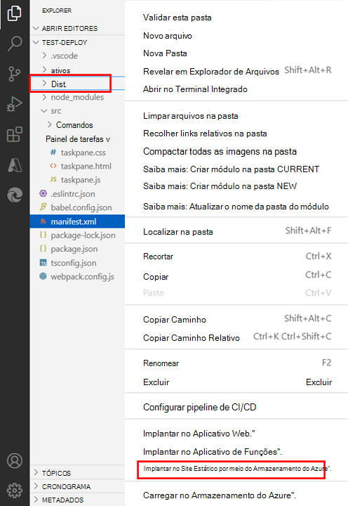

# <a name="publish-an-add-in-developed-with-visual-studio-code"></a><span data-ttu-id="8b91d-103">Publicar um suplemento desenvolvido com o Código do Visual Studio</span><span class="sxs-lookup"><span data-stu-id="8b91d-103">Publish an add-in developed with Visual Studio Code</span></span>

<span data-ttu-id="8b91d-104">Este artigo descreve como publicar um Suplemento do Office criado com o gerador Yeoman e desenvolvido com o [Código do Visual Studio (VS Code)](https://code.visualstudio.com) ou qualquer outro editor.</span><span class="sxs-lookup"><span data-stu-id="8b91d-104">This article describes how to publish an Office Add-in that you created using the Yeoman generator and developed with [Visual Studio Code (VS Code)](https://code.visualstudio.com) or any other editor.</span></span>

> [!NOTE]
> <span data-ttu-id="8b91d-105">Para saber mais sobre como publicar um Suplemento do Office criado usando o Visual Studio, confira [Publicar o suplemento usando o Visual Studio](package-your-add-in-using-visual-studio.md).</span><span class="sxs-lookup"><span data-stu-id="8b91d-105">For information about publishing an Office Add-in that you created using Visual Studio, see [Publish your add-in using Visual Studio](package-your-add-in-using-visual-studio.md).</span></span>

## <a name="publishing-an-add-in-for-other-users-to-access"></a><span data-ttu-id="8b91d-106">Publicar um suplemento para que outros usuários acessem o</span><span class="sxs-lookup"><span data-stu-id="8b91d-106">Publishing an add-in for other users to access</span></span>

<span data-ttu-id="8b91d-107">Um Suplemento do Office é formado por um aplicativo Web e um arquivo de manifesto.</span><span class="sxs-lookup"><span data-stu-id="8b91d-107">An Office Add-in consists of a web application and a manifest file.</span></span> <span data-ttu-id="8b91d-108">O aplicativo Web define a interface do usuário e a funcionalidade do suplemento, enquanto o manifesto especifica o local do aplicativo Web e define as configurações e os recursos do suplemento.</span><span class="sxs-lookup"><span data-stu-id="8b91d-108">The web application defines the add-in's user interface and functionality, while the manifest specifies the location of the web application and defines settings and capabilities of the add-in.</span></span>

<span data-ttu-id="8b91d-109">Enquanto estiver desenvolvendo, você pode executar o complemento em seu servidor Web local ( `localhost` ).</span><span class="sxs-lookup"><span data-stu-id="8b91d-109">While you're developing, you can run the add-in on your local web server (`localhost`).</span></span> <span data-ttu-id="8b91d-110">Quando estiver pronto para publicá-lo para outros usuários acessarem, você precisará implantar o aplicativo Web e atualizar o manifesto para especificar a URL do aplicativo implantado.</span><span class="sxs-lookup"><span data-stu-id="8b91d-110">When you're ready to publish it for other users to access, you'll need to deploy the web application and update the manifest to specify the URL of the deployed application.</span></span>

<span data-ttu-id="8b91d-111">Quando o seu add-in estiver funcionando conforme desejado, você poderá publicá-lo diretamente Visual Studio Code usando a extensão do Azure Armazenamento.</span><span class="sxs-lookup"><span data-stu-id="8b91d-111">When your add-in is working as desired, you can publish it directly through Visual Studio Code using the Azure Storage extension.</span></span>

## <a name="using-visual-studio-code-to-publish"></a><span data-ttu-id="8b91d-112">Usando Visual Studio Code para publicar</span><span class="sxs-lookup"><span data-stu-id="8b91d-112">Using Visual Studio Code to publish</span></span>

>[!NOTE]
> <span data-ttu-id="8b91d-113">Essas etapas só funcionam para projetos criados com o gerador Yeoman.</span><span class="sxs-lookup"><span data-stu-id="8b91d-113">These steps only work for projects created with the Yeoman generator.</span></span>

1. <span data-ttu-id="8b91d-114">Abra seu projeto de sua pasta raiz em Visual Studio Code (VS Code).</span><span class="sxs-lookup"><span data-stu-id="8b91d-114">Open your project from its root folder in Visual Studio Code (VS Code).</span></span>
2. <span data-ttu-id="8b91d-115">Na exibição Extensões em VS Code, pesquise a extensão do Azure Armazenamento e instale-a.</span><span class="sxs-lookup"><span data-stu-id="8b91d-115">From the Extensions view in VS Code, search for the Azure Storage extension and install it.</span></span>
3. <span data-ttu-id="8b91d-116">Depois de instalado, um ícone do Azure é adicionado à Barra de Atividades.</span><span class="sxs-lookup"><span data-stu-id="8b91d-116">Once installed, an Azure icon is added to the Activity Bar.</span></span> <span data-ttu-id="8b91d-117">Selecione-o para acessar a extensão.</span><span class="sxs-lookup"><span data-stu-id="8b91d-117">Select it to access the extension.</span></span> <span data-ttu-id="8b91d-118">Se sua Barra de Atividades estiver oculta, você não poderá acessar a extensão.</span><span class="sxs-lookup"><span data-stu-id="8b91d-118">If your Activity Bar is hidden, you won't be able to access the extension.</span></span> <span data-ttu-id="8b91d-119">Mostrar a Barra de Atividades **selecionando Exibir > Aparência > Mostrar Barra de Atividades**.</span><span class="sxs-lookup"><span data-stu-id="8b91d-119">Show the Activity Bar by selecting **View > Appearance > Show Activity Bar**.</span></span>
4. <span data-ttu-id="8b91d-120">Quando estiver na extensão, entre em sua conta do Azure selecionando **Entrar no Azure**.</span><span class="sxs-lookup"><span data-stu-id="8b91d-120">When in the extension, sign in to your Azure account by selecting **Sign in to Azure**.</span></span> <span data-ttu-id="8b91d-121">Você também pode criar uma conta do Azure se ainda não tiver uma selecionando **Criar uma conta gratuita do Azure**.</span><span class="sxs-lookup"><span data-stu-id="8b91d-121">You can also create an Azure account if you don't already have one by selecting **Create a free Azure account**.</span></span> <span data-ttu-id="8b91d-122">Siga as etapas fornecidas para configurar sua conta.</span><span class="sxs-lookup"><span data-stu-id="8b91d-122">Follow the provided steps to set up your account.</span></span>
5. <span data-ttu-id="8b91d-123">Depois de entrar na sua conta do Azure, você verá suas contas de armazenamento do Azure aparecerem na extensão.</span><span class="sxs-lookup"><span data-stu-id="8b91d-123">Once you have signed in to your Azure account, you'll see your Azure storage accounts appear in the extension.</span></span> <span data-ttu-id="8b91d-124">Se você ainda não tiver uma conta de armazenamento, precisará criar uma usando a **opção Criar nova** conta de armazenamento.</span><span class="sxs-lookup"><span data-stu-id="8b91d-124">If you don't already have a storage account, you'll need to create one using the **Create new storage account** option.</span></span> <span data-ttu-id="8b91d-125">Nomeia sua conta de armazenamento como um nome global exclusivo, usando apenas 'a-z' e '0-9'.</span><span class="sxs-lookup"><span data-stu-id="8b91d-125">Name your storage account a globally unique name, using only 'a-z' and '0-9'.</span></span> <span data-ttu-id="8b91d-126">Observe que, por padrão, isso cria uma conta de armazenamento e um grupo de recursos com o mesmo nome.</span><span class="sxs-lookup"><span data-stu-id="8b91d-126">Note that by default, this creates a storage account and a resource group with the same name.</span></span> <span data-ttu-id="8b91d-127">Ele coloca automaticamente a conta de armazenamento no Oeste dos EUA.</span><span class="sxs-lookup"><span data-stu-id="8b91d-127">It automatically puts the storage account in West US.</span></span> <span data-ttu-id="8b91d-128">Isso pode ser ajustado online por [meio de sua conta do Azure.](https://portal.azure.com/)</span><span class="sxs-lookup"><span data-stu-id="8b91d-128">This can be adjusted online through [your Azure account](https://portal.azure.com/).</span></span>
6. <span data-ttu-id="8b91d-129">Selecione e segure (clique com o botão direito do mouse) em sua conta de armazenamento, escolhendo **Configurar site estático.**</span><span class="sxs-lookup"><span data-stu-id="8b91d-129">Select and hold (right-click) your storage account, choosing **Configure static website**.</span></span> <span data-ttu-id="8b91d-130">Você será solicitado a inserir o nome do documento de índice e o nome do documento 404.</span><span class="sxs-lookup"><span data-stu-id="8b91d-130">You'll be asked to enter the index document name and the 404 document name.</span></span> <span data-ttu-id="8b91d-131">Altere o nome do documento de índice do padrão `index.html` para **`taskpane.html`** .</span><span class="sxs-lookup"><span data-stu-id="8b91d-131">Change the index document name from the default `index.html` to **`taskpane.html`**.</span></span> <span data-ttu-id="8b91d-132">Você também pode optar por alterar o nome do documento 404, mas não é necessário.</span><span class="sxs-lookup"><span data-stu-id="8b91d-132">You may decide to also change the 404 document name but are not required to.</span></span>
7. <span data-ttu-id="8b91d-133">Selecione e segure (clique com o botão direito do mouse) no armazenamento novamente, desta vez escolhendo **Procurar site estático**.</span><span class="sxs-lookup"><span data-stu-id="8b91d-133">Select and hold (right-click) your storage again, this time choosing **Browse static website**.</span></span> <span data-ttu-id="8b91d-134">Na janela do navegador aberta, copie a URL do site.</span><span class="sxs-lookup"><span data-stu-id="8b91d-134">From the browser window that opens, copy the website URL.</span></span>
8. <span data-ttu-id="8b91d-135">Em VS Code, abra o arquivo de manifesto do projeto ( ) e altere qualquer referência à URL do seu localhost (como ) para a `manifest.xml` `https://localhost:3000` URL que você copiou.</span><span class="sxs-lookup"><span data-stu-id="8b91d-135">In VS Code, open your project's manifest file (`manifest.xml`) and change any reference to your localhost URL (such as `https://localhost:3000`) to the URL you've copied.</span></span> <span data-ttu-id="8b91d-136">Esse ponto de extremidade é a URL do site estático para sua conta de armazenamento recém-criada.</span><span class="sxs-lookup"><span data-stu-id="8b91d-136">This endpoint is the static website URL for your newly created storage account.</span></span> <span data-ttu-id="8b91d-137">Salve as alterações no arquivo de manifesto.</span><span class="sxs-lookup"><span data-stu-id="8b91d-137">Save the changes to your manifest file.</span></span>
9. <span data-ttu-id="8b91d-138">Abra um prompt de linha de comando e navegue até o diretório raiz do seu projeto de complemento.</span><span class="sxs-lookup"><span data-stu-id="8b91d-138">Open a command line prompt and navigate to the root directory of your add-in project.</span></span> <span data-ttu-id="8b91d-139">Em seguida, execute o seguinte comando para preparar todos os arquivos para implantação de produção.</span><span class="sxs-lookup"><span data-stu-id="8b91d-139">Then run the following command to prepare all files for production deployment.</span></span>

    ```command&nbsp;line
    npm run build
    ```

    <span data-ttu-id="8b91d-140">Quando a compilação for concluída, a pasta **dist** no diretório raiz do projeto de suplemento incluirá os arquivos que você implantará nas etapas subsequentes.</span><span class="sxs-lookup"><span data-stu-id="8b91d-140">When the build completes, the **dist** folder in the root directory of your add-in project will contain the files that you'll deploy in subsequent steps.</span></span>

10. <span data-ttu-id="8b91d-141">Para implantar, selecione o explorador de arquivos, selecione e segure (clique com o botão direito do mouse) em sua **pasta dist** e escolha **Implantar no Site Estático**.</span><span class="sxs-lookup"><span data-stu-id="8b91d-141">To deploy, select the Files explorer, select and hold (right-click) your **dist** folder, and choose **Deploy to Static Website**.</span></span> <span data-ttu-id="8b91d-142">Quando solicitado, selecione a conta de armazenamento criada anteriormente.</span><span class="sxs-lookup"><span data-stu-id="8b91d-142">When prompted, select the storage account you created previously.</span></span>



11. <span data-ttu-id="8b91d-144">Quando a implantação é concluída, uma **mensagem Procurar** para site é exibida que você pode selecionar para abrir o ponto de extremidade principal do código do aplicativo implantado.</span><span class="sxs-lookup"><span data-stu-id="8b91d-144">When deployment is complete, a **Browse to website** message appears which you can select to open the primary endpoint of the deployed app code.</span></span>

## <a name="see-also"></a><span data-ttu-id="8b91d-145">Confira também</span><span class="sxs-lookup"><span data-stu-id="8b91d-145">See also</span></span>

- [<span data-ttu-id="8b91d-146">Desenvolver Suplementos do Office com o Código do Visual Studio</span><span class="sxs-lookup"><span data-stu-id="8b91d-146">Develop Office Add-ins with Visual Studio Code</span></span>](../develop/develop-add-ins-vscode.md)
- [<span data-ttu-id="8b91d-147">Implantar e publicar seu suplemento do Office</span><span class="sxs-lookup"><span data-stu-id="8b91d-147">Deploy and publish your Office Add-in</span></span>](../publish/publish.md)
