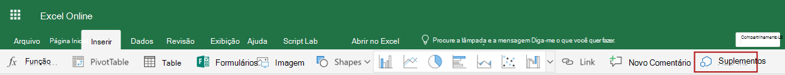

# <a name="get-started-developing-excel-custom-functions"></a><span data-ttu-id="9b0fa-103">Introdução ao desenvolvimento de funções personalizadas do Excel</span><span class="sxs-lookup"><span data-stu-id="9b0fa-103">Get started developing Excel custom functions</span></span>

<span data-ttu-id="9b0fa-104">Com as funções personalizadas, os desenvolvedores agora podem adicionar novas funções ao Excel definindo-as em JavaScript ou Typescript como parte de um suplemento.</span><span class="sxs-lookup"><span data-stu-id="9b0fa-104">With custom functions, developers can now add new functions to Excel by defining them in JavaScript or Typescript as part of an add-in.</span></span> <span data-ttu-id="9b0fa-105">Os usuários do Excel podem acessar funções personalizadas da mesma forma que fariam com qualquer função nativa no Excel, como `SUM()`.</span><span class="sxs-lookup"><span data-stu-id="9b0fa-105">Excel users can access custom functions just as they would any native function in Excel, such as `SUM()`.</span></span>

## <a name="prerequisites"></a><span data-ttu-id="9b0fa-106">Pré-requisitos</span><span class="sxs-lookup"><span data-stu-id="9b0fa-106">Prerequisites</span></span>

[!include[Yeoman generator prerequisites](../includes/quickstart-yo-prerequisites.md)]

* <span data-ttu-id="9b0fa-107">Excel no Windows (versão 1904 ou posterior, conectado a assinatura do Office 365) ou Excel na Web</span><span class="sxs-lookup"><span data-stu-id="9b0fa-107">Excel on Windows (version 1904 or later, connected to Office 365 subscription) or Excel on the web</span></span>
* <span data-ttu-id="9b0fa-108">As funções personalizadas do Excel são compatíveis com o Office no Mac (conectado à assinatura do Office 365) e uma atualização para esse tutorial está disponível.</span><span class="sxs-lookup"><span data-stu-id="9b0fa-108">Excel custom functions are supported in Office on Mac (connected to Office 365 subscription) and an update to this tutorial is forthcoming.</span></span>

>[!NOTE]
><span data-ttu-id="9b0fa-109">As funções personalizadas do Excel não são compatíveis com o Office 2019 (compra única).</span><span class="sxs-lookup"><span data-stu-id="9b0fa-109">Excel custom functions are not supported in Office 2019 (one-time purchase).</span></span>

## <a name="build-your-first-custom-functions-project"></a><span data-ttu-id="9b0fa-110">Crie seu primeiro projeto com funções personalizadas</span><span class="sxs-lookup"><span data-stu-id="9b0fa-110">Build your first custom functions project</span></span>

<span data-ttu-id="9b0fa-111">Para começar, você usará o gerador Yeoman para criar projeto com funções personalizadas.</span><span class="sxs-lookup"><span data-stu-id="9b0fa-111">To start, you'll use the Yeoman generator to create the custom functions project.</span></span> <span data-ttu-id="9b0fa-112">Isso configurará seu projeto com a estrutura de pastas, arquivos de origem e dependências corretos para começar a codificar suas funções personalizadas.</span><span class="sxs-lookup"><span data-stu-id="9b0fa-112">This will set up your project with the correct folder structure, source files, and dependencies to begin coding your custom functions.</span></span>

1. [!include[Yeoman generator create project guidance](../includes/yo-office-command-guidance.md)]

    - <span data-ttu-id="9b0fa-113">**Escolha o tipo de projeto:** `Excel Custom Functions Add-in project`</span><span class="sxs-lookup"><span data-stu-id="9b0fa-113">**Choose a project type:** `Excel Custom Functions Add-in project`</span></span>
    - <span data-ttu-id="9b0fa-114">**Escolha o tipo de script:** `JavaScript`</span><span class="sxs-lookup"><span data-stu-id="9b0fa-114">**Choose a script type:** `JavaScript`</span></span>
    - <span data-ttu-id="9b0fa-115">**Qual será o nome do suplemento?**</span><span class="sxs-lookup"><span data-stu-id="9b0fa-115">**What do you want to name your add-in?**</span></span> `starcount`

    

    <span data-ttu-id="9b0fa-117">O gerador Yeoman criará os arquivos do projeto e instalará os componentes Node de suporte.</span><span class="sxs-lookup"><span data-stu-id="9b0fa-117">The Yeoman generator will create the project files and install supporting Node components.</span></span>

2. <span data-ttu-id="9b0fa-118">O gerador Yeoman fornecerá algumas instruções na linha de comando sobre o que fazer com o projeto, mas ignore-as e continue seguindo nossas instruções.</span><span class="sxs-lookup"><span data-stu-id="9b0fa-118">The Yeoman generator will give you some instructions in your command line about what to do with the project, but ignore them and continue to follow our instructions.</span></span> <span data-ttu-id="9b0fa-119">Navegue até a pasta raiz do projeto.</span><span class="sxs-lookup"><span data-stu-id="9b0fa-119">Navigate to the root folder of the project.</span></span>

    ```command&nbsp;line
    cd starcount
    ```

3. <span data-ttu-id="9b0fa-120">Compile o projeto.</span><span class="sxs-lookup"><span data-stu-id="9b0fa-120">Build the project.</span></span> 

    ```command&nbsp;line
    npm run build
    ```

    > [!NOTE]
    > <span data-ttu-id="9b0fa-121">Os Suplementos do Office devem usar HTTPS, e não HTTP, mesmo durante o desenvolvimento.</span><span class="sxs-lookup"><span data-stu-id="9b0fa-121">Office Add-ins should use HTTPS, not HTTP, even when you are developing.</span></span> <span data-ttu-id="9b0fa-122">Se você for solicitado a instalar um certificado após executar `npm run build`, aceite a solicitação para instalar o certificado que o gerador do Yeoman fornecer.</span><span class="sxs-lookup"><span data-stu-id="9b0fa-122">If you are prompted to install a certificate after you run `npm run build`, accept the prompt to install the certificate that the Yeoman generator provides.</span></span>

4. <span data-ttu-id="9b0fa-123">Inicie o servidor local da web, que é executado no Node.js.</span><span class="sxs-lookup"><span data-stu-id="9b0fa-123">Start the local web server, which runs in Node.js.</span></span> <span data-ttu-id="9b0fa-124">Você pode experimentar o suplemento função personalizada no Excel na Web ou no Windows.</span><span class="sxs-lookup"><span data-stu-id="9b0fa-124">You can try out the custom function add-in in Excel on the web or Windows.</span></span> <span data-ttu-id="9b0fa-125">Você pode ser solicitado a abrir o painel de tarefas do suplemento, embora seja opcional.</span><span class="sxs-lookup"><span data-stu-id="9b0fa-125">You may be prompted to open the add-in's task pane, although this is optional.</span></span> <span data-ttu-id="9b0fa-126">Ainda é possível executar as funções personalizadas sem abrir o painel de tarefas do suplemento.</span><span class="sxs-lookup"><span data-stu-id="9b0fa-126">You can still run your custom functions without opening your add-in's task pane.</span></span>

# <a name="excel-on-windowstabexcel-windows"></a>[<span data-ttu-id="9b0fa-127">Excel no Windows</span><span class="sxs-lookup"><span data-stu-id="9b0fa-127">Excel on Windows</span></span>](#tab/excel-windows)

<span data-ttu-id="9b0fa-128">Para testar o suplemento no Excel para Windows ou Mac, execute o seguinte comando.</span><span class="sxs-lookup"><span data-stu-id="9b0fa-128">To test your add-in in Excel on Windows, run the following command.</span></span> <span data-ttu-id="9b0fa-129">Quando você executa este comando, o servidor Web local iniciará e o Excel abrirá com o seu suplemento carregado.</span><span class="sxs-lookup"><span data-stu-id="9b0fa-129">When you run this command, the local web server will start and Excel will open with your add-in loaded.</span></span>

```command&nbsp;line
npm run start:desktop
```

# <a name="excel-on-the-webtabexcel-online"></a>[<span data-ttu-id="9b0fa-130">Excel na Web</span><span class="sxs-lookup"><span data-stu-id="9b0fa-130">Excel on the web</span></span>](#tab/excel-online)

<span data-ttu-id="9b0fa-131">Para testar o suplemento no Excel na Web, execute o seguinte comando.</span><span class="sxs-lookup"><span data-stu-id="9b0fa-131">To test your add-in in Excel on the web, run the following command.</span></span> <span data-ttu-id="9b0fa-132">O servidor Web local será iniciado ao executar este comando.</span><span class="sxs-lookup"><span data-stu-id="9b0fa-132">When you run this command, the local web server will start.</span></span>

```command&nbsp;line
npm run start:web
```

<span data-ttu-id="9b0fa-133">Para usar o suplemento de funções personalizadas, abra uma nova pasta de trabalho no Excel em um navegador.</span><span class="sxs-lookup"><span data-stu-id="9b0fa-133">To use your custom functions add-in, open a new workbook in Excel on a browser.</span></span> <span data-ttu-id="9b0fa-134">Nesta pasta de trabalho, conclua as seguintes etapas para realizar o sideload do suplemento.</span><span class="sxs-lookup"><span data-stu-id="9b0fa-134">In this workbook, complete the following steps to sideload your add-in.</span></span>

1. <span data-ttu-id="9b0fa-135">No Excel, escolha a guia **Inserir** e, em seguida, escolha **Suplementos**.</span><span class="sxs-lookup"><span data-stu-id="9b0fa-135">In Excel, choose the **Insert** tab and then choose **Add-ins**.</span></span>

   
   
2. <span data-ttu-id="9b0fa-137">Escolha **Gerenciar Meus suplementos** e selecione **Carregar o Suplemento**.</span><span class="sxs-lookup"><span data-stu-id="9b0fa-137">Choose **Manage My Add-ins** and select **Upload My Add-in**.</span></span>

3. <span data-ttu-id="9b0fa-138">Escolha \*\*Procurar... \*\* e navegue até o diretório raiz do projeto criado pelo gerador Yeoman.</span><span class="sxs-lookup"><span data-stu-id="9b0fa-138">Choose **Browse...** and navigate to the root directory of the project that the Yeoman generator created.</span></span>

4. <span data-ttu-id="9b0fa-139">Selecione o arquivo **manifest. XML** e escolha **abrir**, escolha **Carregar**.</span><span class="sxs-lookup"><span data-stu-id="9b0fa-139">Select the file **manifest.xml** and choose **Open**, then choose **Upload**.</span></span>

---

## <a name="try-out-a-prebuilt-custom-function"></a><span data-ttu-id="9b0fa-140">Experimente uma função personalizada predefinida</span><span class="sxs-lookup"><span data-stu-id="9b0fa-140">Try out a prebuilt custom function</span></span>

<span data-ttu-id="9b0fa-141">O projeto de funções personalizadas criado usando o gerador Yeoman contém algumas funções personalizadas predefinidas definidas no arquivo **./src/functions/functions.js**.</span><span class="sxs-lookup"><span data-stu-id="9b0fa-141">The custom functions project that you created by using the Yeoman generator contains some prebuilt custom functions, defined within the **./src/functions/functions.js** file.</span></span> <span data-ttu-id="9b0fa-142">O arquivo **./manifest.xml** na pasta raiz do projeto especifica que todas as funções personalizadas pertencem ao namespace `CONTOSO`.</span><span class="sxs-lookup"><span data-stu-id="9b0fa-142">The **./manifest.xml** file in the root directory of the project specifies that all custom functions belong to the `CONTOSO` namespace.</span></span>

<span data-ttu-id="9b0fa-143">Em sua pasta de trabalho do Excel experimente a função personalizada `ADD` preenchendo as seguintes etapas:</span><span class="sxs-lookup"><span data-stu-id="9b0fa-143">In your Excel workbook, try out the `ADD` custom function by completing the following steps:</span></span>

1. <span data-ttu-id="9b0fa-144">Selecione uma célula e digite `=CONTOSO`</span><span class="sxs-lookup"><span data-stu-id="9b0fa-144">Select a cell and type `=CONTOSO`.</span></span> <span data-ttu-id="9b0fa-145">Observe que o menu de preenchimento automático mostra a lista de todas as funções no namespace `CONTOSO`.</span><span class="sxs-lookup"><span data-stu-id="9b0fa-145">Notice that the autocomplete menu shows the list of all functions in the `CONTOSO` namespace.</span></span>

2. <span data-ttu-id="9b0fa-146">Executar a função `CONTOSO.ADD`, usando os números `10` e `200` como parâmetros de entrada, digitando o valor `=CONTOSO.ADD(10,200)` na célula e pressionando enter.</span><span class="sxs-lookup"><span data-stu-id="9b0fa-146">Run the `CONTOSO.ADD` function, using numbers `10` and `200` as input parameters, by typing the value `=CONTOSO.ADD(10,200)` in the cell and pressing enter.</span></span>

<span data-ttu-id="9b0fa-147">O `ADD` função personalizada calcula a soma de dois números que você especificar como os parâmetros de entrada.</span><span class="sxs-lookup"><span data-stu-id="9b0fa-147">The `ADD` custom function computes the sum of the two numbers that you specify as input parameters.</span></span> <span data-ttu-id="9b0fa-148">Digitando `=CONTOSO.ADD(10,200)` deve obter o resultado **210** na célula, depois pressionar enter.</span><span class="sxs-lookup"><span data-stu-id="9b0fa-148">Typing `=CONTOSO.ADD(10,200)` should produce the result **210** in the cell after you press enter.</span></span>

## <a name="next-steps"></a><span data-ttu-id="9b0fa-149">Próximas etapas</span><span class="sxs-lookup"><span data-stu-id="9b0fa-149">Next steps</span></span>

<span data-ttu-id="9b0fa-150">Você criou com êxito uma função personalizada em um suplemento do Excel, parabéns!</span><span class="sxs-lookup"><span data-stu-id="9b0fa-150">Congratulations, you've successfully created a custom function in an Excel add-in!</span></span> <span data-ttu-id="9b0fa-151">Em seguida, crie um suplemento mais complexo com o recurso de fluxo de dados.</span><span class="sxs-lookup"><span data-stu-id="9b0fa-151">Next, build a more complex add-in with streaming data capability.</span></span> <span data-ttu-id="9b0fa-152">O link a seguir mostra as próximas etapas do tutorial do suplemento do Excel com funções personalizadas.</span><span class="sxs-lookup"><span data-stu-id="9b0fa-152">The following link takes you through the next steps in the Excel add-in with custom functions tutorial.</span></span>

> [!div class="nextstepaction"]
> [<span data-ttu-id="9b0fa-153">Tutorial de funções personalizadas do Excel</span><span class="sxs-lookup"><span data-stu-id="9b0fa-153">Excel custom functions add-in tutorial</span></span>](../tutorials/excel-tutorial-create-custom-functions.md#create-a-custom-function-that-requests-data-from-the-web
)

## <a name="see-also"></a><span data-ttu-id="9b0fa-154">Confira também</span><span class="sxs-lookup"><span data-stu-id="9b0fa-154">See also</span></span>

* [<span data-ttu-id="9b0fa-155">Visão geral de funções personalizadas</span><span class="sxs-lookup"><span data-stu-id="9b0fa-155">Custom functions overview</span></span>](../excel/custom-functions-overview.md)
* [<span data-ttu-id="9b0fa-156">Metadados de funções personalizadas</span><span class="sxs-lookup"><span data-stu-id="9b0fa-156">Custom functions metadata</span></span>](../excel/custom-functions-json.md)
* [<span data-ttu-id="9b0fa-157">Tempo de execução de funções personalizadas do Excel</span><span class="sxs-lookup"><span data-stu-id="9b0fa-157">Runtime for Excel custom functions</span></span>](../excel/custom-functions-runtime.md)