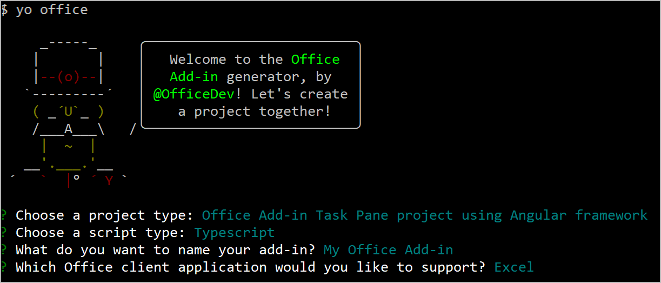
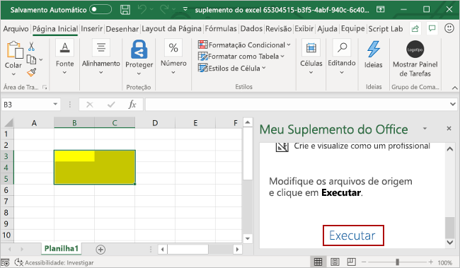

# <a name="build-an-excel-task-pane-add-in-using-angular"></a>Criar um suplemento do painel de tarefas do Excel usando o Angular

Neste artigo, você passará pelo processo de criação de um suplemento do painel de tarefas do Excel usando o Angular e a API JavaScript do Excel.

## <a name="prerequisites"></a>Pré-requisitos

[!include[Yeoman generator prerequisites](../includes/quickstart-yo-prerequisites.md)]

## <a name="create-the-add-in-project"></a>Criar o projeto do suplemento

[!include[Yeoman generator create project guidance](../includes/yo-office-command-guidance.md)]

- **Escolha o tipo de projeto:** `Office Add-in Task Pane project using Angular framework`
- **Escolha o tipo de script:** `TypeScript`
- **Qual será o nome do suplemento?** `My Office Add-in`
- **Você gostaria de proporcionar suporte para qual aplicativo cliente do Office?** `Excel`



Depois que você concluir o assistente, o gerador criará o projeto e instalará os componentes Node de suporte.

[!include[Yeoman generator next steps](../includes/yo-office-next-steps.md)]

## <a name="explore-the-project"></a>Explore o projeto

O projeto de suplemento que você criou com o gerador do Yeoman contém um exemplo de código para um suplemento de painel de tarefas bem básico. Se você quiser examinar os principais componentes do seu projeto de suplemento, abra o projeto no seu editor de código e revise os arquivos listados abaixo. Quando estiver pronto para experimentar o suplemento, prossiga para a próxima seção.

- O arquivo **manifest.xml** no diretório raiz do projeto define as configurações e os recursos do suplemento.
- O arquivo **./src/taskpane/app/app.component.html** contém a marcação HTML do painel de tarefas.
- O arquivo **./src/taskpane/taskpane.css** contém o CSS que é aplicado ao conteúdo no painel de tarefas.
- O arquivo **./src/taskpane/app/app.component.ts** contém o código da API JavaScript do Office que facilita a interação entre o painel de tarefas e o Excel.

## <a name="try-it-out"></a>Experimente

1. Navegue até a pasta raiz do projeto.

    ```command&nbsp;line
    cd "My Office Add-in"
    ```

2. [!include[Start server section](../includes/quickstart-yo-start-server-excel.md)] 

3. No Excel, escolha a guia **Página Inicial** e o botão **Mostrar Painel de Tarefas** na faixa de opções para abrir o painel de tarefas do suplemento.

    

4. Selecione um intervalo de células na planilha.

5. Na parte inferior do painel de tarefas, escolha o link **Executar** para definir a cor do intervalo selecionado como amarelo.

    

## <a name="next-steps"></a>Próximas etapas

Parabéns, você criou com êxito um suplemento do painel de tarefas do Excel usando o Angular! Em seguida, saiba mais sobre os recursos de um suplemento do Excel e crie um suplemento mais complexo seguindo as etapas deste tutorial de suplemento do Excel.

> [!div class="nextstepaction"]
> [Tutorial de suplemento do Excel](../tutorials/excel-tutorial.md)

## <a name="see-also"></a>Confira também

* [Visão geral da plataforma Suplementos do Office](../overview/office-add-ins.md)
* [Criando Suplementos do Office ](../overview/office-add-ins-fundamentals.md)
* [Desenvolver Suplementos do Office ](../develop/develop-overview.md)
* [Conceitos fundamentais de programação com a API JavaScript do Excel](../excel/excel-add-ins-core-concepts.md)
* [Exemplos de código do suplemento do Excel](https://developer.microsoft.com/office/gallery/?filterBy=Samples,Excel)
* [Referência da API JavaScript do Excel](/office/dev/add-ins/reference/overview/excel-add-ins-reference-overview)