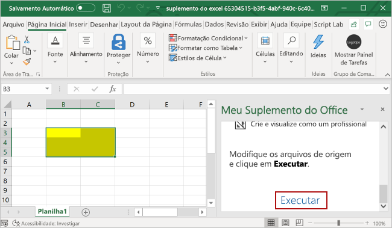

# <a name="build-an-excel-task-pane-add-in"></a>Criar um suplemento do painel de tarefas do Excel

Neste artigo, você passará pelo processo de criação de um suplemento do painel de tarefas do Excel. 

## <a name="create-the-add-in"></a>Criar o suplemento

[!include[Choose your editor](../includes/quickstart-choose-editor.md)]

# <a name="yeoman-generatortabyeomangenerator"></a>[Gerador do Yeoman](#tab/yeomangenerator)

### <a name="prerequisites"></a>Pré-requisitos

[!include[Yeoman generator prerequisites](../includes/quickstart-yo-prerequisites.md)]

### <a name="create-the-add-in-project"></a>Criar o projeto do suplemento

[!include[note about Yeoman generator bug](../includes/note-yeoman-generator-bug-201908.md)]

Use o gerador Yeoman para criar um projeto de suplemento do Excel. Execute o comando a seguir e responda aos prompts da seguinte forma:

```command&nbsp;line
yo office
```

- **Escolha o tipo de projeto:** `Office Add-in Task Pane project`
- **Escolha o tipo de script:** `Javascript`
- **Qual será o nome do suplemento?** `my-office-add-in`
- **Você gostaria de proporcionar suporte para qual aplicativo cliente do Office?** `Excel`

Depois que você concluir o assistente, o gerador criará o projeto e instalará os componentes Node de suporte.

### <a name="explore-the-project"></a>Explore o projeto

[!include[Yeoman generator add-in project components](../includes/yo-task-pane-project-components-js.md)]

### <a name="try-it-out"></a>Experimente

1. Navegue até a pasta raiz do projeto.

    ```command&nbsp;line
    cd "my-office-add-in"
    ```

2. [!include[Start server section](../includes/quickstart-yo-start-server-excel.md)] 

3. No Excel, escolha a guia **Página Inicial** e o botão **Mostrar Painel de Tarefas** na faixa de opções para abrir o painel de tarefas do suplemento.

    

4. Selecione um intervalo de células na planilha.

5. Na parte inferior do painel de tarefas, escolha o link **Executar** para definir a cor do intervalo selecionado como amarelo.

    

# <a name="visual-studiotabvisualstudio"></a>[Visual Studio](#tab/visualstudio)

### <a name="prerequisites"></a>Pré-requisitos

[!include[Quick Start prerequisites](../includes/quickstart-vs-prerequisites.md)]

### <a name="create-the-add-in-project"></a>Criar o projeto do suplemento

1. Na barra de menus do Visual Studio, selecione **Arquivo**  >  **Novo**  >  **Projeto**.

2. Na lista de tipos de projeto em **Visual C#** ou em **Visual Basic**, expanda a opção **Office/SharePoint**, escolha **Suplementos** e depois **Suplemento da Web do Outlook** como o tipo de projeto. 

3. Dê um nome ao projeto e escolha **OK**.

4. Na janela **Criar Suplemento do Office**, escolha **Adicionar novas funcionalidades para o Excel**e clique em **Concluir** para criar o projeto.

5. O Visual Studio cria uma solução, e os dois projetos dele são exibidos no **Gerenciador de Soluções**. O arquivo **Home.html** é aberto no Visual Studio.

### <a name="explore-the-visual-studio-solution"></a>Explorar a solução do Visual Studio

[!include[Description of Visual Studio projects](../includes/quickstart-vs-solution.md)]

### <a name="update-the-code"></a>Atualizar o código

1. **Home.html** especifica o HTML que será renderizado no painel de tarefas do suplemento. Em **Home.html**, substitua o elemento `<body>` pela marcação a seguir e salve o arquivo.

    ```html
    <body class="ms-font-m ms-welcome">
        <div id="content-header">
            <div class="padding">
                <h1>Welcome</h1>
            </div>
        </div>
        <div id="content-main">
            <div class="padding">
                <p>Choose the button below to set the color of the selected range to green.</p>
                <br />
                <h3>Try it out</h3>
                <button class="ms-Button" id="set-color">Set color</button>
            </div>
        </div>
    </body>
    ```

2. Abra o arquivo **Home.js** na raiz do projeto do aplicativo Web. Este arquivo especifica o script do suplemento. Substitua todo o conteúdo pelo código a seguir e salve o arquivo. 

    ```js
    'use strict';

    (function () {

        Office.onReady(function() {
            // Office is ready
            $(document).ready(function () {
                // The document is ready
                $('#set-color').click(setColor);
            });
        });

        function setColor() {
            Excel.run(function (context) {
                var range = context.workbook.getSelectedRange();
                range.format.fill.color = 'green';

                return context.sync();
            }).catch(function (error) {
                console.log("Error: " + error);
                if (error instanceof OfficeExtension.Error) {
                    console.log("Debug info: " + JSON.stringify(error.debugInfo));
                }
            });
        }
    })();
    ```

3. Abra o arquivo **Home.css** na raiz do projeto do aplicativo Web. Este arquivo especifica os estilos personalizados para o suplemento. Substitua todo o conteúdo pelo código a seguir e salve o arquivo. 

    ```css
    #content-header {
        background: #2a8dd4;
        color: #fff;
        position: absolute;
        top: 0;
        left: 0;
        width: 100%;
        height: 80px; 
        overflow: hidden;
    }

    #content-main {
        background: #fff;
        position: fixed;
        top: 80px;
        left: 0;
        right: 0;
        bottom: 0;
        overflow: auto; 
    }

    .padding {
        padding: 15px;
    }
    ```

### <a name="update-the-manifest"></a>Atualizar o manifesto

1. Abra o arquivo de manifesto XML do projeto do suplemento. Este arquivo define as configurações e os recursos do suplemento.

2. O elemento `ProviderName` tem um valor de espaço reservado. Substitua-o com seu nome.

3. O atributo `DefaultValue` do elemento `DisplayName` tem um espaço reservado. Substitua-o pelo **suplementos do My Office**.

4. O atributo `DefaultValue` do elemento `Description` tem um espaço reservado. Substitua-o com **um suplemento do painel de tarefas do Excel**.

5. Salve o arquivo.

    ```xml
    ...
    <ProviderName>John Doe</ProviderName>
    <DefaultLocale>en-US</DefaultLocale>
    <!-- The display name of your add-in. Used on the store and various places of the Office UI such as the add-ins dialog. -->
    <DisplayName DefaultValue="My Office Add-in" />
    <Description DefaultValue="A task pane add-in for Excel"/>
    ...
    ```

### <a name="try-it-out"></a>Experimente

1. Usando o Visual Studio, teste o suplemento do Excel recém-criado, pressionando **F5** ou escolhendo o botão **Iniciar** para abrir o Excel com o botão de suplemento **Mostrar Painel de Tarefas** exibido na faixa de opções. O suplemento será hospedado localmente no IIS.

2. No Excel, escolha a guia **Página Inicial** e o botão **Mostrar Painel de Tarefas** na faixa de opções para abrir o painel de tarefas do suplemento.

    

3. Selecione um intervalo de células na planilha.

4. No painel de tarefas, escolha o botão **Definir cor** para definir a cor do intervalo selecionado como verde.

    

---

## <a name="next-steps"></a>Próximas etapas

Parabéns, você criou com êxito um suplemento do painel de tarefas do Excel! Em seguida, saiba mais sobre os recursos de um suplemento do Excel e crie um suplemento mais complexo seguindo as etapas deste tutorial de suplemento do Excel.

> [!div class="nextstepaction"]
> [Tutorial de suplemento do Excel](../tutorials/excel-tutorial.md)

## <a name="see-also"></a>Confira também

* [Tutorial de suplemento do Excel](../tutorials/excel-tutorial-create-table.md)
* [Conceitos fundamentais de programação com a API JavaScript do Excel](../excel/excel-add-ins-core-concepts.md)
* [Exemplos de código do suplemento do Excel](https://developer.microsoft.com/office/gallery/?filterBy=Samples,Excel)
* [Referência da API JavaScript do Excel](/office/dev/add-ins/reference/overview/excel-add-ins-reference-overview)
