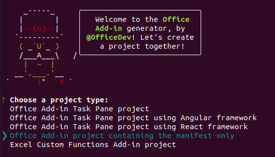
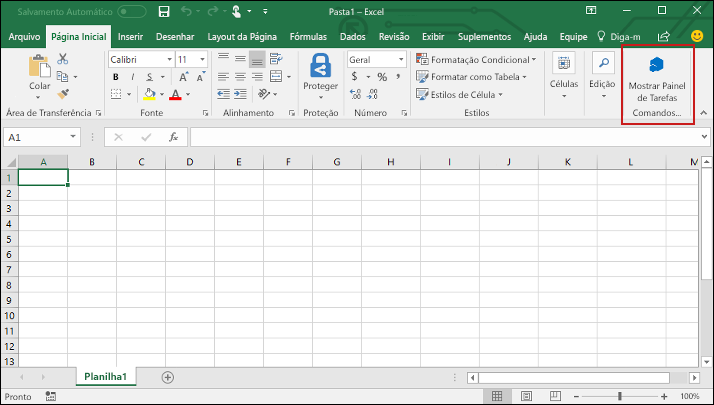

# <a name="build-an-excel-task-pane-add-in-using-vue"></a>Criar um suplemento do painel de tarefas do Excel usando o Vue

Neste artigo, você passará pelo processo de criar um suplemento do painel de tarefas do Excel usando o Vue e a API JavaScript do Excel.

## <a name="prerequisites"></a>Pré-requisitos

[!include[Yeoman generator prerequisites](../includes/quickstart-yo-prerequisites.md)]

- Instale a [CLI do Vue](https://cli.vuejs.org/) globalmente.

  ```command&nbsp;line
  npm install -g @vue/cli
  ```

## <a name="generate-a-new-vue-app"></a>Gerar um novo aplicativo Vue

Use a CLI do Vue para gerar um novo aplicativo Vue. No terminal, execute o comando a seguir.

```command&nbsp;line
vue create my-add-in
```

Em seguida, selecione a predefinição `default`. Caso seja solicitado a usar o Yarn ou o NPM como um pacote, você poderá escolher qualquer um deles.

## <a name="generate-the-manifest-file"></a>Gerar o arquivo de manifesto.

Cada suplemento requer um arquivo de manifesto para definir os recursos e configurações.

1. Navegue até a pasta do seu aplicativo.

    ```command&nbsp;line
    cd my-add-in
    ```

2. Use o gerador Yeoman para gerar o arquivo de manifesto para o seu suplemento executando o seguinte comando:

    ```command&nbsp;line
    yo office
    ```

    > [!NOTE]
    > Ao executar o comando `yo office`, você receberá informações sobre as políticas de coleta de dados de Yeoman e as ferramentas da CLI do suplemento do Office. Use as informações fornecidas para responder às solicitações como achar melhor. Se você escolher **Sair** em resposta à segunda solicitação, será necessário executar o comando `yo office` novamente quando estiver pronto para criar seu projeto de suplemento.

    Quando solicitado, forneça as seguintes informações para criar seu projeto de suplemento:

    - **Escolha o tipo de projeto:** `Office Add-in project containing the manifest only`
    - **Qual será o nome do suplemento?** `my-office-add-in`
    - **Você gostaria de proporcionar suporte para qual aplicativo cliente do Office?** `Excel`

    

Após concluir o assistente, uma pasta `my-office-add-in` será criada, contendo um arquivo `manifest.xml`. Você usará o manifesto para sideload e testará seu suplemento no final do início rápido.

> [!TIP]
> Você pode ignorar as orientações da *próximas etapas* fornecidas pelo gerador Yeoman após a criação do projeto de suplemento. As instruções passo a passo deste artigo fornecem todas as orientações necessárias para concluir este tutorial.

## <a name="secure-the-app"></a>Proteger o aplicativo

[!include[HTTPS guidance](../includes/https-guidance.md)]

Para habilitar o HTTPS no seu aplicativo, crie um arquivo `vue.config.js` na pasta raiz do projeto Vue com o seguinte conteúdo:

```js
module.exports = {
  devServer: {
    port: 3000,
    https: true
  }
};
```

## <a name="update-the-app"></a>Atualizar o aplicativo

1. Abra o arquivo `public/index.html` e adicione a seguinte marca `<script>`, imediatamente antes da marca `</head>`:

   ```html
   <script src="https://appsforoffice.microsoft.com/lib/1/hosted/office.js"></script>
   ```

2. Abra `src/main.js` e substitua os conteúdos pelo código a seguir:

   ```js
   import Vue from 'vue';
   import App from './App.vue';

   Vue.config.productionTip = false;

   window.Office.initialize = () => {
     new Vue({
       render: h => h(App)
     }).$mount('#app');
   };
   ```

3. Abra`src/App.vue` e substitua os conteúdos de arquivo pelo código a seguir:

   ```html
   <template>
     <div id="app">
       <div class="content">
         <div class="content-header">
           <div class="padding">
             <h1>Welcome</h1>
           </div>
         </div>
         <div id="content-main">
           <div class="padding">
             <p>
               Choose the button below to set the color of the selected range to
               green.
             </p>
             <br />
             <h3>Try it out</h3>
             <button @click="onSetColor">Set color</button>
           </div>
         </div>
       </div>
     </div>
   </template>

   <script>
     export default {
       name: 'App',
       methods: {
         onSetColor() {
           window.Excel.run(async context => {
             const range = context.workbook.getSelectedRange();
             range.format.fill.color = 'green';
             await context.sync();
           });
         }
       }
     };
   </script>

   <style>
     .content-header {
       background: #2a8dd4;
       color: #fff;
       position: absolute;
       top: 0;
       left: 0;
       width: 100%;
       height: 80px;
       overflow: hidden;
     }

     .content-main {
       background: #fff;
       position: fixed;
       top: 80px;
       left: 0;
       right: 0;
       bottom: 0;
       overflow: auto;
     }

     .padding {
       padding: 15px;
     }
   </style>
   ```

## <a name="start-the-dev-server"></a>Iniciar o servidor de desenvolvimento

1. No terminal, execute o comando a seguir para iniciar o servidor de desenvolvimento.

   ```command&nbsp;line
   npm run serve
   ```

2. Em um navegador da web, acesse `https://localhost:3000` (observe o `https`).. Se o navegador indicar que o certificado do site não é confiável, [configure o computador para confiar no certificado](https://github.com/OfficeDev/generator-office/blob/fd600bbe00747e64aa5efb9846295a3f66d428aa/src/docs/ssl.md#add-certification-file-through-ie).

3. Quando a página no `https://localhost:3000` estiver em branco e sem erros de certificado, significa que ela está funcionando. O Aplicativo Vue é montado após a inicialização do Office, portanto, ele só mostra itens dentro de um ambiente do Excel.

## <a name="try-it-out"></a>Experimente

1. Siga as instruções da plataforma que você usará para executar o suplemento e realizar sideload do suplemento no Excel.

   - Windows: [Realizar sideload de Suplementos do Office no Windows](../testing/create-a-network-shared-folder-catalog-for-task-pane-and-content-add-ins.md)
   - Navegador Web:[Realizar Sideload de Suplementos do Office no Office na Web](../testing/sideload-office-add-ins-for-testing.md#sideload-an-office-add-in-in-office-on-the-web)
   - iPad e Mac: [Realizar sideload dos Suplementos do Office no iPad e Mac](../testing/sideload-an-office-add-in-on-ipad-and-mac.md)

2. No Excel, escolha a guia **Página Inicial** e o botão **Mostrar Painel de Tarefas** na faixa de opções para abrir o painel de tarefas do suplemento.

   

3. Selecione um intervalo de células na planilha.

4. No painel de tarefas, escolha o botão **Definir cor** para definir a cor do intervalo selecionado como verde.

   

## <a name="next-steps"></a>Próximas etapas

Parabéns, você criou com êxito um suplemento do painel de tarefas do Excel usando o Vue. Em seguida, saiba mais sobre os recursos de um suplemento do Excel e crie um suplemento mais complexo seguindo as etapas deste tutorial de suplemento do Excel.

> [!div class="nextstepaction"]
> [Tutorial de suplemento do Excel](../tutorials/excel-tutorial.md)

## <a name="see-also"></a>Confira também

* [Visão geral da plataforma Suplementos do Office](../overview/office-add-ins.md)
* [Criando Suplementos do Office ](../overview/office-add-ins-fundamentals.md)
* [Desenvolver Suplementos do Office ](../develop/develop-overview.md)
* [Conceitos fundamentais de programação com a API JavaScript do Excel](../excel/excel-add-ins-core-concepts.md)
* [Exemplos de código do suplemento do Excel](https://developer.microsoft.com/office/gallery/?filterBy=Samples,Excel)
* [Referência da API JavaScript do Excel](/office/dev/add-ins/reference/overview/excel-add-ins-reference-overview)
