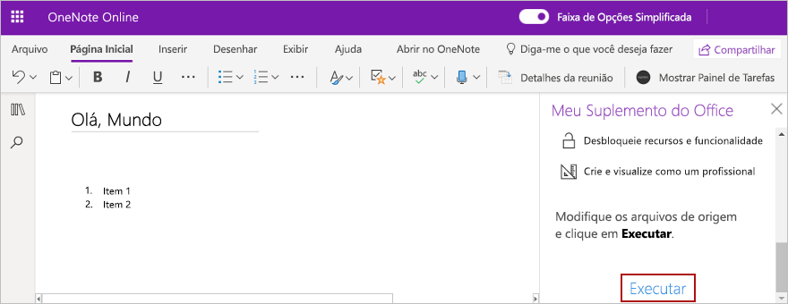

# <a name="build-your-first-onenote-task-pane-add-in"></a>Crie seu primeiro suplemento do painel de tarefas do OneNote

Neste artigo, você verá o processo de criação de um suplemento do painel de tarefas do OneNote.

## <a name="prerequisites"></a>Pré-requisitos

[!include[Yeoman generator prerequisites](../includes/quickstart-yo-prerequisites.md)]

## <a name="create-the-add-in-project"></a>Criar o projeto do suplemento

[!include[Yeoman generator create project guidance](../includes/yo-office-command-guidance.md)]

- **Escolha o tipo de projeto:** `Office Add-in Task Pane project`
- **Escolha o tipo de script:** `Javascript`
- **Qual será o nome do suplemento?** `My Office Add-in`
- **Você gostaria de proporcionar suporte para qual aplicativo cliente do Office?** `OneNote`


Depois que você concluir o assistente, o gerador criará o projeto e instalará os componentes Node de suporte.

[!include[Yeoman generator next steps](../includes/yo-office-next-steps.md)]

## <a name="explore-the-project"></a>Explore o projeto

O projeto de suplemento que você criou com o gerador do Yeoman contém um exemplo de código para um suplemento de painel de tarefas bem básico. 

- O arquivo **./manifest.xml** no diretório raiz do projeto define as configurações e os recursos do suplemento.
- O arquivo **./src/taskpane/taskpane.html** contém a marcação HTML do painel de tarefas.
- O arquivo **./src/taskpane/taskpane.css** contém o CSS que é aplicado ao conteúdo no painel de tarefas.
- O arquivo **./src/taskpane/taskpane.js** contém o código da API JavaScript do Office que facilita a interação entre o painel de tarefas e o aplicativo host do Office.

## <a name="update-the-code"></a>Atualizar o código

No seu editor de código, abra o arquivo **./src/taskpane/taskpane.js** e adicione o seguinte código dentro da função **executar**. Este código usa a API JavaScript do OneNote para definir o título da página e adicionar um contorno ao corpo da página.

```js
try {
    await OneNote.run(async context => {

        // Get the current page.
        var page = context.application.getActivePage();

        // Queue a command to set the page title.
        page.title = "Hello World";

        // Queue a command to add an outline to the page.
        var html = "<p><ol><li>Item #1</li><li>Item #2</li></ol></p>";
        page.addOutline(40, 90, html);

        // Run the queued commands, and return a promise to indicate task completion.
        return context.sync();
    });
} catch (error) {
    console.log("Error: " + error);
}
```

## <a name="try-it-out"></a>Experimente

1. Navegue até a pasta raiz do projeto.

    ```command&nbsp;line
    cd "My Office Add-in"
    ```

2. Inicie o servidor Web local e realize o sideload no seu suplemento.

    > [!NOTE]
    > Os Suplementos do Office devem usar HTTPS, e não HTTP, mesmo durante o desenvolvimento. Se você for solicitado a instalar um certificado após executar um dos seguintes comandos, aceite a solicitação para instalar o certificado que o gerador do Yeoman fornecer.

    > [!TIP]
    > Se você estiver testando o seu suplemento no Mac, execute o seguinte comando antes de continuar. O servidor Web local é iniciado quando este comando é executado.
    >
    > ```command&nbsp;line
    > npm run dev-server
    > ```

    Execute o seguinte comando no diretório raiz do seu projeto. Quando você executar este comando, o servidor da Web local será iniciado (se ainda não estiver em execução).

    ```command&nbsp;line
    npm run start:web
    ```

3. No [OneNote Online](https://www.onenote.com/notebooks), abra um bloco de anotações e crie uma nova página.

4. Escolha **Inserir > Suplementos do Office** para abrir a caixa de diálogo Suplementos do Office.

    - Se você estiver conectado à sua conta de consumidor, selecione a guia **MEUS SUPLEMENTOS** e escolha  **Carregar Meu Suplemento**.

    - Se você estiver conectado à sua conta corporativa ou de estudante, selecione a guia **MINHA ORGANIZAÇÃO** e escolha  **Carregar Meu Suplemento**. 

    A imagem a seguir mostra a guia **MEUS SUPLEMENTOS** para blocos de anotações do consumidor.

    

5. Na caixa de diálogo Carregar Suplemento, navegue até **manifest.xml** na pasta do projeto e escolha **Carregar**. 

6. Na guia **Página Inicial**, na faixa de opções, escolha o botão **Mostrar Painel de Tarefas**. O painel de tarefa do suplemento abre em um iFrame ao lado da página do OneNote.

7. Na parte inferior do painel de tarefas, escolha o link **Executar** para definir o título da página e adicionar um contorno ao corpo da página.

    

## <a name="next-steps"></a>Próximas etapas

Parabéns, você criou com êxito um suplemento do painel de tarefas do OneNote! Em seguida, saiba mais sobre os principais conceitos de criação de suplementos do OneNote.

> [!div class="nextstepaction"]
> [Visão geral da programação da API JavaScript do OneNote](../onenote/onenote-add-ins-programming-overview.md)

## <a name="see-also"></a>Confira também

* [Visão geral da plataforma Suplementos do Office](../overview/office-add-ins.md)
* [Criando Suplementos do Office ](../overview/office-add-ins-fundamentals.md)
* [Desenvolver Suplementos do Office ](../develop/develop-overview.md)
- [Visão geral da programação da API JavaScript do OneNote](../onenote/onenote-add-ins-programming-overview.md)
- [Referência da API JavaScript do OneNote](/office/dev/add-ins/reference/overview/onenote-add-ins-javascript-reference)
- [Amostra de Rubric Grader](https://github.com/OfficeDev/OneNote-Add-in-Rubric-Grader)

