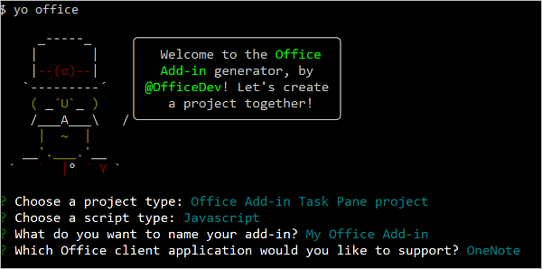

# <a name="build-your-first-onenote-task-pane-add-in"></a><span data-ttu-id="248f6-103">Crie seu primeiro suplemento do painel de tarefas do OneNote</span><span class="sxs-lookup"><span data-stu-id="248f6-103">Build your first OneNote task pane add-in</span></span>

<span data-ttu-id="248f6-104">Neste artigo, você verá o processo de criação de um suplemento do painel de tarefas do OneNote.</span><span class="sxs-lookup"><span data-stu-id="248f6-104">In this article, you'll walk through the process of building a OneNote task pane add-in.</span></span>

## <a name="prerequisites"></a><span data-ttu-id="248f6-105">Pré-requisitos</span><span class="sxs-lookup"><span data-stu-id="248f6-105">Prerequisites</span></span>

[!include[Set up requirements](../includes/set-up-dev-environment-beforehand.md)]
[!include[Yeoman generator prerequisites](../includes/quickstart-yo-prerequisites.md)]

## <a name="create-the-add-in-project"></a><span data-ttu-id="248f6-106">Criar o projeto do suplemento</span><span class="sxs-lookup"><span data-stu-id="248f6-106">Create the add-in project</span></span>

[!include[Yeoman generator create project guidance](../includes/yo-office-command-guidance.md)]

- <span data-ttu-id="248f6-107">**Escolha o tipo de projeto:** `Office Add-in Task Pane project`</span><span class="sxs-lookup"><span data-stu-id="248f6-107">**Choose a project type:** `Office Add-in Task Pane project`</span></span>
- <span data-ttu-id="248f6-108">**Escolha o tipo de script:** `Javascript`</span><span class="sxs-lookup"><span data-stu-id="248f6-108">**Choose a script type:** `Javascript`</span></span>
- <span data-ttu-id="248f6-109">**Qual será o nome do suplemento?**</span><span class="sxs-lookup"><span data-stu-id="248f6-109">**What do you want to name your add-in?**</span></span> `My Office Add-in`
- <span data-ttu-id="248f6-110">**Você gostaria de proporcionar suporte para qual aplicativo cliente do Office?**</span><span class="sxs-lookup"><span data-stu-id="248f6-110">**Which Office client application would you like to support?**</span></span> `OneNote`



<span data-ttu-id="248f6-112">Depois que você concluir o assistente, o gerador criará o projeto e instalará os componentes Node de suporte.</span><span class="sxs-lookup"><span data-stu-id="248f6-112">After you complete the wizard, the generator creates the project and installs supporting Node components.</span></span>

[!include[Yeoman generator next steps](../includes/yo-office-next-steps.md)]

## <a name="explore-the-project"></a><span data-ttu-id="248f6-113">Explore o projeto</span><span class="sxs-lookup"><span data-stu-id="248f6-113">Explore the project</span></span>

<span data-ttu-id="248f6-114">O projeto de suplemento que você criou com o gerador do Yeoman contém um exemplo de código para um suplemento de painel de tarefas bem básico.</span><span class="sxs-lookup"><span data-stu-id="248f6-114">The add-in project that you've created with the Yeoman generator contains sample code for a very basic task pane add-in.</span></span>

- <span data-ttu-id="248f6-115">O arquivo **./manifest.xml** no diretório raiz do projeto define as configurações e os recursos do suplemento.</span><span class="sxs-lookup"><span data-stu-id="248f6-115">The **./manifest.xml** file in the root directory of the project defines the settings and capabilities of the add-in.</span></span>
- <span data-ttu-id="248f6-116">O arquivo **./src/taskpane/taskpane.html** contém a marcação HTML do painel de tarefas.</span><span class="sxs-lookup"><span data-stu-id="248f6-116">The **./src/taskpane/taskpane.html** file contains the HTML markup for the task pane.</span></span>
- <span data-ttu-id="248f6-117">O arquivo **./src/taskpane/taskpane.css** contém o CSS que é aplicado ao conteúdo no painel de tarefas.</span><span class="sxs-lookup"><span data-stu-id="248f6-117">The **./src/taskpane/taskpane.css** file contains the CSS that's applied to content in the task pane.</span></span>
- <span data-ttu-id="248f6-118">O arquivo **./src/taskpane/taskpane.js** contém o código da API JavaScript do Office que facilita a interação entre o painel de tarefas e o aplicativo cliente do Office.</span><span class="sxs-lookup"><span data-stu-id="248f6-118">The **./src/taskpane/taskpane.js** file contains the Office JavaScript API code that facilitates interaction between the task pane and the Office client application.</span></span>

## <a name="update-the-code"></a><span data-ttu-id="248f6-119">Atualizar o código</span><span class="sxs-lookup"><span data-stu-id="248f6-119">Update the code</span></span>

<span data-ttu-id="248f6-120">No seu editor de código, abra o arquivo **./src/taskpane/taskpane.js** e adicione o seguinte código na função `run`.</span><span class="sxs-lookup"><span data-stu-id="248f6-120">In your code editor, open the file **./src/taskpane/taskpane.js** and add the following code within the `run` function.</span></span> <span data-ttu-id="248f6-121">Este código usa a API JavaScript do OneNote para definir o título da página e adicionar um contorno ao corpo da página.</span><span class="sxs-lookup"><span data-stu-id="248f6-121">This code uses the OneNote JavaScript API to set the page title and add an outline to the body of the page.</span></span>

```js
try {
    await OneNote.run(async context => {

        // Get the current page.
        var page = context.application.getActivePage();

        // Queue a command to set the page title.
        page.title = "Hello World";

        // Queue a command to add an outline to the page.
        var html = "<p><ol><li>Item #1</li><li>Item #2</li></ol></p>";
        page.addOutline(40, 90, html);

        // Run the queued commands, and return a promise to indicate task completion.
        return context.sync();
    });
} catch (error) {
    console.log("Error: " + error);
}
```

## <a name="try-it-out"></a><span data-ttu-id="248f6-122">Experimente</span><span class="sxs-lookup"><span data-stu-id="248f6-122">Try it out</span></span>

1. <span data-ttu-id="248f6-123">Navegue até a pasta raiz do projeto.</span><span class="sxs-lookup"><span data-stu-id="248f6-123">Navigate to the root folder of the project.</span></span>

    ```command&nbsp;line
    cd "My Office Add-in"
    ```

2. <span data-ttu-id="248f6-124">Inicie o servidor Web local e realize o sideload no seu suplemento.</span><span class="sxs-lookup"><span data-stu-id="248f6-124">Start the local web server and sideload your add-in.</span></span>

    > [!NOTE]
    > <span data-ttu-id="248f6-125">Os Suplementos do Office devem usar HTTPS, e não HTTP, mesmo durante o desenvolvimento.</span><span class="sxs-lookup"><span data-stu-id="248f6-125">Office Add-ins should use HTTPS, not HTTP, even when you are developing.</span></span> <span data-ttu-id="248f6-126">Se você for solicitado a instalar um certificado após executar um dos seguintes comandos, aceite a solicitação para instalar o certificado que o gerador do Yeoman fornecer.</span><span class="sxs-lookup"><span data-stu-id="248f6-126">If you are prompted to install a certificate after you run one of the following commands, accept the prompt to install the certificate that the Yeoman generator provides.</span></span> <span data-ttu-id="248f6-127">Você também pode executar o prompt de comando ou terminal como administrador para que as alterações sejam feitas.</span><span class="sxs-lookup"><span data-stu-id="248f6-127">You may also have to run your command prompt or terminal as an administrator for the changes to be made.</span></span>

    > [!TIP]
    > <span data-ttu-id="248f6-128">Se você estiver testando o seu suplemento no Mac, execute o seguinte comando antes de continuar.</span><span class="sxs-lookup"><span data-stu-id="248f6-128">If you're testing your add-in on Mac, run the following command before proceeding.</span></span> <span data-ttu-id="248f6-129">O servidor Web local é iniciado quando este comando é executado.</span><span class="sxs-lookup"><span data-stu-id="248f6-129">When you run this command, the local web server starts.</span></span>
    >
    > ```command&nbsp;line
    > npm run dev-server
    > ```

    <span data-ttu-id="248f6-130">Execute o seguinte comando no diretório raiz do seu projeto.</span><span class="sxs-lookup"><span data-stu-id="248f6-130">Run the following command in the root directory of your project.</span></span> <span data-ttu-id="248f6-131">Quando você executar este comando, o servidor da Web local será iniciado (se ainda não estiver em execução).</span><span class="sxs-lookup"><span data-stu-id="248f6-131">When you run this command, the local web server will start (if it's not already running).</span></span>

    ```command&nbsp;line
    npm run start:web
    ```

3. <span data-ttu-id="248f6-132">No [OneNote Online](https://www.onenote.com/notebooks), abra um bloco de anotações e crie uma nova página.</span><span class="sxs-lookup"><span data-stu-id="248f6-132">In [OneNote on the web](https://www.onenote.com/notebooks), open a notebook and create a new page.</span></span>

4. <span data-ttu-id="248f6-133">Escolha **Inserir > Suplementos do Office** para abrir a caixa de diálogo Suplementos do Office.</span><span class="sxs-lookup"><span data-stu-id="248f6-133">Choose **Insert > Office Add-ins** to open the Office Add-ins dialog.</span></span>

    - <span data-ttu-id="248f6-134">Se você estiver conectado à sua conta de consumidor, selecione a guia **MEUS SUPLEMENTOS** e escolha  **Carregar Meu Suplemento**.</span><span class="sxs-lookup"><span data-stu-id="248f6-134">If you're signed in with your consumer account, select the **MY ADD-INS** tab, and then choose **Upload My Add-in**.</span></span>

    - <span data-ttu-id="248f6-135">Se você estiver conectado com a sua conta corporativa ou de estudante, selecione a guia **MINHA ORGANIZAÇÃO** e escolha **Carregar Meu Suplemento**.</span><span class="sxs-lookup"><span data-stu-id="248f6-135">If you're signed in with your work or education account, select the **MY ORGANIZATION** tab, and then select **Upload My Add-in**.</span></span>

    <span data-ttu-id="248f6-136">A imagem a seguir mostra a guia **MEUS SUPLEMENTOS** para blocos de anotações do consumidor.</span><span class="sxs-lookup"><span data-stu-id="248f6-136">The following image shows the **MY ADD-INS** tab for consumer notebooks.</span></span>

    

5. <span data-ttu-id="248f6-137">Na caixa de diálogo Carregar Suplemento, navegue até **manifest.xml** na pasta do projeto e escolha **Carregar**.</span><span class="sxs-lookup"><span data-stu-id="248f6-137">In the Upload Add-in dialog, browse to **manifest.xml** in your project folder, and then choose **Upload**.</span></span>

6. <span data-ttu-id="248f6-138">Na guia **Página Inicial**, na faixa de opções, escolha o botão **Mostrar Painel de Tarefas**.</span><span class="sxs-lookup"><span data-stu-id="248f6-138">From the **Home** tab, choose the **Show Taskpane** button in the ribbon.</span></span> <span data-ttu-id="248f6-139">O painel de tarefa do suplemento abre em um iFrame ao lado da página do OneNote.</span><span class="sxs-lookup"><span data-stu-id="248f6-139">The add-in task pane opens in an iFrame next to the OneNote page.</span></span>

7. <span data-ttu-id="248f6-140">Na parte inferior do painel de tarefas, escolha o link **Executar** para definir o título da página e adicionar um contorno ao corpo da página.</span><span class="sxs-lookup"><span data-stu-id="248f6-140">At the bottom of the task pane, choose the **Run** link to set the page title and add an outline to the body of the page.</span></span>

    

## <a name="next-steps"></a><span data-ttu-id="248f6-142">Próximas etapas</span><span class="sxs-lookup"><span data-stu-id="248f6-142">Next steps</span></span>

<span data-ttu-id="248f6-143">Parabéns, você criou com êxito um suplemento do painel de tarefas do OneNote!</span><span class="sxs-lookup"><span data-stu-id="248f6-143">Congratulations, you've successfully created a OneNote task pane add-in!</span></span> <span data-ttu-id="248f6-144">Em seguida, saiba mais sobre os principais conceitos de criação de suplementos do OneNote.</span><span class="sxs-lookup"><span data-stu-id="248f6-144">Next, learn more about the core concepts of building OneNote add-ins.</span></span>

> [!div class="nextstepaction"]
> [<span data-ttu-id="248f6-145">Visão geral da programação da API JavaScript do OneNote</span><span class="sxs-lookup"><span data-stu-id="248f6-145">OneNote JavaScript API programming overview</span></span>](../onenote/onenote-add-ins-programming-overview.md)

## <a name="see-also"></a><span data-ttu-id="248f6-146">Confira também</span><span class="sxs-lookup"><span data-stu-id="248f6-146">See also</span></span>

- [<span data-ttu-id="248f6-147">Visão geral da plataforma Suplementos do Office</span><span class="sxs-lookup"><span data-stu-id="248f6-147">Office Add-ins platform overview</span></span>](../overview/office-add-ins.md)
- [<span data-ttu-id="248f6-148">Desenvolver Suplementos do Office </span><span class="sxs-lookup"><span data-stu-id="248f6-148">Develop Office Add-ins</span></span>](../develop/develop-overview.md)
- [<span data-ttu-id="248f6-149">Visão geral da programação da API JavaScript do OneNote</span><span class="sxs-lookup"><span data-stu-id="248f6-149">OneNote JavaScript API programming overview</span></span>](../onenote/onenote-add-ins-programming-overview.md)
- [<span data-ttu-id="248f6-150">Referência da API JavaScript do OneNote</span><span class="sxs-lookup"><span data-stu-id="248f6-150">OneNote JavaScript API reference</span></span>](../reference/overview/onenote-add-ins-javascript-reference.md)
- [<span data-ttu-id="248f6-151">Amostra de Rubric Grader</span><span class="sxs-lookup"><span data-stu-id="248f6-151">Rubric Grader sample</span></span>](https://github.com/OfficeDev/OneNote-Add-in-Rubric-Grader)
